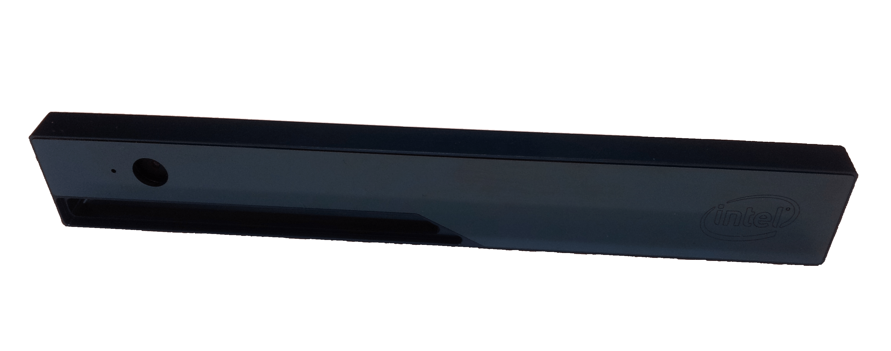

# 在 Ubuntu 上为 Intel RealSense R200 安装驱动

本教程旨在指导如何在 Linux 环境中安装 Intel RealSense R200 摄像机头的相机驱动，从而通过机器人操作系统 (ROS) 访问采集的图像。  
下图展示了 RealSense R200 摄像机头：



驱动包的安装在运行于 Virtual Box 中的 Ubuntu 操作系统 (OS) 上进行。  
运行 Virtual Box 的宿主机、Virtual Box 以及客户系统的规格如下：

- 宿主操作系统：Windows 8  
- 处理器：Intel(R) Core(TM) i7-4702MQ CPU @ 2.20GHz  
- Virtual Box：Oracle VM，版本 5.0.14 r105127  
- 扩展：已安装 Virtual Box 扩展包（USB3 支持所需）  
- 客户操作系统：Linux - Ubuntu 14.04.3 LTS  

教程按以下顺序进行：第一部分展示如何在 Virtual Box 中安装 Ubuntu 14.04 作为客户操作系统；第二部分展示如何安装 ROS Indigo 和相机驱动。以下常见术语定义如下：

- Virtual Box (VB)：运行不同虚拟机的程序，此处为 Oracle VM。  
- 虚拟机 (VM)：在 Virtual Box 中作为客户系统运行的操作系统，此处为 Ubuntu。  

## 在 Virtual Box 中安装 Ubuntu 14.04.3 LTS  

- 创建一个新的虚拟机 (VM)：Linux 64 位。  
- 下载 Ubuntu 14.04.3 LTS 的 iso 文件：[ubuntu-14.04.3-desktop-amd64.iso](https://ubuntu.com/download/desktop)。  
- 安装 Ubuntu：  
  - 安装过程中取消以下两个选项：  
    - 安装时下载更新  
    - 安装第三方软件  
- 安装完成后可能需要启用 Virtual Box 以全屏显示 Ubuntu：  
  - 启动 Ubuntu 虚拟机并登录，点击 Virtual Box 菜单栏的 **Devices->Insert Guest Additions CD image**。  
  - 点击 **Run** 并在弹出窗口中输入 Ubuntu 的密码。  
  - 等待安装完成并重启。现在应能全屏显示虚拟机。  
  - 如果 Ubuntu 弹出更新提示，此时拒绝更新。  
- 在 Virtual Box 中启用 USB 3 控制器：  
  - 关闭虚拟机。  
  - 在虚拟机设置中选择 USB 菜单，选择 "USB 3.0(xHCI)"。  
    仅在已安装 Virtual Box 扩展包的情况下才可执行此操作。  
  - 重新启动虚拟机。  

## 安装 ROS Indigo  

- 按照 [ROS indigo 安装指南](http://wiki.ros.org/indigo/Installation/Ubuntu) 的说明操作：  
  - 安装 Desktop-Full 版本。  
  - 执行 "Initialize rosdep" 和 "Environment setup" 部分描述的步骤。  

## 安装相机驱动  

- 安装 git：  

  ```sh
  sudo apt-get install git
  ```

- 下载并安装驱动：  

  - 克隆 [RealSense_ROS 仓库](https://github.com/bestmodule/RealSense_ROS)：  

    ```sh
    git clone https://github.com/bestmodule/RealSense_ROS.git
    ```

- 按照 [此处](https://github.com/bestmodule/RealSense_ROS/tree/master/r200_install) 的说明操作：  

  - 当出现以下安装包是否安装的提示时，按下回车键：  

    ```sh
    Intel Low Power Subsystem support in ACPI mode (MFD_INTEL_LPSS_ACPI) [N/m/y/?] (NEW)
    ```

    ```sh
    Intel Low Power Subsystem support in PCI mode (MFD_INTEL_LPSS_PCI) [N/m/y/?] (NEW)
    ```

    ```sh
    Dell Airplane Mode Switch driver (DELL_RBTN) [N/m/y/?] (NEW)
    ```

  - 安装过程末尾可能出现的以下错误信息不会导致驱动功能异常：  

    ```sh
    rmmod: ERROR: Module uvcvideo is not currently loaded
    ```

- 安装完成后，重启虚拟机。  

- 测试相机驱动：  

  - 通过 USB3 数据线将 Intel RealSense 摄像机头连接到计算机的 USB3 接口。  
  - 在 Virtual Box 菜单栏点击 **Devices->USB-> Intel Corp Intel RealSense 3D Camera R200**，将相机的 USB 连接转发到虚拟机。  
  - 执行文件 [解压文件夹]/Bin/DSReadCameraInfo：  

    - 如果出现以下错误信息，物理拔下相机的 USB 线，重新插入并再次点击 **Devices->USB-> Intel Corp Intel RealSense 3D Camera R200**，再次执行 [解压文件夹]/Bin/DSReadCameraInfo：  

      ```sh
      DSAPI call failed at ReadCameraInfo.cpp:134!
      ```

    - 如果驱动正常工作并识别了 Intel RealSense R200，将显示该摄像机头的具体信息。  

- 安装和测试 ROS nodlet：  
  - 按照 [此处](https://github.com/bestmodule/RealSense_ROS/blob/master/realsense_dist/2.3/doc/RealSense-ROS-R200-nodelet.md) 的 "Installation" 部分说明安装 ROS nodlet。  
  - 按照 [此处](https://github.com/bestmodule/RealSense_ROS/blob/master/realsense_dist/2.3/doc/RealSense-ROS-R200-nodelet.md) 的 "Running the R200 nodelet" 部分说明测试 ROS nodlet 与 Intel RealSense R200 摄像机头的配合：  
    - 如果一切正常，Intel RealSense R200 摄像机的不同数据流将作为 ROS 话题发布。