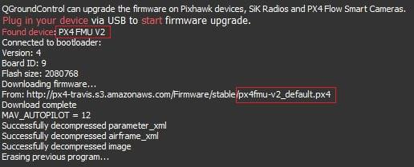

# Bootloader 更新

_PX4 Bootloader_ 用于加载 [Pixhawk控制器](../flight_controller/pixhawk_series.md)（PX4FMU, PX4IO）的固件。

Pixhawk控制器通常预装了合适的Bootloader版本。
但在某些情况下，可能缺少Bootloader，或存在需要更新的旧版本，或板载设备已损坏（bricked）并需要擦除后重新安装Bootloader。

本主题介绍了如何构建PX4 Bootloader，以及多种将其烧录到控制器的方法。

::: info

- 您可以使用 [QGC Bootloader更新](#qgc-bootloader-update-sys-bl-update) 来更新包含 [`bl-update`模块](../modules/modules_command.md#bl-update) 的固件。
  这是在控制器能加载固件时更新Bootloader的最简便方式。
- 您也可以使用 [Debug Probe](#debug-probe-bootloader-update) 来更新Bootloader。
  这在控制器损坏时更新/修复Bootloader非常有用。
- 在 [FMUv6X-RT](../flight_controller/pixhawk6x-rt.md) 上，您可以通过USB [安装Bootloader/修复损坏的控制器](bootloader_update_v6xrt.md)。
  这对于没有调试探针的情况非常有用。

:::

## QGC Bootloader 更新 (`SYS_BL_UPDATE`)

更新 Bootloader 最简便的方法是首先使用 _QGroundControl_ 安装包含所需/最新 Bootloader 的固件。
之后可通过设置参数 [SYS_BL_UPDATE](../advanced_config/parameter_reference.md#SYS_BL_UPDATE) 来在下次重启时启动 Bootloader 更新。

若固件中包含 [`bl-update` 模块](../modules/modules_command.md#bl-update)，则可使用此方法。
最简单的验证方式是查看 [SYS_BL_UPDATE](../advanced_config/parameter_reference.md#SYS_BL_UPDATE) 参数是否 [在 QGroundControl 中存在](../advanced_config/parameters.md#finding-a-parameter)。

:::warning
包含该模块的开发板在其 `default.px4board` 文件中会包含 `CONFIG_SYSTEMCMDS_BL_UPDATE=y` 这一行（[示例搜索](https://github.com/search?q=repo%3APX4%2FPX4-Autopilot+path%3A**%2Fdefault.px4board+CONFIG_SYSTEMCMDS_BL_UPDATE%3Dy&type=code)）。
如有需要，也可以在自定义固件中启用此配置项。
:::

操作步骤如下：

1. 插入 SD 卡（启用启动日志以调试任何问题）。
1. [更新固件](../config/firmware.md#custom) 时使用包含新 Bootloader 的固件镜像。

   ::: info
   更新的 Bootloader 可能已包含在您开发板的默认固件中，或通过自定义固件提供。
   :::

1. 等待机体重启。
1. [查找并启用](../advanced_config/parameters.md) 参数 [SYS_BL_UPDATE](../advanced_config/parameter_reference.md#SYS_BL_UPDATE)。
1. 重启（断开/重新连接开发板）。
   Bootloader 更新过程仅需几秒钟。

通常在此之后，您可能需要再次使用新安装的 Bootloader [更新固件](../config/firmware.md)。

以下提供了一个针对 [FMUv2 Bootloader](#fmuv2-bootloader-update) 更新的具体示例。

## 构建 PX4 引导程序

### PX4 引导程序 FMUv6X 及更新版本

以 FMUv6X (STM32H7) 开始的板卡使用树内 PX4 引导程序。

可以通过在 [PX4-Autopilot](https://github.com/PX4/PX4-Autopilot) 目录中使用 `make` 命令和带有 `_bootloader` 后缀的特定板目标来构建。

对于 FMUv6X 的命令为：

```sh
make px4_fmu-v6x_bootloader
```

这将生成引导程序二进制文件 `build/px4_fmu-v6x_bootloader/px4_fmu-v6x_bootloader.elf`，可以通过 SWD 或 DFU 进行烧录。  
如果你正在构建引导程序，你应该已经熟悉这些选项中的一种。

如果需要 HEX 文件而不是 ELF 文件，请使用 objcopy：

```sh
arm-none-eabi-objcopy -O ihex build/px4_fmu-v6x_bootloader/px4_fmu-v6x_bootloader.elf px4_fmu-v6x_bootloader.hex
```

### PX4 引导程序 FMUv5X 及更早版本

直至 FMUv5X (STM32H7 之前) 的 PX4 板卡使用了 [PX4 bootloader](https://github.com/PX4/Bootloader) 仓库。

仓库的 README 中的说明解释了如何使用它。

## 调试探针引导加载程序更新

以下步骤说明如何使用[兼容的调试探针](../debug/swd_debug.md#debug-probes-for-px4-hardware)手动更新引导加载程序：

1. 获取包含引导加载程序的二进制文件（可从开发团队获取或[自行构建](#building-the-px4-bootloader)）。
2. 获取[调试探针](../debug/swd_debug.md#debug-probes-for-px4-hardware)。
   通过USB将探针连接到PC并设置`gdbserver`。
3. 进入包含二进制文件的目录，并在终端中运行对应目标引导加载程序的命令：

   - FMUv6X

     ```sh
     arm-none-eabi-gdb px4_fmu-v6x_bootloader.elf
     ```

   - FMUv6X-RT

     ```sh
     arm-none-eabi-gdb px4_fmu-v6xrt_bootloader.elf
     ```

   - FMUv5

     ```sh
     arm-none-eabi-gdb px4fmuv5_bl.elf
     ```

   ::: info
   来自[PX4/PX4-Autopilot](https://github.com/PX4/PX4-Autopilot)的H7引导加载程序命名模式为`*._bootloader.elf`。
   来自[PX4/PX4-Bootloader](https://github.com/PX4/PX4-Bootloader)的引导加载程序命名模式为`*_bl.elf`。
   :::

4. gdb终端将出现并显示以下输出：

   ```sh
   GNU gdb (GNU Tools for Arm Embedded Processors 7-2017-q4-major) 8.0.50.20171128-git
   Copyright (C) 2017 Free Software Foundation, Inc.
   License GPLv3+: GNU GPL version 3 or later <http://gnu.org/licenses/gpl.html>
   This is free software: you are free to change and redistribute it.
   There is NO WARRANTY, to the extent permitted by law.
   Type "show copying"    and "show warranty" for details.
   This GDB was configured as "--host=x86_64-linux-gnu --target=arm-none-eabi".
   Type "show configuration" for configuration details.
   For bug reporting instructions, please see:
   <http://www.gnu.org/software/gdb/bugs/>.
   Find the GDB manual and other documentation resources online at:
   <http://www.gnu.org/software/gdb/documentation/>.
   For help, type "help".
   Type "apropos word" to search for commands related to "word"...
   Reading symbols from px4fmuv5_bl.elf...done.
   ```

5. 通过在**/dev/serial/by-id**目录运行`ls`命令获取你的`<dronecode-probe-id>`。
6. 现在使用以下命令连接到调试探针：

   ```sh
   tar ext /dev/serial/by-id/<dronecode-probe-id>
   ```

7. 用另一条USB线为Pixhawk供电，并将探针连接到`FMU-DEBUG`端口。

   ::: info
   如果使用Dronecode探针，可能需要移除外壳才能连接到`FMU-DEBUG`端口（例如Pixhawk 4需要使用T6 Torx螺丝刀）。
   :::

8. 使用以下命令扫描Pixhawk的SWD并连接：

   ```sh
   (gdb) mon swdp_scan
   (gdb) attach 1
   ```

9. 将二进制文件加载到Pixhawk中：

   ```sh
   (gdb) load
   ```

引导加载程序更新完成后，可通过_QGroundControl_ [加载PX4固件](../config/firmware.md)。

## FMUv2引导程序更新

如果_QGroundControl_安装了FMUv2目标版本（安装过程中可查看控制台日志），并且您使用的是较新型号的飞控板，可能需要更新引导程序以访问飞控器的全部内存。
本示例说明如何使用[QGC引导程序更新](qgc-bootloader-update-sys-bl-update)来更新引导程序。

::: info
早期的FMUv2 [Pixhawk系列](../flight_controller/pixhawk_series.md#fmu_versions)飞控器存在[硬件问题](../flight_controller/silicon_errata.md#fmuv2-pixhawk-silicon-errata)，限制其只能使用1MB的闪存。
此问题在新型号中已修复，但您可能需要更新出厂引导程序以安装FMUv3固件并访问全部2MB可用内存。
:::

更新引导程序的步骤：

1. 插入一张SD卡（用于启用启动日志记录以调试任何问题）。
2. [更新固件](../config/firmware.md)至PX4 _master_版本（更新固件时，请检查**高级设置**，然后从下拉列表中选择**开发构建(master)**）。
   _QGroundControl_将自动检测硬件是否支持FMUv2并安装相应的固件。

   

   等待机体重启。

3. [查找并启用](../advanced_config/parameters.md)参数[SYS_BL_UPDATE](../advanced_config/parameter_reference.md#SYS_BL_UPDATE)。
4. 重启（断开/重新连接飞控板）。
   引导程序更新仅需几秒钟。
5. 然后再次[更新固件](../config/firmware.md)。
   此时_QGroundControl_应自动检测硬件为FMUv3并适当更新固件。

   

   ::: info
   如果硬件存在[Silicon Errata](../flight_controller/silicon_errata.md#fmuv2-pixhawk-silicon-errata)，仍将被检测为FMUv2，并在控制台中看到FMUv2被重新安装。
   在此情况下，您将无法安装FMUv3固件。
   :::

## 其他开发板 (非 Pixhawk)

不属于 [Pixhawk 系列](../flight_controller/pixhawk_series.md) 的开发板将拥有各自的引导程序更新机制。

对于已预刷写 Betaflight 的开发板，请参见 [Bootloader 刷入 Betaflight 系统](bootloader_update_from_betaflight.md)。