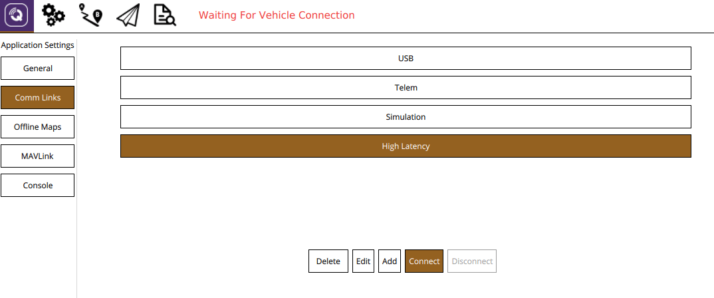

# 铱星/RockBlock卫星通信系统

卫星通信系统可用于在地面站与机体之间提供长距离的高延迟链路。  
该主题描述了如何设置使用RockBlock作为铱星SBD卫星通信系统服务提供商的系统。  
在信号质量良好的情况下，用户可预期的延迟为10至15秒。

## 概述

卫星通信链路所需组件包括：

- 一个 [RockBlock 9603 Iridium卫星调制解调器](https://www.iridium.com/products/rock-seven-rockblock-9603/) 模块，连接至安装了PX4 Autopilot的Pixhawk飞控。
- 一台运行Ubuntu Linux的消息中继服务器。
- 一台运行 _QGroundControl_ 的Ubuntu Linux地面站计算机

完整系统架构如下所示：


::: info
该配置在Ubuntu 14.04和16.04上运行当前版本的 _QGroundControl_ 时经过测试。

- 系统可能可以在其他地面站和操作系统上运行，但尚未进行测试（且无法保证兼容）。
- [RockBlock MK2](https://www.groundcontrol.com/us/product/rockblock-9602-satellite-modem/) 模块也可使用。
  RockBlock 9603模块更推荐使用，因为它更小更轻，同时功能相同。

:::

## 费用

UK链接的运行成本包含线路租赁费和每条消息的费用：

- 每个模块需要激活，每月费用为£10.00
- 系统中每条消息的传输费用为每50字节消耗1个积分
  可从RockBlock购买积分包，每积分价格为£0.04-£0.11，具体取决于购买的积分包大小

有关模块、运行费用和RockBlock的详细说明，请参阅[RockBlock Documentation](https://docs.rockblock.rock7.com/docs)

## 机体设置

### 接线

将RockBlock模块连接到Pixhawk的串口。
由于模块的功耗需求，它只能通过高功率串口供电，最高需要5V 0.5A电流。
如果没有可用的高功率串口，则需要设置另一个与Pixhawk共地且能提供所需功率的电源。
连接器详情和[供电要求](https://docs.rockblock.rock7.com/docs/power-supply)请参见RockBlock文档中的[连接器](https://docs.rockblock.rock7.com/docs/connectors)部分。

### 模块

模块可使用内置天线或连接到SMA接口的外部天线。
要[切换两种天线模式](https://docs.rockblock.rock7.com/docs/switching-rockblock-9603-antenna-mode)，需要调整一根小RF连接线的位置。
使用外部天线时，务必在模块上电前确保天线已连接，以避免损坏模块。

模块的默认波特率为19200。但PX4的_iridiumsbd_驱动需要115200波特率，因此需通过[AT命令](https://www.groundcontrol.com/en/wp-content/uploads/2022/02/IRDM_ISU_ATCommandReferenceMAN0009_Rev2.0_ATCOMM_Oct2012.pdf)进行修改：

1. 使用19200/8-N-1设置连接模块，通过命令 `AT` 测试通信。
   正确响应应为：`OK`。
1. 修改波特率：

   ```
   AT+IPR=9
   ```

1. 使用115200/8-N-1设置重新连接模块，并通过以下命令保存配置：

   ```
   AT&W0
   ```

模块现已准备好与PX4配合使用。

### 软件

使用[ISBD_CONFIG](../advanced_config/parameter_reference.md#ISBD_CONFIG)配置RockBlock模块运行的串口，详见[串口配置](../peripherals/serial_configuration.md)。
无需单独设置串口波特率，因为该参数由驱动自动配置。

::: info
如果_QGroundControl_中未显示该配置参数，可能需要[将驱动添加到固件](../peripherals/serial_configuration.md#parameter_not_in_firmware)：

```
drivers/telemetry/iridiumsbd
```

:::

## RockBlock 设置

在首次购买 RockBlock 模块时，需要在第一步创建用户账户。

登录至 [账户](https://rockblock.rock7.com/Operations) 并在 `My RockBLOCKs` 下注册 RockBlock 模块。  
为模块激活线路租赁服务，并确保账户中拥有足够支持预期飞行时长的信用额度。  
在使用默认设置时，机体每分钟会向地面站发送一条消息。

为消息中继服务器设置投递组，并将模块添加到该投递组中：


## 中继服务器设置

中继服务器应在Ubuntu 16.04或14.04操作系统上运行。

1. 作为消息中继的服务器应具有静态IP地址，并开放两个公网可访问的TCP端口：

   - `5672` 用于 _RabbitMQ_ 消息代理（可在 _rabbitmq_ 设置中修改）
   - `45679` 用于HTTP POST接口（可在 **relay.cfg** 文件中修改）

1. 安装所需的Python模块：

   ```sh
   sudo pip install pika tornado future
   ```

1. 安装 `rabbitmq` 消息代理：

   ```sh
   sudo apt install rabbitmq-server
   ```

1. 配置代理的凭证（将PWD替换为自定义密码）：

   ```sh
   sudo rabbitmqctl add_user iridiumsbd PWD
   sudo rabbitmqctl set_permissions iridiumsbd ".*" ".*" ".*"
   ```

1. 克隆 [SatComInfrastructure](https://github.com/acfloria/SatComInfrastructure.git) 仓库：

   ```sh
   git clone https://github.com/acfloria/SatComInfrastructure.git
   ```

1. 进入 _SatComInfrastructure_ 仓库目录并配置代理的队列：

   ```sh
   ./setup_rabbit.py localhost iridiumsbd PWD
   ```

1. 验证配置：

   ```sh
   sudo rabbitmqctl list_queues
   ```

   这应该会列出4个队列：`MO`、`MO_LOG`、`MT`、`MT_LOG`

1. 编辑 `relay.cfg` 配置文件以匹配您的设置。
1. 以分离模式启动中继脚本：

   ```sh
   screen -dm bash -c 'cd SatcomInfrastructure/; ./relay.py
   ```

其他操作说明：

- 从screen分离：

  ```sh
  ctrl+a d
  ```

- 终止脚本执行：

  ```sh
  ctrl+a :quit
  ```

- 重新连接screen：

  ```sh
  screen -dr
  ```

## 地面站计算机

要设置地面站：

1. 安装所需的python模块：

   ```sh
   sudo pip install pika tornado future
   ```

1. 克隆SatComInfrastructure仓库：

   ```sh
   git clone https://github.com/acfloria/SatComInfrastructure.git
   ```

1. 编辑 **udp2rabbit.cfg** 配置文件以匹配您的设置。
1. [安装 _QGroundControl_](https://docs.qgroundcontrol.com/master/en/qgc-user-guide/getting_started/download_and_install.html) (每日构建版本)。
1. 在QGC中添加UDP连接，参数如下：

   - 监听端口：10000
   - 目标主机：127.0.0.1:10001
   - 高延迟：勾选

   

### 验证

1. 在地面站计算机上打开终端并进入 _SatComInfrastructure_ 仓库所在目录。
   然后启动 **udp2rabbit.py** 脚本：

   ```sh
   ./udp2rabbit.py
   ```

1. 从 [RockBlock Account](https://rockblock.rock7.com/Operations) 向在 `Test Delivery Groups` 选项卡中创建的投递组发送测试消息。

如果在运行 `udp2rabbit.py` 脚本的终端中几秒钟内可以观察到消息确认，则表示RockBlock投递组、中继服务器和udp2rabbit脚本已正确设置：


## 运行系统

1. 启动_QGroundControl_。
   首先手动连接高延迟链路，然后连接常规遥测链路：

   

1. 在地面站计算机上打开终端并切换到_SatComInfrastructure_仓库的目录位置。
   然后启动**udp2rabbit.py**脚本：

   ```sh
   ./udp2rabbit.py
   ```

1. 给机体上电。
1. 等待QGC接收到第一条`HIGH_LATENCY2`消息。
   可通过_MAVLink Inspector_小部件或工具栏的_LinkIndicator_进行检查。
   如果有多个链路连接到活动机体，点击显示链路的名称可使_LinkIndicator_显示所有链路：

   

   链路指示器始终显示优先链路的名称。

1. 卫星通信系统现在已准备好使用。
   优先链路（命令发送所使用的链路）通过以下方式确定：

   - 如果用户未指定链路，常规无线电遥测链路将优先于高延迟链路。
   - 当机体加电且无线电遥测链路丢失（在特定时间内未收到MAVLink消息）时，自动驾驶仪和QGC将回退到高延迟链路。
     一旦恢复无线电遥测链路，QGC和自动驾驶仪将切换回来。
   - 用户可通过工具栏的`LinkIndicator`选择优先链路。
     只要该链路保持活动状态或用户选择其他优先链路，该链路将持续作为优先链路：

     

## 故障排除

- 从机体接收到了卫星通信消息但无法传输任何指令（机体无响应）
  - 检查中继服务器的设置并确保其正确性，尤其是IMEI参数。

- 地面站未收到机体发送的卫星通信消息：
  
  - 通过系统控制台检查_iridiumsbd_驱动是否已启动，并确认模块是否接收到任何卫星的信号：

    ```sh
    iridiumsbd status
    ```

  - 按照上述验证步骤确保中继服务器、delivery group和`udp2rabbit.py`脚本的配置正确。
  - 检查链路是否连接且其设置正确。

- IridiumSBD驱动无法启动：

  - 重启机体。
    如果重启有效，可在`extras.txt`中增加驱动启动前的休眠时间。
    如果无效，请确保Pixhawk和模块的地电位相同，并确认模块的波特率设置为115200。

- 地面站接收到了第一条消息，但机体飞行后无法传输消息或延迟显著增加（以分钟为单位）
  - 飞行后检查信号质量。
    如果飞行过程中信号强度下降且使用内部天线，建议改用外部天线。
    如果已使用外部天线，请将天线尽可能远离任何电子设备或可能干扰信号的物体。
    同时确保天线未损坏。