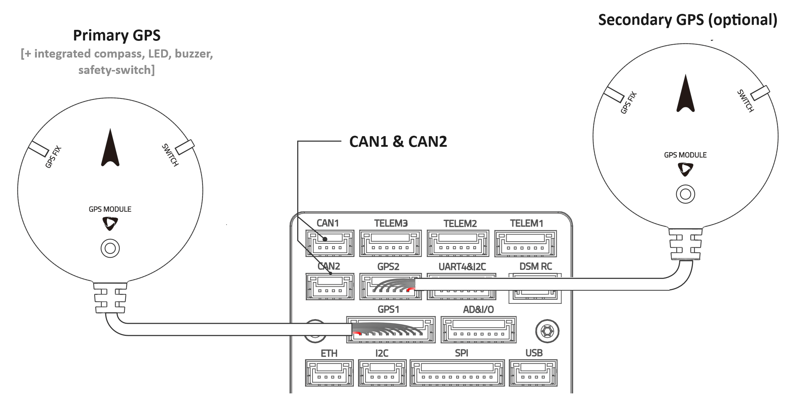
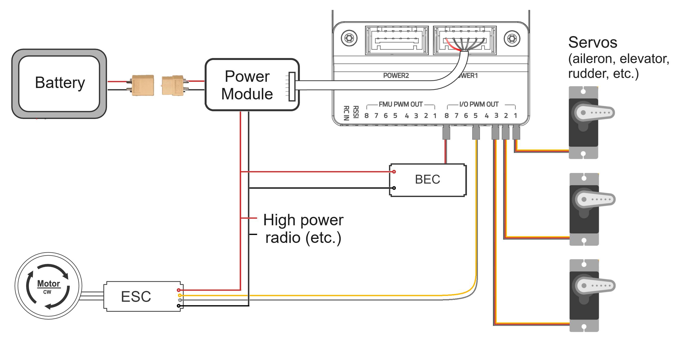
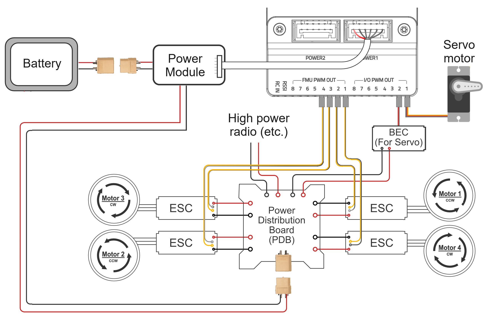
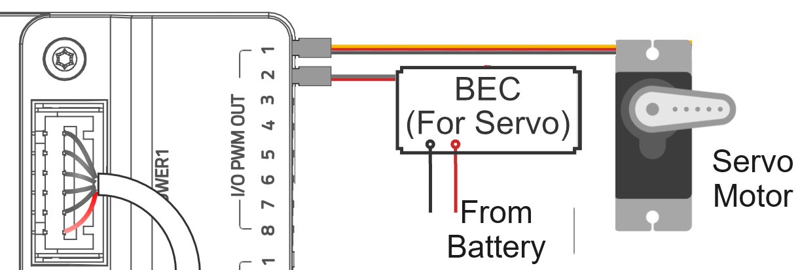

# 组装多旋翼飞行器

本主题提供基本的指导说明和链接，展示如何连接和组装运行PX4的典型多旋翼飞行器（UAV）核心组件。

这些包括飞控、GPS、外部指南针、遥控器和/或数传电台系统、电机和/或其他控制执行器、载荷以及电源系统。

# 组装固定翼飞机

本主题提供基础说明和链接，展示如何连接和组装运行PX4的典型固定翼机体（Plane）的核心组件。

这些组件包括飞控、GPS、外部指南针、空速传感器、遥控器和/或遥测无线电系统、电机和/或其他控制执行器、载荷以及电源系统。

# 组装VTOL

本主题提供基本操作指南和链接，展示如何连接和组装运行PX4的典型VTOL无人机的核心组件。

这些组件包括飞控、GPS、外部指南针、空速传感器、遥控器和/或遥测无线电系统、电机和/或其他控制执行器、载荷以及供电系统。

# 组装无人系统

<!-- 这是非特定机体的简介 -->

本主题提供基本说明和链接，展示如何连接和组装运行PX4的典型无人系统（UAS）的核心组件。

::: tip
如果您对特定机体感兴趣，请查看各机体部分中更针对性的主题：

- [多旋翼](../assembly/assembly_mc.md)
- [垂直起降飞行器](../assembly/assembly_vtol.md)
- [固定翼](../assembly/assembly_vtol.md)
:::

核心组件包括飞控、GPS、外部指南针、遥控器和/或数传无线电系统、电机和/或其他控制执行器、载荷和电源系统。前向飞行的机体（如垂直起降飞行器或固定翼）通常还包括空速传感器。

这些说明主要针对使用[Pixhawk系列](../flight_controller/pixhawk_series.md)飞控（FC）的系统，特别是那些采用[Pixhawk连接器标准](https://github.com/pixhawk/Pixhawk-Standards/blob/master/DS-009%20Pixhawk%20Connector%20Standard.pdf)的设备。对于这些FC，大部分"布线"工作只需将组件连接到相应标记的端口，并使用配套线缆。

::: info 如果您的FC未使用连接器标准...
不遵循连接器标准的Pixhawk系列飞控通常会提供与Pixhawk标准组件连接的线缆。对于其他控制器，您可能需要手动制作线缆和连接器。

[飞控专用指南](#fc-specific-assembly-guides)包含飞控特定的布线和配置信息，制造商网站上的指南也包含类似内容。
:::

## 飞行控制器概述

下图展示了CUAV和Holybro提供的Pixhawk v6x飞行控制器。  
它们的可用端口非常相似，因为它们都是采用了[Pixhawk标准自动驾驶仪](../flight_controller/autopilot_pixhawk_standard.md)和[Pixhawk连接器标准](https://github.com/pixhawk/Pixhawk-Standards/blob/master/DS-009%20Pixhawk%20Connector%20Standard.pdf)的控制器。

Pixhawk连接器标准端口列表如下，包含每个FC上的标签及其用途说明。  
这些飞行控制器具有名称相似的端口，核心外设的连接方式也保持一致。

| Pixhawk连接器标准        | Holybro       | CUAV                | 连接至 ...                                                 |
| ------------------------ | ------------- | ------------------- | ---------------------------------------------------------- |
| 全GPS加安全开关          | GPS1          | GPS&SAFETY          | 主GNSS模块(GPS、指南针、安全开关、蜂鸣器、LED)            |
| 基础GPS                | GPS2          | GPS2                | 次GNSS模块(GNSS/指南针)                                    |
| CAN                      | CAN1/CAN2     | CAN1/CAN2           | DroneCAN设备（如GNSS模块、电机等）                         |
| 通信                     | TELEM (1,2,3) | TELEM (1,2,3)       | 通信电台、协同计算机、MAVLink相机等                        |
| 模拟电源                 | POWER (1,2)   | POWER (1,2)         | SMbus (I2C)电源模块                                        |
| I2C                      | I2C           | None                | 其他I2C外设                                                |
| SPI                      | SPI           | SPI6                | SPI设备（注意：11针，非标准中的6针）                       |
| PX4调试完整版            | FMU DEBUG     | FMU DEBUG, IO DEBUG | Pixhawk "x"系列FC的调试接口                                |
| Pixhawk调试迷你版        | None          | None                | 其他Pixhawk变种的调试接口                                  |

还有一些未纳入标准的相似特性：它们均配备相同的以太网端口(`ETH`)、`SBUS OUT`、`AD&IO`、`USB`、USB-C接口。

在RC控制协议和PWM输出连接方式上存在重要差异，我们将在相关章节详细说明。

::: tip
连接外设前请断开飞行控制器的电源！  
这是“最佳实践”，即使在某些情况下并非绝对必要。
:::

## 安装和调整控制器

飞行控制器应尽可能[安装在机架](../assembly/mount_and_orient_controller.md)上，尽量靠近机体的重心位置，以正面朝上方向安装，且箭头指向机体前方。

为减少振动对飞行控制器内部IMU和陀螺仪的影响，建议使用提供的安装泡沫进行安装，或遵循制造商指导进行安装。

::: info
如果控制器无法以推荐/默认方向安装（例如因空间限制），则需要在自动驾驶仪软件中配置实际使用的方向：[飞行控制器方向](../config/flight_controller_orientation.md)。
:::

## GNSS/Compass (+蜂鸣器+安全开关+LED)

Pixhawk飞控系统通常包含一个主[GNSS/Compass模块](../gps_compass/#supported-gnss)，该模块集成了[蜂鸣器](../getting_started/px4_basic_concepts.md#buzzer)、[安全开关](../getting_started/px4_basic_concepts.md#safety-switch)和[UI LED](../getting_started/led_meanings.md#ui-led)，也可能包含备用的GPS/compass模块。
支持具有厘米级精度的[RTK GNSS](../gps_compass/rtk_gps.md)模块。

GNSS/Compass模块应尽可能远离其他电子设备安装——将指南针与其他电子设备分离可减少电磁干扰。
若方向标记朝上且指向机体前方，或在任意轴上以45度的倍数偏移，校准时将自动检测方向。
若需要其他偏移角度，则需要手动设置方向。
更多信息请参见[安装指南针（或GNSS/Compass）](../assembly/mount_gps_compass.md)。

模块可通过串口或CAN总线连接。

### 串口GNSS模块

主GNSS/compass模块连接到飞控上标记为`GPS1`或`GPS&SAFETY`的接口，应为10针JST GH连接器。
备用GNSS/compass模块（如有）连接到标记为`GPS2`的6针接口。

::: details
Pixhawk连接器标准10针_完整GPS加安全开关端口_用于连接主GNSS模块。
它包含一个GNSS的UART端口和一个指南针的I2C端口，以及[蜂鸣器](../getting_started/px4_basic_concepts.md#buzzer)、[安全开关](../getting_started/px4_basic_concepts.md#safety-switch)和[UI LED](../getting_started/led_meanings.md#ui-led)的引脚。
PX4默认会将此UART配置为主GPS端口。

6针_基础GPS端口_（如存在）仅包含UART和I2C端口。
PX4可能不会将其配置为备用GPS端口。
您可以按照[串口配置](../peripherals/serial_configuration.md)中的说明自行检查/配置。

您也可以使用其他UART端口连接此类GPS模块，但可能需要自行焊接适当线缆，并按照链接说明配置端口。
您还可以使用其他I2C端口连接独立磁强计或GNSS/compass模块中的磁强计。
:::

### DroneCAN GNSS模块

DroneCAN GNSS/Compass模块连接到CAN总线端口，通常标记为`CAN1`和`CAN2`（如上图所示）。
[DroneCAN](../dronecan/index.md)主题包含连接和配置说明。

### RTK GNSS模块

[RTK GNSS](../gps_compass/rtk_gps.md)模块通过专用飞控串口或CAN口连接，方式与普通GNSS模块相同。
需注意的是，地面站需要单独的基准站模块（详见[RTK GNSS](../gps_compass/rtk_gps.md)）。

<!-- https://discord.com/channels/1022170275984457759/1022185721450213396/threads/1245295551784681512 -->

## 空速传感器

[空速传感器](../sensor/airspeed.md)强烈推荐用于固定翼和垂直起降(VTOL)机型。
它们非常重要，因为自动驾驶仪没有其他手段来检测失速。

几乎所有的空速传感器都通过[I2C总线](../sensor_bus/i2c_general.md)连接，并可插入到Pixhawk标准I2C端口（如下图所示为Holybro空速传感器与Pixhawk 6C的连接）。
无需单独为传感器供电。

如果外围设备的I2C端口不足，可以使用I2C总线分割器将端口分割为多个端口。

::: warning
某些I2C设备使用5V SCL/SDA线路，而Pixhawk标准I2C端口预期为3.3V。
您可以使用I2C电平转换器将这些设备连接到Pixhawk飞控。
:::

## 距离传感器

[距离传感器](../sensor/rangefinders.md)可以显著提升机体的鲁棒性和性能，某些使用场景下是必需的：

- 距离传感器可以显著提升降落效果：
  - 降落检测更可靠。
  - 由于传感器可帮助检测减速点，降落过程更平稳。
  - 降低因高度估计错误或着陆点高度设置不当导致的硬着陆风险。
- 支持地形跟随。
- 在GNSS拒止导航时（需配合[光流传感器](#optical-flow-sensor)），能提高状态估计的可靠性。

- 允许在接近地面时禁用"推力辅助"。

[距离传感器](../sensor/rangefinders.md)强烈推荐使用，因为它们允许在降落时进行正确的拉平操作，否则固定翼的自动降落几乎无法实现平稳着陆。

与某些其他组件不同，距离传感器没有特定的常用总线或端口。
不同测距仪会通过I2C、CAN、串口甚至PWM输入进行连接！

请参见[距离传感器](../sensor/rangefinders.md)和厂商文档，了解如何将具体传感器与PX4集成。

## 光流传感器

[光流](../sensor/optical_flow.md) 是一种计算机视觉技术，通过向下摄像头和向下距离传感器估算相对于地面的速度。  
它可以在没有GNSS信号的环境中（如建筑内部、地下或任何GNSS信号被阻断的场景）精确估算飞行速度。

光流传感器可能集成摄像头和距离传感器，或仅集成摄像头（此时需要单独的距离传感器）。  
目前光流传感器的连接方式没有统一标准，传感器可能通过I2C、CAN、串口上的MAVLink等不同接口进行连接。

请参见 [光流传感器](../sensor/optical_flow.md) 和厂商文档，了解如何将特定传感器与PX4集成的具体说明。

## 遥控系统（可选）

[遥控系统（RC）](../getting_started/rc_transmitter_receiver.md) 可用于手动控制无人机系统（UAS）。  
遥控系统包含两部分：机体上的无线电接收机与飞行控制器连接，以及集成在手持控制器中的地面无线电发射机。

::: tip
PX4 在自主飞行模式下**不需要**手动控制器。  
然而RC系统在新机体调试阶段是必需的，并且强烈推荐用于其他低延迟的手动飞行场景。
:::

目前存在多种RC标准，例如 Spektrum/DSM、S.BUS、PPM 等。  
[遥控发射机与接收机](../getting_started/rc_transmitter_receiver.md) 详细说明了如何选择和绑定兼容的发射机/接收机。

RC端口不属于Pixhawk连接器标准的一部分。  
[连接接收机](../getting_started/rc_transmitter_receiver.md#connecting-receivers) 节解释了如何识别连接特定接收机的端口。

通常可通过飞行控制器上的标签快速判断正确端口：

- Spektrum/DSM接收机通常连接到包含`DSM`的输入端口，例如：`DSM`、`DSM/SBUS RC`、`DSM RC`、`DSM/SBUS/RSSI`。
- PPM或SBUS接收机连接到RC输入端口，通常标记为`RC IN`，也可能标注`SBUS`或`PPM`的端口。
- Pixhawk飞行控制器通常附带连接常见RC接收机类型的电缆。

## 遥测无线电 (可选)

[遥测无线电](../telemetry/index.md)可由[地面控制站](../getting_started/px4_basic_concepts.md) (GCS) 用于与飞行中的机体通信。
地面控制站允许您通过图形界面监控和控制UAS，编辑、上传和运行任务，查看连接的摄像头视频，捕获视频和图像等。

将机体端的无线电连接到如下所示的 `TELEM1` 端口。
另一个无线电连接到您的地面站计算机或移动设备（通常通过USB）。

低功率遥测无线电（<1.5 A）由端口供电，通常不需要进一步配置。

如果使用高功率/远距离无线电或另一个端口，需要单独通过BEC为无线电供电，并修改遥测端口的数据速率。
您可能还需要配置无线电本身，对于IP无线电可能需要通过以太网连接——请查看无线电的特定文档以获取设置和配置信息。

::: details

- `TELEM1` 被配置为支持低功率无线电（如 [SIK Radios](../telemetry/sik_radio.md)）的典型数据速率。
- 如果使用支持更高数据速率的无线电，可能需要根据PX4和制造商文档修改[串口配置](../peripherals/serial_configuration.md)。
- 大多数 [SIK Radios](../telemetry/sik_radio.md) 和 [Wifi遥测无线电](../telemetry/telemetry_wifi.md)（约300米范围）由飞控供电。
- 高功率无线电如 [Microhard Serial radio](../telemetry/microhard_serial.md) 需要单独供电，可能需要配置（请参阅PX4和制造商文档）。
- 也可以将遥测无线电连接到 `TELEM2` 和 `TELEM3` 遥测端口（如果存在）。
  但请注意，`TELEM2` 默认配置为连接到伴飞计算机，可能需要[重新配置](../peripherals/mavlink_peripherals.md)以连接地面站。

:::

## SD卡

强烈建议使用SD卡。  
它们用于记录和分析飞行细节、使用DroneCan/UAVCAN总线硬件等。  
许多飞控出厂时已安装SD卡，但您应查阅FC的文档确认。

:::tip
更多信息请参见 [基础概念 > SD卡(可移动存储)](../getting_started/px4_basic_concepts.md#sd-cards-removable-memory)
:::

## 电源与执行器

下图展示了飞行控制器、电机、控制面执行器、其他执行器和其他系统可能的接线方式，同时显示了电源和PWM控制信号的连接方式。
特定机体可能拥有更多/更少的电机和执行器，但使用PWM输出时的接线方式很可能是相似的！

以下章节将更详细地解释每个部分。

::: tip
如果你使用[DroneCAN电调](../peripherals/esc_motors.md#dronecan)，控制信号将通过CAN总线连接，而非如图所示的PWM输出。
:::

### 飞行控制器电源

Pixhawk飞行控制器需要稳定的电源供应，能提供约5V/3A的连续电流（请确认你的具体FC）！
这足以给控制器本身和几个低功耗外设（如GNSS模块、遥控器和低功耗数传电台）供电，但不足以驱动电机、执行器和其他外设。

[电源模块](../power_module/index.md)通常用于为FC提供稳定的电源，并向整个系统提供电池电压和总电流的测量数据——PX4可以利用这些数据来估算电源状态。
电源模块连接到FC的电源端口，通常标记为`POWER`（对于具有冗余电源的FC，可能标记为`POWER 1`或`POWER 2`）。
下图展示了可能的连接方式。

电源模块的另一个输出为其他组件（包括电机和执行器、高功耗数传电台，以及一些载荷如相机和机械爪）提供电池电源。

::: tip
飞行控制器制造商通常会推荐与其FC兼容的电源模块（有时还包括_电源分配板_（PDB））。
你不必使用制造商推荐的电源模块（或PDB），但这是确保电源供应满足FC电源需求和电源端口通信协议的最简便方式。
:::

::: info
FC可能具有通过CAN总线提供电源信息的电源端口。
例如，CUAV Pixhawk 6x具有I2C电源端口`POWER 1`和`POWER 2`，以及CAN端口`POWER C1`和`POWER C2`。
尽管电源端口是Pixhawk连接器标准的一部分，但你仍应查阅FC的特定文档以进行电源设置。
:::

### 电源分配板（PDB）

在此示例中，电池的电源输出首先连接到电源分配板（PDB），该板将输入电源分配到多个并行输出。
你不必使用PDB，但对于具有多个电机的机体，它能简化接线。

功能更强大的PDB可能集成电源模块（在这种情况下取代独立模块）、用于控制多个电机的电调，以及为舵机和其他外设供电的BEC（电池消除电路）。

### 电机

无刷电机通过电调（电子调速器）供电和控制。
PWM电调通过两根来自电池的电源线供电，两根来自飞行控制器的控制信号线（通过三针连接器），以及三根连接到电机的输出线。

电源线应绞合以减少电磁干扰，并尽可能在机架上保持短且整洁。

任何PWM输出总线上的输出都可以连接到任何执行器、电机或其他PWM控制硬件，并在配置[执行器输出](../config/actuators.md#actuator-outputs)时映射到由PX4控制的特定执行器。

注意：

- 优先将电调连接到FMU PWM总线输出，因为它们的延迟低于IO PWM输出。
  注意PWM输出通常标记为`AUX`或`MAIN`。
  如果两者都存在，请使用`AUX`总线，否则使用`MAIN`。
- [DShot电调](../peripherals/dshot.md)（推荐）只能用于FMU PWM输出。
- 电机输出应尽可能集中在一起，而非随机分布在FMU和IO总线上。
  这是因为如果你为某个输出分配了功能（如DShot电调），则无法将相邻的未使用引脚分配为除DShot电调外的其他功能。

### 舵机

舵机用于移动飞行控制面和载荷执行器。
电源和控制的典型接线方式如下所示。

PWM舵机具有三线连接器，提供电源和PWM控制信号（中间引脚为电源/高电平）。
你可以将舵机输出连接到任何引脚或总线，并在后续配置中定义输出在PX4中的实际功能。

电源轨不能由飞行控制器本身供电！
可以使用电池消除电路（BEC）从电池向PWM输出总线的中间"电源"轨提供稳压电压，从而为所有连接的舵机供电。

::: warning
电源轨只能由你的BEC提供单一电压。
如果你使用的舵机不接受相同电压，则需要为使用不同电压的舵机单独供电。
:::

## 其他外设

其他外设（如高功率无线电、相机等）有各自的供电需求。  
这些设备通常由独立的BEC供电。

可选/不常见组件的接线和配置方式详见[Hardware Hardware Selection & Setup](../hardware/drone_parts.md)中各个外设的硬件选型与设置专题。

## 构建教程

在特定机体框架上组装自动驾驶系统取决于您实际使用的硬件，包括尺寸、几何结构、材料、安装点以及使用的组件。  
这些无法通过单一通用的指令集来描述。

相反，我们提供了以下构建教程中具体示例的链接。  
这些教程展示了多种机体的完整设置和配置流程。

- [套件](../frames_multicopter/kits.md)
- [自制组装](../frames_multicopter/diy_builds.md)

- [自制组装](../frames_plane/diy_builds.md)

- [标准VTOL](../frames_vtol/standardvtol.md)
- [尾座式VTOL](../frames_vtol/tailsitter.md)
- [倾转旋翼VTOL](../frames_vtol/tiltrotor.md)

- 检查您的组装：[机体组装](../airframes/index.md) 以查看不同机体框架的完整组装示例。

## 与飞控相关的组装指南

::: tip
您的[飞行控制器](../flight_controller/index.md)制造商文档中可能包含以下未列出的控制器指南，或比下方指南更新的版本。
:::

这些指南解释了如何为多个主流[飞行控制器](../flight_controller/index.md)在框架外部连接自动驾驶仪系统的核心组件。  
它们推荐使用同一制造商的传感器、电源系统和其他组件。

- [CUAV Pixhawk V6X 接线快速入门](../assembly/quick_start_cuav_pixhawk_v6x.md)
- [CUAV V5+ 接线快速入门](../assembly/quick_start_cuav_v5_plus.md)
- [CUAV V5 nano 接线快速入门](../assembly/quick_start_cuav_v5_nano.md)
- [Holybro Pixhawk 6C 接线快速入门](../assembly/quick_start_pixhawk6c.md)
- [Holybro Pixhawk 6X 接线快速入门](../assembly/quick_start_pixhawk6x.md)
- [Holybro Pixhawk 5X 接线快速入门](../assembly/quick_start_pixhawk5x.md)
- [Holybro Pixhawk 4 接线快速入门](../assembly/quick_start_pixhawk4.md)
- [Holybro Pixhawk 4 Mini (已停产) 接线快速入门](../assembly/quick_start_pixhawk4_mini.md)
- [Holybro Durandal 接线快速入门](../assembly/quick_start_durandal.md)
- [Holybro Pix32 v5 接线快速入门](../assembly/quick_start_holybro_pix32_v5.md)
- [Cube 接线快速入门](../assembly/quick_start_cube.md) (所有Cube变体)
- [Pixracer 接线快速入门](../assembly/quick_start_pixracer.md)
- [mRo (3DR) Pixhawk 接线快速入门](../assembly/quick_start_pixhawk.md)

## 参见

- [无人机组件与部件](../getting_started/px4_basic_concepts.md#drone-components-parts) (基础概念)
- [载荷](../getting_started/px4_basic_concepts.md#payloads) (基础概念)
- [硬件选型与设置](../hardware/drone_parts.md) — 关于连接和配置特定飞控、传感器及其他外设的详细信息（例如飞机的空速传感器）

  - [安装飞控模块](../assembly/mount_and_orient_controller.md)
  - [振动隔离](../assembly/vibration_isolation.md)
  - [安装指南针](../assembly/mount_gps_compass.md)

- [多旋翼竞速机配置](../config_mc/racer_setup.md) — 竞速机专用的组装与配置信息（竞速机通常不配备GNSS模块）

