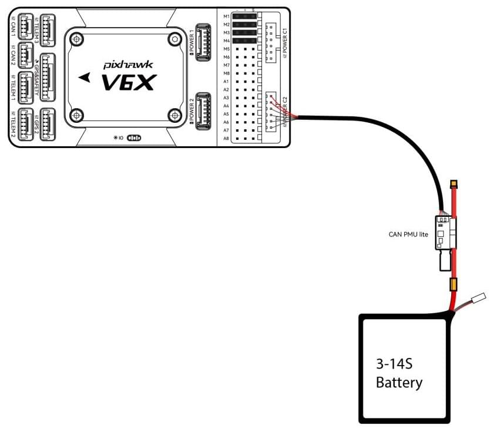

# CUAV Pixhawk V6X 接线快速入门

本快速入门指南展示了如何为 [Pixhawk V6X&reg;](../flight_controller/cuav_pixhawk_v6x.md) 飞控供电，以及如何连接其最重要的外围设备。

## 接线图概述

下图展示了除电机和舵机输出外最重要的传感器和外设的连接方式。我们将在后续章节中逐一详细说明。

| 接口          | **功能**                                                                                                                                                                                                                      |
| :------------ | :---------------------------------------------------------------------------------------------------------------------------------------------------------------------------------------------------------------------------- |
| POWER C1      | 将CAN PMU SE连接到此接口；此接口连接到UAVCAN电源模块                                                                                                                                                                            |
| POWER C2      | 将CAN PMU SE连接到此接口；此接口连接到UAVCAN电源模块                                                                                                                                                                            |
| POWER 1       | 连接SMbus (I2C) 电源模块                                                                                                                                                                                                      |
| POWER 2       | 连接SMbus (I2C) 电源模块                                                                                                                                                                                                      |
| GPS&SAFETY    | 连接Neo系列GPS/C-RTK 9PS，包括GPS、安全开关、蜂鸣器接口                                                                                                                                                                        |
| GPS2          | 连接GPS/RTK模块                                                                                                                                                                                                               |
| UART 4        | 用户可自定义                                                                                                                                                                                                                   |
| TELEM (1,2,3) | 连接遥测或MAVLink设备                                                                                                                                                                                                          |
| TF CARD       | 存储日志的SD卡（出厂时已预装）                                                                                                                                                                                                |
| M1~M8         | IO PWM输出（用于连接电调和舵机）                                                                                                                                                                                              |
| A1~A8         | FMU PWM输出。可定义为PWM/GPIO；支持dshot；用于连接相机快门/热靴、舵机等                                                                                                                                                        |
| USB           | 连接计算机，实现飞控器与计算机的通信，例如加载固件                                                                                                                                                                              |
| CAN1/CAN2     | 连接Dronecan/UAVCAN设备，如NEO3 Pro                                                                                                                                                                                           |
| DSM/SUB/RSSI  | 包含DSM、SBUS、RSSI信号输入接口，DSM接口可连接DSM卫星接收机，SBUS接口可连接SBUS遥控接收机，RSSI用于信号强度返回模块                                                                                                              |
| PPM           | 连接PPM遥控接收机                                                                                                                                                                                                             |
| ETH           | 以太网接口。连接任务计算机等以太网设备                                                                                                                                                                                        |
| AD&IO         | 包含两个模拟输入（ADC3.3/ADC6.6）；通常不使用                                                                                                                                                                                  |## 机体前部

::: info
如果由于空间限制等原因无法将控制器安装在推荐/默认方向上，则需要根据实际安装方向配置自动驾驶软件：[Flight Controller Orientation](../config/flight_controller_orientation.md)。
:::

## GPS + 指南针 + 蜂鸣器 + 安全开关 + LED

Pixhawk® V6X 可搭配 [NEO3 GPS](https://store.cuav.net/shop/neo-3/) （10针接口）购买，应连接至 **GPS1** 接口。  
这些GNSS模块集成了指南针、安全开关、蜂鸣器和LED。

如果需要使用辅助GPS，应连接至 **GPS2** 接口。

GPS/指南针应 [安装在机体机架上](../assembly/mount_gps_compass.md)，尽可能远离其他电子设备，且方向标记需朝向机体前方（将指南针与其他电子设备分离可减少干扰）。

::: info
Pixhawk V6X® 不兼容NEO V2 GPS内置蜂鸣器：应改用 [NEO3/NEO 3Pro](https://store.cuav.net/shop/neo-3/)。  
GPS模块的集成安全开关默认启用（启用时，PX4将不允许你解锁机体）。  
要禁用安全开关，需按住安全开关1秒。  
再次按下安全开关可启用安全功能并解除机体锁定（如果因任何原因无法通过遥控器或地面站解除锁定时，此功能非常有用）。
:::

## 无线电控制

如果要_manual_控制机体，则需要遥控（RC）无线电系统（PX4在自主飞行模式下无需无线电系统）。

需要选择[兼容的发射机/接收机](../getting_started/rc_transmitter_receiver.md)并进行绑定，使它们能够通信（阅读随附的发射机/接收机说明）。

- Spektrum/DSM接收机连接到**DSM/SBUS**输入端口。
- PPM接收机连接到**PPM**输入端口。

如需了解更多关于选择无线电系统、接收机兼容性及绑定发射机/接收机对的信息，请参阅：[Remote Control Transmitters & Receivers](../getting_started/rc_transmitter_receiver.md)。

## 电源

Pixhawk V6X&reg; 配备了支持 3~14s 锂电池的 CAN PMU lite 模块。
将模块的 6针连接器连接到飞控的 **Power C1** 或 **Power C2** 接口。

_Pixhawk V6X_ 电源端口接收来自 CAN PMU lite 电源模块的 Dronecan 数字信号，用于电压、电流和剩余电量数据。VCC 线必须提供至少 3A 持续电流，且默认电压为 5.2V。
5V 虽然可以接受但不推荐。

## 遥测（无线电）系统

[遥测无线电](../telemetry/index.md)可用于从地面站与机体通信并控制飞行（例如，您可以指令无人机飞往特定位置，或上传新的任务）。

机体端无线电应连接到 **TELEM1**/**TELEM2**/**TELEM3** 端口（如连接到 **TELEM1**，则无需进一步配置）。
另一端无线电连接到您的地面站电脑或移动设备（通常通过 USB 连接）。

您也可以从 [CUAV商店](https://store.cuav.net/uav-telemetry-module/) 购买遥测无线电。

## SD卡

推荐使用SD卡，因为它们是[记录和分析飞行细节](../getting_started/flight_reporting.md)、运行任务和使用UAVCAN总线硬件所必需的。
Pixhawk V6X&reg;出厂时已预装SD卡。

:::tip
更多信息请参见[基本概念 > SD卡(可移动存储)](../getting_started/px4_basic_concepts.md#sd-cards-removable-memory)。
:::

## 电机/舵机

电机/舵机需按照[机型参考文档](../airframes/airframe_reference.md)中为你的机体指定的顺序，连接到 **M1~M8** (**MAIN**) 和 **A1~A8** (**AUX**) 端口。

::: info
在PX4固件中，**MAIN** 输出端口映射到Pixhawk V6X的M1~M8端口（来自IO），而 **AUX输出** 映射到A1~A8端口（来自FMU）。
例如，**MAIN1** 映射到M1引脚，**AUX1** 映射到A1引脚。
此参考文档列出了所有支持的空中和地面机型的输出端口到电机/舵机的映射关系（若你的机体未在参考文档中列出，则使用对应类型的"generic"机型）。
:::

:::warning
不同机型的映射关系不一致（例如你不能依赖所有固定翼机型的油门在相同输出端口）。
请务必使用你机体的正确映射关系。
:::

## 舵机电源供应

Pixhawk V6X&reg; 不为舵机供电。如果使用固定翼或地面车辆，需要将外部 BEC（例如带 BEC 的电调或独立的 5V BEC 或 2S 锂电池）连接到 M1~M8/A1~A8 的任意电源（+）引脚以驱动舵机。

::: info
必须确保电源电压与所用舵机的规格相匹配！
:::

## 其他外设

可选/不常用组件的接线和配置在各个外设的主题中进行了介绍。[peripherals](../peripherals/index.md)

## 引脚分配

## 配置

通用配置信息请参考：[Autopilot Configuration](../config/index.md)

QuadPlane 特定配置在此处：[QuadPlane VTOL Configuration](../config_vtol/vtol_quad_configuration.md)

## 更多信息

- [CUAV Docs](https://doc.cuav.net/) (CUAV)
- [Pixhawk V6X](../flight_controller/cuav_pixhawk_v6x.md) (PX4 文档概述页面)
- [Pixhawk Autopilot FMUv6X Standard](https://github.com/pixhawk/Pixhawk-Standards/blob/master/DS-012%20Pixhawk%20Autopilot%20v6X%20Standard.pdf)
- [Pixhawk Autopilot Bus Standard](https://github.com/pixhawk/Pixhawk-Standards/blob/master/DS-010%20Pixhawk%20Autopilot%20Bus%20Standard.pdf)
- [Pixhawk Connector Standard](https://github.com/pixhawk/Pixhawk-Standards/blob/master/DS-009%20Pixhawk%20Connector%20Standard.pdf)