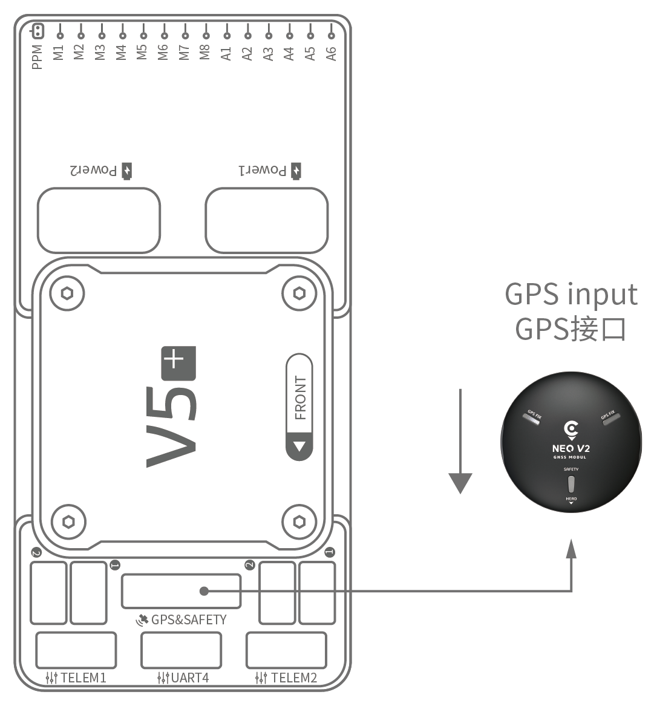

# CUAV V5+ 接线快速入门

:::warning
PX4不生产此（或任何）自动驾驶仪。  
联系[制造商](https://store.cuav.net/)获取硬件支持或合规性问题。
:::

本快速入门指南展示了如何为[CUAV V5+](../flight_controller/cuav_v5_plus.md)飞控供电并连接其最重要的外设。

## 接线图概览

下图展示了除电机和舵机输出外的重要传感器和外设的连接方式。  
后续章节将逐一详细说明这些接口。

| 主要接口         | 功能                                                                                                                                                                                           |
| :--------------- | :------------------------------------------------------------------------------------------------------------------------------------------------------------------------------------------------- |
| Power1           | 连接电源模块。通过_模拟_电压和电流检测进行电源输入。请勿在此接口使用数字电源管理器！                                                                                                               |
| Power2           | 连接I2C智能电池。                                                                                                                                                                                |
| TF CARD          | 用于日志存储的SD卡（出厂时已预装）。                                                                                                                                                             |
| M1~M8            | PWM输出。可用于控制电机或舵机。                                                                                                                                                                  |
| A1~A6            | PWM输出。可用于控制电机或舵机。                                                                                                                                                                  |
| DSU7             | 用于FMU调试，读取调试信息。                                                                                                                                                                      |
| I2C1/I2C2        | 连接I2C设备（如外部磁罗盘）。                                                                                                                                                                    |
| CAN1/CAN2        | 连接UAVCAN设备（如CAN GPS）。                                                                                                                                                                    |
| TYPE-C(USB)      | 连接计算机，实现飞控与计算机的通信（如加载固件）。                                                                                                                                                |
| SBUS OUT         | 连接SBUS设备（如云台）。                                                                                                                                                                         |
| GPS&SAFETY       | 连接Neo GPS，包含GPS、安全开关、蜂鸣器接口。                                                                                                                                       |
| TELEM1/TELEM2    | 连接数传系统。                                                                                                                                                                                   |
| DSM/SBUS/RSSI    | 包含DSM、SBUS、RSSI信号输入接口，DSM接口可连接DSM卫星接收机，SBUS接口可连接SBUS遥控接收机，RSSI用于信号强度返回模块。 |

::: info
更多接口信息请参阅[V5+ Manual](http://manual.cuav.net/V5-Plus.pdf)。
:::

::: info
如果控制器无法以推荐/默认方向安装（例如由于空间限制），则需要根据实际使用的方向配置飞控软件：[Flight Controller Orientation](../gps_compass/rtk_gps.md)。
:::

## GPS + 罗盘 + 安全开关 + LED

推荐的GPS模块是_Neo v2 GPS_，该模块集成了GPS、罗盘、安全开关、蜂鸣器和LED状态灯。

::: info
其他GPS模块可能无法正常工作（参见[此兼容性问题](../flight_controller/cuav_v5_nano.md#compatibility_gps)）。
:::

GPS/罗盘模块应[安装在机架上](../assembly/mount_gps_compass.md)，尽量远离其他电子设备，且方向标记朝向机体前方（Neo v2 GPS的箭头方向与飞控箭头方向一致）。通过线缆连接到飞控的GPS接口。

::: info
如果使用[NEO V2 PRO GNSS (CAN GPS)](http://doc.cuav.net/gps/neo-series-gnss/en/neo-v2-pro.html)，请使用线缆连接到飞控的CAN接口。
:::

## 安全开关

V5+配套的专用安全开关仅在未使用推荐的_Neo V2 GPS_（内置安全开关）时需要。

如果未使用GPS飞行，必须将开关直接连接到`GPS1`端口才能给机体上锁并飞行（如果使用旧的6针GPS，请阅读底部接口定义以修改相关线路）。

## 蜂鸣器

如果未使用推荐的GPS，蜂鸣器可能无法工作。

## 遥控

如果您想手动控制您的机体（PX4在自主飞行模式下不需要无线电系统），需要使用遥控（RC）无线电系统。您需要选择兼容的发射机/接收机并进行绑定以实现通信（请阅读您具体发射机/接收机附带的说明文档）。

下图显示了如何访问您的遥控接收机（请在套件中找到SBUS线缆）。

## Spektrum 卫星接收机

V5+ 配有专用的 DSM 线缆。  
如果使用 Spektrum 卫星接收机，应将其连接到飞行控制器的 DSM/SBUS/RSSI 接口。

## 电源

V5+ 套件包含 _HV_PM_ 模块，支持 2~14S 锂电池。  
将 _HW_PM_ 模块的 6针 接口连接到飞控 `Power1` 接口。

:::warning  
提供的电源模块无保险丝。  
连接外设时 **必须** 关闭电源。  
:::

::: info  
电源模块不会为连接到 PWM 输出的外设供电。  
如果连接舵机/执行器，需要使用 BEC 单独为其供电。  
:::

## 遥测系统（可选）

遥测系统允许您通过地面站与机体通信、监控并控制其飞行（例如，您可以指令无人机飞往特定位置，或上传新的任务）。

通信通道通过遥测无线电实现。
机体端的无线电应连接到 `TELEM1` 或 `TELEM2` 接口（若连接到这些接口，则无需进一步配置）。
另一端无线电连接到您的地面站电脑或移动设备（通常通过USB）。

## SD卡（可选）

[SD卡](../getting_started/px4_basic_concepts.md#sd-cards-removable-memory)已由工厂预装（您无需执行任何操作）。

## 电机

电机/舵机按照机体的指定顺序连接到MAIN和AUX端口（详见[Airframes Reference](../airframes/airframe_reference.md)）。

## 针脚定义

下载 **V5+** 针脚定义从 [这里](http://manual.cuav.net/V5-Plus.pdf)。

## 更多信息

- [使用CUAV v5+构建DJI FlameWheel450机体的日志](../frames_multicopter/dji_f450_cuav_5plus.md)
- [CUAV V5+手册](http://manual.cuav.net/V5-Plus.pdf) (CUAV)
- [CUAV V5+文档](http://doc.cuav.net/flight-controller/v5-autopilot/en/v5+.html) (CUAV)
- [FMUv5参考设计引脚分配](https://docs.google.com/spreadsheets/d/1-n0__BYDedQrc_2NHqBenG1DNepAgnHpSGglke-QQwY/edit#gid=912976165) (CUAV)
- [CUAV代码仓库](https://github.com/cuav) (CUAV)
- [主板设计参考](https://github.com/cuav/hardware/tree/master/V5_Autopilot/V5%2B/V5%2BBASE) (CUAV)