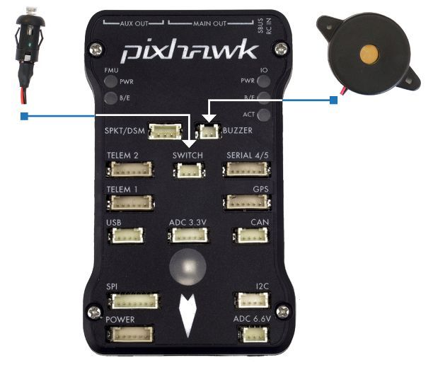
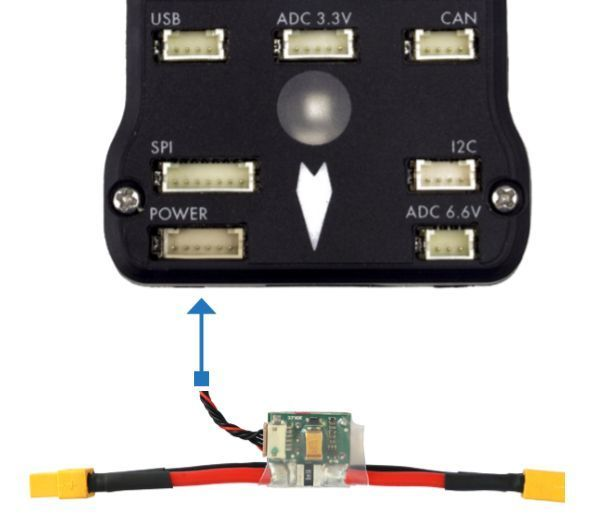
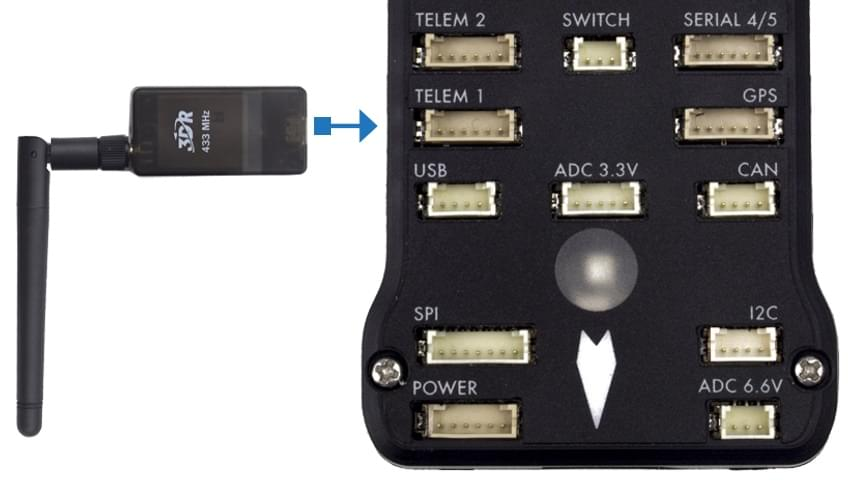

# Pixhawk 接线快速入门

:::warning
PX4 不生产此（或任何）自动驾驶仪。
有关硬件支持或合规性问题，请联系[制造商](https://store.mrobotics.io/)。
:::

本快速入门指南展示了如何为 _3DR Pixhawk_ 飞行控制器供电并连接其最重要的外设。

::: info
[3DR Pixhawk](../flight_controller/pixhawk.md) 已不再由 3DR 提供。
基于 [Pixhawk FMUv2 架构](../flight_controller/pixhawk_series.md) 的其他飞行控制器可从其他公司获得（它们共享相同的连接方式、输出、功能等，并以类似方式接线）。
:::

## 接线图表概览

下图显示了标准 Pixhawk 连接（不包括电机和舵机输出）。
后续章节将逐一介绍各个主要部分。

::: info
更详细的接线信息请[参见下方](#detailed-wiring-infographic-copter)。
:::

## 安装并定位控制器

应使用振动阻尼泡沫垫（包含在套件中）将 _Pixhawk_ 安装在机架上。
应尽可能靠近机体的重心位置安装，顶部朝上且箭头指向机体前方。

::: info
如果控制器无法以推荐/默认方向安装（例如因空间限制），则需要通过自动驾驶仪软件配置实际使用的方向：[飞行控制器方向](../config/flight_controller_orientation.md)。
:::

## 蜂鸣器和安全开关

按照下图连接包含的蜂鸣器和安全开关（这些是必需的）。

## GPS + 电子罗盘

使用套件中提供的6芯线缆将GPS（必需）连接到GPS端口。可选地使用4芯线缆将电子罗盘连接到I2C端口（Pixhawk 具有内部电子罗盘，必要时可使用）。

::: info
图示显示了组合的GPS和电子罗盘。
GPS/电子罗盘应尽可能远离其他电子设备安装在机架上，方向标记指向机体前方（将电子罗盘与其他电子设备分离可减少干扰）。
:::

## 电源

按照下图使用6芯线缆将电源模块（PM）的输出连接到 **POWER** 端口。PM 输入将连接到您的LiPo电池，主输出将为机体的电调/电机供电（可能通过电源分配板）。

电源模块从电池向飞行控制器供电，并发送通过模块提供的模拟电流和电压信息（包括对飞行控制器和电机等的供电）。

:::warning
电源模块为飞行控制器自身供电，但无法为连接到控制器输出端口（轨道）的舵机和其他硬件供电。对于多旋翼这无关紧要，因为电机是单独供电的。
:::

对于固定翼和VTOL，需要单独为输出轨道供电以驱动舵机（方向舵、升降舵等）。通常主推/拉电机使用的电调带有集成 [BEC](https://en.wikipedia.org/wiki/Battery_eliminator_circuit)，可连接到Pixhawk输出轨道。如果没有，需要设置一个5V BEC连接到其中一个空闲的Pixhawk端口（无电源时舵机将无法工作）。

<!-- 需要一个实际的供电示例 -->

## 遥控系统

如果要_手动_控制机体（PX4 在自主飞行模式下不需要无线电系统），则需要远程控制（RC）无线电系统。

您需要[选择兼容的发射机/接收机](../getting_started/rc_transmitter_receiver.md) 并进行绑定以使它们通信（请阅读您特定发射机/接收机附带的说明）。

以下说明展示了如何将不同类型的接收机连接到Pixhawk：

- Spektrum 和 DSM 接收机连接到 **SPKT/DSM** 输入。
  

- PPM-SUM 和 S.BUS 接收机连接到 **RC** 地线、电源和信号引脚，如图所示。
  

- 每个通道有单独导线的 PPM 和 PWM 接收机必须通过[PPM编码器](http://www.getfpv.com/radios/radio-accessories/holybro-ppm-encoder-module.html) 连接到 **RC** 端口（PPM-Sum 接收机使用单个信号线传输所有通道）。

有关选择无线电系统、接收机兼容性以及绑定发射机/接收机对的更多信息，请参见：[遥控发射机与接收机](../getting_started/rc_transmitter_receiver.md)。

## 通信电台（可选）

通信电台可用于从地面站与飞行中的机体通信和控制（例如，您可以指导无人机到特定位置，或上传新任务）。一个电台需按照下图连接到机体，另一个连接到您的地面站计算机或移动设备（通常通过USB）。

<!-- 设置电台后需要什么配置？ -->

## 电机

所有支持的空中和地面框架中 MAIN/AUX 输出端口与电机/舵机的映射关系列在 [框架参考](../airframes/airframe_reference.md) 中。

:::warning
不同框架之间的映射不一致（例如，您不能依赖所有固定翼框架的油门在相同输出上）。
确保使用适用于您机体的正确映射。
:::

:::tip
如果您的框架未在参考中列出，则使用类型正确的"通用"框架。
:::

::: info
输出轨道必须单独供电，如上文[电源](#power)部分所述。
:::

<!-- 插入电机 AUX/MAIN 端口的图片？ -->

## 其他外设

其他组件的接线和配置在[外设](../peripherals/index.md)主题中覆盖。

## 配置

通用配置信息请参见：[自动驾驶仪配置](../config/index.md)。

四旋翼特定配置请参见：[四旋翼 VTOL 配置](../config_vtol/vtol_quadrotor.md)

## 详细接线信息

