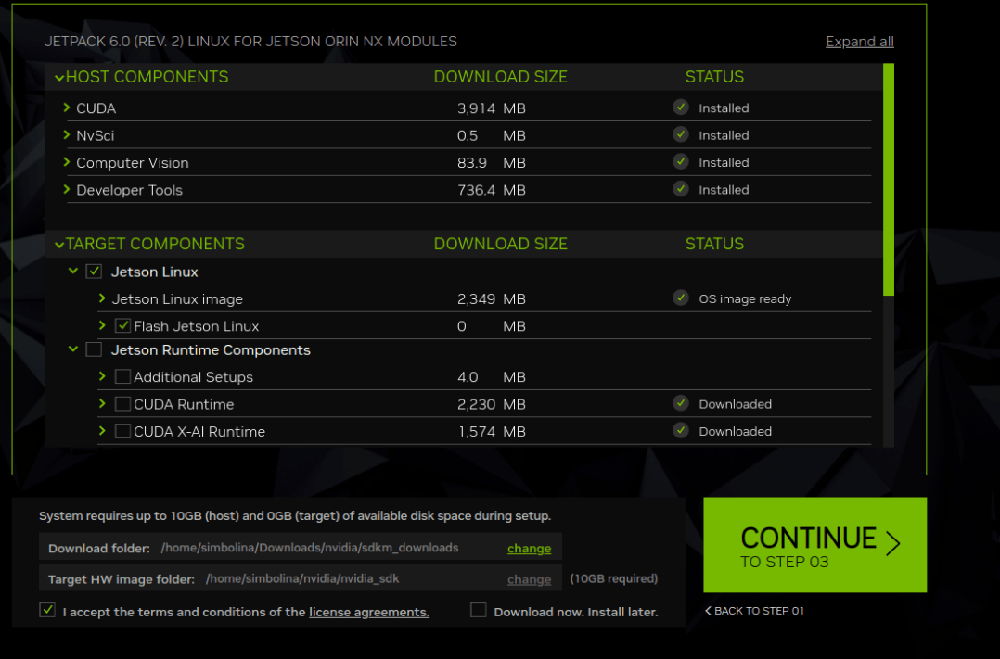
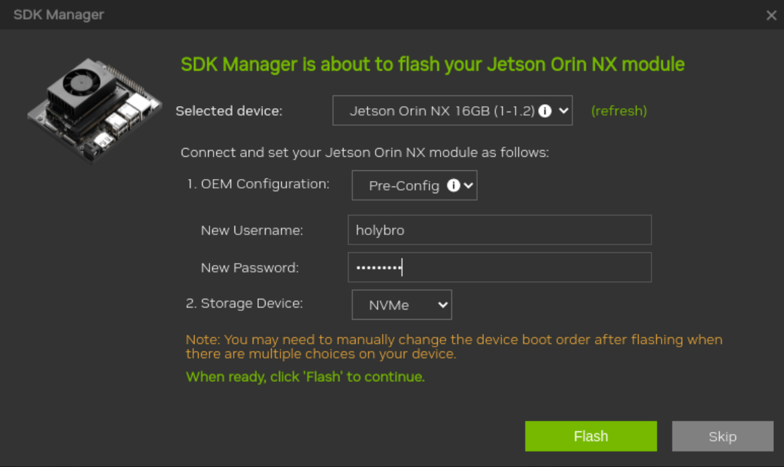
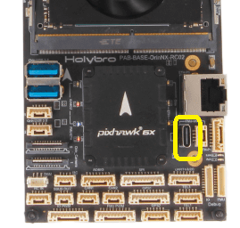

# Holybro Pixhawk Jetson 载板

[Holybro Pixhawk Jetson 载板](https://holybro.com/products/pixhawk-jetson-baseboard) 将 Pixhawk 飞控与 NVIDIA Orin 系列计算机集成于单一设备中，大幅简化了使用伴飞计算机时的硬件和软件配置流程。


该载板提供 [Jetson Orin NX (16GB RAM)](https://holybro.com/products/nvidia-jetson-orin-nx-16g) 或 [Jetson Orin Nano (4GB RAM)](https://holybro.com/products/nvidia-jetson-orin-nx-16g?variant=44391410598077) 两种版本，可与符合 Pixhawk Autopilot Bus (PAB) 规格的任意 Pixhawk 飞控配合使用，例如 Pixhawk 6 或 Pixhawk 6X。

本指南将引导您完成以下操作：

- 硬件概览及配置
- Jetson 板烧录及通过 SSH 登录
- Pixhawk 上 PX4 固件的烧录（及编译）
- Pixhawk 与 Jetson 之间的串口和以太网连接配置
- 通过串口和以太网接口的 MAVLink 配置/测试
- 通过串口和以太网接口的 ROS 2/XRCE-DDS 配置/测试

::: tip
您暂时需要以下硬件才能登录 Jetson 并获取其 IP 地址，之后即可通过 SSH 登录：

- 外接显示器。
  如果显示器没有 mini HDMI 接口，还需要 [Mini HDMI 转 HDMI 转换器](https://a.co/d/6N815N9)（如果外接显示器支持 HDMI 输入）
- 以太网线
- 鼠标和键盘（载板提供 Jetson 的 4 个 USB 接口，其中两个为 USB 3.0）

:::

## 购买

- [Holybro Pixhawk Jetson Baseboard](https://holybro.com/products/pixhawk-jetson-baseboard)

可以选择 Pixhawk 自动驾驶仪和 Jetson 计算机型号。所有主板均配备 WiFi 模块、摄像头、电源模块、独立的 UBEC 以及电源分配板（PDB）。

## 规格

此信息来源于[Holybro Pixhawk-Jetson Baseboard Documentation](https://docs.holybro.com/autopilot/pixhawk-baseboards/pixhawk-jetson-baseboard)

:::: tabs

::: tab 尺寸

[尺寸与重量](https://docs.holybro.com/autopilot/pixhawk-baseboards/pixhawk-jetson-baseboard/dimension-and-weight) (Holybro)

- 尺寸  
  - 126 x 80 x 45mm（含Jetson Orin NX + 散热器/风扇 & 飞控模块）  
  - 126 x 80 x 22.9mm（不含Jetson和飞控模块）  

- 重量  
  - 190g（含Jetson、散热器、飞控模块、M.2 SSD、M.2 Wi-Fi模块）  

:::

::: tab Jetson连接器

- 2x 千兆以太网端口  
  - 通过以太网交换机（RTL8367S）连接至Jetson与飞控  
  - 以太网交换机由与Pixhawk相同的电路供电  
  - 8针 JST-GH  
  - RJ45  

- 2x MIPI CSI相机输入  
  - 各4通道  
  - 22针 Raspberry Pi Cam FFC  

- 2x USB 3.0主机端口  
  - USB A  
  - 5A电流限制  

- 2x USB 2.0主机端口  
  - 5针 JST-GH  
  - 0A电流限制  

- USB 2.0编程/调试端口  
  - USB-C  

- 2个Key M 2242/2280 NVMe SSD插槽  
  - PCIEx4  

- 2个Key E 2230 Wi-Fi/蓝牙插槽  
  - PCIEx2  
  - USB  
  - UART  
  - I2S  

- Mini HDMI输出  

- 4x GPIO  
  - 6针 JST-GH  

- CAN端口  
  - 连接至飞控的CAN2（4针 JST-GH）  

- SPI端口  
  - 7针 JST-GH  

- I2C端口  
  - 4针 JST-GH  

- I2S端口  
  - 7针 JST-GH  

- 2x UART端口  
  - 1个用于调试  
  - 1个连接至飞控的telem2  

- 风扇电源端口  

- IIM42652 IMU  

:::

::: tab 飞控连接器

- Pixhawk飞控总线接口  
  - 100针 Hirose DF40  
  - 50针 Hirose DF40  

- 冗余数字电源模块输入  
  - I2C电源监控支持  
  - 2x 6针 Molex CLIK-Mate  

- 电源路径选择器  

- 过压保护  

- 电压参数  
  - 最大输入电压：6V  
  - USB电源输入：4.75~5.25V  

- 完整GPS加安全开关端口  
  - 10针 JST-GH  

- 二级（GPS2）端口  
  - 6针 JST-GH  

- 2x CAN端口  
  - 4针 JST-GH  

- 3x 带流量控制的遥测端口  
  - 2x 6针 JST-GH  
  - 1个连接至Jetson的`UART1`端口  

- 16路PWM输出  
  - 2x 10针 JST-GH  

- UART4 & I2C端口  
  - 6针 JST-GH  

- 2x 千兆以太网端口  
  - 通过以太网交换机（RTL8367S）连接至Jetson与飞控  
  - 8针 JST-GH  
  - RJ45  

- AD & IO  
  - 8针 JST-GH  

- USB 2.0  
  - USB-C  
  - 4针 JST-GH  

- DSM输入  
  - 3针 JST-ZH 1.5mm间距  

- 无线电接收输入  
  - PPM/SBUS  
  - 5针 JST-GH  

- SPI端口  
  - 外部传感器总线（SPI5）  
  - 11针 JST-GH  

- 2x 调试端口  
  - 1个用于FMU  
  - 1个用于IO  
  - 10针 JST-SH  

:::

::: tab 电源（底板）

Pixhawk的电源通过Jetson旁边`Power 1`或`Power 2`端口供电，Jetson的电源连接是板侧的XT30插头。

Jetson的输入电源电路与Pixhawk飞控分离：

- 8V/3A 最小（取决于使用和外设）  
- 电压范围：7-21V（3S-4S）  
- Jetson底板内置BEC支持7-21V（3S-4S）  
  注意：对于4S以上应用可使用外部UBEC-12A  

开发时建议使用以下有线电源适配器：

- [Jetson Orin电源适配器](https://holybro.com/products/power_adapter_for_jetson_orin)

完整的电源供应框图如下：


:::

::: tab 电源（UBEC-12A）

Holybro单独提供的UBEC 12A（3-14S）BEC可用于更高功率应用（4S）。  
该模块比内置底板BEC提供更大功率，并在BEC故障时提供冗余和更便捷的更换。

电源参数：

- 输入电压：3~14S（XT30）  
- 输出电压：6.0V/7.2V/8.0V/9.2V（推荐7.2V用于Jetson板供电）  
- 输出电流  
  - 持续：12A  
  - 峰值：24A  

尺寸

- 尺寸：48x33.6x16.3 mm  
- 重量：47.8g  

:::

::::根据您的需求，以下是Jetson Orin与飞控器（如Pixhawk）的连接方案，重点解决CSI相机与I2C端口的连接问题，并确保电源和数据传输的正确性：

---

### **1. 明确需求与接口匹配**
- **CSI相机（Orin）**：用于高速视频传输，接口类型为Camera Serial Interface (CSI)，需连接到Orin的CSI端口（Camera0/Camera1）。
- **I2C端口（飞控器）**：用于低速传感器通信，需连接到Orin的I2C端口（如Orin_I2C1_SCL/SDA）。
- **连接目标**：若需将CSI相机数据传输到飞控器，需通过中间协议转换；若仅需I2C通信，则直接连接I2C端口。

---

### **2. 连接方案**
#### **方案一：CSI相机与Orin连接**
- **硬件连接**：
  - 将CSI相机模块的CSI接口直接连接到Orin的 **Camera0 或 Camera1** 端口（参考Orin CSI端口信号定义）。
  - **电源**：CSI端口可能提供3.3V VDD，需确认相机模块是否支持；若不足，需额外供电。
  - **I2C控制**：若相机需I2C控制（如调整参数），需将Orin的 **CAM0_I2C_SCL/SDA**（Camera0端口）与相机模块的I2C接口连接，而非飞控器的I2C端口。

#### **方案二：Orin与飞控器I2C通信**
- **硬件连接**：
  - 将Orin的 **Orin_I2C1_SCL** 和 **Orin_I2C1_SDA**（来自Orin I2C端口）与飞控器的I2C_SCL/SDA连接。
  - **共地**：确保Orin的 **GND** 与飞控器的GND连接。
  - **电源**：若飞控器I2C端口提供5V或3.3V VCC，需确认与Orin I2C端口的电压匹配（通常3.3V）。

#### **方案三：CSI相机数据传输到飞控器（需协议转换）**
- **中间设备**：使用FPGA或微控制器（如Jetson Nano）将CSI视频流转换为I2C或UART协议。
- **步骤**：
  1. Orin通过CSI端口采集视频数据。
  2. 中间设备接收Orin的视频流，转换为I2C/UART协议。
  3. 中间设备的I2C/UART接口连接到飞控器的对应端口。

---

### **3. 电源与信号连接细节**
- **电源匹配**：
  - Orin的CSI端口和I2C端口通常提供 **3.3V**，飞控器的I2C端口也多为3.3V，可直接连接。
  - 若飞控器I2C端口为5V，需使用 **I2C电平转换器**（如TXB0108）防止电压不匹配损坏设备。
- **信号线连接**：
  - **I2C通信**：Orin的 **Orin_I2C1_SCL** → 飞控器 **I2C_SCL**；Orin的 **Orin_I2C1_SDA** → 飞控器 **I2C_SDA**。
  - **共地**：Orin **GND** → 飞控器 **GND**。

---

### **4. 注意事项**
1. **协议差异**：CSI是高速视频接口，I2C是低速控制接口，直接连接不可行。若需传输视频，需通过USB/以太网或中间转换设备。
2. **带宽限制**：I2C最大速率约400 kHz（标准模式）或3.4 MHz（快速模式），远低于CSI的Gbps级别，仅适合控制信号。
3. **飞控器兼容性**：确认飞控器的I2C接口支持所需协议（如MPU9250的I2C地址）。

---

### **5. 示例连接图**
```plaintext
Orin Camera0端口:
- CSI_DATA[0..7] → CSI相机模块
- CAM0_I2C_SCL → CSI相机模块的I2C_SCL
- CAM0_I2C_SDA → CSI相机模块的I2C_SDA
- 3.3V VDD → CSI相机供电

Orin I2C端口 (Orin_I2C1):
- SCL → 飞控器 I2C_SCL
- SDA → 飞控器 I2C_SDA
- GND → 飞控器 GND
```

---

### **6. 软件配置**
- **Orin侧**：
  - 启用I2C接口（`sudo i2cdetect -y 1` 检查设备地址）。
  - 使用CSI驱动（如`v4l2-ctl`）配置相机参数。
- **飞控器侧**：
  - 配置I2C传感器驱动（如Pixhawk的`MPU9250`）。
  - 通过串口或MAVLink协议与Orin通信（非I2C）。

---

### **总结**
- **直接连接**：仅I2C通信可行，CSI相机需Orin处理数据。
- **视频传输**：需通过USB/以太网或中间转换设备。
- **电源与电平**：确保3.3V匹配，必要时使用电平转换器。

如需进一步优化，请提供具体飞控器型号和相机模块型号，以便定制详细方案。

## 硬件设置

底板同时提供了 Pixhawk 和 Orin 接口，如上文所述的 [引脚分配](#pinouts) 所示。Pixhawk 接口符合 Pixhawk 连接器标准（针对标准涵盖的接口），这意味着该板可以通过通用的组装说明为 [多旋翼机体](../assembly/assembly_mc.md)、[固定翼](../assembly/assembly_fw.md) 和 [垂直起降](../assembly/assembly_vtol.md) 机体连接 GPS 等常规外设，或参考对应飞控的 Pixhawk 指南（例如 [Pixhawk 6X 快速入门](../assembly/quick_start_pixhawk6x.md)）。

主要差异可能体现在电源设置（见下文）以及连接到 Jetson 的附加外设配置上。

### 外设

下图进一步说明了外设应连接的接口位置。


### 电源接线

板载的 Pixhawk 和 Jetson 部分必须通过各自的电源接口单独供电。随板提供的电源模块支持 2S-12S 电池输入，并为 Pixhawk 部分提供稳压电源。其另一路输出通常连接到（随板提供的）电源分配板，进而为电机、舵机等设备供电，同时为 Jetson 供电（可通过 UBEC 或直接供电）。

Jetson 部分的输入电压范围为 7V-21V，对应 3S 或 4S 电池。若使用高于 Jetson 允许电压的电池，可通过 UBEC 降压供电，或使用独立电池为 Jetson 供电。

以下展示了部分常见接线配置。

#### 3S/4S 电池

此配置演示如何使用 3S/4S 电池（输出低于 21V）同时为 Pixhawk 和 Jetson 部分供电。


#### 5S 及以上电池（搭配 UBEC）

此配置展示如何使用外部 UBEC（随板提供）为 Jetson 提供合适电压，当使用高压电池（>21V）时。根据电源需求，也可使用该 UBEC（或其他 UBEC）为舵机等控制部件提供稳压电源。


#### 双电池（无 UBEC）

此配置展示如何使用独立电池为 Jetson 供电，而非通过大容量电池调节供电（如上文所示）。


#### 使用电源适配器

在台架测试机体时，建议通过外部电源为 Jetson 供电（如示意图所示）。可通过 USB-C 电源或电池（如图中所示）为 Pixhawk 部分供电。


## 烧录 Jetson 板

::: info
此 Jetson 配置已在 Nvidia Jetpack 6.0 (Ubuntu 22.04 基础) 和 ROS 2 Humble 上进行测试，这些是 PX4-Autopilot 社区目前支持的版本。
开发计算机也运行 Ubuntu 22.04。
:::

当 Jetson 伴飞计算机处于恢复模式时，可以通过开发计算机使用 [Nvidia SDK Manager](https://docs.nvidia.com/sdk-manager/download-run-sdkm/index.html#download-sdk-manager) 进行烧录。
Jetson 板进入恢复模式的方法有很多种，但在此板上最佳方法是使用为此目的提供的滑动开关。
您还需要将开发计算机通过下图所示的特定 USB-C 接口连接到主板。


::: tip
该 USB 接口仅用于烧录 Jetson，不能用作调试接口。
:::

请使用在线或离线安装程序下载 [Nvidia SDK Manager](https://docs.nvidia.com/sdk-manager/download-run-sdkm/index.html#download-sdk-manager)（需要 Nvidia 账号才能安装和使用 SDKManager）。

启动 SDKManager 后，如果开发板已通过恢复模式连接到主机计算机，您应该会看到如下所示的屏幕：


在下一个界面中可以选择要安装的组件。
如图所示选择 _Jetson Linux_ 目标组件（无需选择其他组件，因为烧录完成后开发板会断开连接）。



在接下来的界面中确认所选设备：

- 在 OEM 配置中选择 `Pre-config`（这将跳过重启后的 Ubuntu 首次设置界面）。
- 选择您偏好的用户名和密码（请记录下来），这些将作为 Jetpack 的登录凭据。
- 选择 `NVMe` 作为存储设备，因为开发板具有独立的 SSD 存储空间。



点击 **Flash** 开始安装镜像。
安装过程需要几分钟时间。

::: warning
安装期间风扇会运行，请确保风扇未被阻挡。
Jetson 烧录完成后将启动到初始登录界面。
:::

烧录完成后 Jetson 将重启到登录界面（除非已连接外部显示器否则此变化不会明显）。

注意：在恢复模式位置切换时，仅在烧录后首次重启时跳过恢复模式！
请断开 Jetson 板的电源，并将小滑动开关从恢复模式切换回 EMMC。
这可确保未来 Jetson 将从固件启动而非恢复模式。

## Jetson 网络与 SSH 登录

接下来我们确认 Jetson 的 WiFi 网络是否正常工作，查找其 IP 地址，并通过该 IP 地址进行 SSH 登录。

下图展示了如何将 Jetson 载板与外部键盘、显示器和鼠标连接。
此步骤是为了配置网络连接所必需的。
一旦我们建立了网络连接，我们就可以通过 SSH 连接到 Jetson，而无需使用外部显示器和键盘（如果需要的话）。


将外部显示器连接到板载（Jetson）的 HDMI 接口，通过备用 USB 接口连接键盘和鼠标，并通过 XT-30 输入为 Jetson 供电。
单独连接 Pixhawk 电源，使用 FC 侧的 USB-C 接口或 Jetson 旁边的 `Power1`/`Power2` 接口。

::: tip
Pixhawk 也需要供电，因为板载的内部以太网交换机不通过 XT30 接口供电。
:::

外部显示器应显示登录界面。
输入您在使用 SDKManager 为 Jetson 刷写系统时设置的 _用户名_ 和 _密码_。

接下来打开终端以获取 Jetson 的 IP 地址。
该 IP 地址可用于后续通过 SSH 连接。
输入以下命令：

```sh
ip addr show
```

输出结果应类似以下内容，显示（在此情况下）`wlan0`（WiFi）连接的 IP 地址为 `192.168.1.190`。
请注意，此步骤中 _eth0_ 的显示可能与此输出不同，因为我们尚未设置它，后续步骤中将进行定义：

```sh
1: lo: <LOOPBACK,UP,LOWER_UP> mtu 65536 qdisc noqueue state UNKNOWN group default qlen 1000
    link/loopback 00:00:00:00:00:00 brd 00:00:00:00:00:00
    inet 127.0.0.1/8 scope host lo
       valid_lft forever preferred_lft forever
    inet6 ::1/128 scope host
       valid_lft forever preferred_lft forever
2: l4tbr0: <BROADCAST,MULTICAST> mtu 1500 qdisc noop state DOWN group default qlen 1000
    link/ether 3e:c7:e7:79:f3:87 brd ff:ff:ff:ff:ff:ff
3: usb0: <NO-CARRIER,BROADCAST,MULTICAST,UP> mtu 1500 qdisc pfifo_fast master l4tbr0 state DOWN group default qlen 1000
    link/ether 4e:fe:60:5f:cd:19 brd ff:ff:ff:ff:ff:ff
4: usb1: <NO-CARRIER,BROADCAST,MULTICAST,UP> mtu 1500 qdisc pfifo_fast master l4tbr0 state DOWN group default qlen 1000
    link/ether 4e:fe:60:5f:cd:1b brd ff:ff:ff:ff:ff:ff
5: can0: <NOARP,ECHO> mtu 16 qdisc noop state DOWN group default qlen 10
    link/can
6: eth0: <BROADCAST,MULTICAST,UP,LOWER_UP> mtu 1500 qdisc pfifo_fast state UP group default qlen 1000
    link/ether 48:b0:2d:d8:d9:6f brd ff:ff:ff:ff:ff:ff
    altname enP8p1s0
    inet 10.41.10.1/24 brd 10.41.10.255 scope global eth0
       valid_lft forever preferred_lft forever
    inet6 fe80::25eb:4f5b:2eab:6468/64 scope link noprefixroute
       valid_lft forever preferred_lft forever
7: wlan0: <BROADCAST,MULTICAST,UP,LOWER_UP> mtu 1500 qdisc noqueue state UP group default qlen 1000
    link/ether 28:d0:ea:89:35:78 brd ff:ff:ff:ff:ff:ff
    altname wlP1p1s0
    inet 192.168.1.190/24 brd 192.168.1.255 scope global dynamic noprefixroute wlan0
       valid_lft 85729sec preferred_lft 85729sec
    inet6 fd71:5f79:6b08:6e4f:9f84:2646:dc24:ce7b/64 scope global temporary dynamic
       valid_lft 1790sec preferred_lft 1790sec
    inet6 fd71:5f79:6b08:6e4f:ec50:8cb1:91be:7dd6/64 scope global dynamic mngtmpaddr noprefixroute
       valid_lft 1790sec preferred_lft 1790sec
    inet6 fe80::8276:b752:2b4b:5977/64 scope link noprefixroute
       valid_lft forever preferred_lft forever
```

::: tip 如果命令无法运行 ...
板载的 WiFi 卡可能是 _Intel 8265NGW AC Dual Band_ 或 _Realtek RTL8B22CE_。
Intel 模块可能无法开箱即用，此时应打开终端并运行以下命令以安装其驱动程序：

```sh
sudo apt-get install -y backport-iwlwifi-dkms
```

然后重复上述步骤以尝试获取 IP 地址。
:::

现在我们已经获得了 IP 地址，在您的 _开发计算机_ 上打开终端。
通过 SSH 登录 Jetson，并指定您 Jetson 的 IP 地址（您需要输入与之前相同的凭据）：

```sh
ssh holybro@192.168.1.190
```

如果成功，您可以移除外部显示器，因为此后可以从开发计算机登录。

## Jetson上的初始开发设置

登录到Jetson后，安装以下依赖项（这些对于大多数开发任务都是必需的）：

```sh
sudo apt update
sudo apt install build-essential cmake git genromfs kconfig-frontends libncurses5-dev flex bison libssl-dev
```

## 构建/烧录 Pixhawk

更新 PX4 推荐的方式是使用开发计算机连接 Pixhawk 板载部分进行操作。  
你可以使用 QGroundControl 安装预构建的二进制文件，或者先构建再上传自定义固件。

作为替代方案，你也可以从 Jetson 构建并部署 PX4 固件到 Pixhawk 板载部分。

### 从开发计算机构建/部署 PX4（推荐）

首先将开发计算机连接到 Pixhawk FMU USB-C 端口（如下图高亮部分）：



如果需要使用预构建二进制文件，请启动 QGroundControl 并按照 [加载固件](../config/firmware.md) 中的说明部署最新版本的 PX4。  
之后你需要选择一个机体类型并完成其他常规配置。

如果需要构建并上传 _自定义固件_，请按照以下步骤操作：

- [设置开发环境（工具链）](../dev_setup/dev_env.md)  
- [构建 PX4 软件](../dev_setup/building_px4.md)  
- 使用 [命令行](../dev_setup/building_px4.md#uploading-firmware-flashing-the-board) 或 QGroundC（如上文所述）上传固件

### 在 Jetson 上构建 PX4

你也可以在 Jetson 上构建和开发 PX4 代码。  
注意如果你已有开发计算机无需执行此操作，但可以按需进行。

首先打开终端并通过 SSH 会话连接到 Jetson，然后输入以下命令克隆 PX4 源代码：

```sh
git clone https://github.com/PX4/PX4-Autopilot.git --recursive
```

::: tip
如果不需要所有分支和标签，可以通过以下方式获取仓库的一部分：

```sh
git clone https://github.com/PX4/PX4-Autopilot.git --recursive --depth 1 --single-branch --no-tags
```

:::

然后通过以下命令安装 Ubuntu 构建工具链：

```sh
bash ./PX4-Autopilot/Tools/setup/ubuntu.sh --no-sim-tools
```

如果出现警告，可能需要运行以下命令将二进制目录路径添加到环境变量中：

```sh
echo 'export PATH="$HOME/.local/bin:$PATH"' >> ~/.bashrc && source ~/.bashrc
```

::: tip
如果运行 `ubuntu.sh` 时出现类似以下错误：

```sh
E: Unable to locate package g++-multilib
E: Couldn't find any package by regex 'g++-multilib'
```

需要按照以下方式安装相应的 gcc 工具链，然后重新运行 `ubuntu.sh`：

```sh
sudo apt install gcc-arm-none-eabi gdb-arm-none-eabi -y
```

:::

然后授予操作系统使用串口的权限：

```sh
sudo usermod -a -G dialout $USER
sudo apt-get remove modemmanager -y
```

通过为载板上的 Pixhawk 硬件构建 PX4 来进行完整性检查。  
假设你使用的是 Pixhawk 6x，命令如下：

```sh
make px4_fmu-v6x_default
```

如果构建成功，可以将 Pixhawk USB-C 端口连接到 Jetson USB 端口（如下图，附带的线缆包含在套件中）。


然后通过添加 `upload` 参数进行构建来上传固件到 Pixhawk：

```sh
make px4_fmu-v6x_default upload
```

## 使用 Netplan 配置以太网

Holybro Jetson Pixhawk 载板在 Pixhawk 与 Jetson 之间内置网络交换机，可用于 MAVLink 或 ROS 2 通信（或任何其他协议）。  
虽然无需连接任何外部线缆，但仍需配置以太网连接，确保 Jetson 和 PX4 处于同一子网。

PX4 的默认 IP 地址为 `10.41.10.2`（PX4 v1.15 及更早版本使用 `192.168.0.3`），而 Jetson 通常配置在不同子网的默认 IP 地址上。  
为了使两块板卡能够通信，它们需要处于同一子网。

::: 提示
这些说明大致对应 [PX4 以太网设置](../advanced_config/ethernet_setup.md)（以及 [Holybro Pixhawk RPi CM4 底板](../companion_computer/holybro_pixhawk_rpi_cm4_baseboard.md)）。
:::

接下来我们修改 Jetson 的 IP 地址，使其与 Pixhawk 处于同一网络：

1. 确保已安装 `netplan`。  
   可通过运行以下命令检查：

   ```sh
   netplan -h
   ```

   如果未安装，请使用以下命令安装：

   ```sh
   sudo apt update
   sudo apt install netplan.io
   ```

2. 检查 `system_networkd` 是否正在运行：

   ```sh
   sudo systemctl status systemd-networkd
   ```

   如果处于活动状态，应看到类似以下的输出：

   ```sh
   ● systemd-networkd.service - Network Configuration
        Loaded: loaded (/lib/systemd/system/systemd-networkd.service; enabled; vendor preset: enabled)
        Active: active (running) since Wed 2024-09-11 23:32:44 EDT; 23min ago
   TriggeredBy: ● systemd-networkd.socket
          Docs: man:systemd-networkd.service(8)
      Main PID: 2452 (systemd-network)
        Status: "Processing requests..."
         Tasks: 1 (limit: 18457)
        Memory: 2.7M
           CPU: 157ms
        CGroup: /system.slice/systemd-networkd.service
                └─2452 /lib/systemd/systemd-networkd

   Sep 11 23:32:44 ubuntu systemd-networkd[2452]: lo: Gained carrier
   Sep 11 23:32:44 ubuntu systemd-networkd[2452]: wlan0: Gained IPv6LL
   Sep 11 23:32:44 ubuntu systemd-networkd[2452]: eth0: Gained IPv6LL
   Sep 11 23:32:44 ubuntu systemd-networkd[2452]: Enumeration completed
   Sep 11 23:32:44 ubuntu systemd[1]: Started Network Configuration.
   Sep 11 23:32:44 ubuntu systemd-networkd[2452]: wlan0: Connected WiFi access point: Verizon_7YLWWD (78:67:0e:ea:a6:0>
   Sep 11 23:34:16 ubuntu systemd-networkd[2452]: eth0: Re-configuring with /run/systemd/network/10-netplan-eth0.netwo>
   Sep 11 23:34:16 ubuntu systemd-networkd[2452]: eth0: DHCPv6 lease lost
   Sep 11 23:34:16 ubuntu systemd-networkd[2452]: eth0: Re-configuring with /run/systemd/network/10-netplan-eth0.netwo>
   Sep 11 23:34:16 ubuntu systemd-networkd[2452]: eth0: DHCPv6 lease lost
   ```

   如果 `system_networkd` 未运行，可使用以下命令启用：

   ```sh
   sudo systemctl start systemd-networkd
   sudo systemctl enable systemd-networkd
   ```

3. 打开 Netplan 配置文件（以便为 Jetson 设置静态 IP）。

   Netplan 配置文件通常位于 `/etc/netplan/` 目录，文件名类似 `01-netcfg.yaml`（名称可能不同）。  
   以下使用 `nano` 打开文件，但可使用您偏好的文本编辑器：

   ```sh
   sudo nano /etc/netplan/01-netcfg.yaml
   ```

4. 修改 yaml 配置，覆盖内容为以下信息后保存：

   ```sh
   network:
     version: 2
     renderer: networkd
     ethernets:
       eth0:
         dhcp4: no
         addresses:
           - 10.41.10.1/24
         routes:
           - to: 0.0.0.0/0
             via: 10.41.10.254
         nameservers:
           addresses:
             - 10.41.10.254
   ```

   此配置为 Jetson 的以太网接口分配静态 IP 地址 `10.41.10.1`。

5. 使用以下命令应用更改：

   ```sh
   sudo netplan apply
   ```

Pixhawk 的以太网地址默认设置为 `10.41.10.2`，与 Jetson 处于同一子网。  
我们可以通过在 Jetson 终端中 ping Pixhawk 来测试上述更改：

```sh
ping 10.41.10.2
```

如果成功，将看到以下输出：

```sh
PING 10.41.10.2 (10.41.10.2) 56(84) bytes of data.
64 bytes from 10.41.10.2: icmp_seq=1 ttl=64 time=0.215 ms
64 bytes from 10.41.10.2: icmp_seq=2 ttl=64 time=0.346 ms
64 bytes from 10.41.10.2: icmp_seq=3 ttl=64 time=0.457 ms
64 bytes from 10.41.10.2: icmp_seq=4 ttl=64 time=0.415 ms
```

Jetson 和 Pixhawk 现已可通过以太网通信。

## MAVLink 配置

MAVLink 是 Jetson 与 PX4 之间通信的协议（下一节将讨论 ROS 2 作为替代方案）。  
PX4 用户通常使用 [MAVSDK](../robotics/mavsdk.md) 管理 MAVLink 通信，因为它为 MAVLink 协议提供了简单且跨平台、跨编程语言的抽象层。

内部串口和以太网连接默认都配置为使用 MAVLink。

::: info
更多信息请参见 [MAVLink-Bridge](https://docs.holybro.com/autopilot/pixhawk-baseboards/pixhawk-jetson-baseboard/mavlink-bridge)（Holybro 文档）
:::

### 串口连接

Jetson 与 Pixhawk 内部通过 Pixhawk 的 `TELEM2` 接口连接到 Jetson 的 `THS1` 接口的串口线连接。  
Pixhawk 的 `TELEM2` 接口默认配置为使用 MAVLink（[MAVLink 外设 (GCS/OSD/Companion) > TELEM2](../peripherals/mavlink_peripherals.md#telem2)），因此无需特别操作即可正常工作。

测试连接的简便方法是运行 Jetson 上的 [MAVSDK-Python](https://github.com/mavlink/MAVSDK-Python) 示例代码。

首先安装 MAVSDK-Python：

```sh
pip3 install mavsdk
```

然后克隆仓库：

```sh
git clone https://github.com/mavlink/MAVSDK-Python --recursive
```

修改 `MAVSDK-Python/examples/telemetry.py` 中的[连接代码](https://github.com/mavlink/MAVSDK-Python/blob/707c48c01866cfddc0082217dba9f7fe27d59b27/examples/telemetry.py#L10)：  
将以下代码：

```py
await drone.connect(system_address="udp://:14540")
```

改为通过串口连接：

```sh
await drone.connect(system_address="serial:///dev/ttyTHS1:921600")
```

然后在 Jetson 终端运行示例：

```sh
python ~/MAVSDK-Python/examples/telemetry.py
```

预期输出如下：

``` sh
In air: False
Battery: -1.0
In air: False
Battery: -1.0
In air: False
Battery: -1.0
```

### 以太网连接

Jetson 与 Pixhawk 内部通过以太网交换机连接，如果您已按照 [使用 Netplan 配置以太网](#ethernet-setup-using-netplan) 的说明操作，两者将处于同一以太网子网中。

由于 Pixhawk 的 `Ethernet` 接口默认配置为使用 MAVLink（[MAVLink 外设 (GCS/OSD/Companion) > Ethernet](../peripherals/mavlink_peripherals.md#ethernet)），因此无需其他操作即可使用 MAVLink。

操作步骤与前一节相同，只需将 `connect()` 行修改为：

```sh
await drone.connect(system_address="udp://:14550")
```To resolve the issues with the **MicroXRCEAgent systemd service** and ensure it runs correctly on your **Holybro carrier board with Jetson**, follow these steps:

---

### **1. Fix the Service File**
Your current service file contains **invalid lines** (e.g., `14`, `Holybro carrier board`) and a **malformed `After=` directive**. Replace the entire content of `/etc/systemd/system/microxrceagent.service` with the corrected version below:

```ini
[Unit]
Description=Micro XRCE Agent Service
After=network.target

[Service]
ExecStart=/usr/local/bin/MicroXRCEAgent udp4 -p 8888
User=root
Group=root
Restart=always
ExecStartPre=/bin/sleep 10

[Install]
WantedBy=multi-user.target
```

> ✅ **Verify the path** `/usr/local/bin/MicroXRCEAgent` exists. If not, adjust it to match your actual installation path.

---

### **2. Reload Systemd and Enable the Service**
After fixing the service file, reload systemd and enable the service:

```bash
sudo systemctl daemon-reload
sudo systemctl enable microxrceagent.service
sudo systemctl start microxrceagent.service
```

---

### **3. Check for Errors**
If the service fails to start, use `journalctl` to debug:

```bash
sudo journalctl -u microxrceagent.service --since "5 minutes ago"
```

> 🔍 Look for errors like:
- `Failed at step EXEC spawning /usr/local/bin/MicroXRCEAgent: No such process`
- `Connection refused` (network issues)
- `Address already in use` (port conflict)

---

### **4. Verify Network Configuration**
Ensure the **Jetson and PX4 client** are on the **same network** and the client is configured to connect to the correct IP/port:

```bash
# On Jetson, check the IP address
hostname -I

# On PX4 client (e.g., Raspberry Pi), set:
export PX4_MICROXRCE_AGENT_URI=udp://<JETSON_IP>:8888
```

---

### **5. Test Manually**
Before relying on systemd, test the agent manually to confirm it works:

```bash
/usr/local/bin/MicroXRCEAgent udp4 -p 8888
```

> ✅ If this works, the issue is likely in the systemd service configuration.

---

### **6. Fix Common Issues**
#### **A. Port Conflict**
If port `8888` is already in use:

```bash
sudo lsof -i :8888
```

Kill conflicting processes or change the port in the service file.

#### **B. Delayed Network**
The `ExecStartPre=/bin/sleep 10` adds a 10-second delay to wait for the network. Adjust if needed.

#### **C. Permissions**
Ensure the service runs as root (`User=root`), as required by the agent.

---

### **7. Final Validation**
After fixing, reboot the Jetson and check the service status:

```bash
sudo reboot
sudo systemctl status microxrceagent.service
```

You should see output similar to:

```
● microxrceagent.service - Micro XRCE Agent Service
   Loaded: loaded (/etc/systemd/system/microxrceagent.service; enabled; vendor preset: enabled)
   Active: active (running) since ... (date/time)
 Main PID: 1234 (MicroXRCEAgent)
    Tasks: 42 (limit: 18457)
   Memory: 29.6M
   CPU: 1.356s
   CGroup: /system.slice/microxrceagent.service
           └─1234 /usr/local/bin/MicroXRCEAgent udp4 -p 8888
```

---

### **8. Test ROS2 Sensor Data**
Once the agent is running, test the ROS2 example to ensure data flows correctly:

```bash
ros2 launch px4_ros_com sensor_combined_listener.launch.py
```

You should see high-frequency sensor messages like:

```
[sensor_combined_listener-1] RECEIVED SENSOR COMBINED DATA
...
```

---

### **Troubleshooting Checklist**
| Step | Action |
|------|--------|
| ✅ | Correct service file with no typos |
| ✅ | Verify `/usr/local/bin/MicroXRCEAgent` exists |
| ✅ | Ensure `After=network.target` is properly formatted |
| ✅ | Use `journalctl` to debug service failures |
| ✅ | Confirm PX4 client connects to the correct IP/port |
| ✅ | Test agent manually before systemd |

By following these steps, your **MicroXRCEAgent** should run reliably on boot, enabling seamless communication between PX4 and ROS2. 🚀## 参见

- [Jetson carrier board Holybro Docs](https://docs.holybro.com/autopilot/pixhawk-baseboards/pixhawk-jetson-baseboard)
- [PX4 Middleware docs](../middleware/uxrce_dds.md#starting-the-client)
- [PX4 ROS 2 user guide](../ros2/user_guide.md)