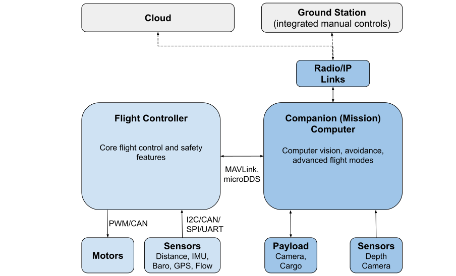

# 伴飞计算机

伴飞计算机（"任务计算机"）是连接在飞行控制器上的独立机载计算机，它们可以启用如[防撞](../computer_vision/collision_prevention.md)等计算密集型功能。

下图展示了包含飞行控制器和伴飞计算机的无人机体架构示意图。

<!-- 源文件地址: https://docs.google.com/drawings/d/1ZDSyj5djKCEbabgx8K4ESdTeEUizgEt8spUWrMGbHUE/edit?usp=sharing -->

飞行控制器在NuttX上运行PX4，提供核心飞行和安全代码。伴飞计算机通常运行Linux，因为这是更适合通用软件开发的平台。它们通过高速串口或以太网连接，通常使用[MAVLink协议](https://mavlink.io/en/)或uXRCE-DDS进行通信。

与地面站和云端的通信通常通过伴飞计算机路由（例如使用[MAVLink Router](https://github.com/mavlink-router/mavlink-router)）。

## 带伴飞计算机的Pixhawk飞行总线载板

以下载板可便捷地将Pixhawk飞行控制器与伴飞计算机集成，显著简化软硬件配置。这些载板支持[Pixhawk飞行总线（PAB）](../flight_controller/pixhawk_autopilot_bus.md)开放标准，因此可插入任何兼容的控制器：

- [ARK Jetson PAB载板](../companion_computer/ark_jetson_pab_carrier.md)
- [Holybro Pixhawk Jetson底板](../companion_computer/holybro_pixhawk_jetson_baseboard.md)
- [Holybro Pixhawk RPi CM4底板](../companion_computer/holybro_pixhawk_rpi_cm4_baseboard.md)

## 集成管理系统

以下集成伴飞计算机/飞行控制器系统默认使用管理版/定制版的飞行控制器和伴飞计算机软件。它们被列出在此是因为可以通过"原生"PX4固件进行更新以用于测试/快速开发：

- [Auterion Skynode](../companion_computer/auterion_skynode.md)
- [ModalAI VOXL 2](https://docs.modalai.com/voxl-2/)

## 伴飞计算机选项

PX4可与可通过串口（或以太网口）使用MAVLink或microROS/uXRCE-DDS协议通信的计算机配合使用。部分典型选项如下：

高性能大功率示例：

- [ModalAI VOXL 2](https://docs.modalai.com/voxl2-external-flight-controller/)
- [NXP NavQPlus](https://nxp.gitbook.io/navqplus/user-contributed-content/ros2/microdds)
- [Nvidia Jetson TX2](https://developer.nvidia.com/embedded/jetson-tx2)
* [Intel NUC](https://www.intel.com/content/www/us/en/products/details/nuc.html)
* [Gigabyte Brix](https://www.gigabyte.com/Mini-PcBarebone/BRIX)

小型/低功耗示例：

- [Raspberry Pi](../companion_computer/pixhawk_rpi.md)

::: info
计算机选择取决于常规权衡：成本、重量、功耗、配置便利性以及所需的计算资源。
:::

## 伴飞计算机软件

伴飞计算机需要运行与飞行控制器通信的软件，并将流量路由到地面站和云端。

#### 无人机应用

无人机API和SDK允许您编写可控制PX4的软件。常用方案包括：

- [MAVSDK](https://mavsdk.mavlink.io/main/en/index.html) - 多种编程语言的库，用于与MAVLink系统（如无人机、摄像头或地面系统）交互
- [ROS 2](../ros2/index.md) 用于与ROS 2节点通信（也可使用）
- [ROS 1和MAVROS](../ros/mavros_installation.md)

MAVSDK通常更易于学习和使用，而ROS为高级场景（如计算机视觉）提供了更多预写软件。[无人机API和SDK > 我应该使用什么API？](../robotics/index.md#what-api-should-i-use) 详细说明了不同选项。

您也可以从零开始编写自定义MAVLink库：

- [C/C++示例代码](https://github.com/mavlink/c_uart_interface_example) 展示了如何连接自定义代码
- MAVLink也可与[多种其他编程语言](https://mavlink.io/en/#mavlink-project-generatorslanguages)配合使用

#### 路由器

如果需要将MAVLink从机体桥接到地面站或IP网络，或需要多连接时，需要使用路由器：

- [MAVLink Router](https://github.com/intel/mavlink-router)（推荐）
- [MAVProxy](https://ardupilot.org/mavproxy/)

## 以太网配置

如果飞行控制器支持，推荐使用以太网连接。详见[以太网配置](../advanced_config/ethernet_setup.md)获取指导。

## 飞行控制器特定配置

以下主题解释了如何为特定飞行控制器配置伴飞计算机，特别是未使用以太网连接时：

- [使用伴飞计算机与Pixhawk控制器](../companion_computer/pixhawk_companion.md)

## 附加信息

- [伴飞计算机外设](../companion_computer/companion_computer_peripherals.md)
- [PX4系统架构 > FC和伴飞计算机](../concept/px4_systems_architecture.md#fc-and-companion-computer)