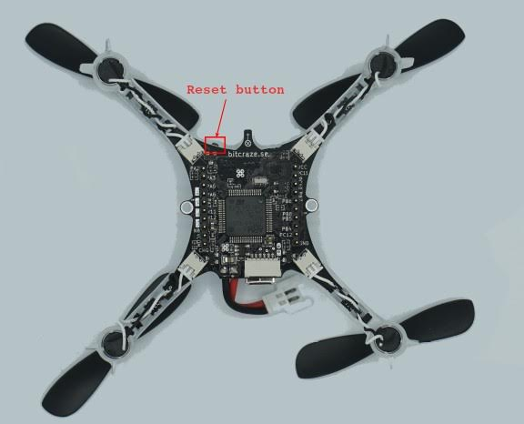
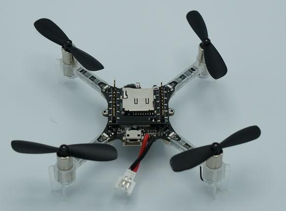
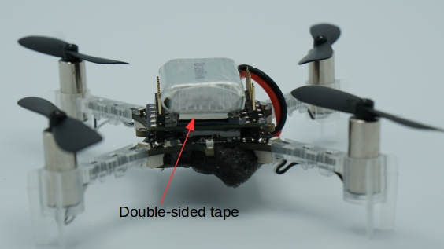
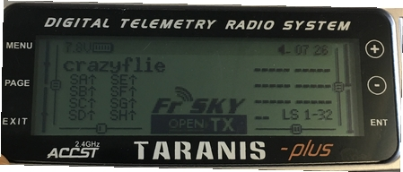
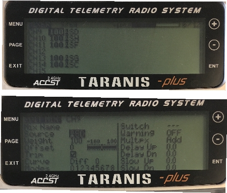

# Crazyflie 2.0 (已停产)

<Badge type="info" text="已停产" />

:::warning
_Crazyflie 2.0_ 已[停产/被替代](../flight_controller/autopilot_experimental.md)。
请改用 [Bitcraze Crazyflie 2.1](../complete_vehicles_mc/crazyflie21.md)！
:::

:::warning

- PX4 不生产此（或任何）飞控系统。
  有关硬件支持或合规性问题，请联系[制造商](https://www.bitcraze.io/)。
- PX4 对此飞控系统的支持为[实验性](../flight_controller/autopilot_experimental.md)。
  :::

Crazyflie 系列微型四旋翼飞行器由 Bitcraze AB 开发。
Crazyflie 2.0 的概述[可在此处找到](https://www.bitcraze.io/crazyflie-2/)。


## 快速概览

::: info
主要硬件文档在此：https://wiki.bitcraze.io/projects:crazyflie2:index
:::

- 主系统芯片：STM32F405RG  
  - CPU：168 MHz ARM Cortex M4 带单精度浮点运算单元  
  - RAM：192 KB SRAM  
- nRF51822 无线电与电源管理MCU  
- MPU9250 加速度计/陀螺仪/磁力计  
- LPS25H 气压计## 购买渠道

- [Crazyflie 2.0](https://store.bitcraze.io/collections/kits/products/crazyflie-2-0)。
- [Crazyradio PA 2.4 GHz USB 接收器](https://store.bitcraze.io/collections/kits/products/crazyradio-pa)：用于_QGroundControl_与Crazyflie 2.0之间的无线通信。
- [Breakout deck](https://store.bitcraze.io/collections/decks/products/breakout-deck)：用于连接新外设的扩展板。
- [Flow deck](https://store.bitcraze.io/collections/decks/products/flow-deck)：包含用于测量地面运动的光流传感器和测量距地面距离的距离传感器。
  这对于精确的高度和位置控制非常有用。
- [Z-ranger deck](https://store.bitcraze.io/collections/decks/products/z-ranger-deck)具有与Flow deck相同的距离传感器来测量距地面的距离。
  这对于精确的高度控制非常有用。
- [SD-card deck](https://store.bitcraze.io/collections/decks/products/sd-card-deck)：用于将数据高速记录到micro SD卡的机载日志记录模块。
- [Logitech Joystick](https://support.logi.com/hc/en-us/articles/360024326793--Getting-Started-Gamepad-F310)。

## 烧录 PX4

在搭建好 PX4 开发环境后，按照以下步骤将 PX4 自主飞行控制器安装到 Crazyflie 2.0 上：

1. 下载 PX4 引导程序源代码：

   ```sh
   git clone https://github.com/PX4/Bootloader.git
   ```

1. 进入源代码顶层目录并使用以下命令编译：

   ```sh
   make crazyflie_bl
   ```

1. 按照以下步骤将 Crazyflie 2.0 进入 DFU 模式：
   - 确保设备初始处于断电状态。
   - 长按复位按钮（见下图...）。
     
   - 插入计算机的 USB 接口。
   - 一秒钟后蓝色 LED 应开始闪烁，5 秒后闪烁速度加快。
   - 松开按钮。
1. 安装 _dfu-util_：

   ```sh
   sudo apt-get update
   sudo apt-get install dfu-util
   ```

1. 使用 _dfu-util_ 烧录引导程序，完成后拔出 Crazyflie 2.0：

   ```sh
   sudo dfu-util -d 0483:df11 -a 0 -s 0x08000000 -D ./build/crazyflie_bl/crazyflie_bl.bin
   ```

   上电后 Crazyflie 2.0 的黄色 LED 应开始闪烁。

1. 下载 PX4 自主飞行控制器源代码：

   ```sh
   git clone https://github.com/PX4/PX4-Autopilot.git
   ```

1. 进入源代码顶层目录并使用以下命令编译：

   ```sh
   make bitcraze_crazyflie_default upload
   ```

1. 当提示插入设备时，插入 Crazyflie 2.0。
   黄色 LED 应开始闪烁表示已进入引导程序模式。
   然后红色 LED 应点亮表示烧录过程已开始。
1. 等待完成。
1. 完成！使用 [QGroundControl](https://docs.qgroundcontrol.com/master/en/qgc-user-guide/setup_view/sensors.html) 校准传感器。

::: info
如果 QGroundControl 无法连接机体，请确保在 [nuttx-config](https://github.com/PX4/PX4-Autopilot/blob/main/boards/bitcraze/crazyflie/nuttx-config/nsh/defconfig) 中 crazyflie 的 `# CONFIG_DEV_LOWCONSOLE is not set` 被替换为 `CONFIG_DEV_LOWCONSOLE=y`。
这可以通过 _menuconfig_ 完成：

```sh
make bitcraze_crazyflie_default menuconfig
```

或 _qconfig_（在 GUI 的 _Serial Driver Support_ 下勾选 _Low-level console support_）：

```sh
make bitcraze_crazyflie_default qconfig
```

:::

## 无线设置说明

机载nRF模块支持通过蓝牙或专有的2.4GHz Nordic ESB协议与板载设备连接。

- 推荐使用[Crazyradio PA](https://www.bitcraze.io/crazyradio-pa/)。
- 要立即通过Crazyflie 2.0飞行，可通过蓝牙支持Crazyflie手机应用。

使用官方Bitcraze **Crazyflie手机应用**：

- 通过蓝牙连接。
- 在设置中将模式更改为1或2。
- 通过QGroundControl进行校准。

通过 **MAVLink** 连接：

- 使用Crazyradio PA配合兼容的地面站（GCS）。
- 下载_crazyflie-lib-python_ 源代码：

  ```sh
  git clone https://github.com/bitcraze/crazyflie-lib-python.git
  ```

::: info
我们将使用[cfbridge.py](https://github.com/bitcraze/crazyflie-lib-python/blob/master/examples/cfbridge.py) 在Crazyflie 2.0（已烧录PX4固件）和QGroundControl之间建立无线MAVLink通信链路。_Cfbridge_ 使QGroundControl能够与crazyradio PA通信。
当前[C基于的cfbridge](https://github.com/dennisss/cfbridge) 存在数据丢失问题，因此我们选择使用 **cfbridge.py**。
:::

- 请确保已设置USB Radio的udev权限。按此链接步骤操作[here](https://www.bitcraze.io/documentation/repository/crazyflie-lib-python/master/installation/usb_permissions/) 并 **重启** 计算机。
- 通过USB连接Crazyradio PA。
- 使用以下方法构建[虚拟环境（本地Python环境）](https://virtualenv.pypa.io/en/latest/) 并安装依赖包：

  ```sh
  pip install tox --user
  ```

- 进入crazyflie-lib-python文件夹并执行：

  ```sh
  make venv
  ```

- 激活虚拟环境：

  ```sh
  source venv-cflib/bin/activate
  ```

- 安装所需依赖：

  ```sh
  pip install -r requirements.txt --user
  ```

要通过crazyradio连接Crazyflie 2.0，**启动cfbridge** 按以下步骤操作：

- 关闭并重新启动Crazyflie 2.0，等待其启动完成。
- 通过USB连接Crazyflie无线电设备。
- 进入crazyflie-lib-python文件夹。
- 激活环境：

  ```sh
  source venv-cflib/bin/activate
  ```

- 进入示例文件夹：

  ```sh
  cd examples
  ```

- 启动cfbridge:

```sh
python cfbridge.py
```

::: info
_Cfbridge_ 默认尝试在通道80上以crazyflie地址0xE7E7E7E7E7发起无线电链路通信。
如果在同一房间内使用[multiple crazyflies and/or crazyradios](https://github.com/dennisss/cfbridge/blob/master/index.md#advanced-swarming) 并希望为每个设备设置不同的通道和/或地址，首先通过USB线缆用QGroundControl连接crazyflie，并在QGroundControl中修改syslink参数（通道、地址）。
然后通过分别指定第一个和第二个参数为相同通道和地址来启动cfbridge，例如：`python cfbridge.py 90 0x0202020202`
:::

- 打开QGroundControl。
- 使用完_cfbridge_后，可以通过按 `CTRL+z` 取消激活虚拟环境（如果已激活）。
  很多时候，从同一终端再次启动_cfbridge_无法连接到crazyflie，这可以通过关闭终端并在新终端中重新启动_cfbridge_解决。

:::tip
如果修改了[crazyflie-lib-python](https://github.com/bitcraze/crazyflie-lib-python) 中的任何驱动，或者在新终端中启动_cfbridge_无法找到crazyflie，可以尝试进入crazyflie-lib-python文件夹并运行以下脚本重新构建cflib。

```sh
make venv
```

:::

::: info
使用摇杆时，将QGroundControl中的`COM_RC_IN_MODE` 设置为"Joystick/No RC Checks"。
在QGroundControl中校准摇杆并将摇杆消息频率设置为5到14 Hz之间的任意值（推荐10 Hz）。
要设置频率，需要启用高级选项。
这是QGroundControl向Crazyflie 2.0发送摇杆指令的速率（要执行此操作，需按照此处说明[here](https://github.com/mavlink/qgroundcontrol) 获取最新QGroundControl源代码（master）并构建）。
:::


## 硬件设置

Crazyflie 2.0可以在[稳定模式](../flight_modes_mc/manual_stabilized.md)、[高度模式](../flight_modes_mc/altitude.md)和[位置模式](../flight_modes_mc/position.md)中实现精确飞行控制。

- 使用_高度模式_飞行需要配备[Z-ranger扩展板](https://store.bitcraze.io/collections/decks/products/z-ranger-deck)。  
  如果还需要使用_位置模式_，建议购买集成Z-ranger传感器的[Flow扩展板](https://store.bitcraze.io/collections/decks/products/flow-deck)。
- 机载气压计极易受到外部风力干扰（包括机体螺旋桨产生的气流）。我们通过泡沫材料对气压计进行物理隔离，并在其顶部安装距离传感器，如下图所示：


为了记录飞行数据，可按照下图所示在机体顶部安装SD卡扩展板：



随后，使用双面胶带将电池粘贴在SD卡扩展板上方：



## 高度控制

Crazyflie 使用 [Z-ranger deck](https://store.bitcraze.io/collections/decks/products/z-ranger-deck) 时可进入 _Altitude_ 模式飞行。根据数据手册，测距仪最大可感知2米（离地面）高度。然而在深色表面测试时该值会降低至0.5米，浅色地面则可达到1.3米。这意味着在 _Altitude_ 或 _Position_ 飞行模式下，无法保持超过该值的高度。

:::tip
若 Crazyflie 2.0 在 _Altitude mode_ 或 _Position mode_ 中等推力指令下出现高度漂移，首先尝试重启机体。若问题仍未解决，需重新校准加速度计和磁力计（指南针）。
:::

::: info
由于机载气压计极易受到 Crazyflie 自身螺旋桨产生的气流干扰，因此无法依赖其保持高度。
:::

## 位置控制

通过 [Flow deck](https://store.bitcraze.io/collections/decks/products/flow-deck)，您可以使用 Crazyflie 2.0 在 _Position mode_ 中进行飞行。  
与 [PX4FLOW](../sensor/px4flow.md) 不同，flow deck 本身不包含陀螺仪，因此需要使用机载陀螺仪进行光流融合以获取局部位置估算。  
此外，flow deck 与 SD 卡扩展板共享同一 SPI 总线，因此在 _Position mode_ 飞行时不建议以高速率进行 SD 卡日志记录。

## 使用 FrSky Taranis 遥控器作为摇杆

如果您已拥有 Taranis 遥控器并希望将其用作控制器，可以将其配置为 USB 摇杆：

- 在 Taranis 中创建一个新模型。

  

- 在 _MODEL SETUP_ 菜单页面中，关闭内部和外部发射模块。

  

- 在 _OUTPUTS_ 菜单页面（某些 Taranis 遥控器中称为“SERVOS”页面），反转油门（CH1）和副翼（CH3）。

  

使用 Taranis 开关进行武装/解除武装并切换不同飞行模式：

- 在 Taranis UI 的 _MIXER_ 菜单页面中，可以将开关分配到 9-16 通道范围内的任意通道，这些通道对应 QGroundControl 摇杆设置中的按钮 0-7。例如，Taranis 的 "SD" 开关可以设置为 Taranis UI 中的 9 通道：

  

- 通过 USB 线将 Taranis 连接到 PC 并打开 QGroundControl。
- 在 QGroundControl 摇杆设置中，当您切换开关时，按钮会变为黄色。例如，Taranis 的 9 通道映射到 QGroundControl 摇杆设置中的按钮 0。您可以将任何模式分配给此按钮，例如 _Altitude_ 模式。当您下拉 "SD" 开关时，飞行模式将切换为 _Altitude_。

  

### ROS

通过 MAVROS 连接到 Crazyflie 2.0：

- 按照上述说明启动 _cfbridge_。
- 更改 QGroundControl 监听的 UDP 端口：
  - 在 QGroundControl 中，导航到 **Application Settings > General**，取消勾选 _Autoconnect to the following devices_ 下的所有复选框。
  - 在 **Comm Links** 中添加一个类型为 _UDP_ 的连接，勾选 _Automatically Connect on Start_ 选项，将 _Listening Port_ 更改为 14557，添加 Target Hosts: 127.0.0.1，然后点击 **OK**。
- 确保已安装 [MAVROS](https://github.com/mavlink/mavros/tree/master/mavros#installation)。
- 使用以下命令启动 MAVROS：

  ```sh
  roslaunch mavros px4.launch fcu_url:="udp://:14550@127.0.0.1:14551" gcs_url:="udp://@127.0.0.1:14557"
  ```

- 如果 QGroundControl 未连接，请重新启动。