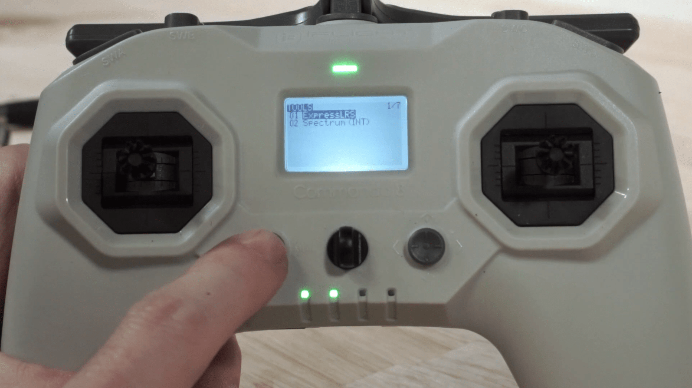
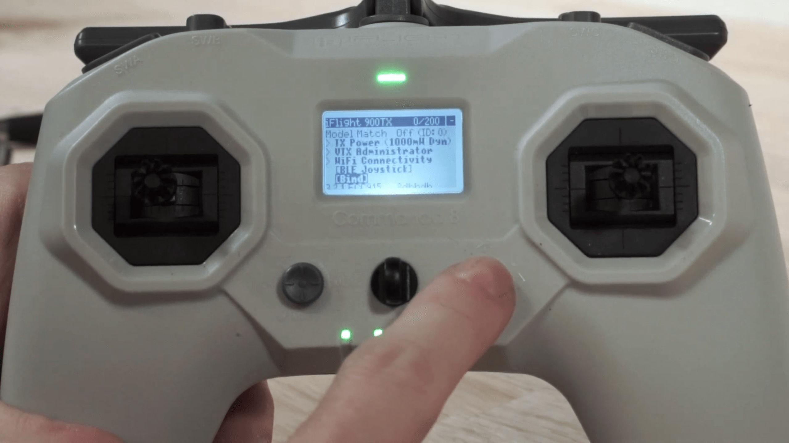

# VOXL 2 Starling PX4 开发无人机

[Starling](https://modalai.com/starling) 是一款由 [VOXL 2](../flight_controller/modalai_voxl_2.md) 和 PX4 驱动的 SLAM 开发无人机，搭载 SWAP 优化的传感器和负载，专为室内外自主导航优化设计。  
通过 Blue UAS Framework 自动驾驶仪和 VOXL 2 技术，Starling 重量仅为 275g，可提供长达 30 分钟的自主室内飞行时间。

VOXL 2 Starling 是一款开箱即飞的 PX4 开发无人机，集成了 [VOXL 2](../flight_controller/modalai_voxl_2.md) 伴飞计算机和 PX4 飞控器、图像传感器、GPS 以及通信模块。该无人机搭载 ModalAI 的 [开放 SDK](https://docs.modalai.com/voxl-developer-bootcamp/)，预配置了计算机视觉辅助飞行的自主模型。  
这款开发无人机旨在帮助用户加速产品上市进程，提升应用开发和原型设计效率。

本指南介绍了将 UAV 调整为可飞行状态所需的最小化额外设置，还涵盖硬件概述、首次飞行、WiFi 设置等内容。

::: info
获取完整且持续更新的文档，请访问 <https://docs.modalai.com/starling-v2>。
:::

::: info
如果您是 VOXL 新手，请务必通过阅读 [VOXL Bootcamp](https://docs.modalai.com/voxl-developer-bootcamp/) 熟悉 VOXL 硬件和软件的核心功能。
:::

## 购买渠道

[modalai.com/starling](https://modalai.com/starling)

## 硬件概述

| 标号 | 描述                             | 型号编号          |
| ---- | -------------------------------- | ----------------- |
| A    | VOXL 2                           | MDK-M0054-1       |
| B    | VOXL 4-in-1 ESC                  | MDK-M0117-1       |
| C    | 气压计屏蔽罩                     | M10000533         |
| D    | ToF 图像传感器（PMD）            | MDK-M0040         |
| E    | 跟踪图像传感器（OV7251）         | M0014             |
| F    | 高分辨率图像传感器（IMX214）     | M0025-2           |
| G    | AC600 WiFi 适配器                | AWUS036EACS       |
| H    | GNSS GPS 模块 & 磁罗盘           | M10-5883          |
| I    | 915MHz ELRS 接收机               | BetaFPV Nano RX   |
| J    | VOXL 2 的 USB-C 接口（图中未显示）|                   |
| K    | VOXL 电源模块                    | MCCA-M0041-5-B-T  |
| L    | 4726FM 旋翼                      | M10000302         |
| M    | 1504 电机                        |                   |
| N    | XT30 电源接口                    |                   |

## 规格书

### 规格参数

| 组件         | 规格                                                         |
| ------------ | ------------------------------------------------------------ |
| 自动驾驶仪   | VOXL2                                                        |
| 起飞重量     | 275g（不含电池 172g）                                        |
| 对角尺寸     | 211mm                                                        |
| 飞行时间     | >30 分钟                                                     |
| 电机         | 1504                                                         |
| 旋翼         | 120mm                                                        |
| 机架         | 3mm 碳纤维                                                   |
| 电调         | ModalAI VOXL 4-in-1 ESC V2                                   |
| GPS          | UBlox M10                                                    |
| 遥控接收机   | 915mhz ELRS                                                  |
| 电源模块     | ModalAI Power Module v3 - 5V/6A                              |
| 电池         | Sony VTC6 3000mah 2S，或任一 2S 18650 电池（XT30 接口）      |
| 高度         | 83mm                                                         |
| 宽度         | 187mm（旋翼折叠）                                            |
| 长度         | 142mm（旋翼折叠）                                            |

### 硬件接线图

## 教程

### ELRS 设置

将 ELRS（ExpressLRS）接收机与遥控器绑定是为基于 VOXL 2 的 PX4 自主开发套件准备飞行的关键步骤。该过程确保无人机与控制系统之间建立安全且响应迅速的连接。

按照本指南将 ELRS 接收机与遥控器绑定。

#### 接收机设置

1. **开启接收机**：无人机通电后，您会注意到 ELRS 接收机的蓝色 LED 闪烁。这表明接收机已开启但尚未与遥控器建立连接。
   
   

2. **进入绑定模式**：要启动绑定，请打开终端并执行 `adb shell` 和 `voxl-elrs -bind` 命令。您会观察到接收机的 LED 开始以心跳模式闪烁，表明已进入绑定模式。
   
   

#### 遥控器设置

1. **进入菜单**：在套件中包含的 Commando 8 遥控器上，按下左模式按钮以打开菜单系统。
   
   

2. **导航到 ExpressLRS**：使用右按钮选择第一个菜单项，应为 "ExpressLRS"。
3. **查找绑定选项**：选择 "ExpressLRS" 选项后，向下滚动到底部菜单找到 "Bind" 部分。可通过按右按钮向下滚动至 "Bind" 选项。
   
   

4. **执行绑定**：选择 "Bind" 并确认操作。绑定成功后，接收机的 LED 将停止闪烁并保持常亮。

#### 绑定后操作

1. **验证连接**：通过遥控器发出指令，观察无人机是否响应。若响应正常，说明绑定成功。
2. **保存配置**：在遥控器中保存当前绑定配置，确保下次使用时无需重新绑定。

### 视频教程

- [VOXL 2 Starling 硬件概述](https://www.youtube.com/watch?v=example1)
- [ELRS 接收机绑定教程](https://www.youtube.com/watch?v=example2)

## 常见问题

### 绑定失败怎么办？

- **检查距离**：确保遥控器和接收机之间距离不超过 5 米。
- **重置接收机**：通过执行 `voxl-elrs -reset` 命令重置接收机。
- **更新固件**：检查并更新 ELRS 接收机的固件至最新版本。

### 如何延长飞行时间？

- **优化电池管理**：使用高质量电池并定期校准。
- **减少负载**：移除不必要的附件以降低能耗。
- **调整飞控参数**：通过 PX4 配置工具优化动力系统效率。

## 联系支持

如需进一步帮助，请联系 [ModalAI 支持团队](https://modalai.com/support) 或访问 [社区论坛](https://community.modalai.com)。

---

通过以上步骤，您应能成功配置 VOXL 2 Starling 无人机的 ELRS 接收机并确保其正常运行。如有任何疑问或遇到问题，请参考常见问题部分或联系技术支持。