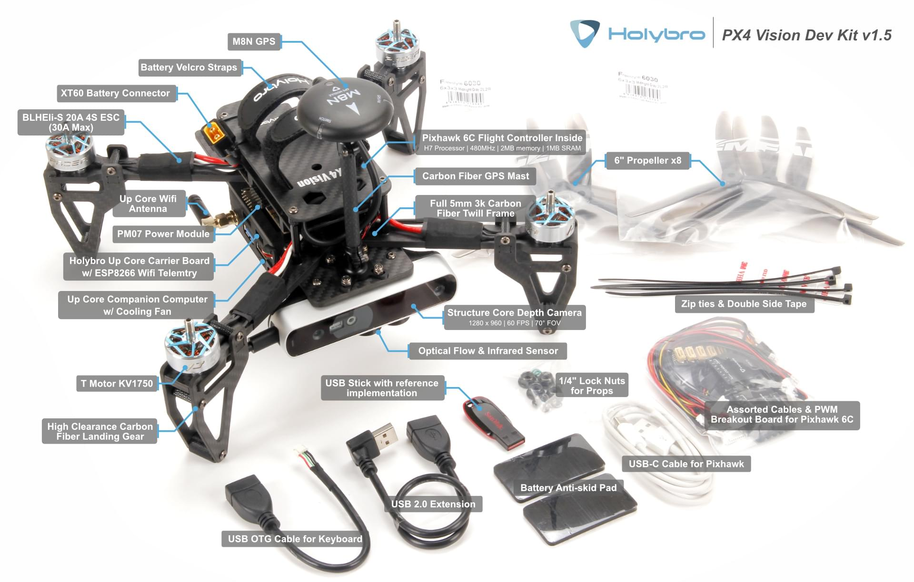

# PX4 视觉自主开发套件

[_PX4 Vision Autonomy Development Kit_](https://holybro.com/collections/multicopter-kit/PX4-Vision) 是一款功能强大且价格实惠的套件，用于在自主机体上进行计算机视觉开发。


该套件包含一架接近即飞状态的碳纤维四旋翼无人机，搭载 _Pixhawk 4_ 或 _Pixhawk 6C_（V1.5 版本）飞控、_UP Core_ 伴飞计算机（4GB 内存 & 64GB eMMC）以及 Occipital _Structure Core_ 深度摄像头传感器。

本指南说明了使机体具备飞行条件所需的最少额外设置（安装遥控系统和电池）。它还涵盖了首次飞行，以及如何开始修改计算机视觉代码。

:::warning
PX4 不再支持本文档中描述的避障软件：

- [PX4/PX4-Avoidance](https://github.com/PX4/PX4-Avoidance) 已归档
- [Path Planning Interface](../computer_vision/path_planning_interface.md) 以及任务中的避障功能和安全着陆功能。

套件附带的 U 盘中包含基于该软件的避障功能实现示例。
此示例仅供参考，用于演示平台的能力。
:::

::: tip
该套件仍强烈推荐用于开发和测试不依赖旧版集成的视觉解决方案。
:::

## 购买渠道

- [PX4 Vision Dev Kit v1.5](https://holybro.com/collections/multicopter-kit/products/px4-vision-dev-kit-v1-5)
- [PX4 Vision Dev Kit v1 (Discontinued)](https://holybro.com/collections/multicopter-kit/products/px4-vision)

## Px4 Vision 指南内容

- [警告与通知](#warnings-and-notifications)
- [内部组成](#what-is-inside)
- [您还需要什么](#what-else-do-you-need)
- [首次设置](#first-time-setup)
- [带避障功能的飞行](#fly-the-drone-with-avoidance)
- [使用套件进行开发](#development-using-the-kit)
- [PX4 Vision载板引脚图](#px4-vision-carrier-board-pinouts)
- [其他开发资源](#other-development-resources)
- [如何获取技术支持](#how-to-get-technical-support)

## 警告与通知

1. 该套件专为使用前向摄像头的计算机视觉项目设计（没有向下或后向的深度摄像头），因此无法（未经修改）用于测试需要向下摄像头的功能。

1. 任务中的障碍物规避功能仅能在GPS可用时测试（任务使用GPS坐标）。位置模式下的防撞功能可在有良好位置锁定（来自GPS或光流）时测试。

1. 标有`USB1`的端口在使用USB3外设时可能会干扰GPS（需禁用依赖GPS的功能包括任务）。这也是为何启动镜像通过USB2.0存储卡提供。

1. PX4 Vision v1搭配ECN 010或以上版本（载体板RC05及以上），UP Core可通过直流插头或电池供电。

    

1. 所有PX4 Vision v1.5的UP Core均可通过直流插头或电池供电。

:::warning
对于ECN低于010/载体板低于RC04的PX4 Vision v1，UP Core应仅通过电池供电（不得移除UP Core电源接口安全盖）。此限制不适用于PX4 Vision v1.5


:::

## 什么是内部结构

::: info
PX4 Vision V1与V1.5的区别可参考[此处](https://docs.holybro.com/drone-development-kit/px4-vision-dev-kit-v1.5/v1-and-v1.5-difference)
:::



PX4 Vision V1的内部结构可参考[PX4 v1.13文档](https://docs.px4.io/v1.13/en/complete_vehicles/px4_vision_kit.html#what-is-inside)。

PX4 Vision DevKit包含以下组件：

- 核心组件：

  - 1x Pixhawk 4或Pixhawk 6C（v1.5版本）飞控
  - 1x PMW3901光流传感器
  - 1x TOF红外距离传感器（PSK-CM8JL65-CC5）
  - 1x Structure Core深度相机
    - 160度广角视觉相机
    - 立体红外相机
    - 内置惯性测量单元（IMU）
    - 强大的NU3000多核深度处理器
  - 1x _UP Core_ 计算机（4GB内存 & 64GB eMMC，预装Ubuntu和PX4避障系统）
    - Intel® Atom™ x5-z8350（最高1.92 GHz）
    - 兼容系统：Microsoft Windows 10完整版、Linux（ubilinux、Ubuntu、Yocto）、Android
    - FTDI UART连接至飞控
    - `USB1`: USB3.0 A型接口，用于从USB2.0闪存启动PX4避障环境（连接USB3.0外设可能导致GPS失灵）
    - `USB2`: JST-GH接口的USB2.0端口，可用于第二摄像头、LTE等（开发时可连接键盘/鼠标）
    - `USB3`: 连接深度相机的USB2.0 JST-GH端口
    - `HDMI`: HDMI输出
    - SD卡槽
    - WiFi 802.11 b/g/n @ 2.4 GHz（连接外部天线#1），使计算机可访问家庭WiFi网络以获取互联网接入/更新

- 机械规格：

  - 机架：全5mm 3k碳纤维斜纹
  - 电机：T-MOTOR KV1750
  - 电调：BEHEli-S 20A电调
  - GPS：M8N GPS模块
  - 电源模块：Holybro PM07
  - 轴距：286mm
  - 重量：854克（不含电池和桨叶）
  - 通信：ESP8266连接至飞控（连接外部天线#2），支持与地面站无线通信

- 一个预装软件的USB2.0闪存，包含：

  - Ubuntu 18.04 LTS
  - ROS Melodic
  - Occipital Structure Core ROS驱动
  - MAVROS
  - [PX4避障](https://github.com/PX4/PX4-Avoidance)

- 各类数据线、8个桨叶、2个已安装电池绑带及其他配件（可用于附加外围设备）## 你需要什么其他配件

该套件包含除电池和无线电控制系统外的所有必要无人机硬件，这些组件需另行购买：

- 电池：
  - 带 XT60 母接头的 4S 锂电池
  - 长度小于 115mm（需适配电源接口与 GPS 天线杆之间的空间）
- 无线电控制系统
  - 可使用任意 [PX4 兼容的遥控系统](../getting_started/rc_transmitter_receiver.md)
  - 带 R-XSR 接收机的 _FrSky Taranis_ 遥控器是较流行的配置方案
- H2.0 六角钥匙（用于卸下顶板以便连接遥控接收机）

此外，用户还需要地面站硬件/软件：

- 运行 [QGroundControl](https://docs.qgroundcontrol.com/master/en/qgc-user-guide/getting_started/download_and_install.html)（QGC）的笔记本电脑或平板设备## 首次设置

1. 将[兼容的遥控接收机](../getting_started/rc_transmitter_receiver.md#connecting-receivers)连接到机体（套件不含）：

   - 使用H2.0六角扳手工具移除/拧下顶部板（电池安装位置）。
   - [将接收机连接到飞控](../assembly/quick_start_pixhawk4.md#radio-control)。
   - 重新安装顶部板。
   - 将遥控接收机安装在机体后部的_UP Core_载板上（使用扎带或双面胶）。
   - 确保天线无遮挡且与机身电气隔离（例如固定在载板下方或机体臂/腿部）。

1. [绑定](../getting_started/rc_transmitter_receiver.md#binding)遥控地面和空中单元（如未完成）。
   绑定流程取决于具体遥控系统（请参考接收机手册）。
1. 将GPS天线提升至垂直位置并旋紧底板上的盖板（v1.5版本无需此步骤）。

   

1. 将套件中的预烧录USB2.0闪存盘插入标有`USB1`的_UP Core_端口（如下图所示）。

   

1. 使用满电电池为机体供电。
   ::: info
   连接电池前请确保螺旋桨已移除。
   :::
1. 使用以下默认凭据通过WiFi连接地面站（需等待几秒）：

   - **SSID:** pixhawk4
   - **密码:** pixhawk4

   :::tip
   WiFi网络的SSID、密码等凭据连接后可通过浏览器访问`http://192.168.4.1`进行修改（如需要），但波特率必须保持921600不变。
   :::

1. 在地面站启动_QGroundControl_。
1. [配置/校准](../config/index.md)机体：

   ::: info
   机体出厂时已预校准（固件、机身类型、电池和传感器均已完成设置）。
   但需要校准刚连接的遥控系统，且建议重新进行磁力计校准。
   :::

   - [校准遥控系统](../config/radio.md)
   - [校准磁力计](../config/compass.md)

1. （可选）在遥控器上配置[飞行模式选择开关](../config/flight_mode.md)。

   ::: info
   飞行模式也可通过_QGroundControl_更改
   :::

   我们建议遥控器开关设置以下模式：

   - [位置模式](../flight_modes_mc/position.md) - 安全的手动飞行模式，可用于测试防撞功能。
   - [任务模式](../flight_modes_mc/mission.md) - 执行任务并测试避障功能。
   - [返航模式](../flight_modes_mc/return.md) - 安全返回起飞点并降落。

1. 按下图所示方向安装螺旋桨：

   

   - 螺旋桨方向可通过标签判断：_6045_（正转，逆时针）和_6045_**R**（反转，顺时针）。

     

   - 使用配套的螺旋桨螺母拧紧：

     

## 使用避障功能飞行无人机

当上述机体设置完成后：

1. 连接电池为机体供电。

1. 等待启动序列完成且避障系统开始运行（在启动过程中机体将拒绝执行解锁指令）。

   :::tip
   通过提供的USB闪存盘启动过程大约需要1分钟（或从[内部存储](#install_image_mission_computer)启动约需30秒）。
   :::

1. 检查避障系统是否已正确启动：

   - _QGroundControl_ 通知日志显示消息：**Avoidance system connected**。

     

   - _Structure Core_ 相机前方可见红色激光。

1. 等待GPS指示灯变为绿色。
   这表示机体已获取GPS定位并准备好飞行！
1. 将地面站连接到机体WiFi网络。
1. 找一个安全的户外飞行地点，理想情况下有树木或其他方便的障碍物用于测试PX4视觉系统。

1. 为测试[碰撞预防](../computer_vision/collision_prevention.md)，启用[位置模式](../flight_modes_mc/position.md)并手动飞向障碍物。
   机体应在距离障碍物6米内减速并停止（该距离可通过[CP_DIST](../advanced_config/parameter_reference.md#CP_DIST)参数进行[修改](../advanced_config/parameters.md)）。

1. 为测试障碍物避让，创建一个路径被障碍物阻挡的任务。
   然后切换至[任务模式](../flight_modes_mc/mission.md)执行任务，观察机体绕过障碍物后返回预定航线。

## 使用套件进行开发

以下章节说明了如何将套件用作开发计算机视觉软件的环境。

### PX4 避障概述

:::warning
此功能已[不再由PX4支持](../computer_vision/path_planning_interface.md)。
:::

PX4 避障系统由运行在伴飞计算机（配备深度摄像头）上的计算机视觉软件组成，该软件为运行在_飞控_上的PX4飞行堆栈提供障碍物和/或路线信息。

伴飞计算机视觉/规划软件的文档可在GitHub找到：[PX4/PX4-Avoidance](https://github.com/PX4/PX4-Avoidance)。该项目提供了多种不同的规划器实现（打包为ROS节点）：

- PX4 Vision Kit默认运行_localplanner_，这是开发您自己软件的推荐起点。
- _globalplanner_尚未与该套件进行测试。
- _landing planner_需要向下摄像头，在安装摄像头前需要先修改摄像头支架。

PX4和伴飞计算机通过[MAVLink](https://mavlink.io/en/)使用以下接口进行数据交换：

- [路径规划接口](../computer_vision/path_planning_interface.md) - 用于在自动模式中实现避障功能的API。
- [防撞接口](../computer_vision/collision_prevention.md) - 基于障碍物地图在手动位置模式中的机体避障API（当前用于防撞）。

<a id="install_image_mission_computer"></a>

### 在伴飞计算机上安装镜像

您可以将镜像安装到_UP Core_并从内部存储器启动（而不是USB闪存盘）。  

建议这样做，因为从内部存储器启动更快，释放了一个USB端口，并且可能提供比USB闪存盘更多的内存。

::: info
从内部存储器启动大约需要30秒，而使用提供的USB2闪存盘启动大约需要1分钟（其他卡片可能需要更长时间）。
:::

要将USB镜像写入_UP Core_：

1. 将预烧录的USB驱动器插入_UP Core_标有`USB1`的端口。
1. [登录到伴飞计算机](#login_mission_computer)（如上所述）。
1. 打开终端并运行以下命令将镜像复制到内部存储器（eMMC）。
   在烧录过程中终端会提示多个响应。

   ```sh
   cd ~/catkin_ws/src/px4vision_ros/tools
   sudo ./flash_emmc.sh
   ```

   ::: info
   执行此脚本时，_UP Core_计算机中的所有信息将被删除。
   :::

1. 拔出USB闪存盘。
1. 重启机体。
   _UP Core_计算机现在将从内部存储器（eMMC）启动。

### 启动伴飞计算机

首先将提供的USB2.0闪存盘插入_UP Core_标有`USB1`的端口，然后使用4S电池为机体供电。
避障系统应在大约1分钟内启动（具体时间取决于提供的USB闪存盘）。

:::tip
[Fly the Drone with Avoidance](#fly-the-drone-with-avoidance) 还说明了如何验证避障系统是否处于活动状态。
:::

如果您已经[在伴飞计算机上安装了镜像](#install_image_mission_computer)，只需为机体供电（即不需要USB闪存盘）。
避障系统应在大约30秒内启动并运行。

一旦启动，伴飞计算机既可以用作计算机视觉开发环境，也可以用于运行软件。

<a id="login_mission_computer"></a>

### 登录伴飞计算机

要登录到伴飞计算机：

1. 通过`USB2`端口将键盘和鼠标连接到_UP Core_：

   

   - 使用套件中的USB-JST电缆获取USB A连接器

     

   - 如果键盘和鼠标有单独的连接器，可以将USB集线器连接到该电缆。

1. 将显示器连接到_UP Core_的HDMI端口。

   

   Ubuntu登录屏幕随后将显示在显示器上。

1. 使用以下凭据登录到_UP Core_：

   - **用户名：** px4vision
   - **密码：** px4vision

### 开发/扩展PX4 避障

PX4 Vision的_UP Core_计算机提供了完整的、完全配置的环境，用于扩展PX4 避障软件（更广泛地说，用于使用ROS 2开发新的计算机视觉算法）。
您应在机体上开发和测试软件，将其同步到您自己的git仓库，并通过GitHub [PX4/PX4-Avoidance](https://github.com/PX4/PX4-Avoidance) 仓库与更广泛的PX4社区分享任何修复和改进。

catkin工作区位于`~/catkin_ws`，并预先配置为运行PX4 避障本地规划器。
启动文件（`avoidance.launch`）位于`px4vision_ros`包中（修改此文件以更改启动的规划器）。

避障包在启动时启动。
要集成不同的规划器，需要禁用此功能。

1. 使用以下命令禁用避障进程：

   ```sh
   systemctl stop avoidance.service
   ```

   您可以通过重启机器来重新启动服务。

   其他有用命令包括：

   ```sh
   # 重启服务
   systemctl start avoidance.service

   # 禁用服务（停止服务且启动后不重启）
   systemctl disable avoidance.service

   # 启用服务（启动服务且启用启动后重启）
   systemctl enable avoidance.service
   ```

1. 障碍物避障包的源代码位于 https://github.com/PX4/PX4-Avoidance ，位于`~/catkin_ws/src/avoidance`中。

1. 修改代码！要获取最新的避障代码，请从避障仓库拉取代码：

   ```sh
   git pull origin
   git checkout origin/master
   ```

1. 构建包

   ```sh
   catkin build local_planner
   ```

ROS工作区位于`~/catkin_ws`。
有关在ROS中开发和使用catkin工作区的参考，请查看[ROS catkin教程](http://wiki.ros.org/catkin/Tutorials)。

### 开发PX4 固件

您可以修改PX4本身，并[安装为自定义固件](../config/firmware.md#custom)：

- 您需要通过USB将_QGroundControl_连接到套件的_Pixhawk_，以便更新固件。
- 加载新固件后，选择_PX4 Vision DevKit_机身类型：
  

## PX4 Vision 1.15 载板引脚

关于PX4 Vision 1.15的信息请见[https://docs.holybro.com](https://docs.holybro.com/drone-development-kit/px4-vision-dev-kit-v1.5)。
载板引脚及其他信息位于[下载部分](https://docs.holybro.com/drone-development-kit/px4-vision-dev-kit-v1.5/downloads)。

## 其他开发资源

- [_UP Core_ Wiki](https://github.com/up-board/up-community/wiki/Ubuntu) - _Up Core_ 伴飞计算机技术信息
- [Occipital Developer Forum](https://structure.io/developers) - _Structure Core_ 摄像头信息
- [Pixhawk 4 Overview](../flight_controller/pixhawk4.md)
- [Pixhawk 6C Overview](../flight_controller/pixhawk6c.md)

## 如何获取技术支持

对于硬件问题，请联系 Holybro：[productservice@holybro.com](mailto:productservice@holybro.com)

对于软件问题，请使用以下社区支持渠道：

- [Holybro PX4 Vision Wikifactory](https://wikifactory.com/+holybro/px4-vision)
- [PX4 Support channels](../contribute/support.md)