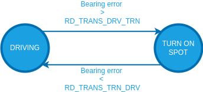
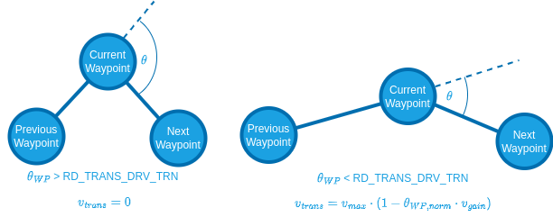
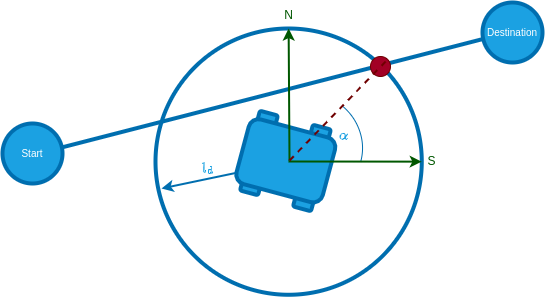

# 位置调参

使用[自动模式](../flight_modes_rover/auto.md)需要进行位置调参。

:::warning
必须在执行此步骤前完成[速度调参](velocity_tuning.md)！
:::

位置控制器负责自主引导机体到达位置设定点。  
这些位置设定点由内部PX4自动模式（任务、返航、GoTo...）自动生成，也可以通过`RoverPositionSetpoint.msg`直接发送到地面站（外部模式）。  
系统会为地面站生成一条到达目标的路径，该路径通过名为[pure pursuit](#pure-pursuit-guidance-logic-info-only)的路径跟随算法进行跟踪。

要调参位置控制器，请使用QGroundControl在以下章节中配置[参数](../advanced_config/parameters.md)。

## 速度  

1. （可选）[RO_SPEED_RED](#RO_SPEED_RED)：基于航向误差的速度降低调节参数。  
   可用于根据当前航向与航向设定值之间的差异限制最大允许速度：  
   $v_{max} = v_{full throttle} \cdot (1 - \theta_{normalized} \cdot k) $  

   其中：  

   - $v_{max}$: 最大速度  
   - $v_{full throttle}$: 全油门速度 [RO_MAX_THR_SPEED](../advanced_config/parameter_reference.md#RO_MAX_THR_SPEED)。  
   - $\theta_{normalized}$: 航向误差（航向 - 航向设定值）从 $[0\degree, 180\degree]$ 归一化到 $[0, 1]$  
   - $k$: 调节参数 [RO_SPEED_RED](#RO_SPEED_RED)  

   ::: info  
   该参数用于根据即将到达的弯道计算机体到达航点时的速度。  
   设置为 -1 以禁用基于航向误差的速度降低。  
   :::  

2. （可选）[RO_DECEL_LIM](../advanced_config/parameter_reference.md#RO_DECEL_LIM) [m/s²] 和 [RO_JERK_LIM](../advanced_config/parameter_reference.md#RO_JERK_LIM) [m/s³] 用于计算速度轨迹，使车辆以计算的转弯速度到达下一个航点。  

   ::: tip  
   为车辆规划一个正方形任务，并观察其在接近航点时的减速情况：  

   - 如果车辆减速过快，请降低 [RO_DECEL_LIM](../advanced_config/parameter_reference.md#RO_DECEL_LIM) 参数；如果过早开始减速，请增加该参数。  
   - 如果观察到车辆减速时出现急动现象，请降低 [RO_JERK_LIM](../advanced_config/parameter_reference.md#RO_JERK_LIM) 参数；否则尽可能增加该参数，因为它可能会影响 [RO_DECEL_LIM](../advanced_config/parameter_reference.md#RO_DECEL_LIM) 的调节。  

   这两个参数需要成对调节，重复调整直到对行为满意。  
   :::  

3. 绘制 [RoverVelocityStatus](../msg_docs/RoverVelocityStatus.md) 消息中的 `adjusted_speed_body_x_setpoint` 和 `measured_speed_body_x` 的对比曲线。  
   如果这些设定值的跟踪效果不满意，请调整 [RO_SPEED_P](../advanced_config/parameter_reference.md#RO_SPEED_P) 和 [RO_SPEED_I](../advanced_config/parameter_reference.md#RO_SPEED_I) 的值。

## 路径跟踪

[pure pursuit](#pure-pursuit-guidance-logic-info-only) 算法用于计算机体的方位设定值，随后通过闭环控制实现。

用于调整该算法的参数如下：

1. [PP_LOOKAHD_GAIN](#PP_LOOKAHD_GAIN): 在直线行驶（右摇杆居中）的位置模式下，系统采用与[自动模式](../flight_modes_rover/auto.md)中相同的路径跟踪算法[pure pursuit](#pure-pursuit-guidance-logic-info-only)，以实现最佳直线行驶效果。该参数决定了控制器向路径转向的激进程度。

   ::: tip
   降低该参数值会使控制更激进，但可能导致振荡。

   调整步骤：

   1. 从值1开始设置[PP_LOOKAHD_GAIN](#PP_LOOKAHD_GAIN)
   2. 将车辆置于[位置模式](../flight_modes_rover/manual.md#position-mode)，以最大速度约一半的速度直线行驶时观察其行为。
   3. 如果车辆无法保持直线行驶，降低参数值；如果在路径周围振荡，则增加参数值。
   4. 重复调整直到对行为满意。

   :::

2. [PP_LOOKAHD_MIN](#PP_LOOKAHD_MIN): [pure pursuit算法](#pure-pursuit-guidance-logic-info-only)使用的前瞻距离最小阈值。

   ::: tip
   将车辆置于[位置模式](../flight_modes_rover/manual.md#position-mode)并以极低速度行驶，如果车辆在[PP_LOOKAHD_GAIN](#PP_LOOKAHD_GAIN)中速调整良好的情况下仍出现振荡，应增加[PP_LOOKAHD_MIN](#PP_LOOKAHD_MIN)的值。
   :::

3. [PP_LOOKAHD_MAX](#PP_LOOKAHD_MAX): [pure pursuit](#pure-pursuit-guidance-logic-info-only)使用的前瞻距离最大阈值。

   ::: tip
   将车辆置于[位置模式](../flight_modes_rover/manual.md#position-mode)并以极高速度行驶，如果车辆在[PP_LOOKAHD_GAIN](#PP_LOOKAHD_GAIN)中速调整良好的情况下仍无法保持直线行驶，应减少[PP_LOOKAHD_MAX](#PP_LOOKAHD_MAX)的值。
   :::

在任何自动导航任务中，如果对路径跟踪效果不满意，可采取以下两个步骤：

1. 检查所有设定点([角速度](rate_tuning.md)、[姿态](attitude_tuning.md)和[速度](velocity_tuning.md))是否被正确跟踪。
2. 进一步调整[路径跟踪算法](#path-following)。

## Ackermann Rover Only

Ackermann型车体采用特殊的转向逻辑，使车体在转向时通过"切角"实现平滑轨迹。  
该逻辑通过根据车体需要转弯的弯角缩放接受半径实现（几何解释请参见[转向逻辑](#corner-cutting-logic-info-only)）。

转向切角的程度可通过以下参数进行调节或禁用：

::: info
转向切角效果是到达航点精度与轨迹平滑度的权衡。
:::

1. [NAV_ACC_RAD](../advanced_config/parameter_reference.md#NAV_ACC_RAD) [m]: 默认接受半径  
   该参数同时作为接受半径缩放的下限  
2. [RA_ACC_RAD_MAX](#RA_ACC_RAD_MAX) [m]: 接受半径缩放的最大值  
   设置为与[NAV_ACC_RAD](../advanced_config/parameter_reference.md#NAV_ACC_RAD)相等可禁用转向切角效果  
3. [RA_ACC_RAD_GAIN](#RA_ACC_RAD_GAIN) [-]: 该调节参数用于乘以[计算得到的理想接受半径](#corner-cutting-logic-info-only)以补偿动态效应  

   :::tip
   初始设置该参数为`1`  
   若观察到车体转向时超调，逐步增加该参数直至满意  
   注意接受半径的缩放受限于[RA_ACC_RAD_MAX](#RA_ACC_RAD_MAX)  
   :::

### 转向切角逻辑（仅说明用）

为实现平滑轨迹，航点的接受半径根据当前航点至前一航点与下一航点连线段的角度进行缩放。  
理想轨迹应使车体以指向下一航点的方向到达下一段路径。为此，将车体最小转弯圆切线地内切于两段线段。

航点接受半径设定为航点至圆与线段切点的距离：

$$
\begin{align*}
r_{min} &= \frac{L}{\sin\left( \delta_{max}\right) } \\
\theta  &= \frac{1}{2}\arccos\left( \frac{\vec{a}*\vec{b}}{|\vec{a}||\vec{b}|}\right) \\
r_{acc} &= \frac{r_{min}}{\tan\left( \theta\right) }
\end{align*}
$$

| 符号         | 描述                        | 单位 |
| ------------ | --------------------------- | ---- |
| $\vec{a}$   | 当前至前一航点的向量       | m    |
| $\vec{b}$   | 当前至下一航点的向量       | m    |
| $r_{min}$   | 最小转弯半径               | m    |
| $\delta_{max}$ | 最大转向角               | m    |
| $r_{acc}$   | 接受半径                   | m    |## 仅差速车

差速车采用以下状态机以充分利用差速车原地转弯的能力：

这些转换阈值可通过 [RD_TRANS_DRV_TRN](#RD_TRANS_DRV_TRN) 和 [RD_TRANS_TRN_DRV](#RD_TRANS_TRN_DRV) 进行设置。

在任务模式中，[RD_TRANS_DRV_TRN](#RD_TRANS_DRV_TRN) 还用于在航点之间的转换角度超过此阈值时将差速车减速至静止：

## Pure Pursuit Guidance Logic (仅信息)

期望方位设定值由纯追踪算法生成。

控制器计算围绕机体的圆与线段的交点。
当目标为位置设定值时，该线段由当前位置连接目标点构成；执行任务时则通常由前一个航点和当前航点连接而成。

围绕机体的圆半径用于调节控制器，通常称为前瞻距离。

前瞻距离决定了控制器的行为激进程度，定义为 $l_d = v \cdot k$。
它取决于rover的速度 $v$ 和调参参数 $k$，该参数可通过 [PP_LOOKAHD_GAIN](#PP_LOOKAHD_GAIN) 设置。

::: info
[PP_LOOKAHD_GAIN](#PP_LOOKAHD_GAIN) 参数值越低，控制器越激进，但可能导致震荡！
:::

前瞻距离的范围受 [PP_LOOKAHD_MAX](#PP_LOOKAHD_MAX) 和 [PP_LOOKAHD_MIN](#PP_LOOKAHD_MIN) 限制。

当rover到路径的距离大于前瞻距离时，rover将目标设定在路径上距离自身最近的点。

## 位置控制器结构（仅信息）

本节为开发者和具有控制系统设计经验的人员提供附加信息。

位置控制器采用以下结构：

## 参数概述

| 参数名称                                                                                                  | 描述                                                                 | 单位 |
| -------------------------------------------------------------------------------------------------------- | -------------------------------------------------------------------- | ---- |
| [RO_SPEED_RED](../advanced_config/parameter_reference.md#RO_SPEED_RED)          | （可选）基于航向误差的速度降低调节参数                             | -    |
| [PP_LOOKAHD_GAIN](../advanced_config/parameter_reference.md#PP_LOOKAHD_GAIN) | Pure pursuit: 主要调节参数                                           | -    |
| [PP_LOOKAHD_MAX](../advanced_config/parameter_reference.md#PP_LOOKAHD_MAX)    | Pure pursuit: 前瞻半径的最大值                                       | m    |
| [PP_LOOKAHD_MIN](../advanced_config/parameter_reference.md#PP_LOOKAHD_MIN)    | Pure pursuit: 前瞻半径的最小值                                       | m    |## Ackermann Specific

| 参数                                                                                                   | 描述                                                       | 单位 |
| ------------------------------------------------------------------------------------------------------ | ---------------------------------------------------------- | ---- |
| [RA_ACC_RAD_MAX](../advanced_config/parameter_reference.md#RA_ACC_RAD_MAX) | (可选) 接受半径可以缩放的最大半径                          | m    |
| [RA_ACC_RAD_GAIN](../advanced_config/parameter_reference.md#RA_ACC_RAD_GAIN) | (可选) 接受半径缩放的调节参数                              | -    |## 差分特定参数

| 参数                                                                                                   | 描述                                                  | 单位 |
| ------------------------------------------------------------------------------------------------------- | ----------------------------------------------------- | ---- |
| [RD_TRANS_DRV_TRN](../advanced_config/parameter_reference.md#RD_TRANS_DRV_TRN) | 航向误差阈值，用于从驱动切换到原地转向              | deg  |
| [RD_TRANS_TRN_DRV](../advanced_config/parameter_reference.md#RD_TRANS_TRN_DRV) | 航向误差阈值，用于从原地转向切换到驱动              | deg  |