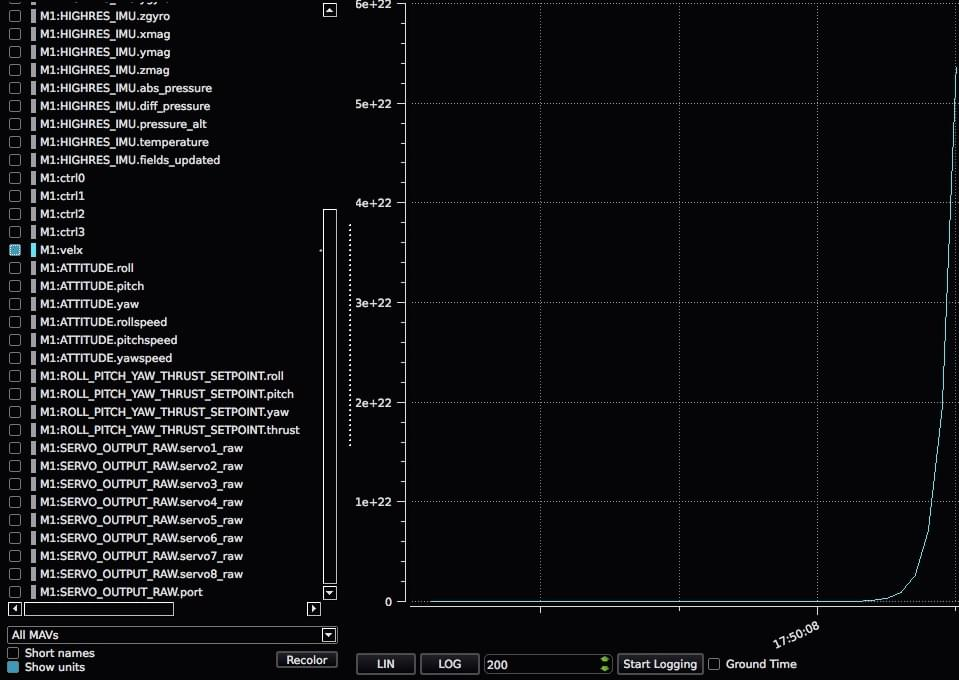

# 发送和接收调试值

在软件开发过程中，通常需要输出某些关键数值。
此时，MAVLink 提供了通用的 `NAMED_VALUE_FLOAT`、`DEBUG` 和 `DEBUG_VECT` 数据包。

## MAVLink 调试消息与 uORB 主题的映射关系

MAVLink 调试消息会与 uORB 主题进行转换。
若要发送或接收 MAVLink 调试消息，需要分别在相应主题上发布或订阅。
以下是 MAVLink 调试消息与 uORB 主题之间映射关系的总结表：

| MAVLink 消息       | uORB 主题         |
| ------------------ | ----------------- |
| NAMED_VALUE_FLOAT  | debug_key_value   |
| DEBUG              | debug_value       |
| DEBUG_VECT         | debug_vect        |

## 教程：发送字符串/浮点数对

本教程展示了如何通过关联的 uORB 主题 `debug_key_value` 发送 MAVLink 消息 `NAMED_VALUE_FLOAT`。

该教程的代码示例可在以下位置获取：

- [调试教程代码](https://github.com/PX4/PX4-Autopilot/blob/main/src/examples/px4_mavlink_debug/px4_mavlink_debug.cpp)
- [启用教程应用](https://github.com/PX4/PX4-Autopilot/blob/main/boards/px4/fmu-v5/default.px4board)，确保您的开发板配置中包含 MAVLink 调试应用 (**CONFIG_EXAMPLES_PX4_MAVLINK_DEBUG**) 并设置为 'y'。

要设置调试发布，仅需以下代码片段。
首先添加头文件：

```C
#include <uORB/uORB.h>
#include <uORB/topics/debug_key_value.h>
#include <string.h>
```

然后在主循环前声明调试值主题（对于不同发布的名称，一个声明即足够）：

```C
/* 声明调试值 */
struct debug_key_value_s dbg;
strncpy(dbg.key, "velx", sizeof(dbg.key));
dbg.value = 0.0f;
orb_advert_t pub_dbg = orb_advertise(ORB_ID(debug_key_value), &dbg);
```

在主循环中发送更为简单：

```C
dbg.value = position[0];
orb_publish(ORB_ID(debug_key_value), pub_dbg, &dbg);
```

:::warning
多个调试消息之间必须留出足够的时间间隔以便 Mavlink 处理。
这意味着代码必须在发送多个调试消息之间等待，或在每次函数调用时交替发送消息。
:::

在 QGroundControl 中，实时图显示效果如下：



## 教程：接收字符串/浮点数对

以下代码片段展示了如何接收上一教程中发送的 `velx` 调试变量。

首先，订阅 `debug_key_value` 主题：

```C
#include <poll.h>
#include <uORB/topics/debug_key_value.h>

int debug_sub_fd = orb_subscribe(ORB_ID(debug_key_value));
[...]
```

然后轮询该主题：

```C
[...]
/* 可用此技术等待多个主题，此处仅使用一个 */
px4_pollfd_struct_t fds[] = {
    { .fd = debug_sub_fd,   .events = POLLIN },
};

while (true) {
    /* 等待 debug_key_value 1000 ms（1 秒） */
    int poll_ret = px4_poll(fds, 1, 1000);

    [...]
```

当 `debug_key_value` 主题上有新消息时，需根据其 key 属性过滤，以忽略 key 不为 `velx` 的消息：

```C
    [...]
    if (fds[0].revents & POLLIN) {
        /* 获取第一个文件描述符的数据 */
        struct debug_key_value_s dbg;

        /* 将数据复制到本地缓冲区 */
        orb_copy(ORB_ID(debug_key_value), debug_sub_fd, &dbg);

        /* 根据 key 属性过滤消息 */
        if (strcmp(_sub_debug_vect.get().key, "velx") == 0) {
            PX4_INFO("velx:\t%8.4f", dbg.value);
        }
    }
}
```