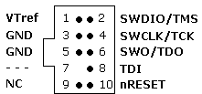

# JLink 调试探针

[J-Link 调试探针][jlink] 是一款闭源的商业硬件探针，支持几乎所有 ARM Cortex-M 设备。  
您需要安装 [J-Link 驱动程序][drivers] 以使该探针正常工作：

```sh
# Ubuntu
wget --post-data "accept_license_agreement=accepted" https://www.segger.com/downloads/jlink/JLink_Linux_x86_64.deb
sudo dpkg -i JLink_Linux_x86_64.deb
# macOS
brew install segger-jlink
```

安装完成后，可以使用以下命令启动服务器：

```sh
JLinkGDBServer -if swd -device STM32F765II
```

此时可能会提示您更新 JLink（建议更新），然后需要指定通信的设备。  
请查阅自动驾驶仪的文档以获取具体设备型号。

完成后，GDB 服务器应在端口 `2331` 上监听，例如：

```sh
Checking target voltage...
Target voltage: 3.28 V
Listening on TCP/IP port 2331
Connecting to target...
Connected to target
Waiting for GDB connection...
```

现在可以使用当前刷写在自动驾驶仪上的确切 elf 文件启动 GDB（在另一个终端中）：

```sh
arm-none-eabi-gdb build/px4_fmu-v5_default/px4_fmu-v5_default.elf -ex "target extended-remote :2331"
```

此时应已成功连接。

如需使用 IDE，可参见 [Eclipse](../debug/eclipse_jlink.md) 或 [VSCode](../dev_setup/vscode.md#hardware-debugging) 的说明。  
更多高级调试选项请查看 [Embedded Debug Tools][emdbg]。

<a id="segger_jlink_edu_mini"></a>

### Segger JLink EDU Mini 调试探针

[Segger JLink EDU Mini](https://www.segger.com/products/debug-probes/j-link/models/j-link-edu-mini/) 是一款价格低廉且流行的 SWD 调试探针。  
探针的接头引脚排列如下图所示（使用类似 [FTSH-105-01-F-DV-K](https://www.digikey.com/products/en?keywords=SAM8796-ND) 的 ARM 10 针迷你连接器进行连接）。



J-Link Edu Mini 连接到 [Pixhawk Debug Mini](swd_debug.md#pixhawk-debug-mini) 的引脚映射如下所示。

| Pin | Signal     | JLink |
| --: | :--------- | ----: |
|   1 | **VREF**   |     1 |
|   2 | Console TX |       |
|   3 | Console RX |       |
|   4 | **SWDIO**  |     2 |
|   5 | **SWDCLK** |     4 |
|   6 | **GND**    |  3, 5 |

请注意，所有 JLink 调试探针均未内置串口连接，因此需要单独连接串口。

<!-- SWD 电缆和连接器与调试端口的图像 - 建议？ -->

[jlink]: https://www.segger.com/products/debug-probes/j-link/
[drivers]: https://www.segger.com/downloads/jlink/
[emdbg]: https://pypi.org/project/emdbg/