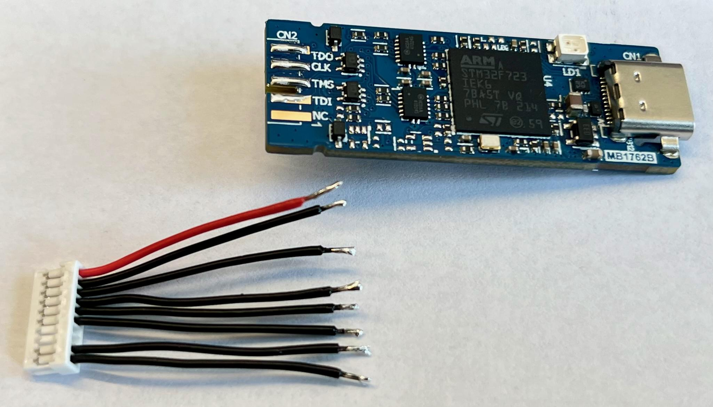

# STLink调试探针

[STLinkv3-MINIE](https://www.st.com/en/development-tools/stlink-v3minie.html) 是一款价格低廉、速度快且功能强大的调试探针，可作为 PX4 开发者的独立调试和控制台通信工具：

- 仅需一条 USB-C 连接即可实现复位、SWD、SWO 和串口通信，体积非常小巧！
- 最高 24MHz SWD 和 SWO 连接。最高 16 MBaud 串口。目标电压范围 1.65V 至 3.6V。
  USB2 高速 480 Mbps 连接。
- 由 STLink 或 OpenOCD 软件驱动，支持广泛的设备。
- 价格远低于 Pixhawk 调试适配器（约 20€）搭配 JLink EDU mini（约 55€）或 JLink BASE（约 400€），同时硬件规格更优。

STLink 调试探针本身不包含用于 Pixhawk 飞控的适配器。
以下的 [Pixhawk 调试端口适配器](#pixhawk-debug-port-adapter) 部分将说明如何自制适配器（需要焊接）。

::: info
[CUAV C-ADB Pixhawk 调试适配器](../debug/swd_debug.md#cuav-c-adb-pixhawk-debug-adapter)（约 65€）内置 STLinkv3-MINIE！
该适配器包含 [Pixhawk 调试全功能](../debug/swd_debug.md#pixhawk-debug-full) 10 针 SH 接口的连接器（但不包含 [Pixhawk 调试迷你版](../debug/swd_debug.md#pixhawk-debug-mini)）。
:::

## 调试配置

STLink 通过 [OpenOCD 提供的 GDB 服务器](https://openocd.org/doc-release/html/index.html)：

```sh

```# Ubuntu  
`sudo apt install openocd`# macOS
brew install open-ocd
```

您可以在新的终端外壳中启动GDB服务器：

```sh
openocd -f interface/stlink.cfg -f target/stm32f7x.cfg
```

配置文件需要为：

- FMUv2-v4: `-f target/stm32f4x.cfg`
- FMUv5: `-f target/stm32f7x.cfg`
- FMUv6: `-f target/stm32h7x.cfg`

您可以通过以下命令连接到3333端口：

```sh
arm-none-eabi-gdb build/px4_fmu-v5x_default/px4_fmu-v5x_default.elf -ex "target extended-remote :3333"
```

请参见 [Embedded Debug Tools][emdbg] 以获取更高级的调试选项。

## Pixhawk 调试端口适配器

要连接到 Pixhawk 调试端口，你需要焊接一个适配器（除非使用 [CUAV 调试适配器](../debug/swd_debug.md#cuav-c-adb-pixhawk-debug-adapter)）。

对于这个焊接指南，你需要：

- 1x [STLinkv3-MINIE](https://www.st.com/en/development-tools/stlink-v3minie.html)。
- 1x 与 [JST SM10B (Full)](https://www.digikey.com/products/en?keywords=A10SR10SR30K203A) 或 [JST SM06B (Mini)](https://www.digikey.com/products/en?keywords=A06SR06SR30K152A) 配合使用的电缆连接器。

  我们建议购买两端都有连接器的完整电缆。

- 1x 电烙铁和焊锡。
- 一些钳子、剪线钳和镊子。

Pixhawk 调试端口在 [DS-009](https://github.com/pixhawk/Pixhawk-Standards/blob/master/DS-009%20Pixhawk%20Connector%20Standard.pdf) 中标准化，需要连接到 STLinkv3-MINIE 的板对板（BTB）边缘连接器 CN2。
引脚映射描述如下：

| #Full | #Mini | Pixhawk 调试    | STLinkv3 | #BTB |
| ----: | ----: | :--------------- | :------- | ---: |
|     1 |     1 | **VREF**         | VCC      |   10 |
|     2 |     2 | Console TX (out) | TX (in)  |    8 |
|     3 |     3 | Console RX (in)  | RX (out) |    7 |
|     4 |     4 | **SWDIO**        | TMS      |    3 |
|     5 |     5 | **SWCLK**        | CLK      |    4 |
|     6 |       | SWO              | TDO      |    5 |
|     7 |       | GPIO1            |          |      |
|     8 |       | GPIO2            |          |      |
|     9 |       | nRST             | RST      |    9 |
|    10 |     6 | **GND**          | GND      |    6 |

GPIO1/2 引脚不被 STLinkv3 支持，我们建议使用数字 ITM 采样替代 SWO，因为前者更加灵活并支持周期精确的时间戳。

你可以选择将短电缆或长电缆焊接到 BTB 连接器上。
短电缆更适合高速通信，但焊接难度较高。
我们建议先焊接长电缆并测试与目标设备通信的最高速度。

::: info
本指南适用于完整的 10 针调试端口。
如果你想焊接 6 针迷你版本，只需省略不需要的信号。
STLink 支持任何基于 SWD/JTAG 的调试接口，因此可以根据其他连接器适配本指南。
调试探针非常便宜，你可以为每个连接器单独准备一个探针，而无需使用适配器。
:::

这是 STLinkv3-MINIE 的交付方式。


拆开 PCB 并检查是否有损坏。
插入电源并确认其是否正常开机。


### 短电缆

短电缆需要使用剪线钳和剥线钳，需要一定的焊接技巧。
不过它会使整个调试探针更小巧。

组装一个不含 GPIO1/2 的 10 针连接器。如果你已经有组装好的电缆，可以用镊子小心地提起固定电缆的插钉，移除 GPIO1/2 电缆。
将电缆剪短至约 2cm（1 英寸），并剥开线芯。


对 STLink 上的 BTB 连接器和电缆进行搪锡处理。



首先将 GND 和 VCC 信号焊接到连接器上以对齐边缘。
然后焊接 TX 和 RX 引脚。最后焊接 RST 连接。


将 STLink 翻转并焊接剩余的三根线。
先焊接 SWDIO->TMS，然后焊接 SWCLK->CLK，最后焊接 SWO->TDO。


### 长电缆

长电缆特别适合使用预组装电缆，因为它可以避免剪线或剥线。

小心地从电缆的一端移除两个 GPIO1/2 电缆。
然后从另一端移除所有电缆。
你现在应该看到线缆末端有八个压接连接器。


对压接电缆连接器和 BTB 连接器进行搪锡处理，并将压接连接器直接焊接在 STLinkv3 上。
注意不要让压接连接器之间发生短路，因为它们的体积较大。


### 测试

你现在需要测试调试探针以确保没有电气短路。

1. 通过 Pixhawk 调试端口将探针连接到目标设备。
2. 使用任意程序测试串口。
3. 通过 [OpenOCD][https://openocd.org] 或 [STLink](https://www.st.com/en/development-tools/stsw-link004.html) 软件测试 SWD 和 RST 连接。
4. 通过 [Orbuculum][https://github.com/orbcode/orbuculum] 测试 SWO 连接。

有关 PX4 FMUv5 和 FMUv6 飞控的软件支持信息，请参见 [嵌入式调试工具][emdbg]。

### 缩小探针尺寸

你可以通过移除 STLinkv3-MINIE 上的未使用组件进一步缩小探针尺寸。

### 最终产品

完成焊接后，你的调试探针应该看起来像这样：


[emdbg]: https://pypi.org/project/emdbg/## 参见

- [STLINK-V3MINIE 调试器/编程器微型探针用于STM32微控制器](https://www.st.com/resource/en/user_manual/um2910-stlinkv3minie-debuggerprogrammer-tiny-probe-for-stm32-microcontrollers-stmicroelectronics.pdf) (用户手册)