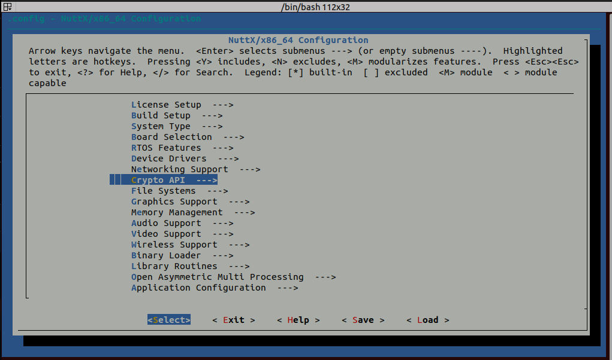

# 日志加密

<Badge type="tip" text="PX4 v1.13" />

[系统日志器](../modules/modules_system.md#logger)可用于生成加密日志，然后可以在分析前手动解密。

默认加密算法是 XChaCha20，默认包装算法是 RSA2048-OAEP。

::: warning
日志加密功能在PX4固件构建中默认未启用。  
要使用此功能需要构建启用了该特性的固件，然后将其上传到飞控（见下文说明）。
:::

::: tip
在PX4 v1.16中日志加密功能得到改进，可以生成包含加密日志数据和加密对称密钥的单个加密日志文件（您可以用该对称密钥解密日志，前提是您能解密对称密钥）。

早期版本中加密的对称密钥存储在单独的文件中。  
更多信息请参见 [Log Encryption (PX4 v1.15)](https://docs.px4.io/v1.15/en/dev_log/log_encryption.html)。
:::

## ULog加密机制详解

::: info
使用的加密算法由[SDLOG_ALGORITHM](../advanced_config/parameter_reference.md#SDLOG_ALGORITHM)参数设定。
撰写时仅支持`XChaCha20`算法（可选择AES，但无实际实现）。

若未来支持其他算法，加密流程预计仍将保持本文档所述方式。
:::

每个新ULog的加密流程如下：

1. 生成XChaCha20对称密钥并使用RSA2048公钥加密。
   此封装（加密）密钥以`.ulge`（"ulog encrypted"）为后缀的文件开头处存储在SD卡中。
2. 日志记录时，ULog数据使用解封装后的对称密钥加密，并立即在`.ulge`文件中封装密钥数据后追加写入。

飞行结束后，包含封装对称密钥和加密日志数据的`.ulge`文件可从SD卡中获取。

为提取日志文件，用户需先解密封装的对称密钥，该密钥可用于解密日志。
解密封装密钥文件仅当用户拥有对应RSA私钥时才可进行，该私钥需与加密时使用的公钥配对。

该流程的详细说明请参见下文的[下载并解密日志文件](#download-decrypt-log-files)章节。

## 文件结构

加密的 `.ulge` 文件包含以下部分：

```plain
-------------------------
| Header                |
-------------------------
| Wrapped symmetric key |
-------------------------
| Encrypted ulog data   |
-------------------------
```

Header部分（22字节）包含以下字段：

| 字节范围 | 字段名称                |
| -------- | ----------------------- |
| 0..6     | 文件魔数标识符          |
| 7        | Header版本号            |
| 8..15    | 时间戳                  |
| 16       | 交换算法                |
| 17       | 交换密钥索引            |
| 18..19   | 密钥大小                |
| 20..21   | 随机数大小              |

Header部分以魔数字符串 `"ULogEnc"` 开头，用于标识这是加密的ulog文件。  
对称密钥部分的文件偏移量为 `22`，日志数据部分的文件偏移量为 `22 + key_size + nonce_size`（`key_size` 和 `nonce_size` 从Header部分获取）。

## 带日志加密功能的定制PX4固件

您需要构建包含自定义RSA公钥和必要Crypto API模块的定制固件以支持日志加密功能。
本节以`px4-fmu-v5`开发板为例说明实现方法。

::: tip
我们将在下方的[生成RSA公私钥](#generate-rsa-public-private-keys)章节中展示如何生成自己的密钥。
:::

::: info
PX4构建中的模块通过配置文件定义，这些文件可通过手动修改或使用`menuconfig`工具进行配置。
更多详情请参见：[PX4开发板配置（Kconfig）](../hardware/porting_guide_config.md)
:::

### Cryptotest构建目标

加密功能会占用大量闪存空间，因此未包含在各开发板的默认构建目标（如`make px4-fmu-v5`）中。
添加加密日志支持的最简单方法是定义包含所需模块和自定义RSA公钥的自定义`make`目标。

::: warning
许多构建配置已接近闪存容量上限。
如果遇到构建错误提示超出最大闪存容量，需要在`.px4board`文件或`default.px4board`文件中禁用其他功能。
请注意不要禁用所需功能。

例如，若发现FMUv4开发板内存不足，可通过设置`CONFIG_MODULES_SIMULATION_SIMULATOR_SIH=n`在[boards/px4/fmu-v4/default.px4board](https://github.com/PX4/PX4-Autopilot/blob/main/boards/px4/fmu-v4/default.px4board#L76)中禁用SIH模式，这可能释放足够的闪存空间以支持加密功能。
:::

#### Pixhawk FMUv5开发板

FMUv5开发板已预设`px4-fmu-v5_cryptotest`自定义构建目标，可用于构建包含所需模块和"测试"RSA密钥的定制固件。
该构建目标的配置文件位于`boards/px4/fmu-v5`目录下的[`cryptotest.px4board`](https://github.com/PX4/PX4-Autopilot/blob/main/boards/px4/fmu-v5/cryptotest.px4board)文件中。相关配置如下：

```plain
CONFIG_BOARD_CRYPTO=y
CONFIG_DRIVERS_STUB_KEYSTORE=y
CONFIG_DRIVERS_SW_CRYPTO=y
CONFIG_PUBLIC_KEY1="../../../Tools/test_keys/rsa2048.pub"
```

::: info
该文件同时设置了`CONFIG_PUBLIC_KEY0`为名为`key0.pub`的密钥。
此密钥在当前PX4实现中未使用，可忽略。
:::

::: details 加密相关密钥概览

| 参数                         | 描述                                                                                           |
| ---------------------------- | ----------------------------------------------------------------------------------------------------- |
| CONFIG_BOARD_CRYPTO          | 包含加密模块到固件。<br>= `y`: 启用日志加密。<br>= `n`: 禁用日志加密。 |
| CONFIG_DRIVERS_SW_CRYPTO     | 包含PX4加密后端库（被上层库使用）。<br>= `y`: 启用<br>= `n`: 禁用    |
| CONFIG_DRIVERS_STUB_KEYSTORE | 包含PX4临时密钥库驱动。<br>= `y`: 启用<br>= `n`: 禁用                             |
| CONFIG_PUBLIC_KEY0           | 密钥库索引0的公钥位置。                                                          |
| CONFIG_PUBLIC_KEY1           | 密钥库索引1的公钥位置。<br>= `{path to key1}`                                    |
| CONFIG_PUBLIC_KEY2           | 密钥库索引2的公钥位置。<br>= `{path to key2}`                                    |
| CONFIG_PUBLIC_KEY3           | 密钥库索引3的公钥位置。<br>= `{path to key3}`                                    |

临时密钥库是可存储最多四个密钥的密钥库实现。
这些密钥的初始值由`CONFIG_PUBLIC_KEY0`到`CONFIG_PUBLIC_KEY3`定义的路径设置。
密钥可被用于不同加密用途，具体由参数决定。

用于加密`.ulge`文件开头对称密钥的_交换密钥_，通过[SDLOG_EXCH_KEY](../advanced_config/parameter_reference.md#SDLOG_EXCH_KEY)参数指定密钥库索引。
默认值为`1`，对应`CONFIG_PUBLIC_KEY1`定义的密钥。

_日志密钥_是未加密的对称密钥。
通过[SDLOG_KEY](../advanced_config/parameter_reference.md#SDLOG_KEY)参数指定密钥库索引，默认值为`2`。
注意该值在每次日志生成时都会重新生成，`CONFIG_PUBLIC_KEY2`中指定的任何值都会被覆盖。

您可以选择不同的密钥存储位置，只要它们未被其他功能使用即可。
:::

`CONFIG_PUBLIC_KEY1`中的密钥是用于加密`.ulge`文件开头对称密钥的公钥（默认设置见[SDLOG_EXCH_KEY](../advanced_config/parameter_reference.md#SDLOG_EXCH_KEY)）。
您可以使用`rsa2048.pub`密钥进行测试，或在文件中替换为自定义公钥路径（见[生成RSA公私钥](#generate-rsa-public-private-keys)）。

构建固件命令：

```sh
make px4-fmu-v5_cryptotest
```

#### 其他开发板

对于其他开发板，首先需要将`cryptotest.px4board`复制到目标开发板目录根部。
例如，对于FMUv6开发板，需复制到[/boards/px4/fmu-v6x](https://github.com/PX4/PX4-Autopilot/tree/main/boards/px4/fmu-v6x)目录。

然后需要添加FMUv5默认配置中包含但其他开发板缺少的配置项。
我们通过`menuconfig`工具进行添加。

使用`menuconfig`需要安装这些依赖：

```sh
sudo apt-get install libncurses-dev flex bison openssl libssl-dev dkms libelf-dev libudev-dev libpci-dev libiberty-dev autoconf
```

在PX4中运行目标开发板的常规`make`命令，但需在末尾添加"menuconfig"。
此处以`px4_fmu-v5_cryptotest`为例，因为它已包含我们想要复制的配置：

```sh
make px4_fmu-v5_cryptotest menuconfig
```

导航到`Crypto API`并使用**Y**键选择它。



这将打开下级菜单。
启用以下设置：`Blake2s hash algorithm`、`Entropy pool and strong random number generator`和`Use interrupts to feed timing randomness to entropy pool`。


::: tip
部分选项可根据需要进行调整。
:::

启用加密设置后退出`menuconfig`。
现在可以构建和测试固件。

## 下载与解密日志文件

在分析日志之前，必须首先下载并解密它们。  
PX4 在 [Tools/log_encryption](https://github.com/PX4/PX4-Autopilot/blob/main/Tools/) 中包含 Python 脚本，使这一过程更加便捷：

- [download_logs.py](https://github.com/PX4/PX4-Autopilot/blob/main/Tools/log_encryption/download_logs.py): 将日志下载到 `/logs/encrypted`。
- [decrypt_logs.py](https://github.com/PX4/PX4-Autopilot/blob/main/Tools/log_encryption/decrypt_logs.py): 使用指定（或默认）密钥将 `/logs/encrypted` 中的加密日志解密到 `/logs/decrypted`。

以下部分展示了这些脚本的使用方法。

### 下载日志文件

最简单的下载方式是使用 [download_logs.py](https://github.com/PX4/PX4-Autopilot/blob/main/Tools/log_encryption/download_logs.py)。  
该脚本需要一个参数来设置设备的串口或 UDP MAVLink 连接，如下所示（根据需要调整参数）：

- UDP 连接

  ```sh
  cd PX4-Autopilot/Tools/log_encryption
  python3 download_logs.py udp:0.0.0.0:14550
  ```

- Linux 上的 USB 串口

  ```sh
  cd PX4-Autopilot/Tools/log_encryption
  python3 download_logs.py /dev/ttyACM0 --baudrate 57600
  ```

文件将下载到 `/logs/encrypted`，这是解密脚本预期的路径。

::: info
加密日志文件也可以通过 QGroundControl 的 [Log Download](https://docs.qgroundcontrol.com/master/en/qgc-user-guide/analyze_view/log_download.html) 视图（**Analyze Tools > Log Download**）手动下载，如同普通日志文件。

请注意在这种情况下，您需要将文件复制到 `/logs/encrypted` 并重命名为 `.ulge` 后缀（它们默认以 `.ulg` 后缀下载）
:::

### 解密 ULogs

默认情况下，[decrypt_logs.py](https://github.com/PX4/PX4-Autopilot/blob/main/Tools/log_encryption/decrypt_logs.py) 脚本使用 `keys/private/private_key.pem` 中的私钥解密 `/logs/encrypted` 中的加密日志，并在 `/logs/decrypted` 中生成未加密日志。

进入 `Tools/log_encryption` 文件夹并按如下方式运行工具：

```sh
cd PX4-Autopilot/Tools/log_encryption
python3 decrypt_logs.py
```

成功后，解密后的日志可在解密文件夹中找到。

```sh
PX4-Autopilot/logs/decrypted
```

预期的文件夹结构（显示加密日志、解密日志和默认私钥的位置）如下所示：

```sh
PX4-Autopilot/
│
├── logs/ # 日志主目录
│ ├── encrypted/ # 存储加密日志 (.ulge)
│ │ ├── log-YYYY-MM-DD_HH-MM-SS_ID.ulge # 加密日志
│ │
│ ├── decrypted/
│ │ ├── log-YYYY-MM-DD_HH-MM-SS_ID.ulg # 常规 PX4 日志
|
├── keys/ # 密钥主目录
  ├── private/ # 存储私钥
    ├── private_key.pem # RSA 私钥 (2048位)
```

::: tip
该脚本还允许通过可选的位置参数指定特定密钥和/或指定特定文件或文件夹进行解密：

```sh
python3 decrypt_logs.py ["" | custom_key] [log_file.ulge | log_folder]
```

完整的命令选项如下所示：

```sh
```# 默认密钥 + 默认文件夹
python3 decrypt_logs.py# 特定密钥 + 默认文件夹
python3 decrypt_logs.py path/to/private_key.pem# 特定密钥 + 特定文件
python3 decrypt_logs.py path/to/private_key.pem path/to/log_file.ulge# 特定密钥 + 特定文件夹
python3 decrypt_logs.py path/to/private_key.pem path/to/log_folder# 默认密钥 + 特定文件
python3 decrypt_logs.py "" path/to/log_file.ulge# 默认密钥 + 特定文件夹
python3 decrypt_logs.py "" path/to/log_folder
```

:::

## 生成 RSA 公钥与私钥

[Tools/log_encryption/generate_keys.py](https://github.com/PX4/PX4-Autopilot/blob/main/Tools/log_encryption/generate_keys.py) 脚本可用于生成设备端用于加密的公钥，以及计算机端用于日志解密的私钥。

::: details 该脚本依赖 OpenSSL。

运行以下命令检查是否已安装 OpenSSL：

```sh
openssl version
```

如果没有输出，可按照以下方式安装 OpenSSL：

- Ubuntu/Debian

  ```sh
  sudo apt update
  sudo apt install openssl
  ```

- macOS

  ```sh
  brew install openssl
  ```

:::

脚本使用方式如下：

```sh
cd PX4-Autopilot/Tools/log_encryption
python3 generate_keys.py
```

生成的私钥和公钥将按照以下目录结构保存：
私钥应安全存储，并在需要[解密日志文件](#decrypt-ulogs)时使用。

```sh
PX4-Autopilot/
│
├── keys/ # 密钥主目录
│ ├── private/ # 存储私钥
│ │ ├── private_key.pem # RSA 私钥（2048位）
│ │
│ ├── public/ # 存储公钥
│ │ ├── public_key.der # DER 格式的公钥
│ │ ├── public_key.pub # 十六进制格式的公钥
```

注意：
- 脚本不会覆盖目录中的现有密钥
  如果目录中仅包含私钥，将生成新的公钥
- 公钥将使用默认名称和位置生成（即 `CONFIG_PUBLIC_KEY1` 所期望的格式），私钥则生成在默认位置（即我们用于[解密 ulogs](#decrypt-ulogs)的脚本所期望的位置）

### 手动生成密钥

本节说明如何手动执行脚本相同的操作（如需）：

1. 首先按照上一章节说明安装 OpenSSL
2. 使用 OpenSSL 生成 RSA2048 私钥和公钥：

   ```sh
   openssl genpkey -algorithm RSA -out private_key.pem -pkeyopt rsa_keygen_bits:2048
   ```

3. 从私钥生成公钥：

   ```sh
   # 将 private_key.pem 转换为 DER 文件
   openssl rsa -pubout -in private_key.pem -outform DER -out public_key.der
   # 从 DER 文件生成十六进制格式的公钥（以逗号分隔）
   xxd -p public_key.der | tr -d '\n' | sed 's/\(..\)/0x\1, /g' > public_key.pub
   ```

4. 将密钥复制到工具链预期的相应位置（如上一章节所示）
5. 要使用该密钥，请修改 `.px4board` 文件，将 `CONFIG_PUBLIC_KEY1` 指向 `public_key.pub` 文件路径

   ```sh
   CONFIG_PUBLIC_KEY1="../../../keys/public/public_key.pub"
   ```

## 飞行回顾与加密日志

如果您的日志敏感到需要加密的程度，那么您可能不会信任公共[飞行回顾](../getting_started/flight_reporting.md)服务器（该服务器在防止数据丢失或窃取方面并不是特别安全）。

::: info
公共[飞行回顾](../getting_started/flight_reporting.md)服务不支持加密日志。
如果希望使用该服务，您可以先使用此处的工具下载并解密文件。
:::

本节解释如何托管一个_私有_的飞行回顾服务器实例。
您可以使用自己下载并解密的日志，或者将私钥包含在服务器中，实现上传时自动解密日志。

步骤如下：

1. 按照Flight Review的[安装与设置](https://github.com/PX4/flight_review?tab=readme-ov-file#installation-and-setup)说明克隆并设置服务器。
2. 将您的私钥放入源代码位置：`flight_review/app/private_key/private_key.pem`
3. 将此密钥位置添加到服务器配置文件中：`flight_review/app/config_default.ini`

   添加的行应类似如下（对应上述文件路径）：

   ```sh
   ulge_private_key = ../private_key/private_key.pem
   ```

4. 按照飞行回顾说明启动您的服务器。