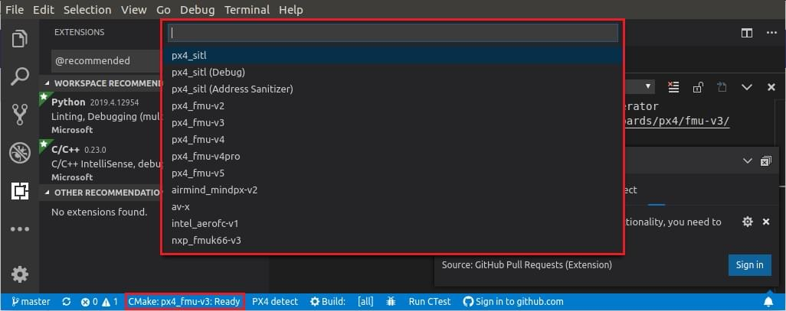

# Visual Studio Code IDE（VSCode）

[Visual Studio Code](https://code.visualstudio.com/) 是一个功能强大的跨平台源代码编辑器/集成开发环境（IDE），可用于 Ubuntu、Windows 和 macOS 平台上的 PX4 开发。

使用 VSCode 进行 PX4 开发有以下几个原因：

- 设置过程 _真的_ 只需几分钟。
- 丰富的扩展生态系统，提供了 PX4 开发所需的各种工具：C/C++（与 _cmake_ 集成良好）、_Python_、_Jinja2_、ROS 消息，甚至是 DroneCAN DSDL。
- 与 GitHub 集成效果极佳。

本主题介绍了如何设置 IDE 并开始开发。

::: info
其他强大的 IDE 也存在，但它们通常需要更多的努力才能与 PX4 集成。
使用 _VSCode_ 时，配置信息存储在 PX4/PX4-Autopilot 代码库中（[PX4-Autopilot/.vscode](https://github.com/PX4/PX4-Autopilot/tree/main/.vscode)），因此设置过程只需添加项目文件夹即可。
:::

## 先决条件

您必须已安装命令行 [PX4 开发环境](../dev_setup/dev_env.md) 并下载了 _Firmware_ 源代码仓库。

## 安装与设置

1. [下载并安装 VSCode](https://code.visualstudio.com/)（系统会提供适合您操作系统的版本）。
1. 打开 VSCode 并添加 PX4 源代码：

   - 在欢迎页面选择 _Open folder ..._ 选项（或通过菜单：**File > Open Folder**）：

     

   - 将出现文件选择对话框。
     选择 **PX4-Autopilot** 目录并点击 **OK**。

   项目文件和配置将随后加载到 _VSCode_ 中。

1. 在 _This workspace has extension recommendations_ 提示中点击 **Install All**（此提示会显示在 IDE 的右下角）。
   

   VSCode 将在左侧打开 _Extensions_ 面板，以便您查看安装进度。

   

1. 右下角可能会出现多个通知/提示：

   :::tip
   如果提示消失，点击底部蓝色栏右侧的小"警报"图标。
   :::

   - 如果提示安装新的 _cmake_ 版本：
     - 请选择 **No**（[PX4 开发环境](../dev_setup/dev_env.md) 已安装了正确的版本）。
   - 如果提示登录 _github.com_ 并添加凭证：
     - 这取决于您！这为 GitHub 和 IDE 提供了深度集成，可能会简化您的工作流程。
   - 其他提示是可选的，如果它们看起来有用，可以安装。<!-- 可能需要添加这些提示的截图 -->

<a id="building"></a>

## 构建 PX4

要构建：

1. 选择您的构建目标（"cmake build config"）：

   - 当前的 _cmake build target_ 会显示在底部的蓝色 _config_ 栏中（如果已经是您想要的目标，可跳到下一步）。
     

     ::: info
     您选择的 cmake 目标会影响 [构建/调试](#debugging) 时提供的目标（例如，硬件调试必须选择类似 `px4_fmu-v6` 的硬件目标）。
     :::

   - 点击配置栏中的目标以显示其他选项，并选择您需要的（这将替换当前选中的目标）。
   - _Cmake_ 会随后配置您的项目（请查看右下角的通知）。
     
   - 等待配置完成。
     完成后通知会消失，并显示构建位置：
     。

1. 您可以通过配置栏启动构建（选择 **Build** 或 **Debug**）。
   

完成至少一次构建后，您可以使用 [代码补全](#code completion) 和其他 _VSCode_ 功能。

## 调试

<a id="debugging_sitl"></a>

### SITL 调试

要在 SITL 上调试 PX4：

1. 选择侧边栏（标记为红色）上的调试图标以显示调试面板。
   

1. 然后从顶部栏的调试下拉菜单（紫色框）中选择您的调试目标（例如 _Debug SITL (Gazebo Iris)_）。

   ::: info
   提供的调试目标（紫色框）与您的构建目标（底部栏的黄色框）匹配。
   例如，要调试 SITL 目标，您的构建目标必须包含 SITL。
   :::

1. 点击顶部栏中的调试 "play" 按钮（调试目标旁边的粉框）开始调试。

调试过程中，您可以设置断点、单步执行代码，并正常开发。

### 硬件调试

[SWD 调试端口](../debug/swd_debug.md) 中的说明解释了如何连接到常见飞控器的 SWD 调试端口。


<a id="code-completion"></a>

## 代码补全

在开发过程中，VSCode 提供了强大的代码补全功能，例如：

```cpp
#include <px4_log.h>
#include <px4_tasks.h>

int main() {
    PX4_INFO("Hello, PX4!");
    return 0;
}
```

::: tip
确保已安装 [C/C++ 扩展](https://marketplace.visualstudio.com/items?itemName=ms-vscode.cpptools) 以启用智能感知和代码导航功能。
:::


## 常见问题

### 如何配置调试器？

请参阅 [调试 PX4](../debug/debugging.md) 文档以获取详细步骤。

### 如何自定义构建配置？

可以通过修改 `.vscode/settings.json` 文件来自定义构建配置。例如：

```json
{
  "cmake.configureArgs": [
    "-DPX4_PLATFORM=posix"
  ]
}
```

### 如何管理多个工作区？

使用 `.vscode/workspaces` 文件夹来存储和管理多个工作区配置。