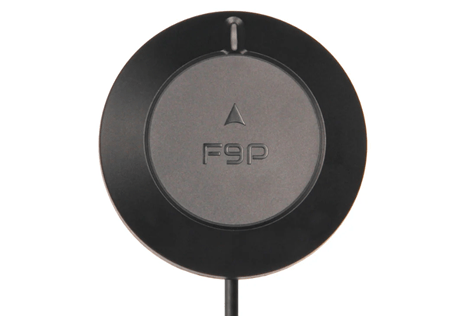

# Holybro H-RTK ZED-F9P RTK Rover（DroneCAN 变体）

[H-RTK ZED-F9P Rover](https://holybro.com/collections/h-rtk-gps/products/h-rtk-zed-f9p-rover) RTK GNSS 是原始 [H-RTK F9P Rover](../gps_compass/rtk_gps_holybro_h-rtk-f9p.md) 的升级版本。

::: tip
本主题涵盖该模块的 [DroneCAN](../dronecan/#enabling-dronecan) 变体。

该模块还存在适用于 `GPS1` 和 `GPS2 UART` 接口的变体，其设置方法请参见 [RTK GNSS](../gps_compass/rtk_gps.md#positioning-setup-configuration)。
:::

该 RTK GNSS 集成了 U-Blox ZED-F9P GNSS 接收器、RM3100 电子罗盘和三色 LED 指示灯，提供精确的定位和姿态数据。DroneCAN 变体包含额外的 MCU、IMU 和气压计传感器。其 IP66 防护等级使其适用于需要防尘防水的严苛环境。



该 RTK GNSS 提供多频段 RTK 功能，具有快速收敛时间和稳定性能。它支持 GPS（L1 & L2）、GLONASS、Galileo 和 BeiDou 信号的并行接收，确保可靠的精确定位。通过基准站或 NTRIP 服务可实现厘米级精度。

高精度 PNI RM3100 电子罗盘确保精确的姿态和稳定性，具有出色的可靠性，非常适合严苛的无人机应用。其特点包括高分辨率、低功耗、强抗噪能力、大动态范围和高采样率。其测量结果在温度变化下保持稳定，且无偏移漂移。

## 购买渠道

- [Holybro](https://holybro.com/collections/h-rtk-gps/products/h-rtk-zed-f9p-rover)

## 硬件规格

- 传感器
  - Ublox ZED-F9P GPS
    - 厘米级精度 RTK 定位
    - IP66 防尘防水
    - EMI 屏蔽以提升 GNSS 性能
    - 开箱即用的运动基线支持
  - RM3100: 高精度低噪声电子罗盘
- DroneCAN 传感器（DroneCAN 变体特有）
  - MCU: STM32G4
  - IMU: Invensense ICM-42688
  - 气压计: ICP20100
- 两个 JST GH CAN 接口（通过转接线）
- LED 指示灯
  - 三色 LED 指示灯
- 关键规格
  - 工作温度: -40C 到 85C
  - 输入电压: 4.75-5.25V
  - 电流消耗: 250 mA
  - 重量: 117 克

## 硬件设置

### 接线

Holybro ZED-F9P GPS 通过 Pixhawk 标准 4 针 JST GH 电缆连接到 CAN 总线。详细信息请参见 [CAN 接线](../can/index.md#wiring) 指南。

对于利用 GPS 偏航的双 F9P 配置，通过 CAN 或 I2C 扩展分线器或 [集线器](https://holybro.com/products/can-hub?_pos=1&_sid=eeb6b74b2&_ss=r) 将两个 F9P 的 CAN 接口连接到同一总线。

## 固件设置

Holybro ZED-F9P GPS 板出厂时已预装 "AP Periph"（Ardupilot DroneCAN 固件）。

更新 "AP Periph" 固件的最新版本：

1. [下载最新固件](https://firmware.ardupilot.org/AP_Periph/latest/HolybroG4_GPS/)。
2. 通过以下任一方式更新固件：
   - 使用 ArduPilot：
     1. 在飞控上安装 _Ardupilot_ 固件，并在电脑上安装 Mission Planner 地面站。
     2. 按照 [DroneCAN 固件更新指南](链接) 操作。
   - 使用 Zubax Babel 工具：
     1. 连接硬件并选择正确的波特率。
     2. 通过 [Zubax Babel 固件更新流程](链接) 完成。

完成后需将飞控固件改回 PX4。

## 启用 DroneCAN

设置参数 [UAVCAN_ENABLE](链接) 以启用 DroneCAN 功能：

- `2` 用于动态节点分配
- `3` 用于固定节点分配

具体步骤请参见 [DroneCAN 启用指南](../dronecan/#enabling-dronecan)。

## 传感器位置配置

1. **安装支架**：将模块安装在机身上，确保箭头方向与机体前向对齐。
2. **间距要求**：双模块配置时，两个模块间距需大于 1 米且小于 10 米。
3. **方向校准**：通过参数 [EKF2_GPS_YAW_OFF](链接) 设置基准站与机体的顺时针夹角（度数）。

## 双模块设置

在 QGroundControl 中执行以下步骤：

1. **设置 GPS_TYPE**：
   - 基准站（Base）: `17`
   - 机体（Rover）: `18`
2. **启用自动配置**：设置 [GPS_AUTO_CONFIG](链接) 为 `1`。
3. **设置相对位置**：
   ```cpp
   GPS_POS_X = 基准站X坐标
   GPS_POS_Y = 基准站Y坐标
   GPS_POS_Z = 基准站Z坐标
   ```
4. **启用相对偏航**：设置 [UAVCAN_SUB_GPS_R](链接) 为 `1`。

完成后两个模块的 LED 将变为绿色，表示 RTK 固定解成功。注意双模块定位仅在至少一个模块报告 `RTK Fixed (6)` 状态时有效，室内或 GPS 信号弱区域将无法工作。