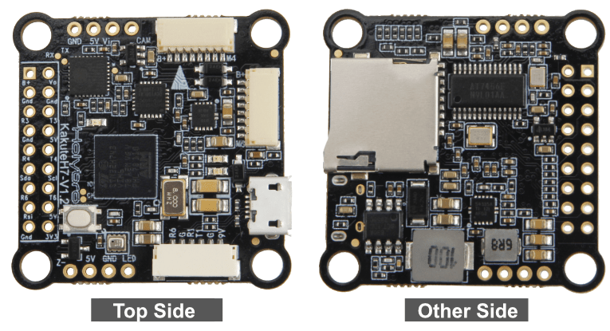

# Holybro Kakute H7

<Badge type="tip" text="PX4 v1.13" />

:::warning
PX4 并不制造此（或任何）自动驾驶仪。
有关硬件支持或合规性问题，请联系[制造商](https://holybro.com/)。
:::

[Holybro Kakute H7](https://holybro.com/products/kakute-h7) 具备多种功能，包括双即插即用4合1电调端口、高清摄像头插孔、气压计、屏幕显示（OSD）、6个UART、完整的黑盒MicroSD卡插槽、5V和9V电压调节器（BEC）、易于焊接的布局等。

Kakute H7 在其前身[Kakute F7](../flight_controller/kakutef7.md)的最佳特性基础上构建，并进一步改进了硬件组件和布局。双即插即用4合1电调连接器简化了对x8和八旋翼配置的支持，保持组装简单整洁。

该板还具有内置气压计、LED和蜂鸣器焊盘，以及I2C焊盘（SDA和SCL）用于外部GPS/磁力计。



::: info
此飞控器是[制造商支持](../flight_controller/autopilot_manufacturer_supported.md)的。
:::

## 关键特性

- MCU: STM32H743 32位处理器，运行频率480 MHz
- IMU: MPU6000
- 气压计: BMP280
- 屏幕显示（OSD）: AT7456E
- 板载蓝牙芯片: PX4中禁用
- 2x JST-SH1.0_8pin端口（用于单个或4合1电调，x8/八旋翼即插即用兼容）
- 1x JST-GH1.25_6pin端口（用于高清系统如Caddx Vista & Air Unit）
- 电池输入电压: 2S - 8S
- 5V 2A持续输出（BEC）
- 9V 1.5A持续输出（BEC）
- 安装: 30.5 x 30.5mm/Φ4mm孔，Φ3mm垫片
- 尺寸: 35x35mm
- 重量: 8g

## 购买渠道

该板可以从以下商店之一购买（例如）:

- [Holybro](https://holybro.com/products/kakute-h7)

:::tip
_Kakute H7_ 设计用于与_Tekko32_ 4合1电调配合使用，可组合购买。
:::

## 连接器和引脚

这是_Kakute H7_的丝印图，显示板的顶部：


| 引脚      | 功能                                                          | PX4 默认设置         |
| -------- | ----------------------------------------------------------------- | ------------------- |
| B+       | 电池正电压 (2S-8S)                                  |                     |
| SDA, SCL | I2C连接 (用于外设)                                  |                     |
| 5V       | 5V输出 (最大2A)                                                |                     |
| 3V3      | 3.3V输出 (最大0.25A)                                           |                     |
| VI       | 来自FPV摄像头的视频输入                                       |                     |
| VO       | 到视频发射器的视频输出                                 |                     |
| CAM      | 到相机OSD控制                                             |                     |
| G 或 GND | 接地                                                            |                     |
| RSI      | 从接收机输入的模拟RSSI (0-3.3V)                          |                     |
| R1, T1   | UART1 RX和TX                                                   | TELEM1              |
| R3, T3   | UART3 RX和TX                                                   | NuttX调试控制台 |
| R4, T4   | UART4 RX和TX                                                   | GPS1                |
| R6, T6   | UART6 RX和TX (R6也位于GH插头中)                  | RC端口             |
| R7       | UART7 RX (RX位于插头中，用于4合1电调)    | DShot遥测     |
| LED      | WS2182可寻址LED信号线 (未经测试)                   |                     |
| Z-       | 压电蜂鸣器负极 (将蜂鸣器正极连接到5V焊盘) |                     |
| M1 到 M4 | 电机信号输出 (位于插头中，用于4合1电调)     |                     |
| M5 到 M8 | 电机信号输出 (位于插头中，用于4合1电调)     |                     |
| Boot     | 引导加载程序按钮                                                 |                     |

## PX4 引导加载程序更新 {#bootloader}

该板预装了[Betaflight](https://github.com/betaflight/betaflight/wiki)。
在安装PX4固件之前，必须烧录_PX4引导加载程序_。
下载[kakuteh7_bl.hex](https://github.com/PX4/PX4-user_guide/raw/main/assets/flight_controller/kakuteh7/holybro_kakuteh7_bootloader.hex)引导加载程序二进制文件，并阅读[此页面](../advanced_config/bootloader_update_from_betaflight.md)获取烧录说明。

## 构建固件

要[构建PX4](../dev_setup/building_px4.md)以针对此目标：

```sh
make holybro_kakuteh7_default
```

## 安装PX4固件

固件可以通过以下任何常规方式安装：

- 构建并上传源代码

  ```sh
  make holybro_kakuteh7_default upload
  ```

- 使用_QGroundControl_ [加载固件](../config/firmware.md)。
  您可以使用预构建固件或自己的自定义固件。

::: info
如果通过QGroundcontrol加载预构建固件，必须使用QGC Daily或QGC版本高于4.1.7的版本。
:::

## 串口映射和调试端口

### 串口映射

| UART | 功能 |
|------|------|
| UART1 | TELEM1 |
| UART3 | NuttX调试控制台 |
| UART4 | GPS1 |
| UART6 | RC端口 |
| UART7 | DShot遥测 |

### 调试端口

#### SWD端口


#### JTAG端口

JTAG端口位于板载调试接口上，可通过标准10针JTAG连接器访问。