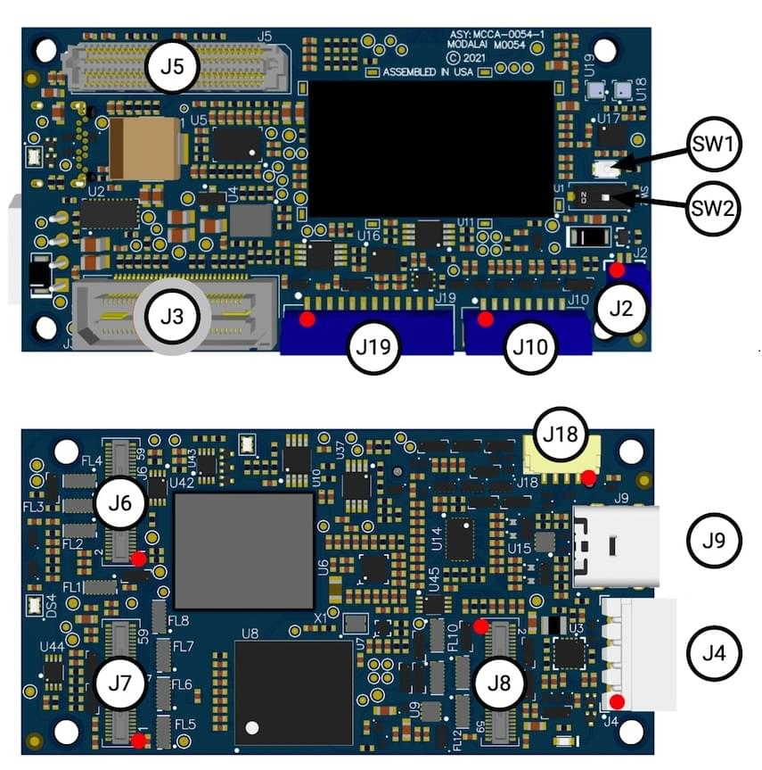

# ModalAI VOXL 2

:::warning
PX4 并不制造此（或任何）自动驾驶仪。
有关硬件支持或合规性问题，请联系[制造商](https://forum.modalai.com/)。
:::

ModalAI [VOXL 2](https://modalai.com/voxl-2) ([技术规格书](https://docs.modalai.com/voxl2-datasheets/)) 是 ModalAI 基于高通 QRB5165 处理器打造的新一代自主计算平台。VOXL 2 配备 8 核处理器、集成 PX4 系统、支持七路摄像头并发、最高达 15+ TOPS 的先进机载 AI 计算能力，以及 5G 连接功能。仅重 16 克的 VOXL 2 是实现全自主与联网无人机的未来之选！

::: info
此飞控器为[制造商支持型号](../flight_controller/autopilot_manufacturer_supported.md)。
:::

## 规格

### 系统

| 功能特性                                                                 | VOXL 2                                                           |
| ----------------------------------------------------------------------- | ---------------------------------------------------------------- |
| 中央处理器                                                              | QRB5165  8核心最高3.091GHz  8GB LPDDR5 128GB Flash |
| 操作系统                                                               | Ubuntu 18.04 - Linux内核v4.19                                   |
| 图形处理器                                                              | Adreno 650 GPU – 1024 ALU                                       |
| 神经网络处理器                                                           | 15 TOPS                                                         |
| 飞行控制器嵌入                                                           | 是（传感器DSP，PX4）                                            |
| 内置WiFi                                                              | 否                                                              |
| 扩展连接能力                                                            | WiFi，5G，4G/LTE，Microhard                                   |
| 视频编码                                                              | 8K30 h.264/h.265 108MP静态图像                                 |
| 计算机视觉传感器                                                         | QTY 6 4-lane CSI，QTY4 CCI（例如2个立体对，高分辨率，跟踪）    |
| 跟踪传感器                                                              | 是                                                              |
| 尺寸规格                                                              | 70mm x 36mm                                                     |
| 重量                                                                    | 16g                                                             |
| VOXL SDK：无GPS导航、SLAM、障碍物规避、物体识别                      | 是                                                              |
| ROS                                                                     | ROS 1 & 2                                                       |
| QGroundControl                                                        | 是                                                              |
| ATAK                                                                    | 是                                                              |
| NDAA ’20 Section 848 Compliant                                          | 是，美国组装                                                    |
| PMD TOF                                                                 | 是（SDK 1.0及更新版本）                                         |
| FLIR Boson                                                              | USB                                                             |
| FLIR Lepton                                                             | USB, SPI                                                        |

::: info
更详细的硬件文档请查看[此处](https://docs.modalai.com/voxl-flight-datasheet/)。
:::

## 尺寸

### 2D 尺寸

### 3D 尺寸

[3D STEP File](https://storage.googleapis.com/modalai_public/modal_drawings/M0054_VOXL2_PVT_SIP_REVA.step)

## PX4 固件兼容性

### voxl-dev 分支

ModalAI 正在积极维护一个 [分支的PX4版本](https://github.com/modalai/px4-firmware/tree/voxl-dev) 可供使用。

由于 VOXL 2 运行 Ubuntu，PX4 的生产版本通过 [apt包管理](https://docs.modalai.com/configure-pkg-manager/) 和 [VOXL SDK](https://docs.modalai.com/voxl-sdk/) 进行分发。

更多关于固件的信息请见 [此处](https://docs.modalai.com/voxl2-px4-developer-guide/)。

### main 分支

PX4 主线版本支持 VOXL 2（开发板文档[请见此处](https://github.com/PX4/PX4-Autopilot/tree/main/boards/modalai/voxl2)）。

## QGroundControl支持

该板载在QGroundControl 4.0及更高版本中得到支持。

## 可用性

- [PX4 Autonomy Developer Kit](https://www.modalai.com/products/px4-autonomy-developer-kit)
- [Starling 2](https://www.modalai.com/products/starling-2)
- [Starling 2 MAX](https://www.modalai.com/products/starling-2-max)
- [Sentinel Development Drone powered by VOXL 2](https://www.modalai.com/pages/sentinel)
  - [Demo Video](https://www.youtube.com/watch?v=hMhQgWPLGXo)
- [VOXL 2 Flight Deck, ready to mount, tune and fly](https://www.modalai.com/collections/ready-to-mount/products/voxl-2-flight-deck)
- [VOXL 2 Development Kits](https://www.modalai.com/products/voxl-2)
  - [Demo Video](https://www.youtube.com/watch?v=aVHBWbwp488)

## 快速入门

供应商提供的快速入门请见[此处](https://docs.modalai.com/voxl2-quickstarts/)。

### VOXL SDK

VOXL SDK（软件开发工具包）包含ModalAI提供的开源项目[voxl-px4](https://docs.modalai.com/voxl-px4/)、[核心库](https://docs.modalai.com/core-libs/)、[服务](https://docs.modalai.com/mpa-services/)、[工具](https://docs.modalai.com/inspect-tools/)、[实用程序](https://docs.modalai.com/sdk-utilities/)和[构建环境](https://docs.modalai.com/build-environments/)，旨在加速VOXL计算板和配件的使用及开发。

VOXL SDK 运行在 VOXL、VOXL 2 和 RB5 Flight 上！

VOXL SDK 中项目的源代码可在 https://gitlab.com/voxl-public 获取，同时包含构建说明。

### 连接器

关于引脚定义的详细信息请见[此处](https://docs.modalai.com/voxl2-connectors/)，[视频概览请见此处](https://www.youtube.com/watch?v=xmqI3msjqdo)

除非特别说明，B2B连接器J3、J5、J6、J7和J8上的所有单端信号均为1.8V CMOS。
除非特别说明，电缆到板连接器J10、J18和J19上的所有单端信号均为3.3V CMOS。

| 连接器 | 描述                   | MPN（板侧）        | 配对MPN（板/线侧） | 类型                         | 信号特性摘要                                                                                                                                                                                             |
| ------ | ---------------------- | ------------------ | ------------------ | ---------------------------- | -------------------------------------------------------------------------------------------------------------------------------------------------------------------------------------------------------- |
| J2     | 风扇                   | SM02B-SRSS-TB(LF)(SN) | SHR-02V-S         | 线缆接头，2针R/A             | 5V直流电源用于风扇 + PWM控制风扇返回（GND）                                                                                                                                                              |
| J3     | 传统B2B                | QSH-030-01-L-D-K-TR | QTH-030-01-L-D-A-K-TR | B2B插座，60针               | 插入式板卡的5V/3.8V/3.3V/1.8V电源，JTAG和调试信号，QUP扩展，GPIO，USB3.1 Gen 2（USB1）                                                                                                                   |
| J4     | 主电源输入             | 22057045          | 0050375043        | 线缆连接器，4针R/A           | +5V主直流电源输入 + GND，电源监控器的I2C@5V                                                                                                                                                              |
| J5     | 高速B2B                | ADF6-30-03.5-L-4-2-A-TR | ADM6-30-01.5-L-4-2-A-TR | B2B插座，120针               | 插入式板卡的更多3.8V/3.3V/1.8V电源，“SOM模式”的5V电源输入，QUP扩展，GPIO（包括I2S），SDCC（SD卡V3.0），UFS1（次级UFS闪存），2L PCIe Gen 3，AMUX和SPMI PMIC信号 |
| J6     | 相机组0                | DF40C-60DP-0.4V(51) | DF40C-60DS-0.4V   | B2B插头，60针               | 2个4车道MIPI CSI端口，CCI和相机控制信号，8组电源轨（从1.05V到5V）用于相机和其他传感器，专用SPI（QUP）端口                                                                                                 |
| J7     | 相机组1                | DF40C-60DP-0.4V(51) | DF40C-60DS-0.4V   | B2B插头，60针               | 2个4车道MIPI CSI端口，CCI和相机控制信号，8组电源轨（从1.05V到5V）用于相机和其他传感器，专用SPI（QUP）端口                                                                                                 |
| J8     | 相机组2                | DF40C-60DP-0.4V(51) | DF40C-60DS-0.4V   | B2B插头，60针               | 2个4车道MIPI CSI端口，CCI和相机控制信号，8组电源轨（从1.05V到5V）用于相机和其他传感器，专用SPI（QUP）端口                                                                                                 |
| J9     | USB-C（ADB）           | UJ31-CH-3-SMT-TR  | USB Type-C        | 线缆插座，24针R/A            | 带重驱动器的ADB USB-C和显示端口备用模式（USB0）                                                                                                                                                          |
| J10    | SPI扩展                | SM08B-GHS-TB(LF)(SN) | GHR-08V-S        | 线缆接头，8针R/A             | 3.3V SPI，2个CS_N引脚，32kHz CLK_OUT@3.3V                                                                                                                                                                |
| J18    | 电调（SLPI访问）       | SM04B-GHS-TB(LF)(SN) | GHR-04V-S        | 线缆接头，4针R/A             | 3.3V电调UART，3.3V参考电压                                                                                                                                                                               |
| J19    | GNSS/MAG/RC/I2C（SLPI访问） | SM12B-GHS-TB(LF)(SN) | GHR-12V-S        | 线缆接头，6针R/A             | 3.3V GNSS UART，3.3V磁力计I2C，5V，RC UART，备用I2C                                                                                                                                                      |

### 用户指南

VOXL 2的PX4用户指南请见[此处](https://docs.modalai.com/voxl-px4/)。

### 开发者指南

VOXL 2的PX4开发者指南请见[此处](https://docs.modalai.com/voxl-px4-developer-guide/)。

### 如何构建

构建说明请见[此处](https://docs.modalai.com/build-environments/)。

## 支持

请访问 [ModalAI Forum](https://forum.modalai.com/category/26/voxl-2) 以获取更多信息。