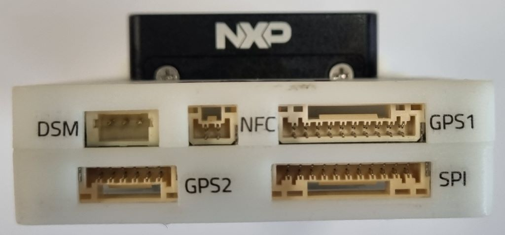

# NXP MR-VMU-RT1176 飞行控制器

<Badge type="tip" text="PX4 v1.15" />

:::warning
PX4 不制造此（或任何）自动驾驶仪。
有关硬件支持（https://community.nxp.com/）或合规性问题，请联系[制造商](https://www.nxp.com)。
:::

_MR-VMU-RT1176_ 参考设计基于 [Pixhawk<sup>&reg;</sup> FMUv6X-RT 开放标准](https://github.com/pixhawk/Pixhawk-Standards/blob/master/DS-020%20Pixhawk%20Autopilot%20v6X-RT%20Standard.pdf)，这是 Pixhawk<sup>&reg;</sup> 飞行控制器成功系列的最新更新版本。

这是 NXP 为使用 FMUv6X-RT 提供的开源 _参考设计_，由行业合作伙伴<sup>&reg;</sup>、NXP 移动机器人团队和 PX4 团队共同设计制造。作为参考/评估设计，它旨在被他人复制、修改或集成到量产中。该设计已通过所有 FCC/CE ROHS REACH UKCA、EMI/RFI ESD 认证，并在全球范围内可用。多家第三方制造商（如 Holybro.com）提供此款或衍生的商用产品。


该板集成了与 Pixhawk 6X-RT 上相同的 FMU 模块，并配以基于 NXP 的载板。载板提供 100Base-T1（双线）汽车以太网、NFC 天线（连接到 SE051）和第三个 CAN 总线。同时移除了 IO 处理器，以启用 12 个 PWM 端口，其中 8 个支持 Dshot 功能。

该板利用了多个 Pixhawk® 开放标准，如 FMUv6X-RT 标准、[自动驾驶仪总线标准](https://github.com/pixhawk/Pixhawk-Standards/blob/master/DS-010%20Pixhawk%20Autopilot%20Bus%20Standard.pdf) 和 [连接器标准](https://github.com/pixhawk/Pixhawk-Standards/blob/master/DS-009%20Pixhawk%20Connector%20Standard.pdf)。配备高性能 NXP i.mx RT1176 双核处理器，模块化设计，三重冗余，温度控制的 IMU 板，隔离的传感器域，提供惊人的性能、可靠性和灵活性。

:::tip
此自动驾驶仪受到 PX4 维护和测试团队的[支持](../flight_controller/autopilot_pixhawk_standard.md)。
:::

## 简介

在 MR-VMU-RT1176 内部，您可以找到 NXP i.MX RT1176，搭配来自 Bosch® 和 InvenSense® 的传感器技术，为您提供控制任何自主飞行器的灵活性和可靠性，适用于学术和商业应用。

Pixhawk® 6X-RT 的 i.MX RT1176 交叉型双核 MCU 包含一个最高运行频率为 1GHz 的 Arm® Cortex®-M7 核心和一个最高运行频率为 400MHz 的 Arm® Cortex®-M4 核心，配备 2MB SRAM 和 64MB 外部 XIP Flash。  
PX4 自动驾驶仪利用了增强的处理能力和 RAM。  
得益于增强的处理能力，开发者可以更高效地进行开发工作，实现复杂的算法和模型。

FMUv6X-RT 开放标准包含高性能、低噪声的 IMU，设计用于更好的稳定控制。  
三重冗余 IMU 与双重冗余气压计位于独立总线上。  
当 PX4 检测到传感器故障时，系统会无缝切换到另一个传感器以保持飞行控制的可靠性。

每个传感器组由独立 LDO 供电，并具备独立电源控制。  
振动隔离系统可过滤高频振动并降低噪声，确保测量精度，使机体实现更优的整体飞行性能。

外部传感器总线 (SPI5) 提供两条芯片选择线和数据就绪信号，用于附加的 SPI 接口传感器和载荷。  
通过集成的 Microchip 以太网 PHY，现在可实现与任务计算机的高速以太网通信。

MR-VMU-RT1176 参考设计非常适合企业研究实验室、初创公司、学术机构（研究、教授、学生）以及希望尝试 T1 (双线) 汽车以太网的商业应用。

请注意，由于这是一个参考设计，此 _特定_ 开发板并未大规模生产。  
我们的授权方将提供类似的变体版本。

## 关键设计点

- 高性能 [NXP i.MX RT1170 1GHz Crossover MCU](https://www.nxp.com/products/processors-and-microcontrollers/arm-microcontrollers/i-mx-1170-1-ghz-crossover-mcu-with-arm-cortex-cores:i.MX-RT1170) 带 Arm® Cortex® 核心
- 硬件安全元件 [NXP EdgeLock SE051](https://www.nxp.com/products/security-and-authentication/authentication/edgelock-se051-proven-easy-to-use-iot-security-solution-with-support-for-updatability-and-custom-applets:SE051)。
  这是广受信任的 EdgeLock SE050 Plug & Trust 安全元件系列的扩展，支持现场更新应用，提供通过 CC EAL 6+ 认证的安全性，达到 OS 层级的 AVA_VAN.5 认证，可抵御最新攻击场景。
  可用于例如安全存储操作员 ID 或证书。
- 模块化飞行控制器：分离的 IMU、FMU 和基板系统，通过 100 针和 50 针 Pixhawk® 自动飞行器总线连接器连接。
- 冗余设计：三组 IMU 传感器和双气压计传感器，分别位于独立总线上
- 三重冗余域：完全隔离的传感器域，配备独立总线和独立电源控制
- 新型振动隔离系统可过滤高频振动并减少噪声，确保测量精度
- 100Base-T1 双线以太网接口，支持高速任务计算机集成
- IMU 通过板载加热电阻实现温度控制，确保 IMU 最佳工作温度

### 处理器与传感器

- FMU 处理器：NXP i.MX RT1176
  - 32 位 Arm® Cortex®-M7，1GHz
  - 32 位 Arm® Cortex®-M4，400MHz 辅助核心
  - 64MB 外部闪存
  - 2MB RAM
- NXP EdgeLock SE051 硬件安全元件
  - 符合 IEC62443-4-2 标准要求
  - 46 kB 用户内存，可通过个性化扩展至 104 kB
  - 针对物联网部署的 CC EAL6+ 认证创新安全方案
  - 支持 AES 和 3DES 加密/解密
- 板载传感器
  - 加速度计/陀螺仪：ICM-20649 或 BMI088
  - 加速度计/陀螺仪：ICM-42688-P
  - 加速度计/陀螺仪：ICM-42670-P
  - 磁力计：BMM150
  - 气压计：2x BMP388

### 电气特性

- 电压规格：
  - 最大输入电压：6V
  - USB 电源输入：4.75\~5.25V
  - 舵机供电输入：0\~36V
- 电流规格：
  - `TELEM1` 输出电流限制：1.5A
  - 其他端口总输出电流限制：1.5A

### 机械特性

- 尺寸
  - 飞行控制器模块：38.8 x 31.8 x 14.6mm
  - 标准底板：50 x 96 x 16.7mm
- 重量
  - 飞行控制器模块：23g
  - 标准底板：51g

### 接口

- 12 个 PWM 舵机输出，其中 8 个支持 D-SHOT
- R/C 输入支持 Spektrum/DSM
- 专用 R/C 输入支持 PPM 和 S.Bus
- 专用模拟/PWM RSSI 输入和 S.Bus 输出
- 4 个通用串口：
  - 3 个支持全流量控制
  - 1 个独立 1.5A 电流限制（Telem1）
  - 1 个带 I2C 和额外 GPIO 线用于外接 NFC 读卡器
- 2 个 GPS 接口
  - 1 个完整 GPS 加安全开关端口
  - 1 个基础 GPS 端口
- 1 个 I2C 接口
- 1 个以太网接口
  - 无变压器应用
  - 100Mbps
- 1 个 SPI 总线
  - 2 个芯片选择线
  - 2 个数据就绪线
  - 1 个 SPI 同步线
  - 1 个 SPI 复位线
- 3 个 CAN 总线（PX4 目前支持 2 个）
  - CAN 总线支持独立静默控制或电调 RX-MUX 控制
- 2 个 SMBus 电源输入端口
- 1 个 AD & IO 端口
- 2 个额外模拟输入
- 1 个 PWM/捕获输入
- 2 个专用调试和 GPIO 线

- 其他特性：
  - 工作及存储温度：-40 ~ 85°C## 购买渠道

从[NXP](https://www.nxp.com)订购。

## 装配/设置

接线方式与 [Holybro Pixhawk 6X](../flight_controller/pixhawk6x.md#connections) 以及其他遵循 [Pixhawk Connector Standard](https://github.com/pixhawk/Pixhawk-Standards/blob/master/DS-009%20Pixhawk%20Connector%20Standard.pdf) 的开发板类似。

<!-- TBD - provide sample wiring diagram. -->## 连接

_MR-VMU-RT1176_ 连接器 (遵循 [Pixhawk Connector Standard](https://github.com/pixhawk/Pixhawk-Standards/blob/master/DS-009%20Pixhawk%20Connector%20Standard.pdf))





如需更多信息请参见：

- [NXP MR-VMU-RT1176 Baseboard Connections](https://nxp.gitbook.io/vmu-rt1176/production-v1-carrier-board-connectors) (nxp.gitbook.io)

## 引脚分配

[NXP MR-VMU-RT1176 Baseboard Pinout](https://nxp.gitbook.io/vmu-rt1176/pin-out) (nxp.gitbook.io)

注：

- [摄像头捕捉引脚](../camera/fc_connected_camera.md#camera-capture-configuration) (`PI0`) 是 AD&IO 端口的第 2 引脚，上方标记为 `FMU_CAP1`。

## 串口映射

| UART   | 设备       | 端口     |
| ------ | ---------- | -------- |
| UART1  | /dev/ttyS0 | 调试    |
| UART3  | /dev/ttyS1 | GPS      |
| UART4  | /dev/ttyS2 | 遥测1   |
| UART5  | /dev/ttyS3 | GPS2     |
| UART6  | /dev/ttyS4 | PX4IO    |
| UART8  | /dev/ttyS5 | 遥测2   |
| UART10 | /dev/ttyS6 | 遥测3   |
| UART11 | /dev/ttyS7 | 外部    |

<!--## 尺寸

TBD -->## 电压规格

_MR-VMU-RT1176_ 在提供三个电源时可以实现三重冗余供电。
三个电源分别为：**POWER1**、**POWER2** 和 **USB**。
**POWER1** 与 **POWER2** 接口在 MR-VMU-RT1176 上使用 [2.00mm节距CLIK-Mate线对板PCB插座](https://www.molex.com/molex/products/part-detail/pcb_receptacles/5024430670) 的 6 路电路。

### 正常操作最大电压

在这些条件下，系统将按以下顺序使用所有电源供电：

1. **POWER1** 和 **POWER2** 输入 (4.9V 至 5.5V)
1. **USB** 输入 (4.75V 至 5.25V)

### 绝对最大电压

在这些条件下，系统将不消耗任何电力（不工作），但硬件保持完好。

1. **POWER1** 和 **POWER2** 输入 (工作范围 4.1V 至 5.7V，0V 至 10V 无损)
1. **USB** 输入 (工作范围 4.1V 至 5.7V，0V 至 6V 无损)
1. 舵机输入：**FMU PWM OUT** 和 **I/O PWM OUT** 的 VDD_SERVO 引脚 (0V 至 42V 无损)

### 电压监测

默认启用数字 I2C 电池监测（参见 [Quickstart > Power](../assembly/quick_start_pixhawk6x.md#power)）。

::: info
此特定板不支持通过 ADC 的模拟电池监测，但具有不同基板的飞行控制器变种可能支持。
:::

## 构建固件

:::tip
大多数用户无需构建此固件！
当连接合适的硬件时，它会被预构建并由_QGroundControl_自动安装。
:::

要[构建PX4](../dev_setup/building_px4.md)用于此目标：

```sh
make px4_fmu-v6xrt_default
```

## 调试端口 {#debug_port}

[PX4系统控制台](../debug/system_console.md) 和 [SWD接口](../debug/swd_debug.md) 运行在 **FMU调试** 端口。

管脚定义和连接器符合 [Pixhawk调试全接口](../debug/swd_debug.md#pixhawk-debug-full) 标准，该标准定义在 [Pixhawk连接器规范](https://github.com/pixhawk/Pixhawk-Standards/blob/master/DS-009%20Pixhawk%20Connector%20Standard.pdf) 中（JST SM10B连接器）。

| 引脚     | 信号           | 电压   |
| -------- | -------------- | ------ |
| 1（红色） | `Vtref`        | +3.3V  |
| 2（黑色） | 控制台发送（输出） | +3.3V  |
| 3（黑色） | 控制台接收（输入） | +3.3V  |
| 4（黑色） | `SWDIO`        | +3.3V  |
| 5（黑色） | `SWCLK`        | +3.3V  |
| 6（黑色） | `SWO`          | +3.3V  |
| 7（黑色） | NFC GPIO       | +3.3V  |
| 8（黑色） | PH11           | +3.3V  |
| 9（黑色） | nRST           | +3.3V  |
| 10（黑色）| `GND`          | GND    |

关于使用该端口的更多信息请参见：

- [SWD调试端口](../debug/swd_debug.md)
- [PX4系统控制台](../debug/system_console.md)（注意，FMU控制台映射到USART3）## 外设

- [数字空速传感器](https://holybro.com/products/digital-air-speed-sensor)
- [遥测无线电模块](https://holybro.com/collections/telemetry-radios?orderby=date)
- [测距仪/距离传感器](../sensor/rangefinders.md)

## 支持的平台 / 机体类型

任何可通过普通RC舵机或Futaba S-Bus舵机控制的多旋翼/固定翼飞机/地面车辆或船只。  
完整支持的配置集可以在[Airframes Reference](../airframes/airframe_reference.md)中查看。

## 更多信息

- [更新 Pixhawk 6X-RT 引导程序](../advanced_config/bootloader_update_v6xrt.md)
- [Pixhawk 6X 接线快速入门](../assembly/quick_start_pixhawk6x.md)
- [PM02D 电源模块](../power_module/holybro_pm02d.md)
- [PM03D 电源模块](../power_module/holybro_pm03d.md)
- [Pixhawk FMUv6X-RT 开放标准](https://github.com/pixhawk/Pixhawk-Standards/blob/master/DS-020%20Pixhawk%20Autopilot%20v6X-RT%20Standard.pdf)
- [Pixhawk 自主飞行器总线标准](https://github.com/pixhawk/Pixhawk-Standards/blob/master/DS-010%20Pixhawk%20Autopilot%20Bus%20Standard.pdf)
- [Pixhawk 接口标准](https://github.com/pixhawk/Pixhawk-Standards/blob/master/DS-009%20Pixhawk%20Connector%20Standard.pdf)