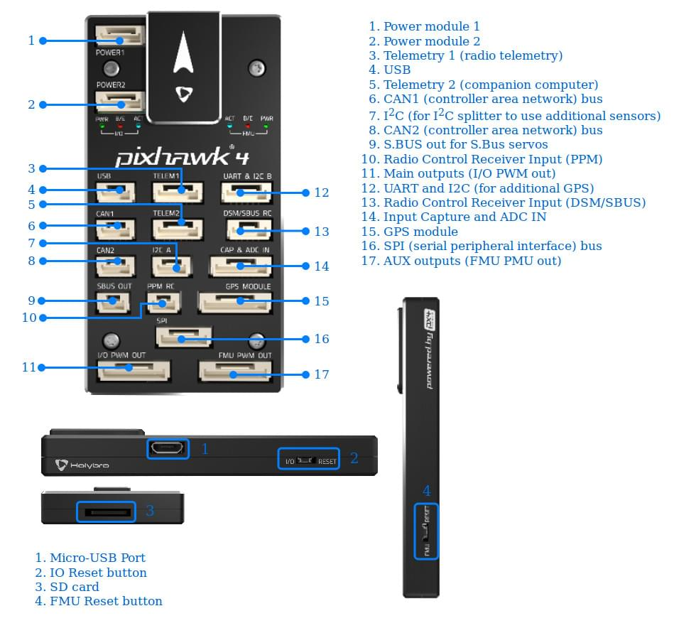

# Holybro Pixhawk 4

:::warning
PX4 不生产此（或任何）自动驾驶仪。
有关硬件支持或合规性问题，请联系[制造商](https://holybro.com/)。
:::

_Pixhawk 4_<sup>&reg;</sup> 是由 Holybro<sup>&reg;</sup> 与 PX4 团队合作设计和制造的先进自动驾驶仪。  
它针对运行 PX4 v1.7 及更高版本进行了优化，适用于学术和商业开发者。  

它基于 [Pixhawk-project](https://pixhawk.org/) **FMUv5** 开源硬件设计，并运行 PX4 操作系统 [NuttX](https://nuttx.apache.org/)。

 

:::tip
此自动驾驶仪受到 PX4 维护和测试团队的[支持](../flight_controller/autopilot_pixhawk_standard.md)。
:::

## 快速概览

- 主 FMU 处理器：STM32F765  
  - 32 位 Arm® Cortex®-M7，216MHz，2MB 存储，512KB RAM  
- IO 处理器：STM32F100  
  - 32 位 Arm® Cortex®-M3，24MHz，8KB SRAM  
- 板载传感器：  
  - 加速度计/陀螺仪：ICM-20689  
  - 加速度计/陀螺仪：BMI055 或 ICM20602  
  - 磁力计：IST8310  
  - 气压计：MS5611  
- GPS：u-blox Neo-M8N GPS/GLONASS 接收器；集成磁力计 IST8310  
- 接口：  
  - 8-16 路 PWM 输出（8 路来自 IO，8 路来自 FMU）  
  - 3 路专用 PWM/Capture 输入（FMU）  
  - 专用 R/C 输入（CPPM）  
  - 专用 R/C 输入（Spektrum/DSM 和 S.Bus）带模拟/PWM RSSI 输入  
  - 专用 S.Bus 舵机输出  
  - 5 路通用串口  
  - 3 路 I2C 接口  
  - 4 路 SPI 总线  
  - 最多 2 路 CAN 总线（用于双 CAN 电调）  
  - 模拟输入（2 路电池的电压/电流）  
- 电源系统：  
  - 电源模块输出：4.9~5.5V  
  - USB 电源输入：4.75~5.25V  
  - 舵机电源输入：0~36V  
- 重量和尺寸：  
  - 重量：15.8g  
  - 尺寸：44x84x12mm  
- 其他特性：  
  - 工作温度：-40 ~ 85°C  

更多信息请参见 [Pixhawk 4 技术数据表](https://github.com/PX4/PX4-user_guide/raw/main/assets/flight_controller/pixhawk4/pixhawk4_technical_data_sheet.pdf)。

## 购买渠道

从 [Holybro](https://holybro.com/products/pixhawk-4) 订购。

## 接口



:::warning
**DSM/SBUS RC** 和 **PPM RC** 端口仅用于接收器。  
这些端口是带电的！切勿连接舵机、电源或电池（或连接到任何接收器）。
:::

## 引脚定义

从 [此处](https://cdn.shopify.com/s/files/1/0604/5905/7341/files/Pixhawk4-Pinouts.pdf) 下载 _Pixhawk 4_ 引脚定义。

::: info
连接器引脚定义从左到右排列（即第 1 引脚是左侧第一个引脚）。  
例外情况是 [调试端口](#debug_port)（第 1 引脚是右侧第一个引脚）。
:::

## 串口映射表

| UART | 设备 | 端口 |
|------|------|------|
| UART1 | GPS | TELEM1 |
| UART2 | 串口调试 | TELEM2 |
| UART3 | CAN 总线 | CAN1 |
| UART4 | CAN 总线 | CAN2 |
| UART5 | I2C 总线 | I2C1 |

## 电压规格

- **电源输入**：4.9~5.5V（5V 稳压器）  
- **备用电源输入**：5.5~18V（通过 BEC）  
- **绝对最大值**：  
  - 输入电压：18V  
  - 工作电流：1.2A（最大瞬时电流）  

## 调试端口

::: info
调试端口位于板载 JTAG 接口，支持 SWD 调试协议。
:::

```bash
# 示例调试命令
arm-none-eabi-gdb -ex "target extended-remote /dev/ttyUSB0" firmware.elf
```

## 三重冗余设计

- **triple-redundant** 电源架构：  
  - 主电源（5V 稳压器）  
  - 备用电源（BEC）  
  - USB 电源（备用）  

## 进一步信息

- [Pixhawk 4 技术数据表](https://github.com/PX4/PX4-user_guide/raw/main/assets/flight_controller/pixhawk4/pixhawk4_technical_data_sheet.pdf)  
- [FMUv5 引脚定义参考设计](https://docs.google.com/spreadsheets/d/1-n0__BYDedQrc_2NHqBenG1DNepAgnHpSGglke-QQwY/edit#gid=912976165).  
- [Pixhawk 4 接线快速指南](../assembly/quick_start_pixhawk4.md)  
- [Pixhawk 4 引脚定义](https://cdn.shopify.com/s/files/1/0604/5905/7341/files/Pixhawk4-Pinouts.pdf) (Holybro)  
- [Pixhawk 4 快速入门指南](https://cdn.shopify.com/s/files/1/0604/5905/7341/files/Pixhawk4-quickstartguide.pdf) (Holybro)