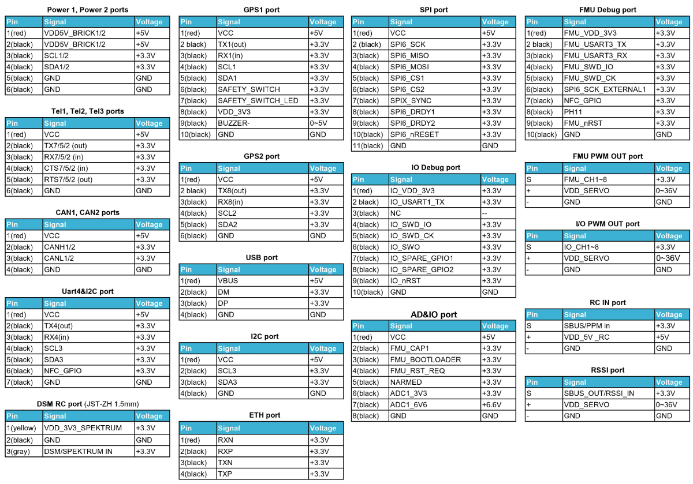

# Holybro Pixhawk 5X

:::warning
PX4 不制造此（或任何）自动驾驶仪。
有关硬件支持或合规性问题，请联系[制造商](https://holybro.com/)。
:::

_Pixhawk 5X_<sup>&reg;</sup> 是 Pixhawk® 飞控家族的最新升级产品，由 Holybro<sup>&reg;</sup> 和 PX4 团队合作设计和制造。

它基于[Pixhawk​​® Autopilot FMUv5X 标准](https://github.com/pixhawk/Pixhawk-Standards/blob/master/DS-011%20Pixhawk%20Autopilot%20v5X%20Standard.pdf)、[自动驾驶仪总线标准](https://github.com/pixhawk/Pixhawk-Standards/blob/master/DS-010%20Pixhawk%20Autopilot%20Bus%20Standard.pdf)和[连接器标准](https://github.com/pixhawk/Pixhawk-Standards/blob/master/DS-009%20Pixhawk%20Connector%20Standard.pdf)。该产品预装最新 PX4 Autopilot®，采用三重冗余架构、温度控制、隔离传感器域，提供卓越的性能和可靠性。

 

:::tip
此自动驾驶仪由 PX4 维护和测试团队[支持](../flight_controller/autopilot_pixhawk_standard.md)。
:::

## 简介

在Pixhawk® 5X内部，搭载了基于STMicroelectronics®的STM32F7微控制器，配合来自Bosch®和InvenSense®的传感器技术，为控制任何自主飞行器提供了灵活性和可靠性，适用于学术和商业应用。  
Pixhawk® 5X的F7微控制器配备2MB闪存和512KB RAM。  
PX4 Autopilot充分利用了这增强的处理能力和RAM。  
得益于更新的处理能力，开发者能够更高效地进行开发工作，实现复杂的算法和模型。

FMUv5X开放标准集成了高性能、低噪声的IMU，设计用于提升稳定性。  
三重冗余IMU和双重冗余气压计分别位于独立总线上。  
当PX4 Autopilot检测到传感器故障时，系统会无缝切换至备用传感器，以保持飞行控制的可靠性。

每个传感器组均通过独立LDO供电并具备独立电源控制。  
全新设计的减震装置可滤除高频振动并降低噪声，确保测量精度，使机体实现更优的整体飞行性能。  
外部传感器总线（SPI5）配备两条芯片选择线和数据就绪信号，支持SPI接口的附加传感器和载荷，并集成了Microchip以太网PHY（LAN8742AI-CZ-TR），现可通过以太网实现与任务计算机的高速通信。  
两个智能电池监控端口（SMBus），支持INA226 SMBus电源模块。

Pixhawk® 5X非常适合企业研发实验室、初创公司、学术界（研究、教授、学生）以及商业应用。

## 关键设计点

- 模块化飞行控制器  
  - 分离式IMU、FMU和基础系统，通过100针和50针Pixhawk® Autopilot Bus连接器连接，设计用于灵活且可定制的系统  
- 冗余设计  
  - 3个IMU传感器与2个气压计传感器分布在独立总线上，允许在硬件故障情况下仍能并行连续运行  
- 三重冗余系统  
  - 完全隔离的传感器系统，具备独立总线和独立电源控制  
- 温度控制的IMU  
  - 机载IMU加热电阻，确保IMU工作在最佳温度  
- 振动隔离系统  
  - 新设计的系统可过滤高频振动并降低噪声，确保读数精度  
- 以太网接口  
  - 用于高速任务计算机集成  
- 自动传感器校准，消除信号波动和温度影响  
- 通过SMBus监控两个智能电池  
- 为外部NFC读卡器提供额外的GPIO线和5V电源  
- 用于无人机安全认证的安全元件（SE050）## 技术规格

- FMU处理器：STM32F765  
  - 32位Arm® Cortex®-M7，216MHz，2MB内存，512KB RAM  
- IO处理器：STM32F100  
  - 32位Arm® Cortex®-M3，24MHz，8KB SRAM  
- 板载传感器：  

  - 加速度计/陀螺仪：ICM-20649  
  - 加速度计/陀螺仪：ICM-42688P  
  - 加速度计/陀螺仪：ICM-20602  
  - 磁力计：BMM150  
  - 气压计：2x BMP388  

- 接口  

  - 16路PWM舵机输出  
  - 遥控接收机输入（Spektrum/DSM）  
  - 专用PPM和S.Bus输入的遥控接收机接口  
  - 专用模拟/PWM RSSI输入和S.Bus输出  
  - 4路通用串口  
    - 3路支持全流量控制  
    - 1路带独立1.5A电流限制  
    - 1路带I2C和额外GPIO线（用于外部NFC读卡器）  
  - 2路GPS端口  
    - 1路完整GPS及安全开关端口  
    - 1路基础GPS端口  
  - 1路I2C端口  
  - 1路以太网端口  
    - 无变压器应用  
  - 100Mbps  
  - 1路SPI总线  
  - 2路芯片选择线  
  - 2路数据就绪线  
  - 1路SPI同步线  
  - 1路SPI复位线  
  - 2路CAN总线（用于CAN外设）  
    - CAN总线支持独立静音控制或电调RX-MUX控制  
  - 2路带SMBus的电源输入端口  
  - 1路AD与IO端口  
    - 2路额外模拟输入  
    - 1路PWM/捕获输入  
    - 2路专用调试和GPIO线  

- 电压规格  

  - 最大输入电压：6V  
  - USB供电输入：4.75~5.25V  
  - 舵机供电输入：0~36V  

- 尺寸  

  - 飞行控制器模块：38.8 x 31.8 x 14.6mm  
  - 标准底板：52.4 x 103.4 x 16.7mm  

- 重量  

  - 飞行控制器模块：23g  
  - 标准底板：51g  

- 其他特性：  
  - 工作及存储温度：-40 ~ 85°c## 购买渠道

从 [Holybro](https://holybro.com/products/pixhawk-5x) 订购。

## 组装/设置

[Pixhawk 5X 接线快速入门](../assembly/quick_start_pixhawk5x.md)提供了关于如何组装必要的/重要的外设（如GPS、电源模块等）的说明。

## 连接


## 引脚分配



::: info
连接器引脚分配为从左到右（即第1针是最左侧的引脚）。
::: infos:

- [相机捕获引脚](../camera/fc_connected_camera.md#camera-capture-configuration) (`PI0`) 是 AD&IO 端口的第2针，上方标记为 `FMU_CAP1`。
- _Pixhawk 5X_ 的引脚分配表可从 [此处](https://github.com/PX4/PX4-user_guide/blob/main/assets/flight_controller/pixhawk5x/pixhawk5x_pinout.pdf) 或 [此处](https://cdn.shopify.com/s/files/1/0604/5905/7341/files/Holybro_Pixhawk5X_Pinout.pdf) 下载为 PDF 格式。

## 串口映射

| UART   | 设备       | 端口           |
| ------ | ---------- | -------------- |
| USART1 | /dev/ttyS0 | GPS          |
| USART2 | /dev/ttyS1 | TELEM3       |
| USART3 | /dev/ttyS2 | 调试控制台     |
| UART4  | /dev/ttyS3 | UART4 & I2C  |
| UART5  | /dev/ttyS4 | TELEM2       |
| USART6 | /dev/ttyS5 | PX4IO/RC     |
| UART7  | /dev/ttyS6 | TELEM1       |
| UART8  | /dev/ttyS7 | GPS2         |## 尺寸


## 电压规格

_Pixhawk 5X_ 在提供三个电源输入时可实现三重冗余供电。三个电源线路分别为：**POWER1**、**POWER2** 和 **USB**。  
Pixhawk 5X 上的 **POWER1** 与 **POWER2** 接口采用 [2.00mm Pitch CLIK-Mate Wire-to-Board PCB Receptacle](https://www.molex.com/molex/products/part-detail/pcb_receptacles/5024430670) 6路电路设计。

**正常运行最大电压规格**  
在此条件下，系统将按以下顺序使用所有电源输入：

1. **POWER1** 和 **POWER2** 输入（4.9V 至 5.5V）  
1. **USB** 输入（4.75V 至 5.25V）

**绝对最大电压规格**  
在此条件下，系统将不会消耗任何电力（处于非工作状态），但硬件保持完好：

1. **POWER1** 和 **POWER2** 输入（工作范围 4.1V 至 5.7V，0V 至 10V 无损）  
1. **USB** 输入（工作范围 4.1V 至 5.7V，0V 至 6V 无损）  
1. 舵机输入：**FMU PWM OUT** 与 **I/O PWM OUT** 的 VDD_SERVO 引脚（0V 至 42V 无损）

**电压监控**  
默认启用数字 I2C 电池监控功能（详见 [Quickstart > Power](../assembly/quick_start_pixhawk5x.md#power)）。

::: info  
通过 ADC 实现的模拟电池监控不支持该特定板型，但可能在采用不同底板的飞行控制器变体中提供支持。  
:::

## 构建固件

:::tip
大多数用户不需要构建此固件！
当连接合适的硬件时，固件已预先构建并由 _QGroundControl_ 自动安装。
:::

要[编译 PX4](../dev_setup/building_px4.md)以适配该目标：

```
make px4_fmu-v5x_default
```

<a id="debug_port"></a>## 调试端口

[PX4 系统控制台](../debug/system_console.md)和[SWD 接口](../debug/swd_debug.md)运行在 **FMU 调试** 端口上。

该引脚定义和连接器符合[Pixhawk 调试完整](../debug/swd_debug.md#pixhawk-debug-full)接口规范，该规范定义于[Pixhawk 连接器标准](https://github.com/pixhawk/Pixhawk-Standards/blob/master/DS-009%20Pixhawk%20Connector%20Standard.pdf)（JST SM10B 连接器）。

| 引脚      | 信号           | 电压  |
| -------- | ---------------- | ----- |
| 1（红色）  | `Vtref`          | +3.3V |
| 2（黑色）  | 控制台 TX（输出） | +3.3V |
| 3（黑色）  | 控制台 RX（输入）  | +3.3V |
| 4（黑色）  | `SWDIO`          | +3.3V |
| 5（黑色）  | `SWCLK`          | +3.3V |
| 6（黑色）  | `SWO`            | +3.3V |
| 7（黑色）  | NFC GPIO         | +3.3V |
| 8（黑色）  | PH11             | +3.3V |
| 9（黑色）  | nRST             | +3.3V |
| 10（黑色） | `GND`            | GND   |

关于使用该端口的更多信息请参见：

- [SWD 调试端口](../debug/swd_debug.md)
- [PX4 系统控制台](../debug/system_console.md)（注意，FMU 控制台映射到 USART3）## 外设

- [数字空速传感器](https://holybro.com/products/digital-air-speed-sensor)
- [遥测无线电模块](https://holybro.com/collections/telemetry-radios?orderby=date)
- [测距仪/距离传感器](../sensor/rangefinders.md)

## 支持的平台 / 机体结构

任何可以通过普通遥控舵机或Futaba S-Bus舵机控制的多旋翼/固定翼/地面车或船只。  
完整支持的配置列表可参考[Airframes Reference](../airframes/airframe_reference.md)。

## 更多信息

- [Pixhawk 5X 接线快速入门](../assembly/quick_start_pixhawk5x.md)
- [Pixhawk 5X 概述与规格](https://cdn.shopify.com/s/files/1/0604/5905/7341/files/Holybro_Pixhawk5X_Spec_Overview.pdf) (Holybro)
- [Pixhawk 5X 端口配置](https://cdn.shopify.com/s/files/1/0604/5905/7341/files/Holybro_Pixhawk5X_Pinout.pdf) (Holybro)
- [FMUv5X 参考设计端口配置](https://docs.google.com/spreadsheets/d/1Su7u8PHp-Y1AlLGVuH_I8ewkEEXt_bHHYBHglRuVH7E/edit#gid=562580340).
- [Pixhawk 飞控单元FMUv5X标准](https://github.com/pixhawk/Pixhawk-Standards/blob/master/DS-011%20Pixhawk%20Autopilot%20v5X%20Standard.pdf).
- [Pixhawk 飞控总线标准](https://github.com/pixhawk/Pixhawk-Standards/blob/master/DS-010%20Pixhawk%20Autopilot%20Bus%20Standard.pdf).
- [Pixhawk 连接器标准](https://github.com/pixhawk/Pixhawk-Standards/blob/master/DS-009%20Pixhawk%20Connector%20Standard.pdf).