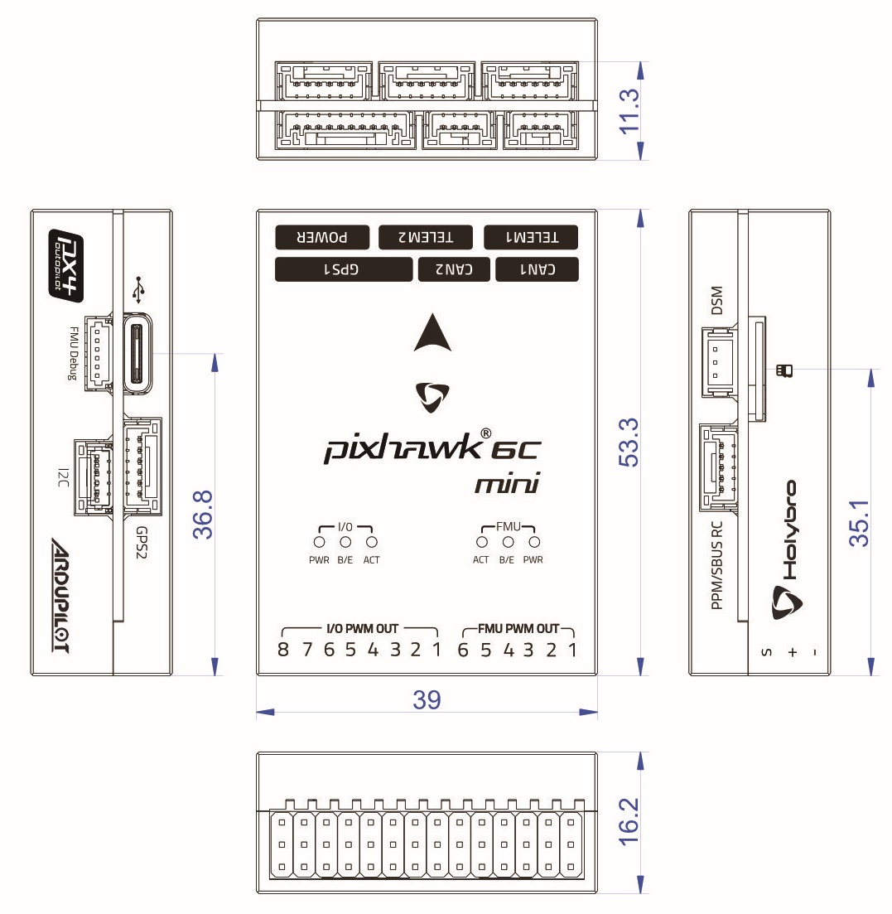
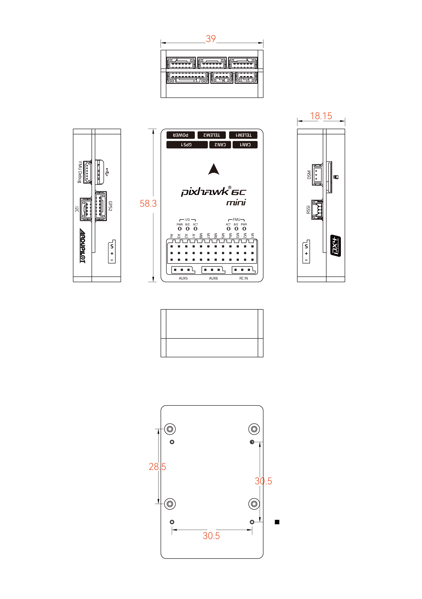

# Holybro Pixhawk 6C Mini

:::warning
PX4不生产此（或任何）自动驾驶仪。
有关硬件支持或合规性问题，请联系[制造商](https://holybro.com/)。
:::

Pixhawk 6C Mini<sup>&reg;</sup> 是与 Holybro<sup>&reg;</sup> 和 PX4 团队合作设计和制造的 Pixhawk® 飞行控制器成功系列的最新升级。  
它配备高性能 H7 处理器，具有 IMU 冗余、温度控制的 IMU 板和高性价比设计，提供惊人的性能和可靠性。  
它符合 Pixhawk [连接器标准](https://github.com/pixhawk/Pixhawk-Standards/blob/master/DS-009%20Pixhawk%20Connector%20Standard.pdf)。


:::tip
此自动驾驶仪由 PX4 维护和测试团队[支持](../flight_controller/autopilot_pixhawk_standard.md)。
:::

## 介绍

Pixhawk® 6C Mini 是 Pixhawk® 飞控家族的最新升级版本。

在 Pixhawk® 6C Mini 内部，搭载了基于 STMicroelectronics® 的 STM32H743 处理器，配合来自 Bosch® 与 InvenSense® 的传感器技术，为控制各类自主机体提供灵活性与可靠性，适用于学术研究与商业应用。

Pixhawk 6C Mini 的 H7 微控制器采用 Arm® Cortex®-M7 内核，最高运行频率可达 480 MHz，并配备 2MB 闪存和 1MB RAM。得益于提升的处理性能，开发者能够更高效地进行开发工作，支持复杂算法和模型的运行。

Pixhawk 6C Mini 集成高性能、低噪声的惯性测量单元（IMU），设计上兼顾成本效益并实现 IMU 冗余。其振动隔离系统可过滤高频振动并降低噪声，确保测量精度，从而提升机体整体飞行性能。

Pixhawk® 6C Mini 是企业研发实验室、初创公司、学术机构（研究、教授、学生）及商业应用开发者的理想选择。

**关键设计要点**

- 高性能 STM32H743 处理器，具备更强计算能力与 RAM  
- 新型低成本设计，采用低剖面机身结构  
- 新设计的集成振动隔离系统，可过滤高频振动并降低噪声，确保测量精度  
- IMU 通过机载加热电阻进行温度控制，确保达到最佳工作温度## 技术规格

### **处理器与传感器**

- FMU处理器: STM32H743
  - 32位Arm® Cortex®-M7，480MHz，2MB内存，1MB SRAM
- IO处理器: STM32F103
  - 32位Arm® Cortex®-M3，72MHz，64KB SRAM
- 板载传感器
  - 加速度计/陀螺仪: ICM-42688-P
  - 加速度计/陀螺仪: BMI055
  - 磁力计: IST8310
  - 气压计: MS5611

### **电气数据**

- 电压参数:
  - 最大输入电压: 6V
  - USB电源输入: 4.75~5.25V
  - 舵机供电输入: 0~36V
- 电流参数:
  - `TELEM1` 最大输出电流限制器: 1A
  - 其他所有端口组合输出电流限制器: 1A

### **机械数据**

- 尺寸: 53.3 x 39 x 16.2 mm
- 重量: 39.2g

### **接口**

- 14路PWM舵机输出（8路来自IO，6路来自FMU）
- 3个通用串口
  - `TELEM1` - 完整流控制，独立1A电流限制
  - `TELEM2` - 完整流控制
- 2个GPS接口
  - GPS1 - 完整GPS端口（含GPS和安全开关）
  - GPS2 - 基础GPS端口
- 1个I2C端口
  - 支持传感器模块上的专用I2C校准EEPROM
- 2个CAN总线
  - CAN总线支持独立静默控制或ESC RX-MUX控制
- 1个调试端口:
  - FMU Debug Mini
- 专用遥控输入（支持Spektrum/DSM和S.BUS、CPPM、模拟/PWM RSSI）
- 1个电源输入端口（模拟）

- 其他特性:
  - 工作及存储温度: -40 ~ 85°C## 购买渠道

从 [Holybro](https://holybro.com/products/pixhawk-6c-mini) 订购。

## 组装/设置

Pixhawk 4 Mini的端口与Pixhawk 6C Mini的端口非常相似。  
请参考[Pixhawk 4 Mini接线快速入门](../assembly/quick_start_pixhawk4_mini.md)，该文档提供了如何组装必需/重要外围设备（如GPS、电源模块等）的说明。

## 引脚分配

- [Holybro Pixhawk 6C Mini端口引脚分配](https://docs.holybro.com/autopilot/pixhawk-6c-mini/pixhawk-6c-mini-ports)

## 串口映射

| UART   | 设备       | QGC 参数描述   | 飞控上的端口标签 |
| ------ | ---------- | -------------- | ---------------- |
| USART1 | /dev/ttyS0 | GPS1           | GPS1             |
| USART2 | /dev/ttyS1 | 通信端口3      | N/A              |
| USART3 | /dev/ttyS2 | N/A            | FMU调试端口      |
| UART5  | /dev/ttyS3 | 通信端口2      | TELEM2           |
| USART6 | /dev/ttyS4 | PX4IO          | I/O PWM输出      |
| UART7  | /dev/ttyS5 | 通信端口1      | TELEM1           |
| UART8  | /dev/ttyS6 | GPS2           | GPS2             |

<!-- See http://docs.px4.io/main/en/hardware/serial_port_mapping.html#serial-port-mapping -->## 尺寸




## 电压规格

_Pixhawk 6C Mini_ 在双电源供电时可实现电源双冗余。两个电源轨分别为：**POWER1** 和 **USB**。

**正常操作最大规格**

在此条件下，系统将按以下顺序使用所有电源供电：

1. **POWER1** 输入（4.9V 至 5.5V）
1. **USB** 输入（4.75V 至 5.25V）

**绝对最大规格**

在此条件下，系统将不会消耗任何电力（处于非工作状态），但硬件将保持完好：

1. **POWER1** 输入（工作范围 4.1V 至 5.7V，0V 至 10V 无损坏）
1. **USB** 输入（工作范围 4.1V 至 5.7V，0V 至 6V 无损坏）
1. 舵机输入：**FMU PWM OUT** 和 **I/O PWM OUT** 的 VDD_SERVO 引脚（0V 至 42V 无损坏）

**电压监控**

Pixhawk 6C Mini 使用模拟电源模块。

Holybro 提供多种模拟 [电源模块](../power_module/index.md) 以满足不同需求：

- [PM02 电源模块](../power_module/holybro_pm02.md)
- [PM06 电源模块](../power_module/holybro_pm06_pixhawk4mini_power_module.md)
- [PM07 电源模块](../power_module/holybro_pm07_pixhawk4_power_module.md)
- [PM08 电源模块](https://holybro.com/products/pm08-power-module-14s-200a)

## 构建固件

:::tip
大多数用户无需构建此固件！
当连接合适硬件时，_QGroundControl_ 会自动预构建并安装固件。
:::

要[构建 PX4](../dev_setup/building_px4.md)用于此目标：

```
make px4_fmu-v6c_default
```

<a id="debug_port"></a>## 调试端口

[PX4 系统控制台](../debug/system_console.md)和 [SWD 接口](../debug/swd_debug.md) 在 **FMU 调试** 端口上运行。

该引脚定义和连接器符合 [Pixhawk 调试 Mini](../debug/swd_debug.md#pixhawk-debug-mini) 接口规范，该规范定义在 [Pixhawk 连接器标准](https://github.com/pixhawk/Pixhawk-Standards/blob/master/DS-009%20Pixhawk%20Connector%20Standard.pdf) （JST SH 连接器）中。

| 引脚     | 信号           | 电压  |
| ------- | ---------------- | ----- |
| 1 (红) | `Vtref`          | +3.3V |
| 2 (黑) | 控制台 TX（输出） | +3.3V |
| 3 (黑) | 控制台 RX（输入） | +3.3V |
| 4 (黑) | `SWDIO`          | +3.3V |
| 5 (黑) | `SWCLK`          | +3.3V |
| 6 (黑) | `GND`            | GND   |

关于使用此端口的信息请参见：

- [SWD 调试端口](../debug/swd_debug.md)
- [PX4 系统控制台](../debug/system_console.md)（注意：FMU 控制台映射到 USART3）## 外设

- [Digital Airspeed Sensor](https://holybro.com/products/digital-air-speed-sensor)
- [Telemetry Radio Modules](../telemetry/index.md):
  - [Holybro Telemetry Radio](../telemetry/holybro_sik_radio.md)
  - [Holybro Microhard P900 Radio](../telemetry/holybro_microhard_p900_radio.md)
  - [Holybro XBP9X Telemetry Radio](../telemetry/holybro_xbp9x_radio.md)
- [Rangefinders/Distance sensors](../sensor/rangefinders.md)

## 支持的平台/机型

任何可使用普通遥控舵机或Futaba S-Bus舵机控制的多旋翼/固定翼飞机/地面车或船只。
完整支持的机型配置列表可参见[Airframes Reference](../airframes/airframe_reference.md)。

## 参见

- [Holybro Docs](https://docs.holybro.com/) (Holybro)
- [Pixhawk 4 Mini接线快速入门](../assembly/quick_start_pixhawk4_mini.md) (以及 [Pixhawk 6C接线快速入门](../assembly/quick_start_pixhawk6c.md))
- [PM02电源模块](../power_module/holybro_pm02.md)
- [PM06电源模块](../power_module/holybro_pm06_pixhawk4mini_power_module.md)
- [PM07电源模块](../power_module/holybro_pm07_pixhawk4_power_module.md)
- [PM08电源模块](https://holybro.com/products/pm08-power-module-14s-200a)
- [FMUv6C参考设计引脚分配](https://docs.google.com/spreadsheets/d/1FcmWRKd6zjdz3-cnjEDYEmANKZOFzNSc/edit?usp=sharing&ouid=113251442407318461574&rtpof=true&sd=true).
- [Pixhawk连接器标准](https://github.com/pixhawk/Pixhawk-Standards/blob/master/DS-009%20Pixhawk%20Connector%20Standard.pdf).