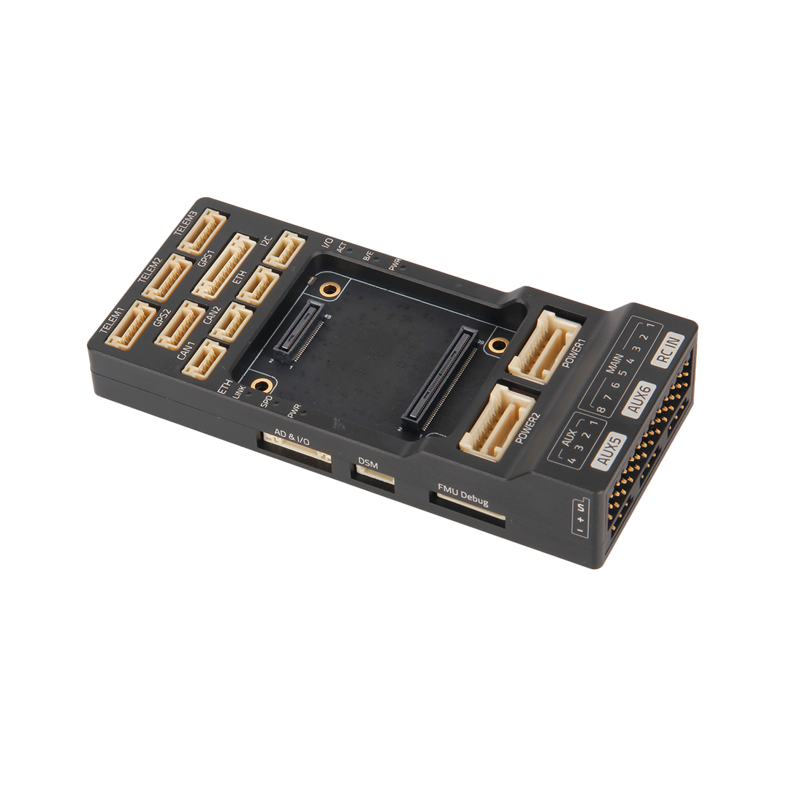
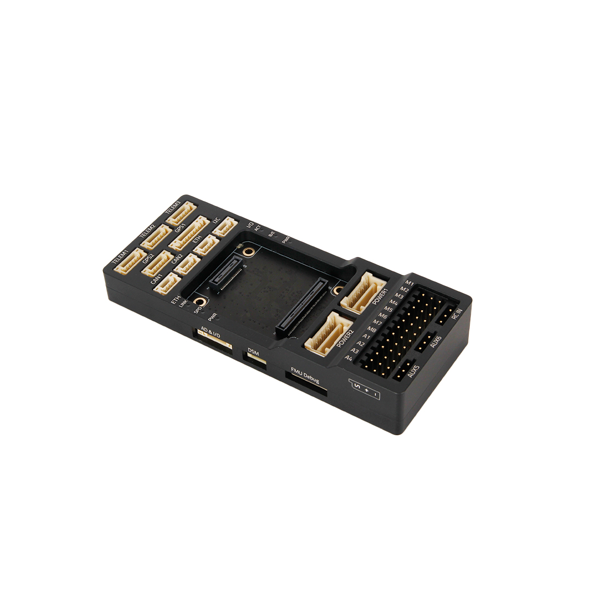
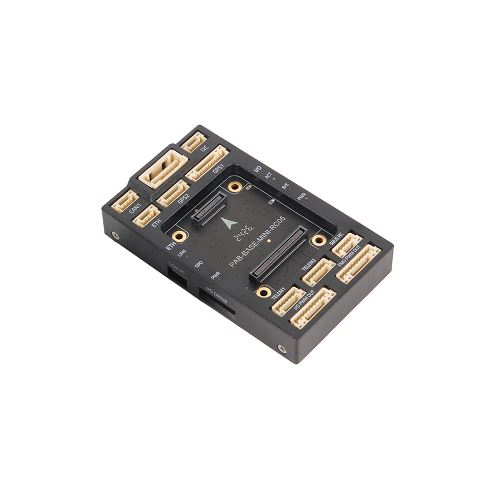
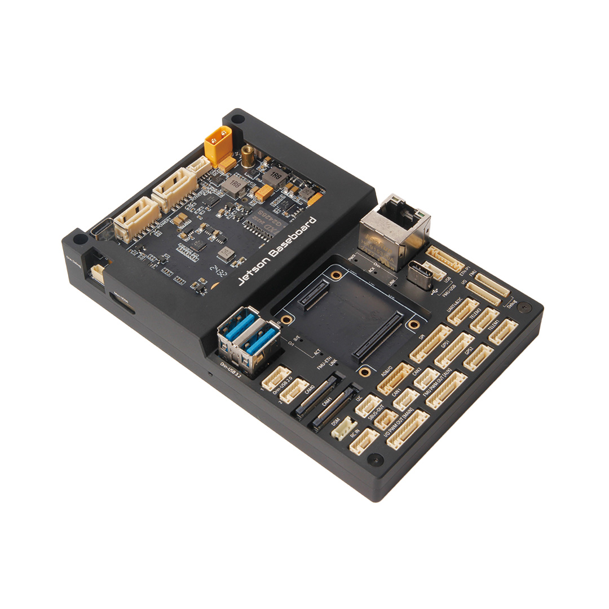
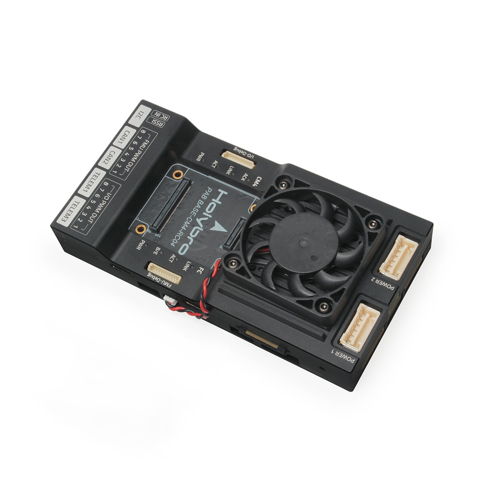

# Holybro Pixhawk 6X

:::warning
PX4不生产此（或任何）自动驾驶仪。
如需硬件支持或合规性问题，请联系[制造商](https://holybro.com/)。
:::

_Pixhawk 6X_<sup>&reg;</sup> 是Pixhawk®飞控系列的最新升级产品，由Holybro<sup>&reg;</sup>与PX4团队联合设计制造。

该产品基于 [Pixhawk​​® Autopilot FMUv6X Standard](https://github.com/pixhawk/Pixhawk-Standards/blob/master/DS-012%20Pixhawk%20Autopilot%20v6X%20Standard.pdf)、[Autopilot Bus Standard](https://github.com/pixhawk/Pixhawk-Standards/blob/master/DS-010%20Pixhawk%20Autopilot%20Bus%20Standard.pdf) 和 [Connector Standard](https://github.com/pixhawk/Pixhawk-Standards/blob/master/DS-009%20Pixhawk%20Connector%20Standard.pdf) 标准开发。

配备高性能H7处理器、模块化设计、三重冗余架构、温控IMU板和隔离传感器域，提供卓越的性能、可靠性和灵活性。

### Pixhawk 6X (Rev 8)


#### Pixhawk 6X (Rev 3/4, 已停产)

 

### Pixhawk 6X 底板选项

:::: tabs

::: tab 标准版v2A



:::

::: tab 标准版v2B


:::

::: tab 迷你版


:::

::: tab Jetson 底板


:::

::: tab CM4 底板


:::

::::

:::tip
此自动驾驶仪由PX4维护和测试团队[支持](../flight_controller/autopilot_pixhawk_standard.md)。
:::

## 介绍

在Pixhawk® 6X内部，您可以找到基于STMicroelectronics®的STM32H753，搭配来自Bosch®和InvenSense®的传感器技术，为您提供控制任何自主机体的灵活性和可靠性，适用于学术和商业应用。

Pixhawk® 6X的H7微控制器包含最高运行频率达480 MHz的Arm® Cortex®-M7内核，配备2MB闪存和1MB RAM。PX4 Autopilot充分利用了增强的算力和RAM。得益于更新的处理能力，开发者可以更高效地进行开发工作，从而支持更复杂的算法和模型。

FMUv6X开放式标准包含高性能、低噪声IMU，设计用于更好的稳定性能。三重冗余IMU和双重冗余气压计分别位于独立总线上。当PX4 Autopilot检测到传感器故障时，系统会无缝切换到其他传感器以保持飞行控制可靠性。

每个传感器组由独立的LDO供电，并具有独立电源控制。振动隔离系统可过滤高频振动并降低噪声，确保测量精度，使机体实现更优的飞行性能。

外部传感器总线（SPI5）包含两条芯片选择线和数据就绪信号，用于扩展SPI接口的附加传感器和载荷，并通过集成的Microchip以太网PHY，现在可通过以太网实现与任务计算机的高速通信。

Pixhawk® 6X非常适用于企业研发实验室、初创公司、学术机构（研究、教授、学生）以及商业应用的开发人员。

## 关键设计点

- 高性能 STM32H753 处理器
- 模块化飞控：分离的IMU、FMU和基板系统通过100针和50针Pixhawk®自动驾驶总线连接器连接
- 冗余设计：3个IMU传感器和2个气压计传感器分布在不同总线上
- 三重冗余域：完全隔离的传感器域，配备独立总线和独立电源控制
- 新设计的振动隔离系统可滤除高频振动并降低噪声，确保读数精度
- 以太网接口用于高速任务计算机集成
- IMU通过板载加热电阻进行温度控制，实现IMU最佳工作温度

### 处理器与传感器

- FMU处理器：STM32H753
  - 32位Arm® Cortex®-M7，480MHz，2MB闪存，1MB RAM
- IO处理器：STM32F100
  - 32位Arm® Cortex®-M3，24MHz，8KB SRAM
- 板载传感器（当前版本Rev 8）：
  - 加速度计/陀螺仪：3x ICM-45686（带BalancedGyro™技术）
  - 气压计：ICP20100 & BMP388
  - 磁力计：BMM150
- 板载传感器（Rev 3/4，已停产）：
  - 加速度计/陀螺仪：ICM-20649 或 BMI088
  - 加速度计/陀螺仪：ICM-42688-P
  - 加速度计/陀螺仪：ICM-42670-P
  - 磁力计：BMM150
  - 气压计：2x BMP388

### 电气参数

- 电压规格：
  - 最大输入电压：6V
  - USB电源输入：4.75~5.25V
  - 舵机电源输入：0~36V
- 电流规格：
  - `TELEM1`输出电流限制器：1.5A
  - 所有其他端口总输出电流限制器：1.5A

### 机械参数

- 尺寸
  - 飞控模块：38.8 x 31.8 x 14.6mm
  - 标准基板：52.4 x 103.4 x 16.7mm
  - 迷你基板：43.4 x 72.8 x 14.2 mm
- 重量
  - 飞控模块：23g
  - 标准基板：51g
  - 迷你基板：26.5g

### 接口

- 16路PWM舵机输出
- 遥控输入（支持Spektrum/DSM）
- 专用遥控输入（支持PPM和S.Bus）
- 专用模拟/PWM RSSI输入和S.Bus输出
- 4个通用串口
  - 3个带全流量控制
  - 1个带单独1.5A电流限制（Telem1）
  - 1个带I2C和额外GPIO线（用于外部NFC读卡器）
- 2个GPS端口
  - 1个完整GPS+安全开关端口
  - 1个基础GPS端口
- 1个I2C端口
- 1个以太网端口
  - 无变压器应用
  - 100Mbps
- 1个SPI总线
  - 2个片选线
  - 2个数据就绪线
  - 1个SPI同步线
  - 1个SPI复位线
- 2个CAN总线（用于CAN外设）
  - CAN总线支持独立静音控制或电调RX-MUX控制
- 2个SMBus电源输入端口
  - 1个AD&IO端口
  - 2个额外模拟输入
  - 1个PWM/捕获输入
  - 2个专用调试和GPIO线

- 其他特性：
  - 工作及存储温度：-40 ~ 85°C## 购买渠道

从 [Holybro](https://holybro.com/products/pixhawk-6x) 订购。

## 组装/设置

[Pixhawk 6X 接线快速入门](../assembly/quick_start_pixhawk6x.md) 提供了如何组装必要/重要外设（如 GPS、电源模块等）的指导。

## 连接

示例接线图  


## 引脚分配

- [Holybro Pixhawk 底板引脚分配](https://docs.holybro.com/autopilot/pixhawk-6x/pixhawk-baseboard-pinout)
- [Holybro Pixhawk Mini底板引脚分配](https://docs.holybro.com/autopilot/pixhawk-6x/pixhawk-mini-baseboard-pinout)
- [Holybro Pixhawk Jetson 底板](https://docs.holybro.com/autopilot/pixhawk-baseboards/pixhawk-jetson-baseboard)
- [Holybro Pixhawk RPi CM4 底板](https://docs.holybro.com/autopilot/pixhawk-baseboards/pixhawk-rpi-cm4-baseboard)

说明：

- [相机捕获引脚](../camera/fc_connected_camera.md#camera-capture-configuration) (`PI0`) 是 AD&IO 端口的第2针，标记为 `FMU_CAP1`。

## 串口映射

| UART   | 设备         | 端口             |
| ------ | ------------ | ---------------- |
| USART1 | /dev/ttyS0   | GPS              |
| USART2 | /dev/ttyS1   | TELEM3           |
| USART3 | /dev/ttyS2   | Debug Console    |
| UART4  | /dev/ttyS3   | UART4 & I2C      |
| UART5  | /dev/ttyS4   | TELEM2           |
| USART6 | /dev/ttyS5   | PX4IO/RC         |
| UART7  | /dev/ttyS6   | TELEM1           |
| UART8  | /dev/ttyS7   | GPS2             |## 尺寸

[Pixhawk 6X Dimensions](https://docs.holybro.com/autopilot/pixhawk-6x/dimensions)

## 电压规格

_Pixhawk 6X_ 若提供三个电源输入可实现三重冗余供电。三个电源通道分别为：**POWER1**、**POWER2** 和 **USB**。  
Pixhawk 6X 的 **POWER1** & **POWER2** 接口采用 6 路电路的 [2.00mm 间距 CLIK-Mate 线对板 PCB 插座](https://www.molex.com/molex/products/part-detail/pcb_receptacles/5024430670)。

### 正常操作最大电压规格

在此条件下，系统将按以下顺序使用所有电源输入：

1. **POWER1** 和 **POWER2** 输入（4.9V 到 5.5V）  
1. **USB** 输入（4.75V 到 5.25V）

### 绝对最大电压规格

在此条件下，系统将不会汲取任何电源（无法工作），但硬件仍可保持完好状态：

1. **POWER1** 和 **POWER2** 输入（工作范围 4.1V 到 5.7V，0V 到 10V 无损坏）  
1. **USB** 输入（工作范围 4.1V 到 5.7V，0V 到 6V 无损坏）  
1. 伺服输入：**FMU PWM OUT** 和 **I/O PWM OUT** 的 VDD_SERVO 引脚（0V 到 42V 无损坏）

### 电压监控

数字 I2C 电池监控默认启用（详见 [快速入门 > 电源](../assembly/quick_start_pixhawk6x.md#power)）。

::: info
通过 ADC 的模拟电池监控在此特定板上不支持，但可能在该飞控的不同底板版本中支持。
:::

## 构建固件

:::提示
大多数用户无需构建此固件！
当连接合适的硬件时，_QGroundControl_ 会自动预构建并安装该固件。
:::

要[构建 PX4](../dev_setup/building_px4.md)以适配此目标平台：

```
make px4_fmu-v6x_default
```

<a id="debug_port"></a>## 调试端口

[PX4 系统控制台](../debug/system_console.md)和[SWD 接口](../debug/swd_debug.md)运行在 **FMU 调试** 端口上。

引脚定义和连接器符合[Pixhawk Debug Full](../debug/swd_debug.md#pixhawk-debug-full)接口标准，该标准定义在[Pixhawk Connector Standard](https://github.com/pixhawk/Pixhawk-Standards/blob/master/DS-009%20Pixhawk%20Connector%20Standard.pdf)（JST SM10B 连接器）中。

| 引脚      | 信号           | 电压  |
| -------- | ---------------- | ----- |
| 1 (红色)  | `Vtref`          | +3.3V |
| 2 (黑色)  | 控制台 TX (OUT) | +3.3V |
| 3 (黑色)  | 控制台 RX (IN)  | +3.3V |
| 4 (黑色)  | `SWDIO`          | +3.3V |
| 5 (黑色)  | `SWCLK`          | +3.3V |
| 6 (黑色)  | `SWO`            | +3.3V |
| 7 (黑色)  | NFC GPIO         | +3.3V |
| 8 (黑色)  | PH11             | +3.3V |
| 9 (黑色)  | nRST             | +3.3V |
| 10 (黑色) | `GND`            | GND   |

关于使用该端口的更多信息请参见：

- [SWD 调试端口](../debug/swd_debug.md)
- [PX4 系统控制台](../debug/system_console.md)（注意，FMU 控制台映射到 USART3）## 外设

- [遥测无线电模块](https://holybro.com/collections/telemetry-radios?orderby=date)
- [测距仪/距离传感器](../sensor/rangefinders.md)
- [Holybro 传感器](https://holybro.com/collections/sensors)
- [Holybro GPS & RTK 系统](https://holybro.com/collections/gps-rtk-systems)
- [电源模块 & 电源分配板](https://holybro.com/collections/power-modules-pdbs)

## 支持的平台 / 机型

任何可以通过普通RC舵机或Futaba S-Bus舵机控制的多旋翼机/固定翼飞机/探测车或船只。所有支持的配置可在[Airframes Reference](../airframes/airframe_reference.md)中查看。

## 更多信息

- [Holybro 文档](https://docs.holybro.com/) (Holybro)
- [Pixhawk 6X 接线快速入门](../assembly/quick_start_pixhawk6x.md)
- [Pixhawk 飞控 FMUv6X 标准](https://github.com/pixhawk/Pixhawk-Standards/blob/master/DS-012%20Pixhawk%20Autopilot%20v6X%20Standard.pdf)
- [Pixhawk 飞控总线标准](https://github.com/pixhawk/Pixhawk-Standards/blob/master/DS-010%20Pixhawk%20Autopilot%20Bus%20Standard.pdf)
- [Pixhawk 接口标准](https://github.com/pixhawk/Pixhawk-Standards/blob/master/DS-009%20Pixhawk%20Connector%20Standard.pdf)