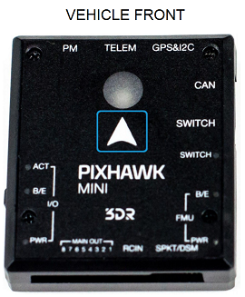
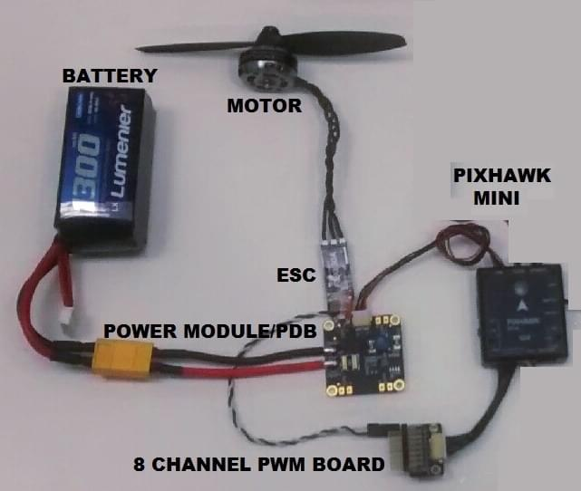
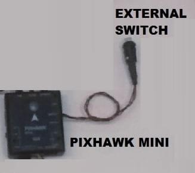

# Holybro Pixhawk Mini（已停产）

:::warning
PX4 不生产此（或任何）自动驾驶仪。
有关硬件支持或合规性问题，请联系[制造商](https://holybro.com/)。
:::

Holybro *Pixhawk<sup>&reg;</sup> Mini* 自动驾驶仪是 Pixhawk 的新一代产品。  
其体积约为原始 Pixhawk 的 1/3，并配备更强大的处理器和传感器。

Pixhawk Mini 基于 PX4 开源硬件项目，并针对 PX4 飞行堆栈进行了优化。


接线信息请参见[如下](#wiring)。

::: info
此飞行控制器由 3DR 与 HobbyKing<sup>&reg;</sup> 联合设计。  
其曾名为 3DR Pixhawk Mini。
:::

:::tip
该自动驾驶仪受到 PX4 维护和测试团队的[支持](../flight_controller/autopilot_pixhawk_standard.md)。
:::

## 规格参数

**处理器：**

- **主处理器：** STM32F427 Rev 3
- **I/O处理器：** STM32F103

**传感器：**

- **加速度计/陀螺仪/磁力计：** MPU9250  
  - [已弃用](https://github.com/PX4/PX4-Autopilot/pull/7618)（由PX4固件弃用）
- **加速度计/陀螺仪：** ICM20608
- **气压计：** MS5611

**电压参数：**

- **电源模块输出：** 4.1~5.5V
- **最大输入电压：** 45V (10S LiPo)
- **最大电流检测：** 90A
- **USB供电输入：** 4.1~5.5V
- **舵机电源输入：** 0~10V

**接口：**

- 1 x UART串口（用于GPS）
- Spektrum DSM/DSM2/DSM-X® 卫星兼容遥控输入
- Futaba S BUS® 兼容遥控输入
- PPM总线信号遥控输入
- I2C（用于数字传感器）
- CAN（用于数字电机控制，需兼容控制器）
- ADC（用于模拟传感器）
- Micro USB接口

**重量和尺寸：**

- **尺寸：** 38x43x12mm
- **重量：** 15.8g

**GPS模块（套装包含）：**

- **GNSS接收器：** u-blox® Neo-M8N；磁罗盘 HMC5983
- **重量：** 22.4g
- **尺寸：** 37x37x12mm## 购买途径

已停产。

## 连接器分配

`<To be added>`## 功能特性

Pixhawk Mini 的主要功能包括：

- 采用先进的 32 位 ARM Cortex® M4 处理器，运行 NuttX RTOS
- 8 个 PWM/舵机输出接口
- 多种外设连接选项（UART、I2C、CAN）
- 冗余电源输入及自动故障切换
- 集成安全开关和可选外部安全按钮，便于电机激活
- 多色 LED 指示灯
- 集成多音调压电音频指示器
- microSD 卡实现长时间高速率数据记录
- 易用的 Micro JST 接口

Pixhawk Mini 配备新型 **GPS模块**：

- 基于 u-blox M8N
- 最多可同时接收 3 种 GNSS 信号（GPS、Galileo、GLONASS、BeiDou）
- 行业领先的 -167 dBm 导航灵敏度
- 安全性和完整性保护
- 支持所有卫星增强系统
- 抗干扰和欺骗检测功能
- 多种产品版本满足不同性能和成本需求## 套件内容

_Pixhawk Mini_ 套件包含以下内容：

| 组件名称                                                                 | 图片                                                                                                                                |
| ------------------------------------------------------------------------ | ------------------------------------------------------------------------------------------------------------------------------------ |
| Pixhawk Mini 飞控                                                         |                                                 |
| GPS模块                                                                  |                                   |
| 四路电源分配板                                                           |  |
| 8通道PWM扩展板                                                           |    |
| 4针电缆（用于I2C）                                                       |                            |
| 用于PPM/SBUS的遥控接收线缆                                               |                         |
| 6转6/4针Y型适配器（用于GPS和额外I2C设备）                                |                |
| 6针电缆（2条）（用于电源分配板和指南针/GPS）                              |                                      |
| 6针JST转DF13接口（用于旧版数传电台）                                     |                     |
| 安全开关                                                                 |                                  |
| 8通道PWM扩展电缆                                                         |     |
| 安装泡沫                                                                 |                                                 |
| I2C扩展板? - 未列出的部件                                                |  -                                                                                                                                   |## 可选配件

- 遥测无线电套装：915 MHz（美国），433 MHz（欧洲）
  ::: info
  安装3DR遥测无线电时，请使用Pixhawk Mini附带的连接器，而不是无线电自带的连接器。
  :::

- 3DR 10S电源模块
- WiFi遥测无线电
- Digital Airspeed Sensor## 兼容性

### 无线遥控器

- PPM输出遥控接收机
- Spektrum DSM 遥控接收机
- Futaba S BUS 遥控接收机

### 电调

- 所有标准PWM输入电调## 连接器引脚分配（pin outs）


## 产品对比

### Pixhawk Mini 对比 Pixhawk（原版）

- 体积缩小三分之一 - 从 50x81.5x15.5mm 减至 38x43x12mm。  
- Rev 3 处理器可完全利用 2MB 闪存。  
- 改进的传感器，主/次IMU分别为 MPU9250 和 ICM20608。  
  飞行和导航更加稳定可靠。  
- 内置 GPS+指南针模块。采用支持 GLONASS 的 Neo M8N，指南针为 HMC5983。  
  预计 GPS 定位更快且更稳定。  
- 使用 Micro JST 连接器替代 DF-13。  
  操作更便捷。  
- 集成压电扬声器和安全开关。  
- 原生支持 4S 电池，并配有内置 PDB。  

### Pixhawk Mini 对比 Pixfalcon

- 改进的传感器，主/次IMU分别为 MPU9250 和 ICM20608。  
  预计抗振动性能和可靠性更佳。  
- 支持 UAVCAN 的 CAN 接口。  
- 配备 8 通道舵机接口板，适用于飞机及其他需要动力 PWM 输出的机体。  
- 配备 I2C 扩展板，共提供 5 个 I2C 接口。  
- 体积相近。  

Pixhawk Mini 采用来自 ST Microelectronics® 的先进处理器和传感器技术，并搭载 NuttX 实时操作系统，为控制任何自主机体提供卓越的性能、灵活性和可靠性。

## 已知问题

- 部分Pixhawk Mini存在[硬件缺陷](https://github.com/PX4/PX4-Autopilot/issues/7327#issuecomment-317132917)，导致内部MPU9250惯性测量单元不可靠。
  - 此问题仅存在于早期硬件版本中，因为[制造商已通过某些方式修复了该问题](https://github.com/PX4/PX4-Autopilot/issues/7327#issuecomment-372393609)。
  - 要检查特定电路板是否受影响，需将电路板断开一段时间后上电，然后尝试从PX4命令行启动mpu9250驱动。如果受影响，驱动将无法启动。
  - MPU9250在PX4固件中[默认禁用](https://github.com/PX4/PX4-Autopilot/pull/7618)。
  - 受影响的Pixhawk Mini在没有外部磁力计或连接GPS的情况下（即使在室内）也无法完成校准。
  - 当使用外部GPS时，[这不是问题](https://github.com/PX4/PX4-Autopilot/pull/7618#issuecomment-320270082)，因为次级ICM20608提供加速度计和陀螺仪，而外部GPS提供磁力计。

<a id="wiring"></a>## 接线快速入门

:::warning
_Pixhawk Mini_ 已不再由3DR生产或提供。
:::

本快速入门指南展示了如何为[Pixhawk Mini](../flight_controller/pixhawk_mini.md)供电并连接其最重要的外设。

### 标准接线图

下图展示了使用_Pixhawk Mini Kit_和3DR遥测无线电的四旋翼标准接线（还包括电调、电机、电池和运行在手机上的地面控制站）。
我们将在后续章节中逐一讲解每个主要部件。


::: info
对于其他类型的机体，输出接线/供电方式略有不同。VTOL、固定翼和多旋翼的详细信息将在下文覆盖。
:::

### 安装并调整控制器方向

应使用防震泡沫垫（包含在套件中）将_Pixhawk Mini_安装在机架上。应尽可能靠近机体的重心位置安装，顶面向上，箭头指向机体前方。




::: info
如果控制器无法安装在推荐/默认方向（例如由于空间限制），需要配置自动驾驶仪软件以匹配实际使用的方向：[飞行控制器方向](../config/flight_controller_orientation.md)
:::

### GPS + 指南针

使用提供的6针电缆将3DR GPS + 指南针连接到Pixhawk Mini的**GPS&I2C**端口（右上角）。
GPS/指南针应尽可能远离其他电子设备安装，并面向机体前方（将指南针与其他电子设备分离可减少干扰）。


NOTE - 插入显示两个端口的图片？或GPS&I2C的正面图？

首次使用前必须校准指南针：[指南针校准](../config/compass.md)

### 电源

下图展示了四旋翼中使用_Pixhawk Mini_时的典型供电接线。
使用套件中提供的_四旋翼电源分配板_从电池为Pixhawk Mini和电调/电机供电（也可为其他配件供电）。

::: info
_四旋翼电源分配板_包含的电源模块（PM）适用于<=4S电池。
如果需要更高功率，建议使用_3DR 10S电源模块_（已停产）。
:::



_Pixhawk Mini_通过**PM**端口供电。
当使用电源模块（如本例）时，该端口还会读取模拟电压和电流测量值。

最多可通过电源分配板为4个电调单独供电（尽管在此示例中仅连接了一个）。

控制信号来自MAIN OUT。在此示例中只有一个控制通道，通过_8通道PWM接线板_连接到电调。

Pixhawk Mini输出线路（MAIN OUT）无法为连接的设备供电（在所示电路中也无需供电）。
对于需要从MAIN OUT供电的设备（如固定翼中使用的舵机），需要使用BEC（电池消除电路）为线路供电。
附带的接线板允许一个通道为其他输出供电。

### 遥控

Pixhawk Mini支持多种不同的遥控接收器型号：

- Spektrum和DSM接收器连接到**SPKT/DSM**输入。

  

- PPM-SUM和S.BUS接收器连接到**RCIN**端口。

  

- 具有_每个通道独立线_的PPM和PWM接收器必须通过_PPM编码器_连接到**RCIN**端口 [例如这个](http://www.getfpv.com/radios/radio-accessories/holybro-ppm-encoder-module.html)（PPM-Sum接收器使用单个信号线传输所有通道）。

关于选择遥控系统、接收器兼容性以及绑定遥控器/接收器对的更多信息，请参见：[遥控器与接收器](../getting_started/rc_transmitter_receiver.md)。

### 安全开关（可选）

控制器集成了一个安全开关，可在自动驾驶仪准备起飞后用于激活电机。
如果某个机体上该开关难以触及，可以连接（可选的）外部安全按钮，如下所示。



### 遥测无线电

### 电机

所有支持的空中和地面框架中MAIN/AUX输出端口与电机/舵机的映射关系列在[框架参考](../airframes/airframe_reference.md)中。

:::warning
不同框架的映射并不一致（例如，你不能依赖所有固定翼框架的油门在同一个输出上）。
请确保为你的机体使用正确的映射。
:::

:::tip
如果参考中未列出你的框架类型，请使用相同类型的标准"通用"框架。
::: infos:

- 如上文[电源](#power)部分所述，输出线路需要单独供电。
- Pixhawk Mini不能用于QuadPlane VTOL框架。这是因为QuadPlane需要9个输出（4个Main, 5个AUX），而Pixhawk Mini只有8个输出（8个Main）。


### 其他外设

其他组件的接线和配置包含在[外设](../peripherals/index.md)的单独主题中。

### 配置

通用配置信息包含在：[自动驾驶仪配置](../config/index.md)。

QuadPlane特定配置包含在：[QuadPlane VTOL配置](../config_vtol/vtol_quad_configuration.md)

## 构建固件

:::tip
大多数用户无需构建此固件！
当连接合适的硬件时，_QGroundControl_ 会预构建并自动安装。
:::

要[构建PX4](../dev_setup/building_px4.md)用于该目标平台：

```
make px4_fmu-v3_default
```

## 调试端口

此开发板没有调试端口（即，没有用于访问[系统控制台](../debug/system_console.md)或[SWD接口](../debug/swd_debug.md)的端口）。

开发者需要将导线焊接到板载测试垫以进行SWD调试，并焊接到STM32F4（IC）的TX和RX引脚以获取控制台。