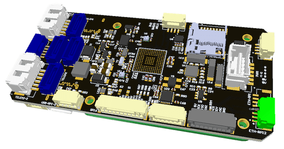

# RaccoonLab FMUv6X 自动驾驶仪

:::warning
PX4 不生产此（或任何）自动驾驶仪。
有关硬件支持或合规性问题，请联系[制造商](https://raccoonlab.co)。
:::

[RaccoonLab FMUv6X](https://docs.raccoonlab.co/guide/autopilot/RCLv6X.html)飞控基于以下Pixhawk®标准：[Pixhawk Autopilot FMUv6X Standard](https://github.com/pixhawk/Pixhawk-Standards/blob/master/DS-012%20Pixhawk%20Autopilot%20v6X%20Standard.pdf)，[Autopilot Bus Standard](https://github.com/pixhawk/Pixhawk-Standards/blob/master/DS-010%20Pixhawk%20Autopilot%20Bus%20Standard.pdf)和[Connector Standard](https://github.com/pixhawk/Pixhawk-Standards/blob/master/DS-009%20Pixhawk%20Connector%20Standard.pdf)。

配备高性能H7处理器、模块化设计、三重冗余、温度控制IMU板和隔离传感器域，提供卓越的性能、可靠性和灵活性。RaccoonLab专注于基于DroneCAN和Cyphal的机载控制系统总线。我们的自动驾驶仪是DroneCAN和Cyphal生态系统的一部分，使其成为下一代智能车辆的理想选择。



RaccoonLab为Raspberry Pi和NVIDIA Jetson Xavier NX提供多功能HAT，增强连接性和功能。[Jetson Xavier NX HAT](https://docs.raccoonlab.co/guide/nx_hat/)设计用于将CAN总线与Jetson Xavier NX集成，实现Cyphal和DroneCAN协议的访问。[Raspberry Pi CM4 HAT](https://docs.raccoonlab.co/guide/rpi_hat/)提供强大功能，包括CAN总线连接、LTE调制解调器、内部电压测量、其他MCU的SWD调试以及通过MAVLINK与PX4的UART通信。这些HAT扩展了设备功能，使其非常适合高级机器人和UAV应用。

:::tip
此自动驾驶仪受PX4维护和测试团队[支持](../flight_controller/autopilot_pixhawk_standard.md)。
:::

## 关键设计特点

- 高性能STM32H753处理器
- 模块化飞控：通过100针和50针Pixhawk自动驾驶仪总线连接器分离的IMU、FMU和基板系统
- 冗余：3个IMU传感器和2个气压计传感器在不同总线上
- 三重冗余域：完全隔离的传感器域，具有独立总线和独立电源控制
- 新型振动隔离系统，可过滤高频振动并减少噪声以确保读数准确
- 以太网接口，用于高速任务计算机集成

## 处理器与传感器

- FMU处理器：STM32H753
  - 32位Arm Cortex-M7，480MHz，2MB闪存，1MB RAM
- IO处理器：STM32F100
  - 32位Arm Cortex-M3，24MHz，8KB SRAM
- 板载传感器
  - 加速计/陀螺仪：ICM-20649或BMI088
  - 加速计/陀螺仪：ICM-42688-P
  - 加速计/陀螺仪：ICM-42670-P
  - 磁力计：BMM150
  - 气压计：2个BMP388

## 电气数据

- 电压规格：
  - 最大输入电压：36V
  - USB电源输入：4.75\~5.25V
  - 舵机电源输入：0\~36V
- 电流规格：
  - `TELEM1`输出电流限制器：1.5A
  - 所有其他端口总输出电流限制器：1.5A

## 机械数据

- 尺寸
  - 飞控模块：38.8 x 31.8 x 14.6mm
  - 标准基板：52.4 x 103.4 x 16.7mm
  - 迷你基板：43.4 x 73.4 x 14.6mm
- 重量
  - 飞控模块：12g
  - 标准基板：32g
  - 迷你基板：22g

## 接口

- UART映射表（具体端口配置需参考官方文档）
- CAN总线：2个CAN2.0B接口
- I2C：2个接口
- SPI：2个接口
- USB：1个Type-C接口

## 电源管理

- 支持外部供电（5V/12V）
- 内置电压调节器（3.3V/5V）
- 电池电压监测精度：±1%

## 建立固件

:::tip
大多数用户无需构建此固件！
当连接适当硬件时，_QGroundControl_ 会自动安装预构建的固件。
:::

要[构建PX4](../dev_setup/building_px4.md)为此目标：

```sh
make px4_fmu-v6x_default
```

## 支持的平台/机体

任何可通过普通RC舵机或Futaba S-Bus舵机控制的多旋翼/固定翼/车/船。
完整支持配置可在[机体参考](../airframes/airframe_reference.md)中查看。

## 进一步信息

- [Pixhawk Autopilot FMUv6X Standard](https://github.com/pixhawk/Pixhawk-Standards/blob/master/DS-012%20Pixhawk%20Autopilot%20v6X%20Standard.pdf)
- [Pixhawk Autopilot Bus Standard](https://github.com/pixhawk/Pixhawk-Standards/blob/master/DS-010%20Pixhawk%20Autopilot%20Bus%20Standard.pdf)
- [Pixhawk Connector Standard](https://github.com/pixhawk/Pixhawk-Standards/blob/master/DS-009%20Pixhawk%20Connector%20Standard.pdf)
- [RaccoonLab docs](http://docs.raccoonlab.co)