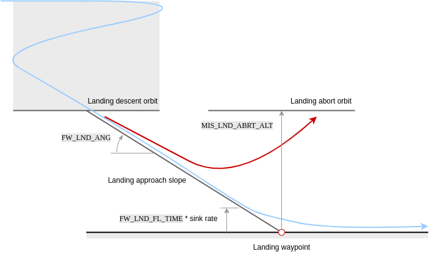

# 任务模式（固定翼）

_任务模式_ 会使得机体执行预设的自主[任务](../flying/missions.md)（飞行计划），该计划已上传至飞控系统。
任务通常通过地面控制站（GCS）应用程序如 [QGroundControl](https://docs.qgroundcontrol.com/master/en/) (QGC) 创建并上传。

::: info

- 此模式需要全局三维位置估计（来自GPS或通过[本地位置](../ros/external_position_estimation.md#enabling-auto-modes-with-a-local-position)推断）。
- 必须先解除机体的武装状态才能启用此模式。
- 此模式为自动模式 - 控制机体不需要用户干预。
- 任何机体都可以通过遥控器控制切换飞行模式。

:::

## 描述

任务通常在地面控制站（例如[QGroundControl](https://docs.qgroundcontrol.com/master/en/qgc-user-guide/plan_view/plan_view.html)）中创建并上传，通常在起飞前完成。  
任务也可通过开发者API创建，或在飞行中上传。  

[任务命令](#mission-commands)的处理方式会根据固定翼飞行特性进行调整（例如盘旋操作会被实现为绕圈飞行）。  

::: info  
任务需上传至SD卡，且在启动自动驾驶仪**之前**需要插入SD卡。  
:::  

当进入MISSION模式时，所有机体类型的行为逻辑如下：  

1. 如果未存储任务、PX4已执行完所有任务命令、或[任务不可行](#mission-feasibility-checks)：  
   - 飞行中会盘旋。  
   - 着陆后会"等待"。  

1. 如果已存储任务且PX4正在飞行：  
   - 会从当前步骤开始执行[任务/飞行计划](../flying/missions.md)。  
   - 起飞任务项会被视为普通航点。  

1. 如果已存储任务且机体着陆：  
   - 仅当当前航点是`Takeoff`时才会起飞。  
   - 如果配置为弹射起飞，机体必须通过弹射器发射（见[FW Takeoff/Landing in Mission](#mission-takeoff)）。  

1. 如果未存储任务、或PX4已执行完所有任务命令：  
   - 飞行中会盘旋。  
   - 着陆后会"等待"。  

1. 可通过在_QGroundControl_中选择任务命令手动更改当前任务步骤。  

   ::: info  
   如果任务中包含_Jump to item_命令，切换至其他任务项**不会**重置循环计数器。  
   其中一个影响是：如果将当前任务命令更改为1，任务**不会**完全重新开始。  
   :::  

1. 任务仅在机体解除武装或上传新任务时重置。  

   :::tip  
   为在机体着陆后自动解除武装，在_QGroundControl_中进入[Vehicle Setup > Safety](https://docs.qgroundcontrol.com/master/en/qgc-user-guide/setup_view/safety.html)，导航至_Land Mode Settings_并勾选_Disarm after_选项。  
   输入着陆后解除武装前的等待时间。  
   :::  

任务可通过切换出任务模式（如[悬停模式](../flight_modes_fw/hold.md)或[位置模式](../flight_modes_fw/position.md)）暂停，再切换回任务模式恢复。  
如果暂停时尚未拍摄图像，恢复后会从当前位置飞向原目标航点。  
如果暂停时正在进行图像拍摄（包含相机触发项），恢复后会从当前位置飞向最后通过的航点，然后以相同速度和相机触发行为重新执行路径。  
这确保了在测绘/相机任务中完整记录规划路径。  
机体暂停时可上传新任务，此时当前活动任务项会重置为1。  

::: info  
当任务暂停且机体相机正在触发时，PX4会将当前活动任务项设置为上一个航点，以便任务重启时重新执行最后的任务航段。  
此外，PX4会存储已执行任务项中的速度设置和相机触发信息，并在任务恢复时重新应用这些设置。  
:::  

:::warning  
切换至任何遥控模式前请确保油门杆不为零（否则机体将坠毁）。  
建议切换模式前将控制杆置于中立位置。  
:::  

关于任务规划的更多信息，请参见：  
- [任务规划](../flying/missions.md)  
- [Plan View](https://docs.qgroundcontrol.com/master/en/qgc-user-guide/plan_view/plan_view.html) (_QGroundControl_ 用户指南)

## 任务可行性检查

PX4 在任务上传时及执行前会运行基本检查以确定任务是否可行。  
如果任何检查失败，用户将收到通知且无法启动任务（机体将切换到 [Hold mode](../flight_modes_mc/hold.md) 而非 Mission 模式）。

以下列出最重要的部分检查项：

- 任何任务项与任务计划或安全地理围栏冲突  
- 定义了多个着陆开始任务项 ([MAV_CMD_DO_LAND_START](https://mavlink.io/en/messages/common.html#MAV_CMD_DO_LAND_START))  
- 固定翼着陆的坡度角不可行 ([FW_LND_ANG](#FW_LND_ANG))  
- 着陆开始项 (`MAV_CMD_DO_LAND_START`) 出现在RTL任务项 ([MAV_CMD_NAV_RETURN_TO_LAUNCH](https://mavlink.io/en/messages/common.html#MAV_CMD_NAV_RETURN_TO_LAUNCH)) 之前  
- 当配置为必选项时缺少起飞/着陆项 ([MIS_TKO_LAND_REQ](#MIS_TKO_LAND_REQ))  

此外还会检查首个航点是否距离Home点过远 ([MIS_DIST_1WP](#MIS_DIST_1WP))。  
若检查失败会通知用户，但这不影响任务计划的有效性（即使距离过大仍可启动任务）。

## QGroundControl 支持

_QGroundControl_ 提供了额外的地面控制站（GCS）级别任务处理支持（除了飞控提供的功能之外）。

更多信息请参见：

- [机体着陆后移除任务](https://docs.qgroundcontrol.com/master/en/qgc-user-guide/releases/stable_v3.2_long.html#remove-mission-after-vehicle-lands)
- [Return模式后恢复任务](https://docs.qgroundcontrol.com/master/en/qgc-user-guide/releases/stable_v3.2_long.html#resume-mission)

## 任务参数

任务行为受多个参数影响，大部分参数已记录在[参数参考 > 任务](../advanced_config/parameter_reference.md#mission)中。  
以下仅列出极小部分参数。

通用参数：

| 参数                                                                                          | 描述                                                                                                                     |
| -------------------------------------------------------------------------------------------------- | ------------------------------------------------------------------------------------------------------------------------------- |
| [NAV_RCL_ACT](../advanced_config/parameter_reference.md#NAV_RCL_ACT)       | 遥控丢失故障安全模式（机体在失去遥控连接时的应对方式）- 例如进入悬停模式、返航模式、终止等。 |
| [NAV_LOITER_RAD](../advanced_config/parameter_reference.md#NAV_RCL_ACT) | 固定翼盘旋半径。                                                                                                       |

与[任务可行性检查](#mission-feasibility-checks)相关的参数：

| 参数                                                                                                   | 描述                                                                                                                                                        |
| ----------------------------------------------------------------------------------------------------------- | ------------------------------------------------------------------------------------------------------------------------------------------------------------------ |
| [MIS_DIST_1WP](../advanced_config/parameter_reference.md#MIS_DIST_1WP)             | 当首个航点与Home点距离超过此值时会触发警告消息。若值为0或更小则禁用此功能。                                  |
| [FW_LND_ANG](../advanced_config/parameter_reference.md#FW_LND_ANG)                   | 最大降落坡度角。                                                                                                                                       |
| [MIS_TKO_LAND_REQ](../advanced_config/parameter_reference.md#MIS_TKO_LAND_REQ) | 设置任务是否_需要_包含起飞和/或降落项。固定翼和垂直起降飞行器默认值均为2，表示任务必须包含降落。 |## 任务命令

PX4 在任务模式下支持以下 MAVLink 任务命令（部分命令有特殊说明，详见列表后说明）。  
除非特别注明，其余实现方式均遵循 MAVLink 规范定义。

任务项：

- [MAV_CMD_NAV_WAYPOINT](https://mavlink.io/en/messages/common.html#MAV_CMD_NAV_WAYPOINT)  
  - _Param3_（flythrough）被忽略。当 _param 1_（time_inside）> 0 时，flythrough 始终启用。
- [MAV_CMD_NAV_LOITER_UNLIM](https://mavlink.io/en/messages/common.html#MAV_CMD_NAV_LOITER_UNLIM)
- [MAV_CMD_NAV_LOITER_TIME](https://mavlink.io/en/messages/common.html#MAV_CMD_NAV_LOITER_TIME)
- [MAV_CMD_NAV_LAND](https://mavlink.io/en/messages/common.html#MAV_CMD_NAV_LAND)
- [MAV_CMD_NAV_TAKEOFF](https://mavlink.io/en/messages/common.html#MAV_CMD_NAV_TAKEOFF)
- [MAV_CMD_NAV_LOITER_TO_ALT](https://mavlink.io/en/messages/common.html#MAV_CMD_NAV_LOITER_TO_ALT)
- [MAV_CMD_DO_JUMP](https://mavlink.io/en/messages/common.html#MAV_CMD_DO_JUMP)
- [MAV_CMD_NAV_ROI](https://mavlink.io/en/messages/common.html#MAV_CMD_NAV_ROI)
- [MAV_CMD_DO_SET_ROI](https://mavlink.io/en/messages/common.html#MAV_CMD_DO_SET_ROI)
- [MAV_CMD_DO_SET_ROI_LOCATION](https://mavlink.io/en/messages/common.html#MAV_CMD_DO_SET_ROI_LOCATION)
- [MAV_CMD_DO_SET_ROI_WPNEXT_OFFSET](https://mavlink.io/en/messages/common.html#MAV_CMD_DO_SET_ROI_WPNEXT_OFFSET)
- [MAV_CMD_DO_SET_ROI_NONE](https://mavlink.io/en/messages/common.html#MAV_CMD_DO_SET_ROI_NONE)
- [MAV_CMD_DO_CHANGE_SPEED](https://mavlink.io/en/messages/common.html#MAV_CMD_DO_CHANGE_SPEED)
- [MAV_CMD_DO_SET_HOME](https://mavlink.io/en/messages/common.html#MAV_CMD_DO_SET_HOME)
- [MAV_CMD_DO_SET_SERVO](https://mavlink.io/en/messages/common.html#MAV_CMD_DO_SET_SERVO)
- [MAV_CMD_DO_LAND_START](https://mavlink.io/en/messages/common.html#MAV_CMD_DO_LAND_START)
- [MAV_CMD_DO_TRIGGER_CONTROL](https://mavlink.io/en/messages/common.html#MAV_CMD_DO_TRIGGER_CONTROL)
- [MAV_CMD_DO_DIGICAM_CONTROL](https://mavlink.io/en/messages/common.html#MAV_CMD_DO_DIGICAM_CONTROL)
- [MAV_CMD_DO_MOUNT_CONFIGURE](https://mavlink.io/en/messages/common.html#MAV_CMD_DO_MOUNT_CONFIGURE)
- [MAV_CMD_DO_MOUNT_CONTROL](https://mavlink.io/en/messages/common.html#MAV_CMD_DO_MOUNT_CONTROL)
- [MAV_CMD_IMAGE_START_CAPTURE](https://mavlink.io/en/messages/common.html#MAV_CMD_IMAGE_START_CAPTURE)
- [MAV_CMD_IMAGE_STOP_CAPTURE](https://mavlink.io/en/messages/common.html#MAV_CMD_IMAGE_STOP_CAPTURE)
- [MAV_CMD_VIDEO_START_CAPTURE](https://mavlink.io/en/messages/common.html#MAV_CMD_VIDEO_START_CAPTURE)
- [MAV_CMD_VIDEO_STOP_CAPTURE](https://mavlink.io/en/messages/common.html#MAV_CMD_VIDEO_STOP_CAPTURE)
- [MAV_CMD_DO_SET_CAM_TRIGG_DIST](https://mavlink.io/en/messages/common.html#MAV_CMD_DO_SET_CAM_TRIGG_DIST)
- [MAV_CMD_DO_SET_CAM_TRIGG_INTERVAL](https://mavlink.io/en/messages/common.html#MAV_CMD_DO_SET_CAM_TRIGG_INTERVAL)
- [MAV_CMD_SET_CAMERA_MODE](https://mavlink.io/en/messages/common.html#MAV_CMD_SET_CAMERA_MODE)
- [MAV_CMD_NAV_DELAY](https://mavlink.io/en/messages/common.html#MAV_CMD_NAV_DELAY)
- [MAV_CMD_NAV_RETURN_TO_LAUNCH](https://mavlink.io/en/messages/common.html#MAV_CMD_NAV_RETURN_TO_LAUNCH)
- [MAV_CMD_DO_CONTROL_VIDEO](https://mavlink.io/en/messages/common.html#MAV_CMD_DO_CONTROL_VIDEO)
- [MAV_CMD_DO_GIMBAL_MANAGER_PITCHYAW](https://mavlink.io/en/messages/common.html#MAV_CMD_DO_GIMBAL_MANAGER_PITCHYAW)
- [MAV_CMD_DO_GIMBAL_MANAGER_CONFIGURE](https://mavlink.io/en/messages/common.html#MAV_CMD_DO_GIMBAL_MANAGER_CONFIGURE)
- [MAV_CMD_OBLIQUE_SURVEY](https://mavlink.io/en/messages/common.html#MAV_CMD_OBLIQUE_SURVEY)
- [MAV_CMD_DO_SET_CAMERA_ZOOM](https://mavlink.io/en/messages/common.html#MAV_CMD_DO_SET_CAMERA_ZOOM)
- [MAV_CMD_DO_SET_CAMERA_FOCUS](https://mavlink.io/en/messages/common.html#MAV_CMD_DO_SET_CAMERA_FOCUS)

地理围栏定义

- [MAV_CMD_NAV_FENCE_RETURN_POINT](https://mavlink.io/en/messages/common.html#MAV_CMD_NAV_FENCE_RETURN_POINT)
- [MAV_CMD_NAV_FENCE_POLYGON_VERTEX_INCLUSION](https://mavlink.io/en/messages/common.html#MAV_CMD_NAV_FENCE_POLYGON_VERTEX_INCLUSION)
- [MAV_CMD_NAV_FENCE_POLYGON_VERTEX_EXCLUSION](https://mavlink.io/en/messages/common.html#MAV_CMD_NAV_FENCE_POLYGON_VERTEX_EXCLUSION)
- [MAV_CMD_NAV_FENCE_CIRCLE_INCLUSION](https://mavlink.io/en/messages/common.html#MAV_CMD_NAV_FENCE_CIRCLE_INCLUSION)
- [MAV_CMD_NAV_FENCE_CIRCLE_EXCLUSION](https://mavlink.io/en/messages/common.html#MAV_CMD_NAV_FENCE_CIRCLE_EXCLUSION)

集结点

- [MAV_CMD_NAV_RALLY_POINT](https://mavlink.io/en/messages/common.html#MAV_CMD_NAV_RALLY_POINT)

::: info
如发现遗漏或错误的消息，请提交 issue 或 PR。

- PX4 会解析上述消息，但并非所有消息都会被实际执行。例如，部分消息与机体类型相关。
- 局部坐标系（local frames）不被支持，仅支持全局坐标系（global frames）。
- 更多消息可通过 QGroundControl 的任务编辑器使用。

支持列表可通过查看 `MavlinkMissionManager::parse_mavlink_mission_item` 的源码实现确认，路径为 [src/modules/mavlink/mavlink_mission.cpp](https://github.com/PX4/PX4-Autopilot/blob/master/src/modules/mavlink/mavlink_mission.cpp)。
:::

## 任务命令超时

某些任务命令/项目可能需要时间完成，例如夹爪的开合、绞盘的伸缩或云台移动到感兴趣区域。

在提供硬件传感器反馈时，PX4 可用于判断动作是否完成，然后进入下一个任务项目。若未提供反馈或反馈丢失，则任务命令超时可确保这些动作将自动进入下一个任务项目，而不是阻塞任务进度。

通过 [MIS_COMMAND_TOUT](../advanced_config/parameter_reference.md#MIS_COMMAND_TOUT) 参数设置超时时间。应将其设置为略大于任务中最长持续动作所需时间的小量。

## 圆滑转弯：航点间轨迹

PX4 默认遵循从上一个航点到当前目标的直线轨迹（它不会在航点之间规划其他类型的路径——如果需要此类路径，可以通过添加额外航点进行模拟）。

机体在接近下一个航点时会以平滑的圆弧路径靠近（如果已定义下一个航点），该路径由接受半径决定（[NAV_ACC_RAD](../advanced_config/parameter_reference.md#NAV_ACC_RAD)）。下图展示了您可能期望的路径类型。

当机体进入接受半径时，会立即切换到下一个航点。该半径由"L1距离"定义，该距离由两个参数计算得出：[NPFG_DAMPING](../advanced_config/parameter_reference.md#NPFG_DAMPING) 和 [NPFG_PERIOD](../advanced_config/parameter_reference.md#NPFG_PERIOD)，以及当前地速。默认情况下约为70米。

公式为：

$$L_{1_{distance}}=\frac{1}{\pi}L_{1_{damping}}L_{1_{period}}\left \| \vec{v}_{ {xy}_{ground} } \right \|$$## 任务起飞

使用任务起飞（以及通过任务降落）开始飞行，是推荐的自主飞行操作方式。

支持跑道起飞和手抛起飞两种方式——[跑道起飞](../flight_modes_fw/takeoff.md#runway-takeoff)和[手抛起飞](../flight_modes_fw/takeoff.md#catapult-hand-launch)，配置信息请参见[Takeoff mode (FW)](../flight_modes_fw/takeoff.md)。

起飞行为通过任务中的起飞任务项定义，该任务项对应[MAV_CMD_NAV_TAKEOFF](https://mavlink.io/en/messages/common.html#MAV_CMD_NAV_TAKEOFF) MAVLink命令。在任务执行期间，机体将朝向该航点起飞，并爬升至指定高度。任务项完成后，任务将开始执行下一个任务项。

具体而言，起飞任务项定义了起飞航向和安全高度。航向指机体起点与任务项设定的水平位置之间的连线，安全高度即任务项中的高度值。

对于跑道起飞，`Takeoff`任务项将使机体解锁电机并加油门起飞。手抛起飞时，机体将解锁，但仅在抛出时（检测到加速度触发器）才加油门。在两种情况下，启动任务时机体应面向起飞航点放置（或投掷）。如果可能，始终让机体逆风起飞。

::: info
固定翼任务需要`Takeoff`任务项才能起飞；但如果机体在任务启动时已处于飞行状态，起飞任务项将被视为普通航点。
:::

关于起飞行为和配置的更多详情，请参见[Takeoff mode (FW)](../flight_modes_fw/takeoff.md)。

## 任务着陆

固定翼任务着陆是推荐的自主着陆方式。
这可以在 _QGroundControl_ 中通过[固定翼着陆模式](https://docs.qgroundcontrol.com/master/en/qgc-user-guide/plan_view/pattern_fixed_wing_landing.html)进行规划。

如果可能，应始终规划顺风着陆。

以下章节描述了着陆序列、着陆中止与微调、安全注意事项和配置。

### 着陆序列

着陆模式由一个盘旋航点([MAV_CMD_NAV_LOITER_TO_ALT](https://mavlink.io/en/messages/common.html#MAV_CMD_NAV_LOITER_TO_ALT))和一个着陆航点([MAV_CMD_NAV_LAND](https://mavlink.io/en/messages/common.html#MAV_CMD_NAV_LAND))组成。
两个航点的位置定义了着陆进近的起点和终点，从而确定着陆的下滑道。

此模式导致以下着陆序列：

1. **飞向着陆位置**：机体以当前高度飞向盘旋航点。
2. **下降盘旋至进近高度**：到达航点的盘旋半径后，机体执行下降盘旋直到达到"进近高度"（盘旋航点的高度）。
   机体在此高度继续盘旋，直到有切向路径指向着陆航点，此时开始着陆进近。
3. **着陆进近**：机体沿着陆进近坡度飞向着陆航点，直到达到拉平高度。
4. **拉平**：机体拉平直到触地。

### 着陆进近

| 参数 | 描述 |
| --- | --- |
| [FW_LND_ANG](../advanced_config/parameter_reference.md#FW_LND_ANG) | 最小允许着陆角度。 |
| [FW_LND_EARLYCFG](../advanced_config/parameter_reference.md#FW_LND_EARLYCFG) | 可选地在着陆下降阶段部署着陆配置（如襟翼、扰流板、着陆空速）。 |
| [FW_LND_LANDALT](../advanced_config/parameter_reference.md#FW_LND_LANDALT) | 着陆高度（相对于着陆点）。 |

### 拉平/滑跑

拉平阶段的目的是将机体从下降轨迹转换为水平滑跑。拉平期间，机体的几何构型用于计算防止机翼触地的滚转约束。

| 参数 | 描述 |
| --- | --- |
| [FW_LND_PULLUP](../advanced_config/parameter_reference.md#FW_LND_PULLUP) | 拉平速率（高度/秒）。 |
| [FW_LND_TOUCHDOWN](../advanced_config/parameter_reference.md#FW_LND_TOUCHDOWN) | 触地时的最小高度（相对于着陆点）。 |

### 中止

在着陆模式下，如果检测到异常情况，可通过以下方式中止着陆：

#### 自动中止

| 参数 | 描述 |
| --- | --- |
| [MIS_LND_ABRT_ALT](../advanced_config/parameter_reference.md#MIS_LND_ABRT_ALT) | 中止盘旋的最小高度（相对于着陆点）。 |
| [FW_LND_ABORT](../advanced_config/parameter_reference.md#FW_LND_ABORT) | 启用自动中止条件。 |
| [FW_LND_USETER](../advanced_config/parameter_reference.md#FW_LND_USETER) | 启用最终进近阶段的距离传感器。 |

#### 手动中止

在拉平阶段，可通过释放油门杆手动中止着陆。此时机体将执行盘旋至安全高度。

### 微调

当[FW_LND_NUDGE](../advanced_config/parameter_reference.md#FW_LND_NUDGE)启用时，可通过航向杆对进近路径进行微小调整。调整范围由[FW_LND_TD_OFF](../advanced_config/parameter_reference.md#FW_LND_TD_OFF)定义。

拉平阶段开始后，进近路径微调将冻结。对于配备可转向前轮的跑道着陆，航向杆指令将直接传递给前轮，直到机体解除武装。

::: info
微调不应用于弥补位置控制调校不足。
如果机体在预定路径上经常表现出较差的跟踪性能，请参考[固定翼控制调校指南](../flight_modes_fw/position.md)。
:::

| 参数 | 描述 |
| --- | --- |
| [FW_LND_NUDGE](../advanced_config/parameter_reference.md#FW_LND_NUDGE) | 启用固定翼着陆的微调功能。 |
| [FW_LND_TD_OFF](../advanced_config/parameter_reference.md#FW_LND_TD_OFF) | 设置允许的触地点横向偏移量。 |
| [FW_W_EN](../advanced_config/parameter_reference.md#FW_W_EN) | 启用前轮转向控制器。 |

### 近地安全约束

在着陆模式下，距离传感器用于确定离地高度，机体几何构型用于计算滚转约束以防止机翼触地。

| 参数 | 描述 |
| --- | --- |
| [FW_WING_SPAN](../advanced_config/parameter_reference.md#FW_WING_SPAN) | 机体翼展。 |
| [FW_WING_HEIGHT](../advanced_config/parameter_reference.md#FW_WING_HEIGHT) | 机翼高度（从起落架底部或机身底部）。 |## 参见

- [任务](../flying/missions.md)
  - [包裹投递任务](../flying/package_delivery_mission.md)
- [任务模式（MC）](../flight_modes_mc/mission.md)