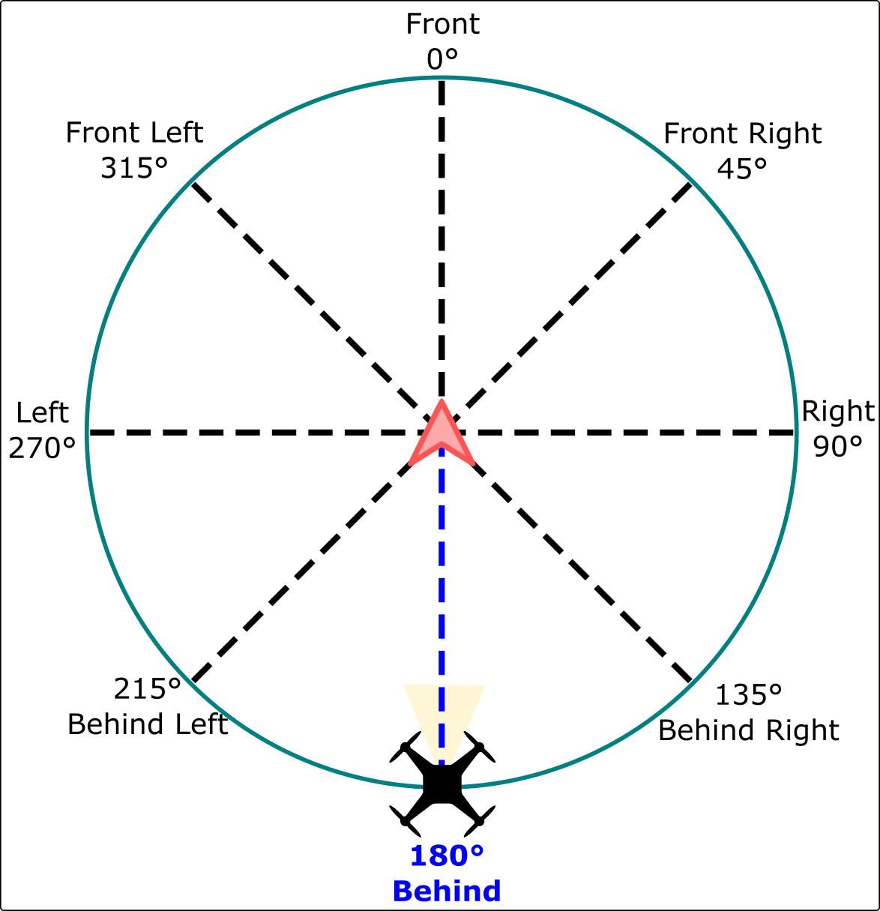

# 跟随我模式（多旋翼）

_跟随我_模式允许多旋翼飞行器根据另一个系统广播的位置（及可选速度）信息，通过[FOLLOW_TARGET](https://mavlink.io/en/messages/common.html#FOLLOW_TARGET) MAVLink消息，自主保持相对位置和高度。

::: info

- 该模式为自动模式 - 无需用户干预即可控制机体。
- 模式需要至少有效的局部位置估计（无需全局位置）。
  - 未获得有效局部位置的飞行器无法切换至此模式。
  - 位置估计丢失时飞行器将进入安全模式。
- 模式会阻止解锁（切换至此模式时机体必须已解锁）。
- 模式要求风速和飞行时间在允许范围内（通过参数指定）。
- 该模式目前仅支持多旋翼（或VTOL的多旋翼模式）。
- 跟随目标也必须能够提供位置信息。
- 跟随我模式由_QGroundControl_在带有GPS模块的Android设备上以及[MAVSDK](#follow-me-with-mavsdk)支持。

<!-- https://github.com/PX4/PX4-Autopilot/blob/main/src/modules/commander/ModeUtil/mode_requirements.cpp -->

:::

## 概述

机体将根据[高度控制模式](#FLW_TGT_ALT_M)自动偏转以面向目标，从指定的[相对角度](#FLW_TGT_FA)、[距离](#FLW_TGT_DST)和[高度](#FLW_TGT_HT)进行跟随。默认情况下，机体将在目标后方8米处，高于起始位置8米的高度进行跟随。

用户可通过遥控器调整跟随角度、高度和距离：

- **跟随高度**通过"上下"输入（"油门"）控制。  
  将操纵杆居中保持固定高度，上推或下拉操纵杆调整高度。
- **跟随距离**通过"前后"输入（"俯仰"）控制。  
  前推操纵杆增加跟随距离，后拉减少距离。
- **跟随角度**通过"左右"输入（"滚转"）控制。  
  从用户视角来看，面向无人机向左移动操纵杆时，无人机将向左侧移动。  
  从上方视角看，向左移动操纵杆时，无人机将逆时针移动。

  跟随角度定义为相对于目标航向（0度）按顺时针方向增加

  

::: info
通过遥控器设置的角度、高度和距离值在退出随行模式时将被丢弃。  
退出并重新激活随行模式后，这些参数将重置为默认值。
:::

### 视频

<lite-youtube videoid="csuMtU6seXI" params="start=155" title="PX4 Follow Target follows a Rover!"/>

### 安全注意事项

:::warning
**随行模式**未实现任何类型的障碍物避让功能。  
使用此模式时需特别谨慎。
:::

飞行时应遵守以下安全事项：

- 随行模式应仅在开阔无障碍区域（如无树木、电线、房屋等）使用。  
  - 设置[随行高度](#FLW_TGT_HT)时，需确保其高于周围所有障碍物。  
    默认值为起始位置上方8米。
- 建议在启用随行模式前手动飞行至安全高度，而非在降落状态下启用（即使模式包含自动起飞功能）。
- 确保为机体预留足够的停止空间，特别是高速移动时。
- 首次使用时，若出现问题应随时准备切换回Position模式。
- 无法通过遥控器操纵杆关闭随行模式（这会调整参数）。  
  需使用可发送飞行模式切换信号的地面站，或在遥控器上配置飞行模式切换开关。

### QGroundControl随行模式

_Follow Me_模式通过_QGroundControl_支持，要求地面站硬件具备GPS模块。  
推荐配置为支持USB OTG的安卓设备和两个遥测电台。

设置_Follow Me_模式步骤：

- 将遥测电台连接到地面站设备和机体（实现双电台间的位置信息传递）。
- 禁用安卓设备的睡眠模式：  
  - 该设置通常位于：**设置 > 显示**。  
  - 需确保设备不会进入睡眠状态，否则可能导致GPS信号间歇性丢失。
- 起飞至至少2-3米高度（建议即使支持自动起飞也手动操作）：  
  - 将机体置于地面，按下安全开关并后退至少10米。  
  - 解锁并起飞。
- 切换至随行模式：  
  - 多旋翼将首先上升至地面或起始位置上方1米的最低安全高度（视距离传感器是否存在而定）。  
  - 继续上升至[随行高度](#FLW_TGT_HT)3米范围内以避免潜在碰撞后水平移动。  
  - 多旋翼将始终调整航向以面向目标。

此时您可开始移动，无人机将跟随您。

该模式已测试支持以下安卓设备：

- Galaxy S10
- Nexus 7 平板

### MAVSDK随行模式

[MAVSDK](https://mavsdk.mavlink.io/main/en/)支持[Follow Me](https://mavsdk.mavlink.io/main/en/)，允许您创建以机体为随行目标的无人机应用。

更多信息请参见[Follow Me类](https://mavsdk.mavlink.io/main/en/cpp/api_reference/classmavsdk_1_1_follow_me.html)文档及[Follow Me示例](https://mavsdk.mavlink.io/main/en/cpp/examples/follow_me.html)。

## 配置

### 高度控制模式

高度控制模式决定了机体高度是相对于起始位置、地形高度，还是跟随目标报告的高度。

- `2D tracking`（默认的[高度模式](#FLW_TGT_ALT_M)）使无人机以相对于固定起始位置（起飞高度）的高度进行跟随。
  当您上下移动时，无人机与目标的相对距离会发生变化（在丘陵地形中请谨慎使用）。

- `2D + Terrain` 使无人机以相对于其下方地形的固定高度进行跟随，使用来自距离传感器的信息。

  - 如果机体没有距离传感器，跟随效果将与 `2D tracking` 相同。
  - 距离传感器并非总是准确，机体在此模式下飞行时可能会出现"跳跃"现象。
  - 注意该高度是相对于机体下方地面，而非跟随目标。
    无人机可能不会跟随目标的海拔变化！

- `3D tracking` 模式使无人机以相对于跟随目标的高度进行跟随，该高度由目标的GPS传感器提供。
  该模式能适应目标海拔的变化，例如当您爬上山坡时。

:::warning
使用 QGC for Android（或更一般地，在未确认[FOLLOW_TARGET.altitude](https://mavlink.io/en/messages/common.html#FOLLOW_TARGET)为AMSL值的情况下），**请勿将高度模式([FLW_TGT_ALT_M](#FLW_TGT_ALT_M))** 设置为 `3D Tracking`。

MAVLink [FOLLOW_TARGET](https://mavlink.io/en/messages/common.html#FOLLOW_TARGET) 消息定义期望一个相对于平均海平面（AMSL）的高度，而 QGC for Android 发送的是相对于GPS椭球面的高度。
这可能会相差多达200米！

由于内置的最小安全高度限制（1米），无人机可能不会坠毁，但可能会飞得比预期高得多。
如果无人机的高度与指定值显著不同，请假设地面站的高度输出有误，并改用2D跟踪。
:::

### 参数

可以通过以下参数配置跟随模式行为：

| 参数                                                                                                   | 描述                                                                                                                                                                                                                                                                                                                                                       |
| -------------------------------------------------------------------------------------------------------- | ---------------------------------------------------------------------------------------------------------------------------------------------------------------------------------------------------------------------------------------------------------------------------------------------------------------------------------------------------------- |
| [FLW_TGT_HT](../advanced_config/parameter_reference.md#FLW_TGT_HT)                | 机体跟随高度，单位为米。注意此高度是相对于起始/启动位置的固定值（不是目标机体）。默认和最小高度为8米（约26英尺）                                                                                                                                                                                                                                          |
| [FLW_TGT_DST](../advanced_config/parameter_reference.md#FLW_TGT_DST)             | 机体/地面站在水平（x,y）平面的分离距离，单位为米。允许的最小分离距离为1米。默认距离为8米（约26英尺）                                                                                                                                                                                                                                                       |
| [FLW_TGT_FA](../advanced_config/parameter_reference.md#FLW_TGT_FA)                | 相对于目标航向的跟随角度，单位为度。如果输入值超出范围 [`-180.0`, `+180.0`]，将自动进行环绕处理并应用（例如 `480.0` 将转换为 `120.0`）                                                                                                                                                                                                                     |
| [FLW_TGT_ALT_M](../advanced_config/parameter_reference.md#FLW_TGT_ALT_M)       | 高度控制模式。 - `0` = 2D跟踪（高度固定） - `1` = 2D跟踪 + 地形跟随 - `2` = 3D跟踪目标GPS高度 **警告：[不要与QGC for Android一起使用](#altitude-control-mode)**。                                                                                                                                                                                   |
| [FLW_TGT_MAX_VEL](../advanced_config/parameter_reference.md#FLW_TGT_MAX_VEL) | 相对于目标的轨道运动最大速度，单位为m/s。 - 10 m/s 被证明是在激进性与平滑性之间的最佳平衡点。 - 设置更高的值意味着目标周围的轨道轨迹移动速度更快，但如果机体物理上无法达到该速度，会导致激进的飞行行为。                                                                                                                                              |
| [FLW_TGT_RS](../advanced_config/parameter_reference.md#FLW_TGT_RS)                | 动态过滤算法响应性，用于过滤目标位置。 - `0.0` = 对运动和位置、速度、加速度的噪声估计非常敏感。 - `1.0` = 非常稳定但响应性差的过滤器                                                                                                                                                                                                                 |

### 技巧和提示

1. 将[跟随距离](#FLW_TGT_DST)设置为超过12米（8米是"推荐最小值"）。

   目标与无人机GPS传感器之间存在固有的位置偏差（3 ~ 5米），这会使无人机跟随一个"虚拟目标"，该目标位于实际目标附近。
   当跟随距离非常小时，这种现象会更加明显。
   我们建议将跟随距离设置得足够大，以使GPS偏差不显著。

2. 您调整跟随角度的速度取决于[最大切向速度](#FLW_TGT_MAX_VEL)的设置。

   实验表明，`5 m/s` 到 `10 m/s` 之间的值通常适用。

3. 使用遥控器调整高度、距离和角度，可以获得一些创意的摄像镜头。

   <lite-youtube videoid="o3DhvCL_M1E" title="YUN0012 almostCinematic"/>

   该视频演示了通过调整高度到约50米（高），距离到1米（近）实现的地球视角效果，如同从卫星拍摄的视角。

## 已知问题

- SiK 915 Mhz [遥测无线电](../telemetry/sik_radio.md) 被证实会干扰部分Android设备接收的GPS信号。
  在使用跟随目标模式时，应尽可能将无线电与Android设备分开，以避免干扰。
- Android版QGC报告的海拔高度不准确（以椭球面为基准而非AMSL）。
  跟随高度可能偏差高达200米！