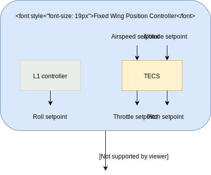
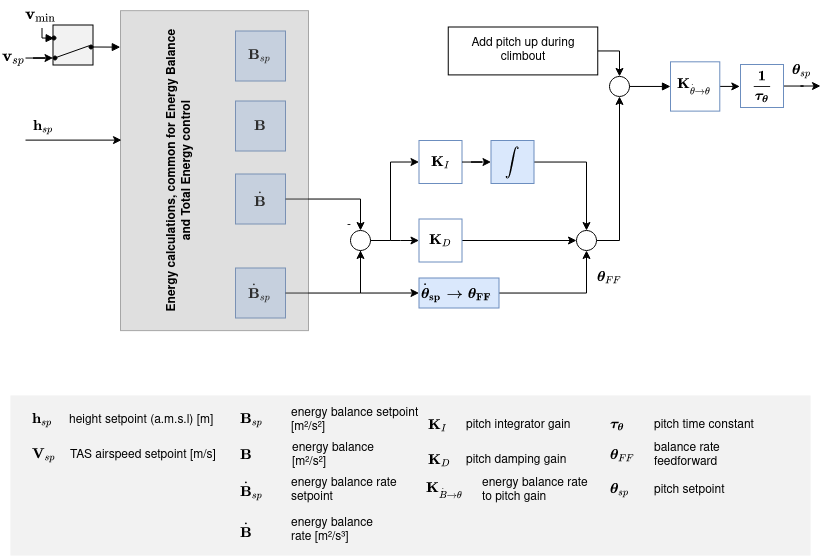

# 控制器图示

本节包含PX4主要控制器的图示。

图示使用标准的[PX4 notation](../contribute/notation.md)(每个图示都包含注释图例)。

<!--    The diagrams were created with LaTeX / TikZ.
        The code can be found in assets/diagrams/mc_control_arch_tikz.tex.
        The easiest way to generate the diagrams and edit them is to copy the code and paste it an Overleaf (www.overleaf.com/) document to see the output.
-->## 多旋翼控制架构

* 这是一个标准的级联控制架构。
* 控制器混合使用P和PID控制器。
* 估计值来自[EKF2](../advanced_config/tuning_the_ecl_ekf.md)。
* 根据模式不同，外环（位置）环路会被绕过（如图中外环后的多路复用器所示）。位置环仅在保持位置或某轴请求速度为零时使用。

### 多旋翼角速率控制器

* K-PID控制器。更多信息请参见[角速率控制器](../config_mc/pid_tuning_guide_multicopter.md#rate-controller)。
* 积分权限受到限制以防止积分饱和。
* 输出被限制（在控制分配模块中），通常在-1和1之间。
* 在微分路径上使用低通滤波器（LPF）以减少噪声（陀螺仪驱动器向控制器提供滤波后的微分值）。

  ::: info
  IMU管道流程：
  陀螺仪数据 > 应用校准参数 > 去除估计偏差 > 带通滤波器(`IMU_GYRO_NF0_BW`和`IMU_GYRO_NF0_FRQ`) > 低通滤波器(`IMU_GYRO_CUTOFF`) > 机体角速度（*用于P和I控制器的滤波角速率*） > 微分 -> 低通滤波器(`IMU_DGYRO_CUTOFF`) > 机体角加速度（*用于D控制器的滤波角加速度*） 

  
  :::

  <!-- 图片源码地址 https://github.com/PX4/PX4-Autopilot/blob/850d0bc588af79186286652af4c8293daafd2c4c/src/lib/mixer/MultirotorMixer/MultirotorMixer.cpp#L323-L326 -->

### 多旋翼姿态控制器

* 姿态控制器使用[四元数](https://en.wikipedia.org/wiki/Quaternion)。
* 控制器实现参考了这篇[文章](https://www.research-collection.ethz.ch/bitstream/handle/20.500.11850/154099/eth-7387-01.pdf)。
* 调整该控制器时唯一需要关注的参数是P增益。
* 角速率指令会被饱和限制。

### 多旋翼加速度到推力与姿态设定值的转换

* 由速度控制器生成的加速度设定值将被转换为推力和姿态设定值。
* 转换后的加速度设定值将在垂直和水平推力中进行饱和和优先级排序。 
* 推力饱和在计算对应推力后进行：
   1. 计算所需垂直推力(`thrust_z`)
   1. 用`MPC_THR_MAX`对`thrust_z`进行饱和
   1. 用`(MPC_THR_MAX^2 - thrust_z^2)^0.5`对`thrust_xy`进行饱和
   
实现细节可在`PositionControl.cpp`和`ControlMath.cpp`中找到。   

### 多旋翼速度控制器

* 用于稳定速度的PID控制器，输出加速度指令。
* 积分器通过限制方法实现抗重置积分饱和（ARW）。
* 输出的加速度指令不会被饱和 - 饱和将应用于转换后的推力设定值，结合最大倾斜角应用。 
* 水平增益通过参数`MPC_XY_VEL_P_ACC`、`MPC_XY_VEL_I_ACC`和`MPC_XY_VEL_D_ACC`设置。
* 垂直增益通过参数`MPC_Z_VEL_P_ACC`、`MPC_Z_VEL_I_ACC`和`MPC_Z_VEL_D_ACC`设置。

### 多旋翼位置控制器

* 简单的P控制器，输出速度指令。 
* 输出的速度被限制以保持在特定范围内。参见参数`MPC_XY_VEL_MAX`。该参数设置最大水平速度。这与最大**期望**速度`MPC_XY_CRUISE`（自主模式）和`MPC_VEL_MANUAL`（手动位置控制模式）不同。
* 水平P增益通过参数`MPC_XY_P`设置。
* 垂直P增益通过参数`MPC_Z_P`设置。
  

#### 位置和速度控制器组合框图

* 模式相关的前馈（ff） - 例如任务模式轨迹生成器（加加速度限制轨迹）计算位置、速度和加速度设定值。
* 加速度设定值（惯性坐标系）将通过偏航设定值转换为姿态设定值（四元数）和总推力设定值。

<!-- 该图纸在draw.io上：https://drive.google.com/open?id=13Mzjks1KqBiZZQs15nDN0r0Y9gM_EjtX
请求开发团队访问权限。 -->## 固定翼位置控制器

### 总能量控制系统（TECS）

PX4实现的总能量控制系统（TECS）可以同时控制固定翼飞行器的真实空速和高度。代码以库的形式实现，被固定翼位置控制模块所调用。

如上图所示，TECS接收空速和高度设定值作为输入，输出油门和俯仰角设定值。这两个输出被发送至固定翼姿态控制器以实现姿态控制解决方案。然而，当油门设定值为有限值且未检测到发动机故障时，该值会直接传递。因此需要理解，TECS的性能直接受俯仰角控制环性能的影响。空速和高度跟踪性能不佳通常由飞行器俯仰角跟踪性能差引起。

::: info
在调整TECS之前，请确保已调整姿态控制器。
:::

同时控制真实空速和高度并非易事。增加飞行器俯仰角会导致高度上升但空速下降。增加油门会提升空速，但也会因升力增加导致高度上升。因此，我们有两个输入（俯仰角和油门）共同影响两个输出（空速和高度），这使得控制问题具有挑战性。

TECS通过以能量形式而非原始设定值来表征问题提供了解决方案。飞行器的总能量是动能和势能之和。推力（通过油门控制）会增加飞行器的总能量状态。特定的总能量状态可以通过势能和动能的任意组合实现。换句话说，从总能量角度看，高海拔低速飞行等同于低海拔高速飞行。我们将这种关系称为比能量平衡，其根据当前高度和真实空速设定值计算得出。比能量平衡通过飞行器俯仰角进行控制。俯仰角增加会将动能转化为势能，而负俯仰角则相反。因此通过将初始设定值转换为可独立控制的能量量，控制问题得以解耦。我们使用推力调节机体的总比能量，而俯仰角则维持势能（高度）和动能（速度）之间的特定平衡。

#### 总能量控制环

<!-- https://drive.google.com/file/d/1q12b6ASbQRkFWqLMXm92cryOI-cZnrKv/view?usp=sharing -->

#### 总能量平衡控制环

<!-- The drawing is on draw.io: https://drive.google.com/file/d/1bZtFULYmys-_EQNhC9MNcKLFauc7OYJZ/view -->

飞行器的总能量是动能和势能之和：

$$E_T = \frac{1}{2} m V_T^2 + m g h$$

对时间求导可得总能量速率：

$$\dot{E_T} = m V_T \dot{V_T} + m g \dot{h}$$

由此可形成比能量速率为：

$$\dot{E} = \frac{\dot{E_T}}{mgV_T}  = \frac{\dot{V_T}}{g} + \frac{\dot{h}}{V_T} = \frac{\dot{V_T}}{g} + sin(\gamma)$$

其中 $\gamma{}$ 是飞行轨迹角。对于小角度 $\gamma{}$ 可近似为：

$$\dot{E} \approx  \frac{\dot{V_T}}{g} + \gamma$$

从飞行器的动力学方程可得以下关系：

$$T - D = mg(\frac{\dot{V_T}}{g} + sin(\gamma)) \approx mg(\frac{\dot{V_T}}{g} + \gamma)$$

其中 T 和 D 分别为推力和阻力。在平飞状态下，初始推力与阻力平衡，推力变化导致：

$$\Delta T = mg(\frac{\dot{V_T}}{g} + \gamma)$$

由此可见，$\Delta T{}$ 与 $\dot{E}{}$ 成正比，因此推力设定值应用于总能量控制。

另一方面，升降舵控制是能量守恒的，因此用于势能和动能的交换。为此定义了比能量平衡率为：

$$\dot{B} = \gamma - \frac{\dot{V_T}}{g}$$## 固定翼姿态控制器

<!-- The drawing is on draw.io: https://drive.google.com/file/d/1ibxekmtc6Ljq60DvNMplgnnU-JOvKYLQ/view?usp=sharing
Request access from dev team. -->

姿态控制器通过级联环方法工作。外环计算姿态设定值与估算姿态之间的误差，并通过乘以增益（P控制器）生成角速率设定值。内环随后计算速率误差，并使用PI（比例+积分）控制器生成期望的角加速度。

控制执行器（副翼、升降舵、方向舵等）的角度位置则通过期望的角加速度和系统先验知识通过控制分配（也称为混合）进行计算。此外，由于舵面在高速时更有效而在低速时效果减弱，控制器（针对巡航速度调校）会通过空速测量值（如果使用此类传感器）进行缩放。

::: info
如果未使用空速传感器，则固定翼姿态控制器的增益调度将被禁用（开环运行）；TECS中无法/不会通过空速反馈进行修正。
:::

前馈增益用于补偿气动阻尼。基本上，飞机上的机体轴力矩主要由两部分产生：控制面（副翼、升降舵、方向舵等，产生运动）和气动阻尼（与机体速率成正比，抵消运动）。为了保持恒定速率，可以通过速率环的前馈来补偿这种阻尼。

### 转弯协调

滚转和俯仰控制器具有相同结构，纵向和横向动力学被假设为足够解耦以独立工作。然而，偏航控制器通过转弯协调约束生成其偏航速率设定值，以最小化飞机滑翔时产生的横向加速度。转弯协调算法完全基于协调转弯几何计算。

$$\dot{\Psi}_{sp} = \frac{g}{V_T} \tan{\phi_{sp}} \cos{\theta_{sp}}$$

偏航速率控制器通过提供额外的方向阻尼，帮助抵消[逆偏航效应](https://youtu.be/sNV_SDDxuWk)并衰减[荷兰滚模态](https://en.wikipedia.org/wiki/Dutch_roll)。

## VTOL飞行控制器

<!-- 该图在draw.io上: https://drive.google.com/file/d/1tVpmFhLosYjAtVI46lfZkxBz_vTNi8VH/view?usp=sharing
需向开发团队申请访问权限 -->

本节简要介绍垂直起降（VTOL）飞行器的控制结构。  
VTOL飞行控制器由多旋翼和固定翼控制器组成，它们在对应VTOL模式下独立运行，或在转换期间协同工作。  
上图展示了简化的控制框图。请注意VTOL姿态控制器模块，该模块主要负责不同VTOL模式间的切换和混合逻辑，以及转换过程中特定于VTOL类型的控制动作（例如标准VTOL在前飞转换时推进电机的逐步启动）。  
输入到该模块的信号称为"虚拟"，因为根据当前VTOL模式，某些信号会被控制器忽略。

对于标准VTOL和倾转旋翼VTOL，转换期间固定翼姿态控制器会生成速率设定值，这些设定值被输入到独立的速率控制器中，产生多旋翼和固定翼执行器的力矩指令。  
而对于尾坐式VTOL，转换期间使用的是多旋翼姿态控制器。

VTOL姿态模块的输出分别为多旋翼和固定翼执行器的独立力矩和力指令（两个`vehicle_torque_setpoint`和`vehicle_thrust_setpoint`实例）。  
这些指令通过特定飞行器结构的控制分配类进行处理。

关于VTOL模块中转换逻辑调节的更多信息，请参见[VTOL配置](../config_vtol/index.md)。

### 空速缩放

本节目标是通过公式说明为何以及如何通过空速缩放率PI和前馈（FF）控制器的输出以提升控制性能。  
首先将展示简化的线性维度滚转力矩方程，随后说明空速对直接力矩生成的影响，最后说明恒定滚转期间空速的影响。

如上文固定翼姿态控制器所示，速率控制器会为控制分配器（此处称为"混控器"）生成角加速度设定值。  
为了生成这些期望的角加速度，混控器会利用可用的气动控制面（例如：标准飞机通常有两个副翼、两个升降舵和一个方向舵）产生力矩。  
这些控制面产生的力矩高度依赖相对空速和空气密度，更准确地说，依赖动态压力。  
如果没有进行空速缩放，针对特定巡航空速精心调节的控制器会在高空速时导致飞行器振荡，或在低空速时跟踪性能变差。

读者应了解[真空速（TAS）](https://en.wikipedia.org/wiki/True_airspeed)和[指示空速（IAS）](https://en.wikipedia.org/wiki/Indicated_airspeed)之间的区别，因为它们在非海平面飞行时数值差异显著。

动态压力的定义为：

$$\bar{q} = \frac{1}{2} \rho V_T^2$$

其中 $\rho{}$ 为空气密度，$V_T{}$ 为真空速（TAS）。

以本节其余部分的滚转轴为例，维度滚转力矩可表示为：

$$\ell = \frac{1}{2}\rho V_T^2 S b C_\ell = \bar{q} S b C_\ell$$

其中 $\ell{}$ 为滚转力矩，$b{}$ 为翼展，$S{}$ 为参考面积。

无量纲滚转力矩导数 $C_\ell{}$ 可通过副翼有效性导数 $C_{\ell_{\delta_a}}{}$、滚转阻尼导数 $C_{\ell_p}{}$ 和二面角导数 $C_{\ell_\beta}{}$ 建模：

$$C_\ell = C_{\ell_0} + C_{\ell_\beta}\:\beta + C_{\ell_p}\:\frac{b}{2V_T}\:p + C_{\ell_{\delta_a}} \:\delta_a$$

其中 $\beta{}$ 为侧滑角，$p{}$ 为机体滚转率，$\delta_a{}$ 为副翼偏转角。

假设对称（$C_{\ell_0} = 0{}$）且协调（$\beta = 0{}$）的飞行器，通过仅使用滚转率阻尼和副翼产生的滚转力矩可以简化方程：

$$\ell = \frac{1}{2}\rho V_T^2 S b \left [C_{\ell_{\delta_a}} \:\delta_a + C_{\ell_p}\:\frac{b}{2V_T} \: p \right]$$

本节最后部分的公式将直接应用于滚转率、俯仰率和偏航率控制器。

对于控制性能不直接依赖空速的机体（例如旋翼类飞行器如[自转旋翼机](../frames_autogyro/index.md)），可通过[FW_ARSP_SCALE_EN](../advanced_config/parameter_reference.md#FW_ARSP_SCALE_EN)参数禁用空速缩放功能。

#### 调整建议

该空速缩放算法的优点在于无需特殊调整。  
然而，空速测量的准确性直接影响其性能。

此外，为获得最大的稳定飞行包线，应在失速速度和机体最大空速的中间值进行姿态控制器调整（例如：可在15-25m/s空速范围内飞行的飞机应在20m/s空速下调整）。  
此"调整"空速应设置在[FW_AIRSPD_TRIM](../advanced_config/parameter_reference.md#FW_AIRSPD_TRIM)参数中。