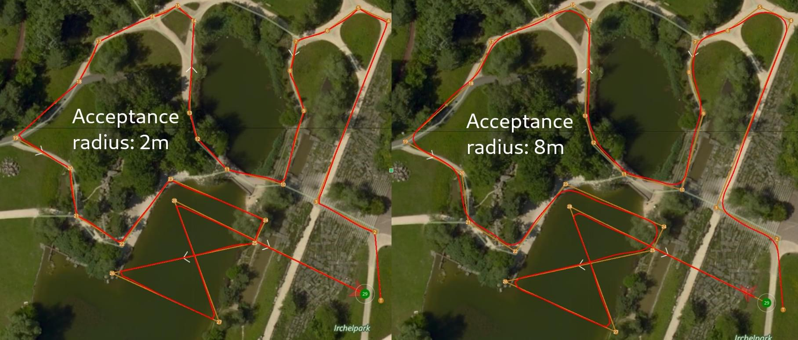

# 任务

任务是一个预定义的飞行计划，可以在 QGroundControl 中进行规划并上传到飞行控制器，然后在[任务模式](../flight_modes_mc/mission.md)中自主执行。

任务通常包括控制起飞、飞行一系列航点、拍摄图像和/或视频、投放货物以及降落等操作。QGroundControl 允许您通过完全手动方式规划任务，或者使用其更高级的功能来规划地面区域调查、走廊调查或结构调查。

本主题提供了如何规划和执行任务的概述。

## 任务规划

手动规划任务非常简单：

- 切换到任务视图  
- 在左上角选择 **添加航点**（"加号"）图标  
- 在地图上点击以添加航点  
- 使用右侧的航点列表修改航点参数/类型  
  底部的海拔指示器显示每个航点的相对海拔高度  
- 完成后，点击右上角的 **上传** 按钮将任务发送到机体

您还可以使用 _Pattern_ 工具自动生成调查网格。

:::tip  
更多信息请参见 [QGroundControl 用户指南](https://docs.qgroundcontrol.com/master/en/qgc-user-guide/plan_view/plan_view.html)。  
:::

### 任务可行性检查

PX4 会运行一些基本检查以确定任务是否可行。例如，任务是否足够接近机体、是否与地理围栏冲突，或者是否需要但缺少任务降落模式。

这些检查在任务上传时和即将执行前运行。如果任何检查失败，用户将收到通知且无法启动任务。

更多关于检查和可能操作的细节，请参见：[任务模式（固定翼）> 任务可行性检查](../flight_modes_fw/mission.md#mission-feasibility-checks) 和 [任务模式（多旋翼）> 任务可行性检查](../flight_modes_mc/mission.md#mission-feasibility-checks)。

### 设置机体偏航角

如果设置，多旋翼机体将在目标航点（对应 [MAV_CMD_NAV_WAYPOINT.param4](https://mavlink.io/en/messages/common.html#MAV_CMD_NAV_WAYPOINT)）中指定的 **航向** 角度进行偏航。

如果目标航点未显式设置 **航向**（`param4=NaN`），则机体将根据参数 [MPC_YAW_MODE](../advanced_config/parameter_reference.md#MPC_YAW_MODE) 指定的方位进行偏航。默认情况下，这是下一个航点。

无法独立控制偏航和行进方向的机体类型将忽略偏航设置（例如固定翼）。

### 设置接受半径/转弯半径

_接受半径_ 定义了围绕航点的圆，当机体进入该圆时，认为已到达该航点，并立即切换到（并开始转向）下一个航点。

对于多旋翼无人机，接受半径通过参数 [NAV_ACC_RAD](../advanced_config/parameter_reference.md#NAV_ACC_RAD) 进行调整。默认情况下，半径较小以确保多旋翼从航点上方经过，但可以增加半径以创建更平滑的路径，使无人机在到达航点前开始转弯。

下图显示了使用不同接受半径参数执行同一任务的效果：

转弯速度会根据接受半径（=转弯半径）和最大允许加速度及加加速度自动计算（参见 [多旋翼的加加速度限制轨迹](../config_mc/mc_jerk_limited_type_trajectory.md#auto-mode)）。

:::tip  
关于航点周围接受半径影响的更多信息，请参见：[任务模式 > 航点间轨迹](../flight_modes_fw/mission.md#rounded-turns-inter-waypoint-trajectory)。  
:::

### 包裹投递（货物）任务

PX4 支持通过夹具在任务中进行货物投递。

此类任务的规划与其他[航点任务](../flying/missions.md)类似，包括任务开始、起飞航点、各种路径航点，可能还有返回航点。唯一的区别是，包裹投递任务必须包含任务项以指示包裹的释放方式和部署机制。更多信息请参见：[包裹投递任务](../flying/package_delivery_mission.md)。

## 执行任务

任务上传后，切换到飞行视图。任务会以易于跟踪进度的方式显示（在此视图中无法修改任务）。

