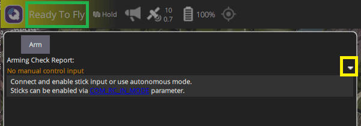

# QGroundControl 飞行就绪状态

PX4 会执行多项飞行前传感器质量及估算器检查，以判断例如当前模式下机体是否具备足够的定位精度进行飞行，如果机体未准备好将阻止启动。

QGroundControl 可用于判断机体是否已准备好飞行，更重要的是可以查看哪些检查项失败。

::: tip
您还可以通过[机体状态LED](../getting_started/led_meanings.md)和[警告音](../getting_started/tunes.md)获取就绪通知。
但QGC是唯一能确定PX4无法启动的精确原因的途径。
:::

## 飞行就绪状态

QGroundControl 中会通过左上角 **Q** 菜单图标附近显示整体的“可飞行状态”，如下图所示：

三种状态分别为：

- "Ready to Fly"（绿色背景）：机体在所有模式下均可飞行，并可解除锁定。
- "Ready to Fly"（琥珀色背景）：机体在当前模式下可飞行并可解除锁定，但某些检查项未通过，导致无法切换到其他模式。
- "Not Ready"（琥珀色背景）：机体在当前模式下不可飞行，且无法解除锁定。

## QGC 上锁检查报告

<Badge type="tip" text="PX4 v1.14" /> <Badge type="tip" text="QGC v4.2.0" />

可通过 QGroundControl 的 [Fly View](https://docs.qgroundcontrol.com/master/en/qgc-user-guide/fly_view/fly_view.html#arm) 中的 [上锁检查报告](https://docs.qgroundcontrol.com/master/en/qgc-user-guide/fly_view/fly_view.html#arm) 查看哪些上锁前检查未通过。  
要访问该界面，请在 QGroundControl 的 Fly View 界面左上角点击 [飞行就绪状态](#flight-readiness-status) 指示器。

上锁检查报告弹出后，会列出所有当前警告，每个警告右侧的切换按钮可展开条目，显示附加信息和可能的解决方案。

解决每个问题后，该问题将从界面中消失。当所有阻止上锁的问题都被解决后，可通过点击上锁按钮显示上锁确认滑块，从而上锁机体（或直接起飞）。

::: tip
QGC 上锁检查 UI 适用于 QGC Daily Build（QGC v4.2.0 及更高版本），并兼容 PX4 v1.14 及更高版本。
:::

## 飞行日志

_QGroundControl_ 中也会以 `PREFLIGHT FAIL` 消息的形式报告预飞错误。  
[在日志中](../getting_started/flight_reporting.md) 的 `estimator_status.gps_check_fail_flags` 消息显示了哪些 GPS 质量检查未通过。  

请注意，[Arming Check Report](#qgc-arming-check-report) 是确定失败原因更便捷的方式，但在 PX4 v1.14 之前的版本中，日志可能仍有用。

## EKF 预飞检查/错误

本节列出了由 [EKF2](../advanced_config/tuning_the_ecl_ekf.md) 报告的错误（并传播到 _QGroundControl_）及其相关检查和参数。  
这些内容仅用于参考（QGC 的 Arming Checks 界面是获取错误和解决方案信息的最佳途径）。

#### 预飞失败: EKF 高 IMU 加速度偏差

<!-- https://github.com/PX4/PX4-Autopilot/blob/main/src/modules/commander/Arming/PreFlightCheck/checks/ekf2Check.cpp#L267 -->
<!-- Useful primer on biases: https://www.vectornav.com/resources/inertial-navigation-primer/specifications--and--error-budgets/specs-imuspecs -->
<!-- Mathieu Bresciani is expert -->

EKF IMU 加速度偏差是 IMU 传感器报告的加速度与 EKF2 估计器（融合位置和/或速度数据，包括 IMU、GNSS、流速传感器等）报告的预期加速度之间的差异。  
该偏差可能在传感器开启时（"开机偏差"）和由于噪声及温度差异随时间变化（"运行中偏差"）。  
该数值通常应非常小（接近零），表明来自不同来源的测量值对加速度的评估一致。

警告表示偏差高于某个任意阈值（机体将不允许起飞）。  
这很可能表明需要重新校准加速度计或进行热校准：

- 如果您 _偶尔_ 收到此警告：[重新校准加速度计](../config/accelerometer.md)。
- 如果您 _经常_ 收到此警告：执行 [热校准](../advanced_config/sensor_thermal_calibration.md)。
- 如果在热校准后（或无法进行热校准）仍收到警告：
  - 验证问题是否来自传感器或飞控硬件：
    - 最简单的测试方法是用其他飞控测试相同机架/传感器。
    - 或者，[记录并比较](../dev_log/logging.md#configuration)所有加速度计的多次台架测试数据，启用 [SDLOG_PROFILE](../advanced_config/parameter_reference.md#SDLOG_PROFILE) 中的 `6: Sensor comparison`。
  - 尝试调整加速度计偏差学习调参参数。

增加这些参数会使飞控更少检测异常，可能会影响估计器的稳定性。  
但如果传感器存在无法通过其他方式解决的问题（即您可以调整 EKF 以获得更好的性能，但无法进一步校准加速度计），则可能需要这样做。

:::warning
调整这些参数是最后的手段。
只有在您拥有数据证明其能改善估计器性能的情况下才应尝试。
:::

| 参数                                                                                                   | 描述                                                                                                                                                                                                                                                                                                                                                                                                                                                                                                        |
| ------------------------------------------------------------------------------------------------------- | ------------------------------------------------------------------------------------------------------------------------------------------------------------------------------------------------------------------------------------------------------------------------------------------------------------------------------------------------------------------------------------------------------------------------------------------------------------------------------------------------------------- |
| [EKF2_ABL_LIM](../advanced_config/parameter_reference.md#EKF2_ABL_LIM)         | EKF 允许估计的最大偏差值（超过此值时偏差会被截断，EKF 将尝试重置自身，甚至在多 EKF 系统中切换到更健康的 EKF）。如果在预飞检查期间估计的偏差超过此参数的 75%，飞控将报告“高加速度偏差”并阻止起飞。当前值 0.4m/s2 已经相当高，提高该值会使飞控更少检测问题。 |
| [EKF2_ABIAS_INIT](../advanced_config/parameter_reference.md#EKF2_ABIAS_INIT) | 初始偏差不确定性（如果完美校准，这与传感器的“开机偏差”相关）。如果用户知道传感器校准良好且开机偏差较小，可能会希望降低此值。                                                                                                                                                                                                                                                                                                                                                                                 |
| [E2_ACC_B_NOISE](../advanced_config/parameter_reference.md#EKF2_ACC_B_NOISE) | 加速度计的预期“运行中偏差”或“每秒偏差变化速度”。默认情况下，该值足够大，以包含因温度变化引起的漂移。如果 IMU 经过温度校准，用户可能希望降低此参数。                                                                                                                                                                                                                                                                                                                                                           |
| [EKF2_ABL_ACCLIM](../advanced_config/parameter_reference.md#EKF2_ABL_ACCLIM) | 估计器尝试学习加速度偏差的最大加速度。这是为了防止估计器因非线性性和比例因子误差而学习偏差。（几乎无需用户修改此参数，除非他们非常清楚自己在做什么）。                                                                                                                                                                                                                                                                                                                                                      |

#### 预飞失败: EKF 高 IMU 陀螺仪偏差

- 当 EKF 估计的 IMU 陀螺仪偏差过大时生成此错误。
- 此处的“过大”表示偏差估计值超过 10deg/s（配置限制的一半，硬编码为 20deg/s）。

#### 预飞失败: 加速度计传感器不一致 - 检查校准

- 当来自不同 IMU 单元的加速度测量值不一致时生成此错误消息。
- 该检查仅适用于具有多个 IMU 的板载设备。
- 该检查由 [COM_ARM_IMU_ACC](../advanced_config/parameter_reference.md#COM_ARM_IMU_ACC) 参数控制。

#### 预飞失败: 陀螺仪传感器不一致 - 检查校准

- 当来自不同 IMU 单元的角速度测量值不一致时生成此错误消息。
- 该检查仅适用于具有多个 IMU 的板载设备。
- 该检查由 [COM_ARM_IMU_GYR](../advanced_config/parameter_reference.md#COM_ARM_IMU_GYR) 参数控制。

#### 预飞失败: 磁罗盘传感器不一致 - 检查校准

- 当不同磁罗盘传感器的测量值差异过大时生成此错误消息。
- 表明校准不良、方向错误或磁干扰。
- 该检查仅适用于连接了多个磁罗盘/磁力计的情况。
- 该检查由 [COM_ARM_MAG_ANG](../advanced_config/parameter_reference.md#COM_ARM_MAG_ANG) 参数控制。

#### 预飞失败: EKF 内部检查

- 如果水平 GPS 速度、磁航向、垂直 GPS 速度或垂直位置传感器（默认为气压计，但可能是测距仪或 GPS 如果使用了非标准参数）的创新值过大时生成此错误消息。创新值是惯性导航计算预测值与传感器测量值之间的差异。
- 用户应检查日志文件中的创新值以确定原因。这些值可在 `ekf2_innovations` 消息中找到。
  常见问题/解决方案包括：
  - IMU 在预热时的漂移。可通过重启飞控解决。可能需要重新校准 IMU 加速度计和陀螺仪。
  - 相邻磁干扰与机体移动结合。通过移动机体并等待或重新供电解决。
  - 磁力计校准不良与机体移动结合。通过重新校准解决。
  - 开机时的初始冲击或快速移动导致惯性导航解算错误。通过重启机体并等待解决。

## 其他参数

以下参数也会影响飞行前检查。

#### COM_ARM_WO_GPS

[COM_ARM_WO_GPS](../advanced_config/parameter_reference.md#COM_ARM_WO_GPS) 参数控制是否允许在没有全局位置估计的情况下解锁。

- `1` (默认): 允许在仅需飞行模式不依赖位置信息时解锁。
- `0`: 仅当EKF提供全局位置估计且EFK GPS质量检查通过时才允许解锁