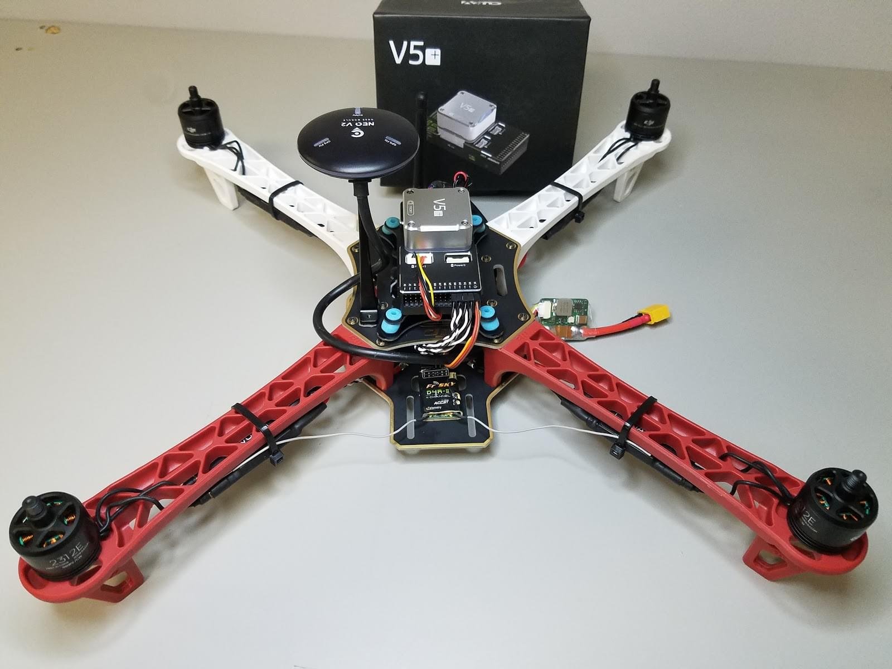
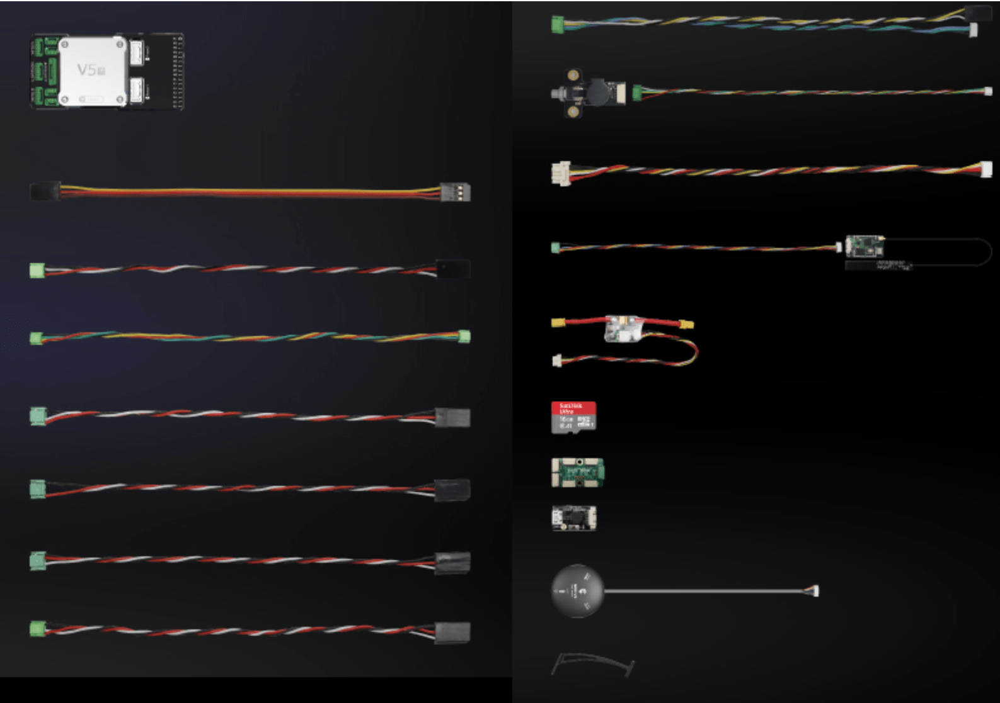
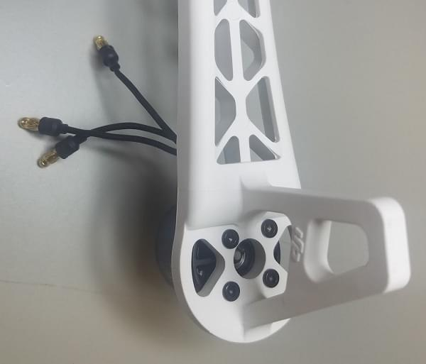
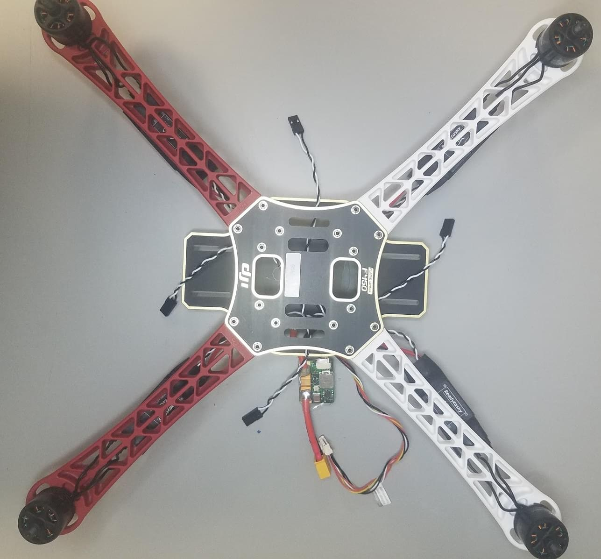
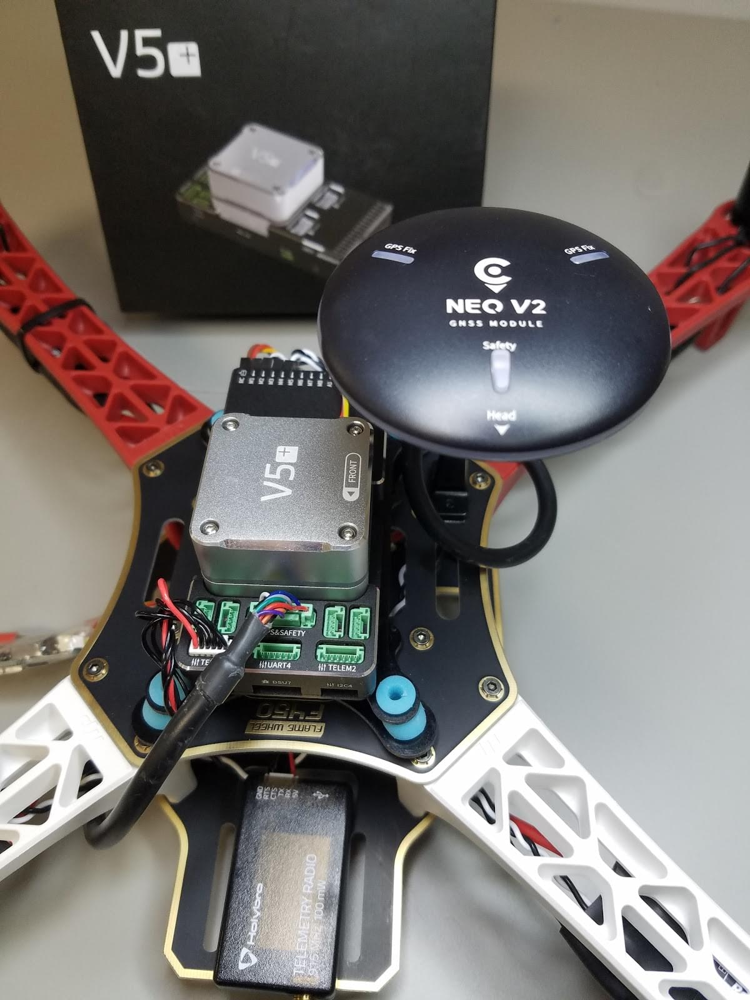

# DJI FlameWheel 450 + CUAV V5+ 构建

本主题提供了使用 *QGroundControl* 组装套件和配置 PX4 的完整说明。

关键信息

- **机架:** DJI F450
- **飞控:** [CUAV V5+](../flight_controller/cuav_v5_plus.md)
- **组装时间（约）:** 90分钟（45分钟用于机架，45分钟自动驾驶仪安装/配置）

## 物料清单

本项目的所需组件包括:
- 飞控: [CUAV V5+](https://store.cuav.net/index.php?id_product=95&id_product_attribute=0&rewrite=cuav-new-pixhack-v5-autopilot-m8n-gps-for-fpv-rc-drone-quadcopter-helicopter-flight-simulator-free-shipping-whole-sale&controller=product&id_lang=1):
  - GPS: [CUAV NEO V2 GPS](https://store.cuav.net/index.php?id_product=97&id_product_attribute=0&rewrite=cuav-new-ublox-neo-m8n-gps-module-with-shell-stand-holder-for-flight-controller-gps-compass-for-pixhack-v5-plus-rc-parts-px4&controller=product&id_lang=1)
  - 电源模块
- 机架: [DJI F450](https://www.amazon.com/Flame-Wheel-Basic-Quadcopter-Drone/dp/B00HNMVQHY)
- 螺旋桨: [DJI Phantom 带内六角升级螺旋桨 9.4x5](https://www.masterairscrew.com/products/dji-phantom-built-in-nut-upgrade-propellers-in-black-mr-9-4x5-prop-set-x4-phantom)
- 电池: [Turnigy 高容量 5200mAh 3S 12C 锂聚合物电池包 XT60](https://hobbyking.com/en_us/turnigy-high-capacity-5200mah-3s-12c-multi-rotor-lipo-pack-w-xt60.html?___store=en_us)
- 遥测: [Holybro Transceiver 遥测无线电 V3](../telemetry/holybro_sik_radio.md)
- 遥控接收机: [FrSky D4R-II 2.4G 4CH ACCST 遥测接收机](https://www.banggood.com/FrSky-D4R-II-2_4G-4CH-ACCST-Telemetry-Receiver-for-RC-Drone-FPV-Racing-p-929069.html?cur_warehouse=GWTR)
- 电机: [DJI E305 2312E 电机 (960kv, 顺时针)](https://www.amazon.com/DJI-E305-2312E-Motor-960kv/dp/B072MBMCZN)
- 电调: Hobbywing XRotor 20A APAC 无刷电调 3-4S 适用于多旋翼

此外，我们还使用了 FrSky Taranis 控制器。
还需要扎带、双面胶、电烙铁。

下图展示了机架和电子组件。

## 硬件

### 框架

本节列出框架所需的所有硬件。

描述 | 数量
---|---
DJI F450 底板 | 1
DJI F450 顶板 | 1
DJI F450 带起落架支架 | 4
M3*8 螺丝 | 18
M2 5*6 螺丝 | 24
维可牢电池绑带 | 1
大疆 Phantom 内置螺母升级螺旋桨 9.4x5 | 1

### CUAV V5+ 套件

本节列出 CUAV v5+ 套件的组件。

描述 | 数量（基础套件） | 数量（+GPS 套件）
--- | --- | ---
V5+ 自主飞行控制器 | 1 | 1
杜邦线 | 2 | 2
I2C/CAN 线缆 | 2 | 2
ADC 6.6 线缆 | 2 | 2
SBUS 信号线 | 1 | 1
IRSSI 线缆 | 1 | 1
DSM 信号线 | 1 | 1
ADC 3.3 线缆 | 1 | 1
调试线缆 | 1 | 1
安全开关线缆 | 1 | 1
电压与电流线缆 | 1 | 1
PW-Link 模块线缆 | 1 | 1
电源模块（含于 CUAV V5+ 套件） | 1 | 1
SanDisk 16GB 存储卡 | 1 | 1
12C 扩展板 | 1 | 1
TTL 板 | 1 | 1
NEO GPS | - | 1
GPS 支架 | - | 1

### 电子设备

描述 | 数量
--- | --- 
CUAV V5+ | 1
CUAV NEO V2 GPS | 1
Holibro 遥测模块 | 1
FrSky D4R-II 2.4G 4CH ACCST 遥测接收机 | 1
DJI E305 2312E 电机（800kv，顺时针） | 4
Hobbywing XRotor 20A APAC 无刷电调 | 4
电源模块（含于 CUAV V5+ 套件） | 1
Turnigy 高容量 5200mAh 3S 12C 锂电池包（XT60 接口） | 1

### 所需工具

组装过程中需要用到以下工具：

- 2.0mm 六角螺丝刀
- 3mm 十字螺丝刀
- 电线剪
- 精密镊子
- 电烙铁

## 组装

预计组装时间约为90分钟（约45分钟用于机架组装，45分钟用于自动驾驶仪安装和机体配置）。

1. 使用提供的螺丝将4个臂连接到底板上。

   

1. 焊接电调（Electronic Speed Controller）到电路板上，红色（正极）和黑色（负极）。

   

1. 焊接电源模块，红色（正极）和黑色（负极）。

   

1. 根据电机位置将电机插入电调中。

   

1. 将电机安装到对应的臂上。

   
   

1. 将顶板（用螺丝固定在支脚顶部）。

   

1. 在CUAV V5+飞控上添加3M双面胶（其具有内部减震功能，无需使用泡沫垫）。

   

1. 使用双面胶将FrSky接收机粘贴到底板上。

   

1. 使用双面胶将遥测模块粘贴到机体底板上。

   
   

1. 在按钮板上安装铝合金隔离柱。

1. 将遥测（`TELEM1`）和GPS模块（`GPS/SAFETY`）插入飞控。
   
   
   
1. 将遥控接收机（`RC`）、全部4个电调（`M1-M4`）和电源模块（`Power1`）插入飞控。
   
   
   ::: info
   电机顺序定义在[机体参考 > 四旋翼X](../airframes/airframe_reference.md#quadrotor-x)
   :::

完成！
最终组装效果如下：

## PX4 配置

使用 *QGroundControl* 安装 PX4 自动驾驶仪，并根据机架进行配置/调校。
[下载并安装](http://qgroundcontrol.com/downloads/) *QGroundControl*（适用于你的平台）。

:::tip
完整的安装和配置说明请参见 [基础配置](../config/index.md)
:::

首先更新固件、机架、几何参数和输出：

- [固件](../config/firmware.md)
- [机架](../config/airframe.md)
  ::: info
  你需要选择 *通用四旋翼* 机架（**四旋翼 x > 通用四旋翼**）。

  
  :::

- [执行器](../config/actuators.md)
  - 更新机体几何参数以匹配机架
  - 将执行器功能分配到输出以匹配你的接线
  - 使用滑块测试配置
  
然后执行必做设置/校准：

- [传感器方向](../config/flight_controller_orientation.md)
- [指南针](../config/compass.md)
- [加速度计](../config/accelerometer.md)
- [水平校准](../config/level_horizon_calibration.md)
- [遥控器设置](../config/radio.md)
- [飞行模式](../config/flight_mode.md)
  
  ::: info
  本次构建我们在接收机上设置了 *Stabilized*（稳定模式）、*Altitude*（高度模式）和 *Position*（位置模式）三种模式（映射到单个通道 - 5）。
  这是推荐给初学者的最小模式集合。
  :::

理想情况下你还应完成：
* [电调校准](../advanced_config/esc_calibration.md)
* [电池估计调校](../config/battery.md)
* [安全设置](../config/safety.md)

## 调校

机体选择会为机体设置*默认*自动驾驶参数。  
这些参数可能足够用于飞行，但建议对每个机体构建进行调整。  

有关如何操作的说明，请从[Autotune](../config/autotune_mc.md)开始。

## 视频

<lite-youtube videoid="r-IkaVpN1Ko" title="CUAV V5+"/>## 致谢

本构建日志由Dronecode Test Flight Team提供。