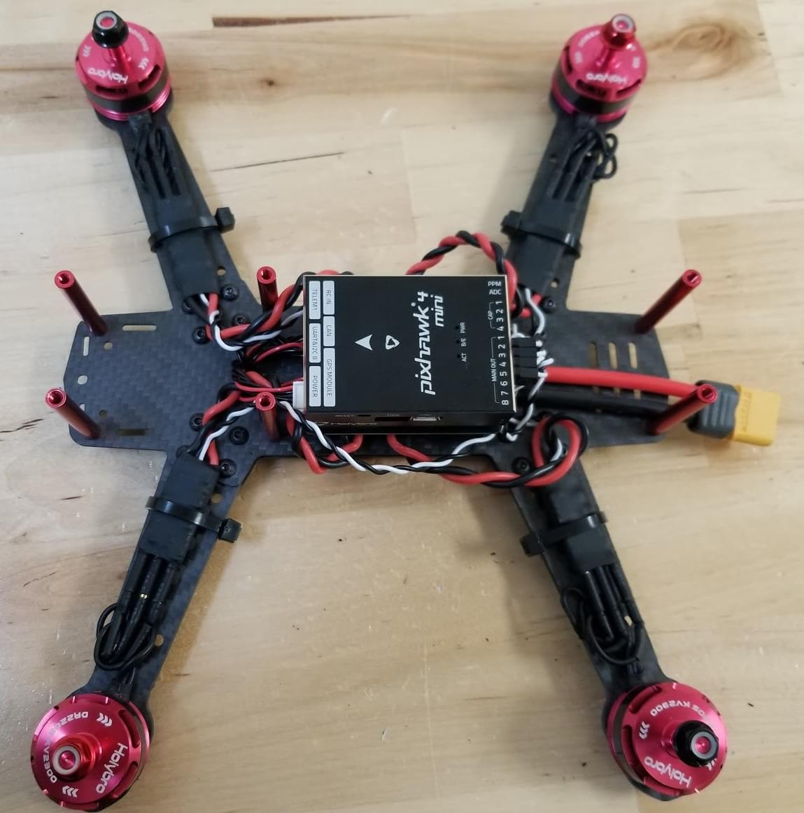
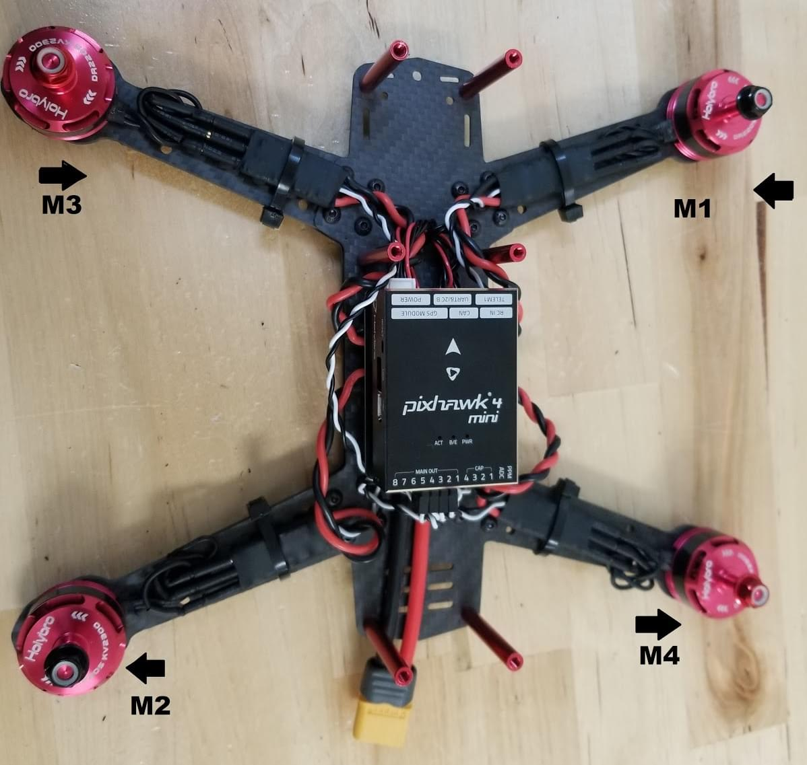
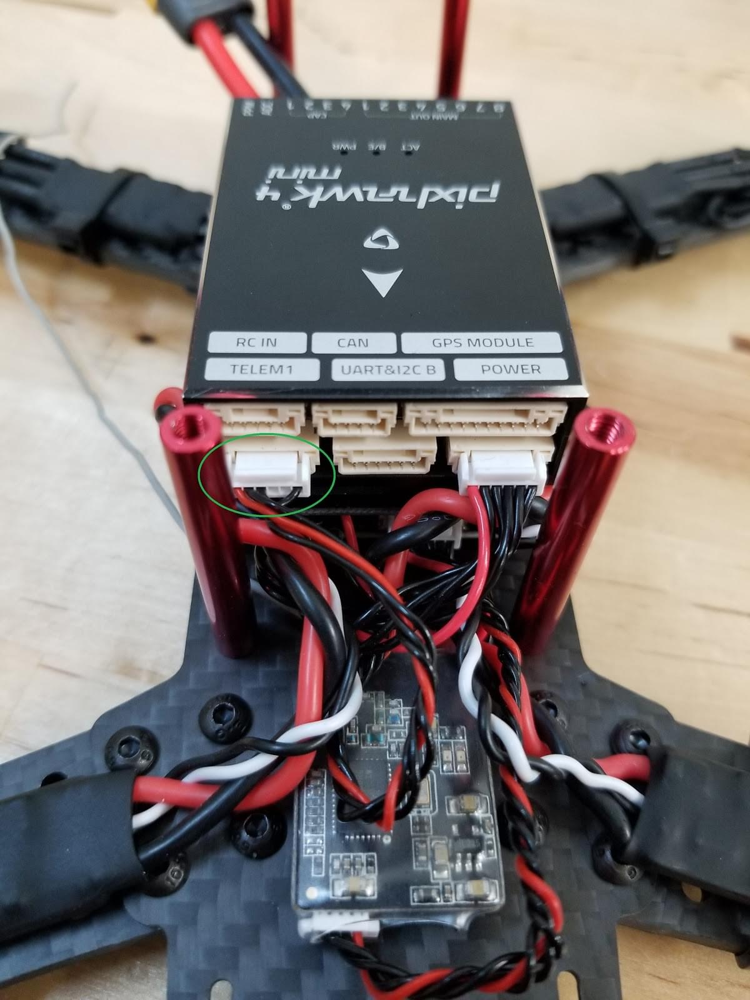

# Holybro QAV250 + Pixhawk 4 Mini 组装指南（已停产）

::: info
_Holybro Pixhawk 4 Mini QAV250套件_ 已不再提供。

本指南仍然保留，因为基于Pix32 v6的类似套件可通过[此链接](https://holybro.com/products/qav250-kit)获取。
因此本指南仍可沿用（后续可能会更新为Pix32 v6版本）。
:::

完整套件包含碳纤维QAV250竞速框架、飞控器及几乎所有其他所需组件（电池和接收机除外）。
该套件提供支持FPV（第一视角飞行）和不支持FPV两种版本。
本主题提供套件组装及通过*QGroundControl*配置PX4的完整指南。

关键信息

- **框架：** Holybro QAV250
- **飞控器：** [Pixhawk 4 Mini](../flight_controller/pixhawk4_mini.md)
- **组装时间（约）：** 3.5小时（2小时用于框架组装，1.5小时用于自动驾驶仪安装/配置）

## 快速入门指南

[Pixhawk 4 Mini QAV250 Kit 快速入门指南](https://github.com/PX4/PX4-user_guide/raw/main/assets/flight_controller/pixhawk4mini/pixhawk4mini_qav250kit_quickstart_web.pdf)

## 材料清单

Holybro [QAV250套件](https://holybro.com/products/qav250-kit) 包含几乎所有所需组件：
* [Holybro Transceiver Telemetry Radio V3](../telemetry/holybro_sik_radio.md)
* 电源模块 holybro
* 带电调的完整电源管理板
* 电机 - DR2205 KV2300
* 5英寸塑料螺旋桨
* 含硬件的碳纤维250机体
* Foxer相机
* Vtx 5.8ghz

另外您还需要电池和接收机(+兼容的遥控器)。
本组装使用：
- 接收机: [FrSSKY D4R-II](https://www.frsky-rc.com/product/d4r-ii/)
- 电池: [4S 1300 mAh](http://www.getfpv.com/lumenier-1300mah-4s-60c-lipo-battery-xt60.html)

## 硬件

本节列出机架和自动驾驶仪安装所需的所有硬件。

### 机架 QAV250

描述 | 数量
--- | ---
一体式机架板 | 1
飞控盖板 | 1
PDB | 1
摄像头板 | 1
35mm绝缘柱 | 6
乙烯基螺丝和螺母 | 4
15mm钢螺丝 | 8
钢制螺母 | 8
7mm钢螺丝 | 12
电池魔术贴绑带 | 1
电池泡沫垫 | 1
起落架垫 | 4

### 电子设备

描述 | 数量
--- | ---
电机 - DR2205 KV2300 | 4
带电调的完整电源管理板 | 4
Holybro电源模块 | 1
Fr-sky D4R-II接收机 | 1
Pixhawk 4 mini | 1
Holybro GPS Neo-M8N | 1
[Holybro Transceiver Telemetry Radio V3](../telemetry/holybro_sik_radio.md) | 1
Lumenier 1300 mAh 4S 14.8V电池 | 1
5.8GHz发射模块 | 1
FPV摄像头（仅完整套件） | 1

下图展示机架和电子组件的组合效果。

## 组装

组装机架预计需要2小时，安装自动驾驶仪并配置机体在*QGroundControl*中需要1.5小时。

### 所需工具

以下工具用于本组装过程：

- 2.0mm 六角螺丝刀  
- 3mm 十字螺丝刀  
- 电线剪  
- 精密镊子  

### 机架组装

1. 如图所示用15mm螺丝将臂连接到按钮板上：  
     
1. 将短板放在臂上：  
     
1. 将螺母放在15mm螺丝上（见下一步）  
1. 将塑料螺丝插入标示的孔中（注意当机体完成时，此部分朝下）：  
     
1. 将塑料螺母加到螺丝上（如图翻转）：  
     
1. 将电源模块压过塑料螺丝，然后添加塑料绝缘柱：  
     
1. 将飞控板安装在绝缘柱上（在电源模块上方）：  
     
1. 安装电机，电机上有旋转方向的箭头指示：  
     
1. 使用套件中的双面胶将*Pixhawk 4 Mini*粘贴到飞控板上：  
     
1. 将电源模块的“电源”线连接到*Pixhawk 4 mini*：  
     
1. 将铝制绝缘柱安装到按钮板上：  
     
1. 连接ESC与电机并固定。图中显示了电机的顺序和旋转方向：  
     

   在ESC上连接电机，确保电机向正确方向旋转，如果电机反向旋转，请将ESC的A接线柱与C接线柱互换。  
   
   :::warning  
   测试电机方向时请卸下螺旋桨。  
   :::  
   
     
1. 将信号ESC线按正确顺序连接到Pixhawk的PWM输出（见上图）：  
     
1. 连接接收机：  
   * 如果使用PPM接收机，请连接到PPM端口：  
   
       
   * 如果使用SBUS接收机，请连接到RC IN端口：  
   
       
1. 连接遥测模块。用双面胶粘贴模块并连接到遥测端口：  
     
1. 连接GPS模块：  
     

   将模块粘贴在顶部面板上（使用提供的3M胶带或胶水）。然后将顶部面板安装在绝缘柱上：  
     
1. 最后一个“必要”组装步骤是添加螺旋桨固定带：  
     
1. 使用双面胶将电源模块固定在机架底部：  
     
1. 安装机舱盖并固定：  
     
1. 最终组装效果：  
     

### FPV系统组装

1. 安装FPV摄像头和图传模块：  
     
1. 连接摄像头与图传模块：  
     
1. 将天线固定在机舱外部：  
     
1. 最终FPV系统效果：  
     

:::info  
完整的FPV接线示意图：  
  
:::

## PX4 配置

*QGroundControl* 用于安装 PX4 自动驾驶仪并针对 QAV250 机架进行配置/调参。
[下载并安装](http://qgroundcontrol.com/downloads/) *QGroundControl* 到您的平台。

:::tip
完整安装和配置 PX4 的说明请见 [基础配置](../config/index.md)。
:::

首先更新固件、机体和执行器映射：

- [固件](../config/firmware.md)
- [机体](../config/airframe.md)
  
  ::: info
  您需要选择 *HolyBro QAV250* 机体 (**四旋翼 x > HolyBro QAV250**)。

  
  :::
  
- [执行器](../config/actuators.md)
  - 不需要更新机体几何（因为这是预配置好的机体）。
  - 根据接线将执行器功能分配到输出端口：
    - 对于 Pixhawk 4 Mini 以及其他没有 [I/O 板](../hardware/reference_design.md#main-io-function-breakdown) 的控制器，需要在配置界面的 `PWM AUX` 标签页分配执行器到输出端口。
    - Pix32 v6 具备 I/O 板，因此可以分配到 AUX 或 MAIN。
  - 使用滑块测试配置。

然后执行必做设置/校准：

- [传感器方向](../config/flight_controller_orientation.md)
- [指南针](../config/compass.md)
- [加速度计](../config/accelerometer.md)
- [水平地平线校准](../config/level_horizon_calibration.md)
- [遥控器设置](../config/radio.md)
- [飞行模式](../config/flight_mode.md)

建议同时进行以下操作：

- [电调校准](../advanced_config/esc_calibration.md)
- [电池估算调参](../config/battery.md)
- [安全设置](../config/safety.md)

## 调校

机体选择会为该机体设置*默认的*自动驾驶参数。  
这些参数可能已经足够用于飞行，但仍建议对每个机体结构进行调校。

操作指南请从[Autotune](../config/autotune_mc.md)开始。

## 致谢

此构建日志由PX4测试团队提供。