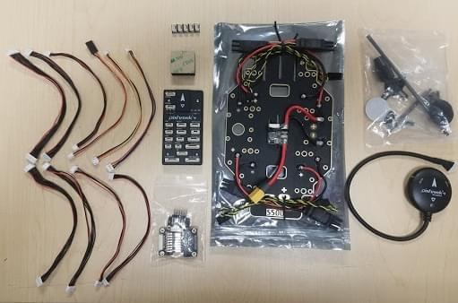
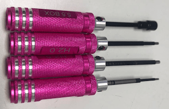
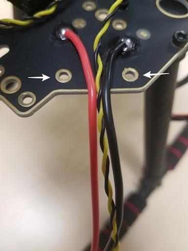
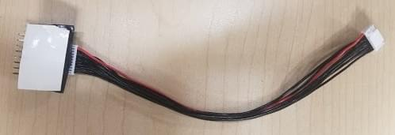
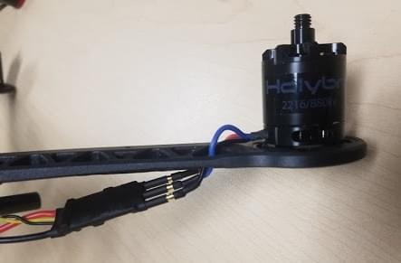

# Holybro S500 V2 + Pixhawk 4 组装

本节提供使用 *QGroundControl* 对该套件进行组装和 PX4 配置的完整说明。

::: info
Holybro 最初为该套件配备的是 [Holybro Pixhawk 4](../flight_controller/pixhawk4.md)，但撰写本文时已升级为更新的 Pixhawk（6C）。
本组装日志依然适用，因为套件装配过程基本相同，且随着飞控升级后也很可能保持不变。
:::

## 关键信息

- **机架:** Holybro S500
- **飞控:** [Pixhawk 4](../flight_controller/pixhawk4.md)
- **组装时间(约):** 90分钟(机架45分钟，飞控安装/配置45分钟)

## 物料清单

Holybro [S500 V2套件](https://holybro.com/collections/s500/products/s500-v2-development-kit) 包含几乎所有所需组件：

* 最新的Pixhawk自动驾驶仪  
  - 本记录使用的是Pixhawk 4，但当前版本包含更新的型号  
* 电源管理PM02（已组装）  
* 采用高强度塑料的ARM  
* 电机 - 2216 KV880（V2更新）  
* 螺旋桨1045（V2更新）  
* Pixhawk4 GPS  
* 集成电调的电源管理板（已完全组装）  
* 433 MHz / 915 MHz [Holybro遥测无线电](../telemetry/holybro_sik_radio.md)  
* 电源和无线电电缆  
* 电池绑带  
* 尺寸: 383*385*240mm  
* 轴距: 480mm  

::: info
不包含LiPo电池。  
此外，我们使用FrSky Taranis遥控器。
:::

## 硬件

项目描述 | 数量
---|---
轴距：480mm              |   1
臂                         |   4
起落架套装          |   2
M3*8螺丝                  |   18
M2 5*6螺丝                |   24
电池绑带               |   1
螺旋桨 1045 (V2 更新)   |   1

## 套件清单
项目 | 数量
---|---
Pixhawk 4                           |  1
Pixhawk4 GPS模块                    |  1
I2C转接板                          |  2
6芯至6芯电缆（电源）               |  3
4芯至4芯电缆（CAN）                |  2
6芯至4芯电缆（数据）               |  1
10芯至10芯电缆（PWM）              |  2
8芯至8芯电缆（辅助）               |  1
7芯至7芯电缆（SPI）                |  1
6芯至6芯电缆（调试）               |  1
PPM/SBUS输出电缆                   |  1
XSR接收机电缆                      |  1
DSMX接收机电缆                     |  1
SBUS接收机电缆                     |  1
USB电缆                            |  1
X型折叠支架                        |  1
70mm & 140mm碳纤维杆支架          |  2
6*3 2.54mm间距水平插针             |  1
8*3 2.54mm间距水平插针             |  2
泡沫套件                           |  1
Pixhawk4快速入门指南               |  1
Pixhawk4引脚图                     |  1
GPS快速入门指南                    |  1

### 电子元件
项目描述 | 数量
--- | --- 
Pixhawk 4飞控（不含PM06）          |  1
电源管理PM02（已组装）            |  1
电机 - 2216 KV880（V2升级版）     |  4
Pixhawk 4 GPS                     |  1
集成电源管理板与电调（已组装）    |  1
433MHz数传电台 / 915MHz数传电台   |  1

### 所需工具

本装配过程使用的工具包括：

- 1.5 mm六角螺丝刀
- 2.0 mm六角螺丝刀
- 2.5 mm六角螺丝刀
- 3mm十字螺丝刀
- 电线剪
- 精密镊子

## 组装

预计组装时间为90分钟，其中约45分钟用于框架组装，45分钟用于在QGroundControl中安装和配置自动驾驶仪。

1. 组装起落架。  
   我们将从将起落架组装到垂直杆开始。拧下起落架螺丝并插入垂直杆，如下图所示。

   

   

1. 将电源管理板组装到起落架上。将起落架与垂直杆拧到完全组装好的电源管理板上。  
   该板有4个孔（如下图箭头所示）。

  

  使用M3X8螺丝连接，共8个，每侧4个。

  

1. 将臂组装到电源管理板上。  
   将臂连接到电源管理板。

   

   

   使用M2 5X6螺丝，每个臂共2个。  
   从板的底部插入螺丝。

   

   确保电调电缆从臂的中间穿过。

   

1. 将8*3 2.54mm间距水平插针与10针到10针电缆（PWM）连接到电源管理板。  
   将10针到10针电缆（PWM）连接到8*3 2.54mm间距水平插针。

   

   剪下一段3M胶带并粘贴在水平插针底部：

   

   将水平插针粘贴到电源管理板上：

   

   

1. 将电机组装到臂上。为此需要16个M3X7螺丝、4个电机和4个臂。  
   将电机安装在每个臂上，将螺丝从臂的底部穿过：

   

   

   在4个电机安装到臂上后，取出红色、蓝色和黑色线缆并穿过臂部：

   

1. 组装GPS模块。  
   将GPS模块安装在指定位置，如下图所示。

   

1. Pixhawk 4接线。Pixhawk 4包含多条不同线路和连接。  
   下图展示了所有需要连接的线缆及其连接后的效果。

   

1. 将遥测模块和GPS模块连接到飞行控制器，如图37所示；同时连接遥控接收机、所有4个电调以及电源模块。

   

完全组装后的套件如下所示：

## PX4 配置

*QGroundControl* 用于安装 PX4 自动驾驶仪并针对 QAV250 机架进行配置/调参。
[下载并安装](http://qgroundcontrol.com/downloads/) *QGroundControl* 您平台的版本。

:::tip
完整的安装和配置 PX4 的说明请参见 [基本配置](../config/index.md)。
:::

首先更新固件和机架：

* [固件](../config/firmware.md)
* [机架](../config/airframe.md)

  您需要选择 *Holybro S500* 机架 (**四旋翼X型 > Holybro S500**)。

  

然后设置执行器输出：

- [执行器](../config/actuators.md)
  - 您无需更新机体几何参数（因为这是一个预配置的机架）。
  - 将执行器功能分配到输出端口以匹配您的接线。
  - 使用滑块测试配置。

然后执行必填的设置/校准：

* [传感器方向](../config/flight_controller_orientation.md)
* [指南针](../config/compass.md)
* [加速度计](../config/accelerometer.md)
* [水平地平线校准](../config/level_horizon_calibration.md)
* [遥控器设置](../config/radio.md)
* [飞行模式](../config/flight_mode.md)

理想情况下您还应执行：

* [电调校准](../advanced_config/esc_calibration.md)
* [电池估算调参](../config/battery.md)
* [安全设置](../config/safety.md)

## 调参

机体选择会为该机型设置*默认*自动驾驶仪参数。
这些参数足够完成飞行，但针对特定机型构建进行参数调优是更好的选择。

有关如何操作的说明，请从[Autotune](../config/autotune_mc.md)开始。

## 致谢

本构建日志由 Dronecode Test Flight Team 提供。