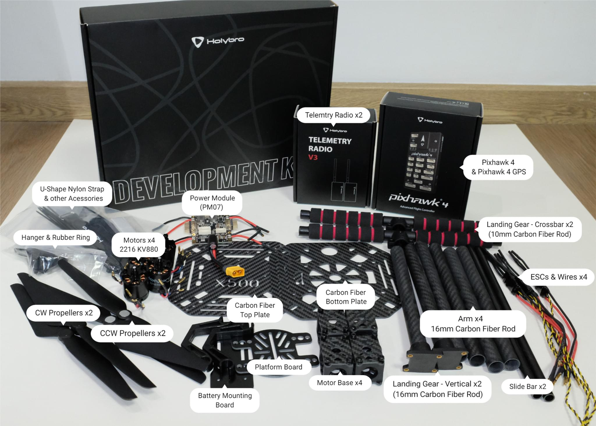

# Holybro X500 + Pixhawk4 构建

::: info
Holybro 最初随套件提供的飞控为 [Holybro Pixhawk 4](../flight_controller/pixhawk4.md)，但撰写本文时已升级为 [Holybro Pixhawk 6C](../flight_controller/pixhawk6c.md)。
本构建日志仍然适用，因为套件组装方式几乎相同，且随着飞控升级预计将继续保持。
:::

本主题提供使用 *QGroundControl* 完整构建套件和配置 PX4 的操作指南。

## 关键信息

- **完整套件：** [Holybro X500 套件](https://holybro.com/products/px4-development-kit-x500-v2)
- **飞控器：** [Pixhawk 4](../flight_controller/pixhawk4.md)
- **组装时间（约）：** 3.75 小时（180 分钟用于机架，45 分钟用于自动驾驶仪安装/配置）

## 物料清单

Holybro [X500套件](https://holybro.com/products/px4-development-kit-x500-v2) 几乎包含所有必需组件：

* [Pixhawk 4 飞控](../flight_controller/pixhawk4.md)
* [Holybro M8N GPS](https://holybro.com/collections/gps/products/m8n-gps)
* [电源管理模块 - PM07](../power_module/holybro_pm07_pixhawk4_power_module.md)
* Holybro电机 - 2216 KV880 x4（已过时，请查看[备件清单](https://holybro.com/products/spare-parts-x500-v2-kit)获取当前版本）
* Holybro BLHeli S 电调 20A x4（已过时，请查看[备件清单](https://holybro.com/products/spare-parts-x500-v2-kit)获取当前版本）
* 旋翼 - 1045 x4（已过时，请查看[备件清单](https://holybro.com/products/spare-parts-x500-v2-kit)获取当前版本）
* 电池绑带
* 电源和无线电线缆
* 机身框架 - 500 mm
* 尺寸 - 410x410x300 mm
* 433 MHz / 915 MHz [Holybro数传电台](../telemetry/holybro_sik_radio.md)

此外，如需手动控制无人机，还需要准备电池和接收机([兼容的遥控系统](../getting_started/rc_transmitter_receiver.md))。

## 主要硬件

本节列出机架和飞控安装所需的所有硬件。

| 项目 | 描述 | 数量 |
|---|---|---|
| 底板 | 碳纤维（2毫米厚） | 1 |
| 顶板 | 碳纤维（1.5毫米厚） | 1 |
| 臂 | 碳纤维管（直径：16毫米 长度：200毫米） | 4 |
| 起落架 - 竖杆 | 碳纤维管+工程塑料 | 2 |
| 起落架 - 横梁 | 碳纤维管+工程塑料+泡沫 | 2 |
| 电机底座 | 由6个部件和4颗螺丝4个螺母组成 | 4 |
| 滑动杆 | 直径：10毫米 长度：250毫米 | 2 |
| 电池安装板 | 厚度：2毫米 | 1 |
| 电池垫 | 3毫米黑色硅胶垫 | 1 |
| 平台板 | 厚度：2毫米 | 1 |
| 挂环&橡胶圈垫片 | 内孔直径：10毫米 黑色 | 8 |

### 电子设备

| 项目描述 | 数量 |
|---|---|
| Pixhawk4及配套线缆 | 1 |
| Pixhawk4 GPS模块 | 1 |
| 电源管理PM07（含预焊电调电源线） | 1 |
| 电机2216 KV880（V2升级版） | 4 |
| Holybro BLHeli S 20A电调 x4 | 1 |
| 433 MHz / 915 MHz [Holybro遥测无线电](../telemetry/holybro_sik_radio.md) | 1 |

### 所需工具

组装过程中使用以下工具：

- 1.5毫米六角螺丝刀
- 2.0毫米六角螺丝刀
- 2.5毫米六角螺丝刀
- 3毫米十字螺丝刀
- 5.5毫米套筒扳手或小钳子
- 电线剪
- 精密镊子## 组装

预估总组装时间为3.75小时（180分钟用于机架，45分钟用于飞控安装/配置）

1. 从组装起落架开始。
   拧开起落架螺丝，插入垂直杆（图1和图2）。

   

   _图2_：起落架组件

   

   _图2_：起落架组装完成

1. 将4个臂管穿过图3所示的4个电机底座。
   确保杆件略微伸出底座且所有4个臂管保持一致，同时确保电机线缆朝外。

   

   _图3_：将臂管连接到电机底座

1. 插入4个尼龙螺丝和尼龙垫片，使用4个尼龙螺母将电源模块PM07固定在底部板上，如图4所示。

   

   _图4_：安装电源模块

1. 将4个电机电调（ESC）穿过每个臂管，并将3根线缆连接到电机上（图5）。

   

   _图5_：连接电机

1. 将ESC电源线连接到电源模块PM07，黑色对黑色，红色对红色，ESC PWM信号线连接到"FMU-PWM-Out"。
   确保按正确顺序连接电机ESC PWM线。
   参考图7查看机体电机编号，并连接到PM07板上对应的编号。

   
   _图7_：ESC电源模块和信号接线

   电机上的颜色表示旋转方向（图7-1），黑色尖端为顺时针，白色尖端为逆时针。
   请遵循PX4四旋翼X型机体的电机方向参考（图7-2）。

   

   _图7_：电机顺序/方向图解

   

   _图7-1_：电机方向

1. 将10针线缆连接到FMU-PWM-in，将6针线缆连接到PM07电源模块的PWR1。

   

   _图8_：电源模块PWM和电源接线

1. 如果要在顶板上安装GPS，现在可以使用4颗螺丝和螺母将GPS支架固定在顶板上。

   

   _图9_：安装GPS支架

1. 将电源模块PM07固定在底部板上，使用4个尼龙螺母和垫片。

   

   _图10_：安装电源模块

1. 将4个电机电调（ESC）穿过每个臂管，并将3根线缆连接到电机上（图5）。

   

   _图11_：连接电机

1. 将ESC电源线连接到电源模块PM07，黑色对黑色，红色对红色，ESC PWM信号线连接到"FMU-PWM-Out"。
   确保按正确顺序连接电机ESC PWM线。
   参考图7查看机体电机编号，并连接到PM07板上对应的编号。

   
   _图12_：ESC电源模块和信号接线

   电机上的颜色表示旋转方向（图7-1），黑色尖端为顺时针，白色尖端为逆时针。
   请遵循PX4四旋翼X型机体的电机方向参考（图7-2）。

   

   _图13_：电机顺序/方向图解

   

   _图14_：电机方向

1. 将10针线缆连接到FMU-PWM-in，将6针线缆连接到PM07电源模块的PWR1。

   

   _图15_：电源模块PWM和电源接线

1. 如果要在顶板上安装GPS，现在可以使用4颗螺丝和螺母将GPS支架固定在顶板上。

   

   _图16_：安装GPS支架

请参考[Pixhawk 4 Quick Start]获取更多详细信息。

## PX4配置

:::tip
完整的安装和配置PX4的说明请参考[基础配置](../config/index.md)。
:::

*QGroundControl* 用于安装PX4飞控系统并针对X500机体进行配置/调参。
[下载并安装](http://qgroundcontrol.com/downloads/) *QGroundControl*，选择您对应的平台。

首先更新固件、机体和执行器映射：

- [固件](../config/firmware.md)
- [机体](../config/airframe.md)

  需要选择 *Holybro S500* 机体 (**四旋翼x > Holybro S500**)。

  

- [执行器](../config/actuators.md)
  - 由于这是预配置机体，无需更新机体几何结构。
  - 按照接线方式将执行器功能分配到输出端口。
  - 使用滑块测试配置。

然后执行必选的设置/校准：

- [传感器方向](../config/flight_controller_orientation.md)
- [指南针](../config/compass.md)
- [加速度计](../config/accelerometer.md)
- [水平校准](../config/level_horizon_calibration.md)
- [遥控器设置](../config/radio.md)
- [飞行模式](../config/flight_mode.md)

建议同时完成：

- [电调校准](../advanced_config/esc_calibration.md)
- [电池估算调参](../config/battery.md)
- [安全设置](../config/safety.md)

## 调参

机体选择会为该机体设置*默认*的自动驾驶参数。这些参数足以支持飞行，但针对特定机体结构进行参数调整会更好。

如何操作，请从[自动调参](../config/autotune_mc.md)开始。

## 致谢

此构建日志由Dronecode Test Flight Team提供。