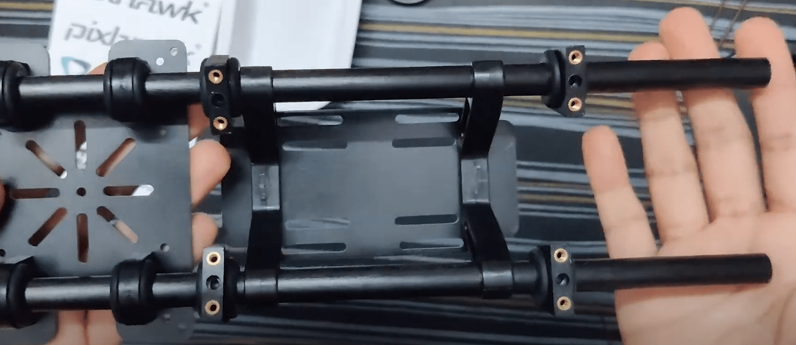
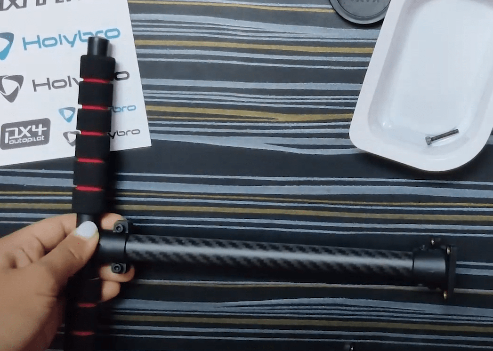
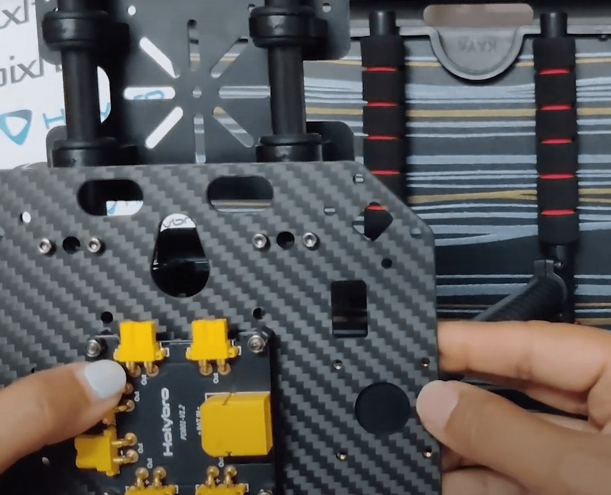

# Holybro X500 V2 + Pixhawk 6C (PX4开发套件)

本主题提供完整的[Holybro X500 V2 ARF套件](https://holybro.com/collections/x500-kits)组装说明，该套件也被称为Holybro PX4开发套件。

## 机体组装

::: info
- 本文档中的图片可点击查看对应步骤的YouTube视频。
- 每个章节顶部会列出所需螺丝。

:::

### 载荷与电池支架

**螺丝**- 沉头螺丝M2.5*6 12个

1. 将每个支架上的橡胶环密封圈插入对应位置。
   不要使用尖锐物体将橡胶压入内部。

   

1. 取出电池安装板，使用沉头螺丝M2.5*6将其与滑动杆夹固定。

   

1. 使用沉头螺丝M2.5*6将4个支架安装到平台板上。

   )

1. 取出滑动杆并将4个支架插入后，再将其固定到底板上。

   )

1. 现在插入第2步和第3步组装的电池支架和载荷支架。

### 动力模块

**螺丝**- 内六角螺钉M2.5*6 8个 | M3锁紧螺母 4个 | M3*5尼龙垫柱 4个 | M3*14螺丝 4个

   )

1. 取出底板，插入4个M3*14螺丝并在其上安装尼龙垫柱。

   

1. 放置电源分配板，使用锁紧螺母进行组装。电源模块PM02（用于Pixhawk 6C）将为该板供电。

   

1. 使用内六角螺钉M2.5*6将底板安装到4个支架上（这些支架已在载荷支架组装的第3步中安装到2个滑动杆上）

### 起落架

1. 组装起落架时，松开起落架-横梁预装螺丝，插入起落架-立柱并拧紧。

   

1. 按照视频操作组装GPS。

   

   本指南使用Holybro指南建议的GPS安装位置。
1. 使用M3锁紧螺母和M3*10螺丝将GPS安装座底部固定在载荷支架侧

   

### Pixhawk 6C

- PM02的线缆连接到Pixhawk的POWER1端口
- 通信链路连接到TELEM1端口
- GPS连接到GPS1端口

### 伴飞计算机（可选）

**螺丝**- 内六角螺钉M2.5*12 4个 | M2.5*5尼龙垫柱 4个 | M2.5锁紧螺母 4个

X500套件为伴飞计算机（如树莓派或Jetson nano）预留了安装空间[TBD]。
- 插入4个内六角螺钉M2.5*12并安装垫柱
- 将伴飞计算机放置到位后，使用M2.5锁紧螺母进行组装

### 摄像头

- 可使用深度相机支架安装Intel RealSense深度/跟踪相机或Structure Core等设备
- 将支架插入2个滑动杆内，并根据所用相机类型使用对应螺丝固定

## 安装/配置 PX4

:::tip
完整的安装和配置 PX4 的说明请参见 [基本配置](../config/index.md)。
:::

*QGroundControl* 用于安装 PX4 自动驾驶仪，并针对 X500 机型进行配置/调试。
[下载并安装](http://qgroundcontrol.com/downloads/) *QGroundControl*（适用于您的平台）。

首先更新固件、机型和执行器映射：

- [固件](../config/firmware.md)
- [机型](../config/airframe.md)

  您需要选择 *Holybro X500 V2* 机型（**四旋翼 x > Holybro 500 V2**）

  

- [执行器](../config/actuators.md)
  - 您无需更新机体几何参数（因为这是预配置的机型）。
  - 根据接线情况将执行器功能分配到输出端口。
    机型已预配置为电机连接在 **FMU PWM Out** 上。
  - 使用滑动条测试配置。

然后执行强制性的设置/校准：

- [传感器方向](../config/flight_controller_orientation.md)
- [指南针](../config/compass.md)
- [加速度计](../config/accelerometer.md)
- [水平地平线校准](../config/level_horizon_calibration.md)
- [遥控器设置](../config/radio.md)
- [飞行模式](../config/flight_mode.md)

理想情况下您还应完成：

- [电调校准](../advanced_config/esc_calibration.md)
- [电池估算调试](../config/battery.md)
- [安全设置](../config/safety.md)

## 调校

机体选择会为该机体设置 *默认* 自动驾驶参数。
这些参数足够用于飞行，但为特定机体结构调校参数是很有必要的。

操作指南请从 [自动调校](../config/autotune_mc.md) 开始。

## 致谢

本构建日志由 Akshata 和 Hamish Willee 提供，特别感谢 Holybro 和 Dronecode 提供的硬件与技术支持。