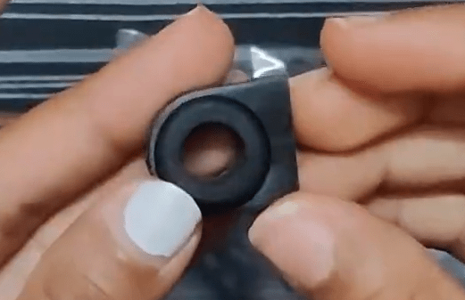
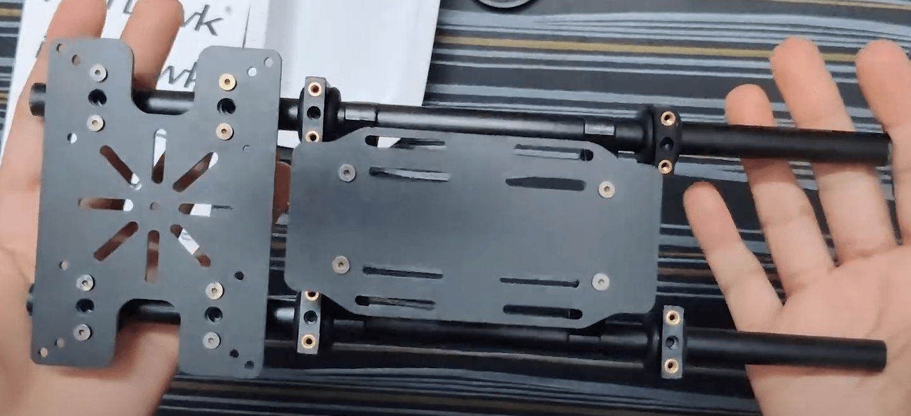
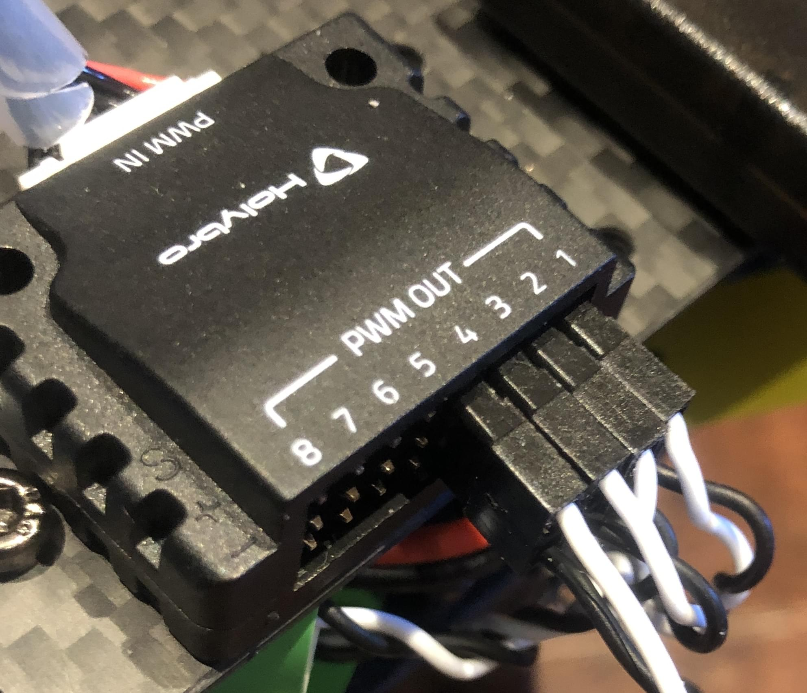
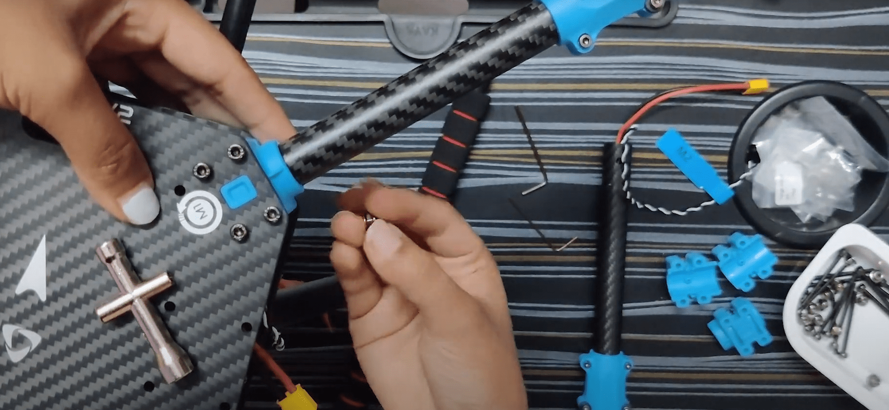
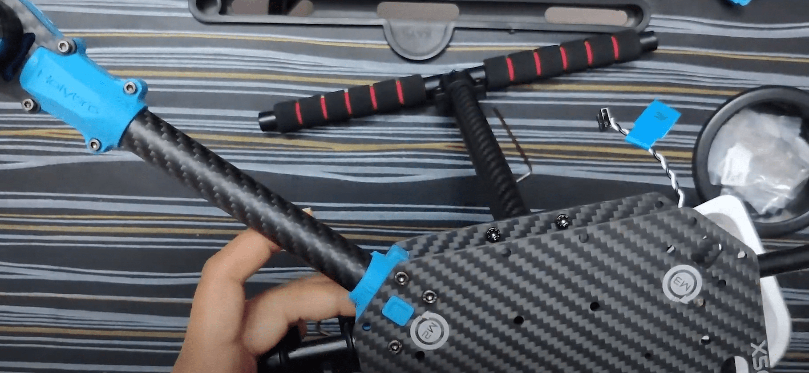
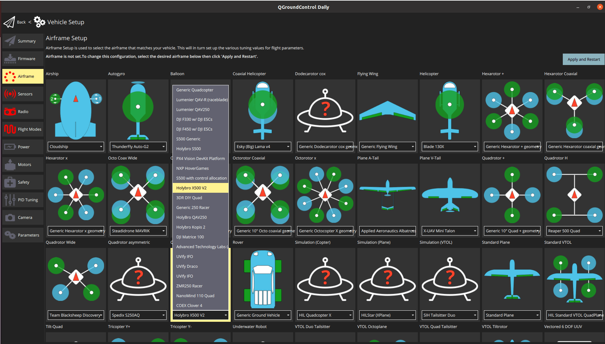

# Holybro X500 V2 + Pixhawk 6C（PX4 开发套件）

本主题提供了组装 [Holybro X500 V2 ARF套件](https://holybro.com/collections/x500-kits) 的完整说明，该套件也称为 Holybro PX4 开发套件。

## 组装

::: info
- 文档中的图片可点击以查看该步骤的YouTube视频。
- 每个部分会在顶部列出所需的螺丝。
:::

### 载荷和电池支架

**螺丝** - 沉头螺丝 M2.5*6 12个

1. 将挂架橡胶环形垫片插入各自的挂架中。
   不要使用尖锐物体将橡胶垫片压入内部。

   

1. 取出电池安装板，使用沉头螺丝 M2.5*6 与滑动杆夹具进行固定。

   

1. 使用沉头螺丝 M2.5*6 将4个挂架安装到平台板上。

   )

1. 取出滑动杆，将4个挂架插入后固定在底板上。

   )

1. 现在将第2步和第3步组装的电池支架和载荷支架插入

### 电源模块

**螺丝**- 圆头螺钉 M2.5*6 8个 | M3锁紧螺母 4个 | 尼龙支柱 M3*5 4个 | M3*14 螺丝 4个

   )

1. 取底部板并插入4个 M3*14 螺丝，将尼龙支柱固定在其上。

   

1. 放置电源分配板并使用锁紧螺母进行组装。电源模块 PM02（用于 Pixhawk 6C）将为该板供电。

   

1. 使用圆头螺钉 M2.5*6 将底部板安装在4个悬挂件上（我们已在载荷支架组装的第3步中插入的2个杆件上）

### 起落架

1. 组装起落架时，请松开起落架横梁的预装螺丝，插入起落架立柱并拧紧

   

   

1. 使用沉头螺钉 M3*8 将起落架固定到底板上

   

   

由于在顶板组装完成后插入线缆会比较费劲，建议提前完成布线工作。  
尽管该设计良好，即使后期再进行布线也是可以的。

### Power

Pixhawk 6C通过电源模块PM02供电(在此情况下)。
该电源模块由电池(4S 16.8V 5200 mAh)供电。

电机通过电源分配板供电，如下图所示。

请注意电调接头是颜色编码的，必须插入到PWM输出中，使白色线缆朝上。

### 机臂

**六角法兰螺钉** Socket Cap Screw M3*38 16个 | 法兰锁紧螺母 Flange Locknut M3 16个

1. 安装机臂相对简单，因为电机已预组装完成。
   - 请确保将正确编号的机臂与其电机安装在对应侧。

   

   :::tip
   使用六角钥匙或任何细长物品，将其插入螺栓待紧固面的对面进行操作。
   :::

1. 取一个机臂，将矩形型材插入到底板上的矩形空腔内。

   

1. 在将顶板安装到这个三组件（底板、顶板与机臂）时，需使用六角法兰螺钉 Socket Cap Screw M3*38 和法兰锁紧螺母 Flange Locknut M3 进行固定。
1. 使用开发套件中提供的迷你十字扳手固定一侧。

   

1. 在所有3个电机都安装到位前不要拧紧任何螺丝，否则在安装第3和第4个电机时可能会遇到困难。

   

### 螺旋桨

- 底板指示电机的方向。
- 带有白色/银色涂层的螺旋桨应安装在对应相同涂层的电机上。
- 螺旋桨的解锁和锁定状态在螺旋桨本身上有所标识。
- 使用这4个螺旋桨，并根据上述三点注意事项将它们安装到电机上。

以下部件可按常规方式安装。

### GPS

**螺丝-** 锁紧螺母 M3 4个 | 螺丝 M3*10 4个

1. 按照视频组装GPS。

   

   本指南使用了Holybro指南中建议的GPS安装位置。
1. 使用锁紧螺母 M3 和螺丝 M3*10 将GPS支架的底部固定在载荷固定架的一侧

   

### Pixhawk 6C

- PM02的线连接到Pixhawk的POWER1
- 遥测信号连接到TELEM1
- GPS连接到GPS1

### 伴飞计算机（可选）

**螺丝-** 套筒头螺丝 M2.5*12 4个 | 尼龙垫柱 M2.5*5 4个 锁紧螺母 M2.5 4个

X500 套件提供了安装伴飞计算机的空间，例如 Raspberry Pi 或 Jetson nano 可安装在此处 [TBD]。
- 插入 4 个套筒头螺丝 M2.5*12，并将垫柱放置其上。
- 然后将伴飞计算机放置好，并使用锁紧螺母 M2.5 进行组装

### 摄像头

- 可通过 Depth Camera Mount 安装 Intel Realsense 深度/追踪摄像头或 Structure Core
- 仅需将支架插入两条支架内，并根据所用摄像头使用对应的螺丝

## 安装/配置 PX4

:::tip
完整的安装和配置 PX4 的说明请参见 [基本配置](../config/index.md)。
:::

*QGroundControl* 用于安装 PX4 自动驾驶仪，并针对 X500 机体框架进行配置/调参。
[下载并安装](http://qgroundcontrol.com/downloads/) *QGroundControl* 以适配你的平台。

首先更新固件、机体框架和执行器映射：

- [固件](../config/firmware.md)
- [机体框架](../config/airframe.md)

  你需要选择 *Holybro X500 V2* 机体框架 (**四旋翼 x > Holybro 500 V2**)

  

- [执行器](../config/actuators.md)
  - 无需更新机体几何参数（因为该机体框架已预配置）。
  - 根据接线情况将执行器功能分配到输出端。
    机体框架已预配置为将电机连接到 **FMU PWM Out**。
  - 使用滑块测试配置。

然后执行强制设置/校准：

- [传感器方向](../config/flight_controller_orientation.md)
- [指南针](../config/compass.md)
- [加速度计](../config/accelerometer.md)
- [水平校准](../config/level_horizon_calibration.md)
- [遥控器设置](../config/radio.md)
- [飞行模式](../config/flight_mode.md)

理想情况下你还需要进行：

- [电调校准](../advanced_config/esc_calibration.md)
- [电池估算调参](../config/battery.md)
- [安全设置](../config/safety.md)

## 调参

机身选择会为该机体设置*默认*自动驾驶参数。
这些参数已经足够用于飞行，但为特定机身结构调整参数是个好主意。

如需相关操作指导，请从[自动调参](../config/autotune_mc.md)开始。

## 致谢

本构建日志由 Akshata 和 Hamish Willee 提供，同时衷心感谢 Holybro 和 Dronecode 提供的硬件和技术支持。