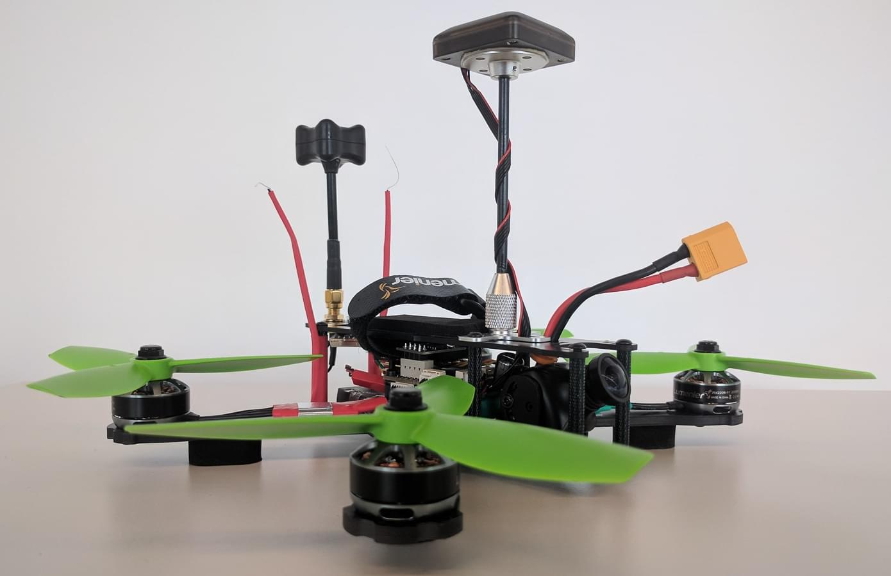
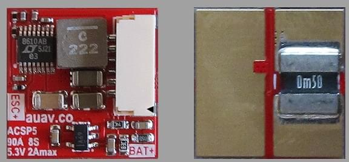
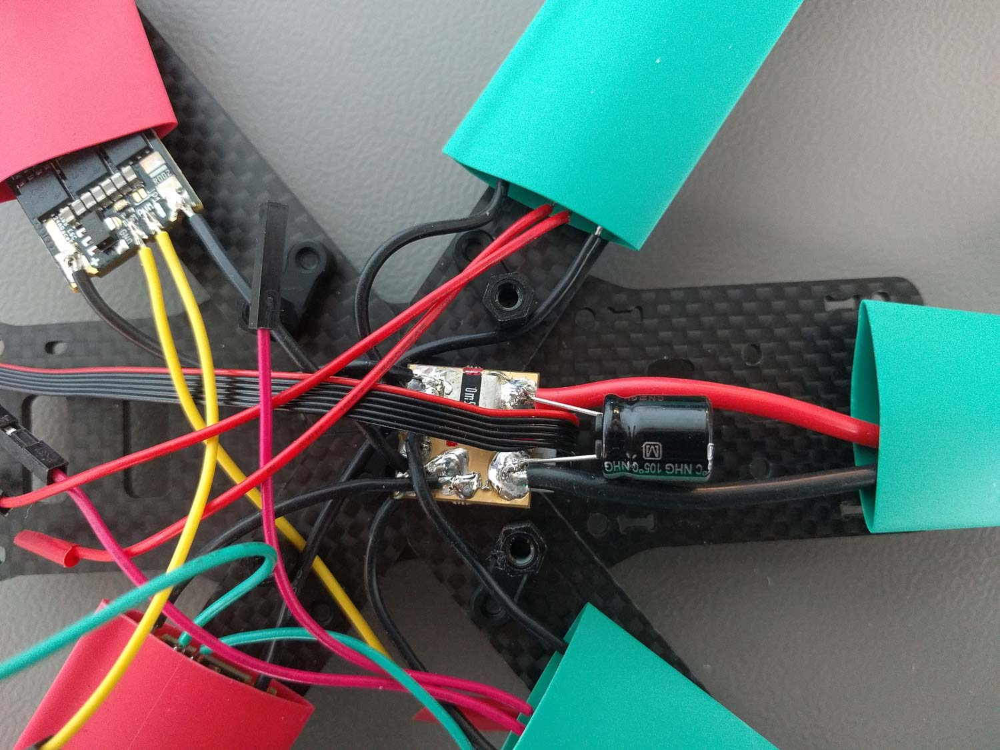
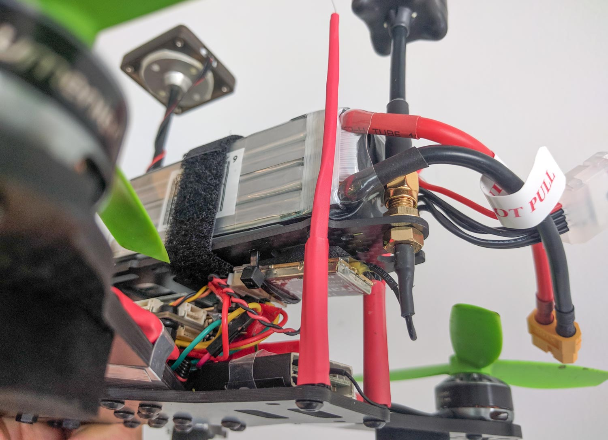

# Lumenier QAV-R 5英寸竞速机（Pixracer）

Lumenier QAV-R 5英寸FPV竞速四旋翼飞行器是一款具有可拆卸机臂的刚性、轻量且快速的FPV竞速机。  
本主题提供使用该机架与 *Pixracer* 飞控及 *KISS 24A Race Edition* 电调的完整组装和配置说明，同时也包含（可选）FPV系统搭建的相关信息。

关键信息：

- **机架：** [Lumenier QAV-R 5英寸](http://www.getfpv.com/qav-r-fpv-racing-quadcopter-5.html)  
- **飞控：** [Pixracer](../flight_controller/pixracer.md)  

<lite-youtube videoid="wMYgqvsNEwQ" title="QAV-R 5 PX4 FPV Racequad"/>

  

## 零部件清单

### 机体（飞行所需）

* 飞控：[Pixracer](../flight_controller/pixracer.md)（来自[AUAV](https://store.mrobotics.io/mRo-PixRacer-R14-Official-p/auav-pxrcr-r14-mr.htm)），包含ESP8266 WiFi模块和[ACSP5](https://store.mrobotics.io/product-p/auav-acsp5-mr.htm) 电源模块  
* 机架：[Lumenier QAV-R 5"](http://www.getfpv.com/qav-r-fpv-racing-quadcopter-5.html)  
* 电机：[Lumenier RX2206-11 2350KV](http://www.getfpv.com/lumenier-rx2206-11-2350kv-motor.html)  
* 电调：[KISS 24A Race Edition](http://www.getfpv.com/kiss-24a-esc-race-edition-32bit-brushless-motor-ctrl.html)  
* 螺旋桨：HQProp 5x4.5x3 [CW](http://www.getfpv.com/hqprop-5x4-5x3rg-cw-propeller-3-blade-2-pack-green-nylon-glass-fiber.html) [CCW](http://www.getfpv.com/hqprop-5x4-5x3g-ccw-propeller-3-blade-2-pack-green-nylon-glass-fiber.html)  
* GPS/外置磁罗盘：从[Pixhawk Mini（已停产）](../flight_controller/pixhawk_mini.md) 套件中取下的M8N模块并重新布线  
* 电池：[TATTU 1800mAh 4s 75c Lipo](http://www.getfpv.com/tattu-1800mah-4s-75c-lipo-battery.html)  
* 遥控接收机：[FrSky X4R-SB](http://www.getfpv.com/frsky-x4r-sb-3-16-channel-receiver-w-sbus.html)  
* 遥控发射机：[FrSky Taranis](http://www.getfpv.com/frsky-taranis-x9d-plus-2-4ghz-accst-radio-w-soft-case-mode-2.html)  
* 飞控减震：[O型环](http://www.getfpv.com/multipurpose-o-ring-set-of-8.html)  
* GPS支架：[GPS天线杆](http://www.getfpv.com/folding-aluminum-gps-mast-for-dji.html)  

### FPV（可选）

* 摄像头：[RunCam Swift RR Edition](https://www.getfpv.com/runcam-swift-rotor-riot-special-edition-ir-block-black.html) **包含必备的GoPro高清广角镜头！**  
* 视频发射器：[ImmersionRC Tramp HV 5.8GHz 600mW](https://www.getfpv.com/immersionrc-tramp-hv-5-8ghz-video-tx-us-version.html)（已停产）。  
* 视频天线：[TBS Triumph 5.8GHz CP](http://www.getfpv.com/fpv/antennas/tbs-triumph-5-8ghz-cp-fpv-antenna-3275.html)（SMA接口适配ImmercionRC发射器）  
* FPV电源插头：[JST公头电池引线](http://www.getfpv.com/male-jst-battery-pigtail-10cm-10pcs-bag.html)  

::: info  
这些组件涵盖标准FPV 5.8GHz模拟FM视频的发送端。您需要兼容的接收端和显示设备才能接收实时视频流。  
:::

## 组装基本机架

我按照视频中09:25至13:26的时间段所示方式组装了基本的中心板和臂结构：

<lite-youtube videoid="7SIpJccXZjM" title="How to Build a Lumenier QAV-R"/>

我将四个电机安装在机架上，线缆朝向机体中心方向。每个电机我使用了配套的较长电机螺丝，并将它们安装在间距更大的两个孔位中。

## 构建动力系统

KISS电调因其出色的性能而闻名，但也存在两个缺点：

- 其使用的软件不是开源的(与BLHeli不同)
- 据我所知，没有预焊接导线和/或插头的硬件套件

这意味着我们需要在每个电调上至少焊接6个焊点，但这仍然非常值得。

:::tip
在实际焊接之前，务必先将希望连接的两侧用焊锡搪锡。
这将使焊接更容易，并且减少出现冷焊点的可能性。
:::

:::tip
确保为从电池到电机的高电流传输电源连接使用适当线径的电缆。
相比之下，所有信号线都可以非常细。
:::

:::tip
在开始焊接前就将热缩管套在导线上！
成功完成功能测试后，对电调、电源模块和自由浮动的无绝缘导线焊点进行热缩处理，可以保护它们免受灰尘、湿气和物理损伤。
:::

### 电机

首先，我将所有三个电机导线裁剪成适当长度，使得当电调安装在机臂中心偏移位置时能够直接适配，同时保留足够的余量以便于部件安装，不会对导线造成张力。
然后按照电机输出顺序将它们焊接到电调的输出端子上，电调的开关MOSFET朝上以获得飞行时的良好散热。
选择这种导线顺序的结果是所有电机在测试中都是逆时针旋转，我在必要时通过桥接专用的[JP1焊接跳线](https://1.bp.blogspot.com/-JZoWC1LjLis/VtMP6XdU9AI/AAAAAAAAAiU/4dygNp0hpwc/s640/KISS-ESC-2-5S-24A-race-edition-32bit-brushless-motor-ctrl.jpg)来调整旋转方向，以符合[四旋翼X型配置](../airframes/airframe_reference.md#quadrotor-x)。

### 电源模块

首先，我将机架附带的XT60连接器焊接到Pixracer配套的*ACSP5电源模块*上电池侧标示的接线端，并将电源模块配送的电解电容按正确极性焊接到同一侧。

现在到了棘手的部分。我将所有四个电调电压源+和-端口焊接到电源模块标示的电调输出侧对应焊盘上。
务必确保此处没有冷焊点，因为飞行时的松动连接会导致四旋翼机故障。
使用机架附带的额外配电板会简化工作，但在这种小型机架上会占用过多空间...

:::tip
如果同时安装FPV部件，不要忘记将JST公头电源插头焊接到电源模块的输出侧。
之后进行[FPV设置](#fpv-setup)时会需要它。
:::

### 信号线

我使用了带有标准化针脚接头的细电缆，并将其切成两半作为电调信号线，因为这将便于后续插接到Pixracer的针脚上。
只有标有`PWM`的[KISS电调](https://1.bp.blogspot.com/-0huvLXoOygM/VtMNAOGkE5I/AAAAAAAAAiA/eNNuuySFeRY/s640/KISS-ESC-2-5S-24A-race-edition-32bit-brushless-motor-ctrl.jpg)端口对飞行是必要的。
它们将连接到Pixracer的对应电机信号输出端。
`TLM`端口用于电调遥测，我为其焊接了导线以备将来使用，因为当前所需协议尚未被PX4支持。

在继续下一步之前，我使用廉价的PWM舵机测试仪测试了所有电调电机对及其旋转方向。

## 连接与安装电子元件

:::tip
请仔细检查所连接每个组件的引脚分配。
令人遗憾的是，即使某些硬件组件看起来可以即插即用，实际上并非所有组件都如此。
:::

你需要参考[Pixracer硬件文档](../flight_controller/pixracer.md)来找到所有需要的连接器。
我尝试将所有线缆布线在Pixracer板下方，以保持整洁的构建并为未来的FPV摄像头和发射机留出空间。

我使用QAV-R框架附带的尼龙垫片和螺丝安装Pixracer，但**在板和垫片之间加了一些小O型圈**以增加减震效果。
务必**不要过度或轻微拧紧螺丝**，调整到板子与两侧接触但没有任何张力。
板子不应以任何方式晃动，但如果用手指施加力量时应略可移动。

:::warning
这会严重影响陀螺仪和加速度计传感器在飞行时测量的振动噪声水平。
:::

### 无线电接收器

我使用了Pixracer附带的电缆连接FrSky S-BUS接收器，但剪掉了不必要的电缆分支。

对于智能遥测端口，我使用了接收器附带的电缆。
用镊子移除了连接器上所有不必要的引脚，并将白色自由端电缆切换到连接器的正确引脚以连接"smart"信号。
我随后按照此接线图将自由端焊接至适配FrSky端口的电缆：

我跳过了地线(GND)引脚，因为像电压正极引脚一样，它已经通过RCin S-BUS电缆连接。

### 无线电天线安装

为了保持良好的无线电连接同时避免天线靠近螺旋桨，我使用热缩管和扎带进行了坚固的安装。

此方法中，你需要剪掉扎带的大孔端，将剩余部分与天线电缆一起穿过长热缩管，并使用更大但较短的热缩管将其安装到框架垫片上。

### 电子调速器(ESC)信号

对于ESC信号，我遵循了[Pixracer硬件文档](../flight_controller/pixracer.md)和[四旋翼X配置](../airframes/airframe_reference.md#quadrotor-x)的电机编号方案。
由于没有地线或正极BEC电压连接，我们将`PWM` ESC信号线连接到对应输出接口的顶部引脚。

### GPS / 外部磁力计

我使用了适配所用GPS连接器的电缆，并附带了Pixracer套装。
不幸的是引脚分配完全错误，我根据[3DR Pixhawk Mini用户手册](../flight_controller/pixhawk_mini.md#connector-pin-assignments-pin-outs)的GPS端口用镊子重新接线。

#### Pixracer GPS/I2C端口

| 引脚 | 分配 |
| ---- | ---- |
| 1    | GND  |
| 2    | SDA  |
| 3    | SCL  |
| 4    | RX   |
| 5    | TX   |
| 6    | +5V  |

#### M8N 3DR Pixhawk mini GPS连接器

| 引脚(颜色) | 分配 | 连接到Pixracer引脚 |
| -------- | ---- | ------------------ |
| 1(红色)  | SCL  | 3                  |
| 2        | SDA  | 2                  |
| 3        | VCC 5V | 6                |
| 4        | RX   | 5                  |
| 5        | TX   | 4                  |
| 6        | GND  | 1                  |

我使用通用多旋翼GPS支架安装GPS模块，因为安装得太靠近主体会导致磁力计读数完全不可用。
将模块直接安装在框架顶部后方的实验显示，磁力计噪声幅度是正常值的6倍，这很可能是由ESC电流产生的磁场造成的。
注意我缩短了支架约2cm以更好地适配电缆长度和框架尺寸。GPS模块通过双面胶带固定在支架的顶部板上。

## FPV 设置

这是关于可选的 5.8GHz FPV 实时视频传输的安装说明。
你需要参考开头列出的额外 FPV 配件。
此处描述的 FPV 传输系统在电子上独立于飞控系统，它仅在电源模块后获取电池电压。

我首先进行了桌面测试以确保所有设备正常工作。
为此，请将发射器自带的视频信号线连接到 FPV 摄像机的后部接口和发射器的对应插头。然后将 JST 电源插头连接到你的机体或其它电压源。
发射器的 LED 应该会亮起。
使用调到正确频道的 5.8GHz 接收设备来检查视频信号。
如需配置发射器到其他频道或调整发射功率，请参考 [Tramp HV 用户手册](https://www.immersionrc.com/?download=5016)。

如你所见，我使用扎带从内部将发射器固定到机架的"顶部"。
在这种情况下安装电子设备时，务必在设备间放置自粘泡沫垫，以防止飞行时造成物理损伤。
确保将发射器放置在天线接口能对准机架专用孔位的位置。

配件清单中的精美 FPV 摄像机不仅配备我见过的最优质的 FPV 镜头，还包含多个摄像机支架，其中一种支架具有高度灵活的调节角度功能，且与 QAV-R 机架完美契合。
我按照下图方式安装了摄像机。用于将摄像机支架固定到机架的两个螺丝和螺母是从机架套件剩余的备用件中取用的。

# PX4 配置

*QGroundControl* 用于安装 PX4 飞控系统并为机体进行配置/调参。  
[下载并安装](http://qgroundcontrol.com/downloads/) *QGroundControl* 到您的平台。

:::tip
完整的安装和配置说明请参见 [基础配置](../config/index.md)。
:::

:::warning
在进行任何初始配置时，务必确保机体上的电池或螺旋桨已物理移除。  
安全永远放在第一位！
:::

首先更新固件、机架和执行器映射：

- [固件](../config/firmware.md)
- [机架](../config/airframe.md)

  需要选择 **Quadrotor x > Generic 250 Racer**（通用250赛车）机架。

  

- [执行器](../config/actuators.md)
  - 通常无需更新机体几何参数。
  - 按照接线方式将执行器功能分配到输出端口。
  - 通过滑块测试配置。

然后执行强制设置/校准：

* [传感器方向](../config/flight_controller_orientation.md)
* [指南针](../config/compass.md)
* [加速度计](../config/accelerometer.md)
* [水平地平线校准](../config/level_horizon_calibration.md)
* [遥控器设置](../config/radio.md)
* [飞行模式](../config/flight_mode.md)

建议同时完成以下配置：

- [电调校准](../advanced_config/esc_calibration.md)
- [电池估算调参](../config/battery.md)
  - 4S（4节锂电）充电单节电压4.15V，放电单节电压3.5V（或根据所用电池调整相应值）。
- [安全设置](../config/safety.md)

### 调参

机架选择会为机体设置 *默认* 飞控参数。这些参数已足够飞行使用，但为特定机体结构进行调参是更好的选择。

具体操作说明请从 [自动调参](../config/autotune_mc.md) 开始。