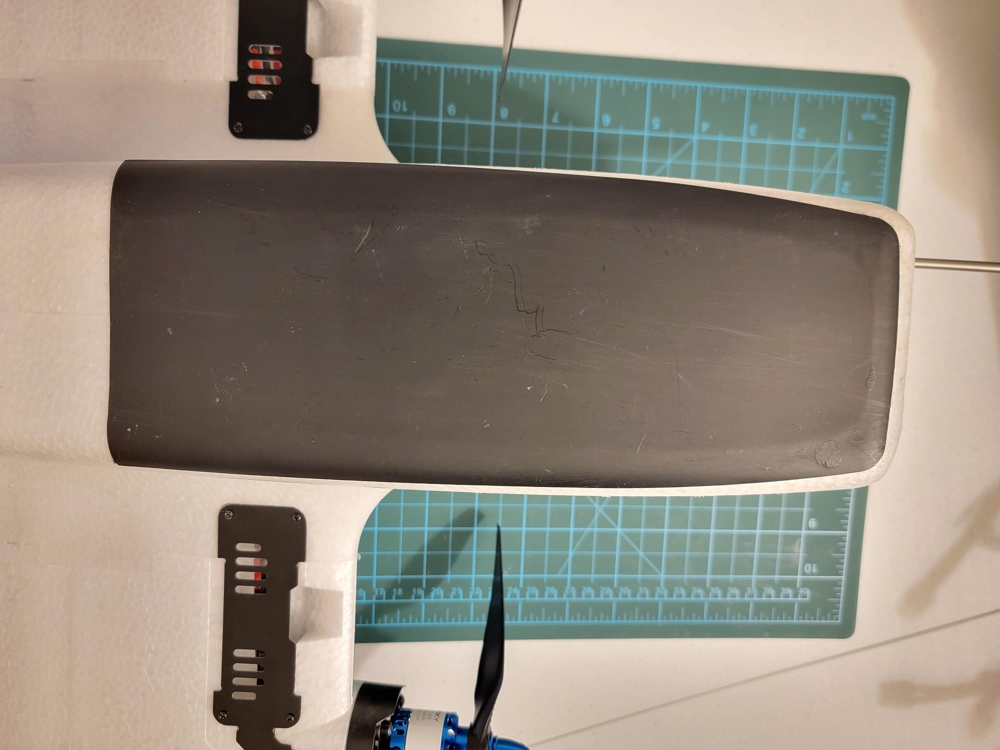
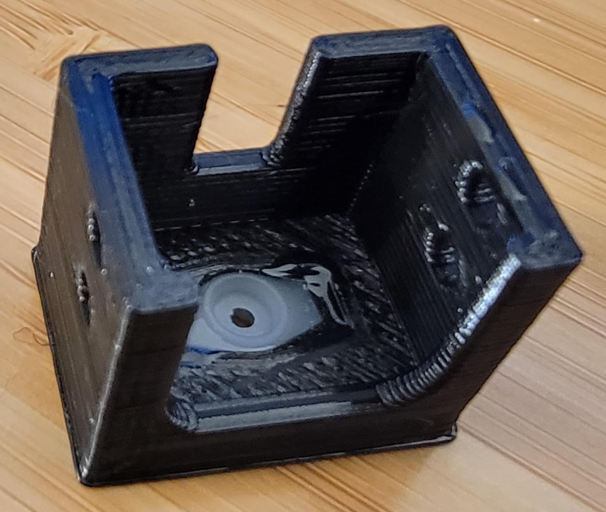
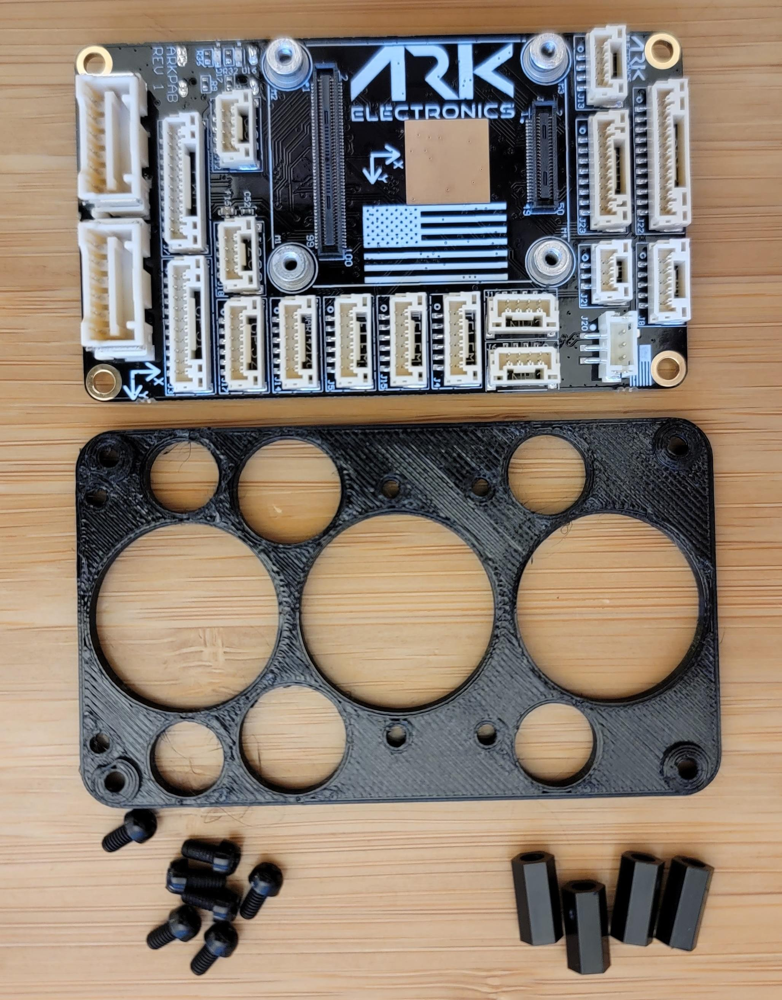
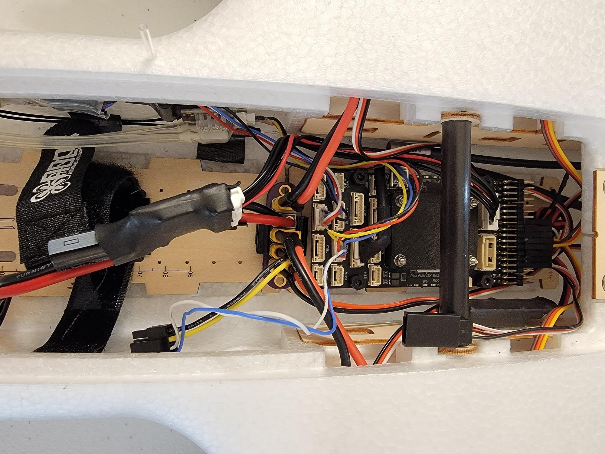

# 双龙2 (RD2) 机体构建

双龙2是一款专为高效第一视角（FPV）飞行设计的双电机遥控飞机。  
由于专为FPV设计，RD2在设计上优化了摄像机、传感器、逻辑电子设备、大容量电池、天线及典型FPV飞机上常见的其他载荷组件的安装便利性。  
这种对载荷的重视使该飞机成为PX4安装的理想候选机型。


## 概述

本项目的构建目标是创建一个高效且续航时间长的FPV平台，用于通用的PX4测试与开发。

关键机身特点:

- 宽敞的内部空间
- 通过顶部大舱门可轻松访问整个机身腔体
- 尾部舱门
- 可选拆除式V尾或传统尾翼设计
- 机翼和机身顶部设有螺纹嵌件用于外部安装
- 丰富的安装特性
  - 顶部天线开孔
  - 顶部GPS盖板
  - 侧向"T"型天线支架
  - 尾部电子设备托架
  - 前向动作相机开孔
  - 前向FPV摄像头开孔
- 可拆卸机翼
- 低失速速度
- 柔和的操作特性

关键构建特点

- 整体构建简便
- 可轻松访问Pixhawk和所有外设
- 配备云台的FPV摄像头
- 通过皮托管获取空速数据
- 约40分钟的飞行时长## 部件清单

- [Reptile Dragon 2 套件](https://usa.banggood.com/REPTILE-DRAGON-2-1200mm-Wingspan-Twin-Motor-Double-Tail-EPP-FPV-RC-Airplane-KIT-or-PNP-p-1805237.html?cur_warehouse=CN&ID=531466)

- [ARK6X FMU](https://arkelectron.com/product/arkv6x/)
- [ARK6X 载板](https://arkelectron.com/product/ark-pixhawk-autopilot-bus-carrier/)
- [替代FMU载板: Holybro Pixhawk 5x 载板](https://holybro.com/products/pixhawk-baseboards)
- [Holybro 电源模块](https://holybro.com/products/pm02d-power-module)
- [Holybro M9N GPS 模块](https://holybro.com/products/m9n-gps)
- Holybro PWM 分线板
- MS4525DO 差压模块和皮托管
- [Caddx Vista FPV 飞行单元](https://caddxfpv.com/products/caddx-vista-kit)
- [Emax ES08MA ii](https://emaxmodel.com/products/emax-es08ma-ii-12g-mini-metal-gear-analog-servo-for-rc-model-robot-pwm-servo)
- [DJI FPV 护目镜](https://www.dji.com/fpv)
- [ExpressLRS Matek 多路接收机](http://www.mateksys.com/?portfolio=elrs-r24)
- [5V BEC](https://www.readymaderc.com/products/details/rmrc-3a-power-regulator-5-to-6-volt-ubec)
- [6s2p 18650 锂电飞行电池](https://www.upgradeenergytech.com/product-page/6s-22-2v-5600mah-30c-dark-lithium-liion-drone-battery) (选择 XT60 接口)
- [定制设计的3D打印部件](https://github.com/PX4/PX4-user_guide/raw/main/assets/airframes/fw/reptile_dragon_2/rd2_3d_printed_parts.zip)
  - ARK6X 载板安装架
  - Holybro Pixhawk 5x 载板安装架
  - FPV 模块和摄像头安装架
  - 皮托管静压探头"插头"适配器
- [定制设计的电源分配PCB](https://github.com/PX4/PX4-user_guide/raw/main/assets/airframes/fw/reptile_dragon_2/xt30_power_distro_pcb.zip)
- 其他硬件: M3 硬件(隔离柱、垫圈、O型圈、螺栓)，M2.5 尼龙隔离柱和螺丝，XT30 接插件，热熔胶，热缩管，Molex Microfit 接插件
- 硅胶线缆(14awg 大电流用，16awg 小电流用，22awg 小功率和信号用)

## 工具

组装过程中使用了以下工具：

- 舵机测试仪（带中心按钮）  
- 螺丝刀套装  
- 3D打印机  
- 扳手套装  
- 胶水：热熔胶、CA（氰基丙烯酸酯）胶水、"Foamtac"胶水  
- 砂纸## 机体构建

该飞机开箱后需要进行部分组装。舵机、机翼和尾部均需安装。

::: info
对于此部分的组装，套件附带的说明书应足够，但以下列出了一些有用的提示。
:::

### 泡沫粘接

在将RD2的泡沫部件粘接时，使用砂纸将接合面打磨粗糙，然后使用CA胶水。如果泡沫未用砂纸打磨，胶水将无法获得足够的表面附着力，粘接效果会很差。

Foamtac似乎无法很好地粘接该泡沫，因此我使用CA胶水粘接所有泡沫与泡沫的接合处。

### 滑橇板

RD2附带的滑橇板需要修剪以适配安装。



修剪掉滑橇板平面侧的模具残留。使用粗砂纸将滑橇板内侧表面和机体底部的接合面打磨粗糙。确认适配后，使用CA胶水将滑橇板粘接到RD2底部。

### 舵机安装

::: info
安装舵机前，建议使用砂纸将舵机朝向舵机盖的一侧打磨粗糙。最终安装时，在舵机与盖板之间挤一滴Foamtac。这将防止舵机安装后移动。
:::


RD2的舵机通过可调舵机连杆连接到控制面。RD2的说明书中会注明每个控制面使用特定长度的连杆（包含在套件中）。安装前请务必测量每个连杆的长度，确保其与对应控制面的长度匹配。将舵机与控制面的机械行程范围对齐非常重要。当舵机处于中心位置时，舵机臂应与舵机呈90度角，控制面应大致居中。完全对齐可能难以实现，剩余偏移量将在软件中调整。

执行舵机对齐的步骤如下：

1. 将舵机置于飞机外部
2. 使用舵机测试仪将舵机移动到中心位置
3. 安装舵机连杆，使用附带的固定螺丝，注意将连杆调整到尽可能接近舵机90度角的一侧
4. 将舵机安装到飞机的舵机槽中
5. 安装连杆，并旋转调整使其尽可能使控制面居中

::: info
由于舵机轴上的齿，舵机连杆可能不会正好与舵机呈90度角。如上例所示，只需接近90度即可。剩余偏移量可通过连杆调整，或在软件中后续调整。
:::

## GPS/指南针模块安装

GPS/指南针模块应安装在RD2配套的后部电子架上。  
该位置远离电源线（以及任何可能造成磁干扰的设备），是GPS/指南针模块的理想安装位置。


GPS模块可以从塑料外壳中取出，以便使用安装孔。  
然后使用尼龙M3紧固件将其固定到后部电子架上。

电子架上已有两个安装孔与模块需求重合，因此我使用标记笔和钻头标记并钻出第三个孔。

## FPV舱体

### FPV舱体组装

首先将ES08MA ii舵机安装到FPV舱体的舵机槽中。
舵机应直接插入，线缆通过舵机槽上的孔穿出FPV舱体。
用一点Foamtac胶水固定舵机。



使用ES08ma ii套装中包含的舵机臂。
裁切舵机臂使其能嵌入FPV舱体摄像头支架的凹槽中。
确保其与凹槽底部齐平。
用CA胶固定舵机臂。

使用舵机测试仪将舵机调至中位。
将摄像头支架舵机臂直接安装在舵机顶部，并用附带的螺丝固定。
用两个侧边螺丝将DJI FPV摄像头固定在支架上。

完成FPV舱体组装后，使用长M2螺栓、1mm垫片和尼龙锁紧螺母将Caddx Vista安装在舱体背部。


### FPV舱体机体安装

FPV舱体通过尼龙M3螺栓安装在电池舱盖顶部，使用两个O型圈使FPV舱体底板与电池舱盖保持间距。

## 飞行计算机安装

::: info
此版本兼容ARK6X载体板和Holybro 5X载体板
两种安装方式均提供指导说明
:::


RD2机体预装了木质电子设备安装基板。在本图中，两组标记刻度指示了各载体板安装位置的基准线；单独刻度对应Holybro 5X载体板安装位，双刻度对应ARK5X载体板安装位。

### ARK6X载体板（推荐）

为ARK6X载体板定制了3D打印支架。使用M2.5尼龙紧固件将ARK6X载体板固定在支架上。




ARK6X载体板没有常规舵机输出接口，而是配备单个JST GH连接器，该连接器承载8路FMU舵机输出。使用Holybro PWM分配板将单个JST GH PWM输出接口拆分为8个独立舵机通道。


此处展示的ARK6X载体板已安装在基板上。注意载体板尾部与双刻度标记对齐。


最终，ARK6X被安装在支架顶部。


### Holybro 5X载体板（可选）

另一种载体板是Holybro Pixhawk 5X载体板。

该载体板默认安装在塑料外壳内。虽然外壳外观美观，但会增加重量，因此已将其从外壳中拆出。拆出后，ARK6X被安装到位，并装配了防护盖。


为Pixhawk 5X载体板定制并3D打印了专用支架，该支架将RD2内部安装板的孔位模式适配为Pixhawk 5X载体板的安装孔位。


在RD2内部安装此支架时需确保位置尽可能靠后。由于前部装有大型电池和FPV吊舱，机体容易产生机头过重现象。将飞行计算机安装在靠后位置有助于保持机体重心（CG）在正确位置。


上图展示了Holybro 5X载体板的完整安装和连接状态。




## 电气

### 电池电源分配

电池电源通过Holybro Power模块传输，然后连接到定制设计的电源分配PCB（印刷电路板）。
从电源分配板，电池电源通过独立的XT30连接器分配到BEC、两个电调（ESC）和Caddx Vista。


即使没有定制PCB，仍然很容易将电源分配到飞机上的所有组件。
这张图片展示了一个替代方案，通过将XT60连接器连接到多个XT30连接器来实现。
图中还展示了舵机电源BEC。


### 舵机电源

由于Holybro载体没有内置舵机电源，因此需要使用外部["BEC"](https://en.wikipedia.org/wiki/Battery_eliminator_circuit)为舵机供电。
EC的输入线焊接在XT30连接器上，并插入电源分配板。
BEC的输出可以插入任何未使用的舵机输出（我选择了IO输出8）。

### 电调（ESC）与电机


插头焊接在16awg线缆上，然后焊接在每个电调的相位输出端。
完成的电调上热缩管被收缩，电调的插头连接到对应的电机。

电机方向取决于电机线连接到电调的顺序。
目前可以先尝试猜测每侧的连接方式。如果任一电机转向错误，可以通过交换任意两个连接线来调整方向。
最终起飞前检查将验证电机方向是否正确。

### 舵机与电调信号线

舵机按照左副翼、右副翼、左电调、右电调、升降舵、方向舵、FPV俯仰的顺序连接到FMU输出端口。

::: info
使用了[DSHOT电调](../peripherals/dshot.md#wiring-connections)（而非舵机的PWM）。
为了高效利用[DSHOT输出端口限制](../peripherals/dshot.md#wiring-connections)，两个电调必须连接到FMU输出通道3和4。
:::

### 空速传感器与皮托管

空速传感器通过附带的JST GH I2C线缆连接到FMU载体板的I2C端口。


皮托管穿过皮托管支架，然后安装在前FPV相机开孔处。

皮托静压软管按长度裁剪并安装，以连接皮托静压探头与空速传感器。
最后，皮托静压传感器用双面胶粘贴在机体侧壁上。

### ELRS接收机

定制线缆用于将ELRS接收机连接到FMU载体板的JST GH `TELEM2`端口。


线缆另一端终止于杜邦连接器，用于连接ELRS接收机的标准间距引脚。
ELRS接收机连接到线缆后，使用热缩管将两者固定在一起。


一根细型无线电天线管从机体顶部穿过，用于将两个ELRS分集天线中的一个垂直安装。
第二个分集天线用双面胶粘贴在机体侧壁上，与第一个天线呈90度对齐。
ELRS接收机使用双面胶粘贴在机体侧壁上，靠近空速压力传感器位置。

### USB

使用直角USB-C延长线缆，以便轻松访问FMU的USB-C端口。


线缆安装时从Pixhawk方向延伸至飞机尾部，线缆继续延伸至后舱门处，多余长度可安全地打结固定。
通过简单移除后舱门并解开线缆结即可访问该线缆。

## 固件构建

无法为此机体使用预构建的PX4发布版本（或主版本）固件，因为它依赖默认未包含的PX4模块 [crsf_rc](../modules/modules_driver_radio_control.md#crsf-rc) 和 [msp_osd](../modules/modules_driver.md#msp-osd)。

这些模块需要一些自定义配置才能启用。

首先，按照 [此指南设置开发环境](../dev_setup/dev_env.md ) 和 [此指南获取PX4源代码](../dev_setup/building_px4.md) 进行操作。

搭建好构建环境后，打开终端并进入 `PX4-Autopilot` 目录。
要启动 [PX4板配置工具（`menuconfig`）](../hardware/porting_guide_config.md#px4-menuconfig-setup)，运行：

```
make ark_fmu-v6x_default boardconfig
```

### `crsf_rc` 模块

PX4包含一个独立的CRSF解析模块，支持遥测和CRSF链路统计。
要使用此模块，必须禁用默认的 `rc_input` 模块并启用 `crsf_rc` 模块。

1. 在PX4板配置工具中，导航到 `drivers` 子菜单，然后向下滚动以高亮 `rc_input`。
2. 按回车键移除 `rc_input` 复选框中的 `*`。
3. 滚动以高亮 `RC` 子菜单，然后按回车键打开它。
4. 滚动以高亮 `crsf_rc` 并按回车键启用它。
5. 保存并退出PX4板配置工具。

更多信息请参见 [TBS Crossfire (CRSF) 遥测](../telemetry/crsf_telemetry.md)。

### `msp_osd` 模块

`msp_osd` 模块通过选定的串口传输MSP遥测数据。
Caddx Vista Air Unit支持监听MSP遥测，并会在其OSD（屏幕显示）中显示接收到的遥测值。

1. 在PX4板配置工具中，导航到 `drivers` 子菜单，然后向下滚动以高亮 `OSD`。
2. 按回车键打开 `OSD` 子菜单
3. 向下滚动以高亮 `msp_osd` 并按回车键启用它

### 构建与烧录

启用 `msp_osd` 和 `crsf_rc` 模块并禁用 `rc_input` 模块后，需要编译固件源代码并将生成的镜像烧录到FMU。

要编译并烧录固件，请通过USB将FMU/载板连接到构建主机PC，然后运行：

```
make ark_fmu-v6x_default upload
```

## PX4 配置

### 参数配置

该参数文件包含此构建的自定义PX4参数配置，包括遥控器设置、调参和传感器配置。  
通过QGC按照 [参数>工具](https://docs.qgroundcontrol.com/master/en/qgc-user-guide/setup_view/parameters.html#tools) (QGC用户指南) 中的说明加载该文件。

- [PX4机体参数快照](https://github.com/PX4/PX4-user_guide/raw/main/assets/airframes/fw/reptile_dragon_2/reptile_dragon_2_params.params)

您可能需要根据自身情况修改部分参数。  
特别是需要检查以下内容：

- [MSP_OSD_CONFIG](../advanced_config/parameter_reference.md#MSP_OSD_CONFIG) 参数必须与连接Caddx Vista的串口匹配（在此构建中为`/dev/ttyS7`）。
- [RC_CRSF_PRT_CFG](../advanced_config/parameter_reference.md#RC_CRSF_PRT_CFG) 参数必须与连接ELRS接收机的串口匹配（在此构建中为`Telem 1`）。

### 遥控器设置

您应在遥控器上启用手动模式、特技模式和位置模式（至少为首次飞行）。
操作说明请参见 [飞行模式配置](../config/flight_mode.md)

我们还建议为首次飞行配置一个[自动调参开关](../config/autotune_fw.md#enable-disable-autotune-switch)，这能让您在飞行时更方便地启用/禁用自动调参功能。

此构建的通道映射已包含在提供的[参数文件](#parameter-config)中。  
通道顺序为：油门、横滚、俯仰、偏航、（空）、飞行模式

::: info
ExpressLRS需要将`AUX1`设置为"上锁通道"。  
这个上锁通道独立于PX4的上锁机制，用于告诉ELRS发射机可以切换到高功率发射。  

在PX4通道映射中，我直接跳过了该通道。  
在我的遥控器上，该通道始终设置为"高电平"，因此ELRS始终处于上锁状态。
:::

### 电机设置与螺旋桨安装

电机和飞行控制表面的设置请参见[执行器](../config/actuators.md)部分。  
提供的[参数文件](#parameter-config)已按此构建说明映射执行器。

RD2套件包含顺时针和逆时针螺旋桨，用于反向旋转电机。  
通过使用反向旋转螺旋桨，飞机可以配置为没有[关键电机](https://en.wikipedia.org/wiki/Critical_engine)。  

在没有关键电机的情况下，若某个电机失效，飞机的可操控性将最大化。  
电机方向应设置为螺旋桨朝向机体上方旋转。  
换句话说，当您面对飞机后方观察左侧电机时，它应顺时针旋转，而右侧电机应逆时针旋转。  

在移除螺旋桨后，为飞机通电，并使用QGC中的[执行器](../config/actuators.md)测试功能使电机旋转。  
如果左侧或右侧电机未按正确方向旋转，请交换其电调的两根线并重新检查。  
最终当两个电机都按正确方向旋转时，使用扳手安装螺旋桨。

## 最终检查

首次飞行前必须进行完整的飞行前检查。

建议检查以下项目：

- 传感器校准 (QGC)
  - 磁力计校准
  - 加速度计校准
  - 空速校准
  - 水平面校准
- 检查控制面偏转
 - 右操纵杆 -> 右副翼上扬，左副翼下压
 - 左操纵杆 -> 左副翼上扬，右副翼下压
 - 操纵杆后拉 -> 升降舵上扬
 - 操纵杆前推 -> 升降舵下压
 - 左方向舵 -> 方向舵左偏
 - 右方向舵 -> 方向舵右偏
- 检查 Px4 输入 (在 `stabilized mode` 中)
 - 右滚转 -> 右副翼下压
 - 左滚转 -> 左副翼下压
 - 俯仰上扬 -> 升降舵下压
 - 俯仰下压 -> 升降舵上扬## 首次飞行

建议在手动模式下进行首次起飞。
由于该飞机没有起落架，你需要亲自投掷飞机，或者理想情况下让助手帮忙投掷。
投掷任何飞机时，都应以略微抬头的姿态并全油门投掷。

如果飞机被调校为机头向下状态，务必准备好向后拉杆以防止飞机撞击地面。
一旦飞机成功起飞，巡航至数百英尺高度后切换至[Acro mode](../flight_modes_fw/acro.md)。
这是使用[Autotuning](../config/autotune_fw.md)调校机身结构的好时机。

如果飞机在_Acro mode_中表现良好，可切换至[Position mode](../flight_modes_fw/position.md)。

## 构建结果与性能

总体而言，此次构建是成功的。  
RD2 机体在此配置下飞行表现良好，且机体内部有充足空间可安装传感器和额外硬件。

### 性能

- 失速速度：15mph（指示空速）  
- 巡航速度：35-50mph  
- 航程：28mph 下约 40 分钟  

### 视频与飞行日志

[演示飞行日志](https://review.px4.io/plot_app?log=6a1a279c-1df8-4736-9f55-70ec16656d1e)

飞行日志的 FPV 视频：

<lite-youtube videoid="VqNWwIPWJb0" params="ab_channel=ChrisSeto" title="Reptile Dragon 2 Demo Flight For Px4 Log Review"/>