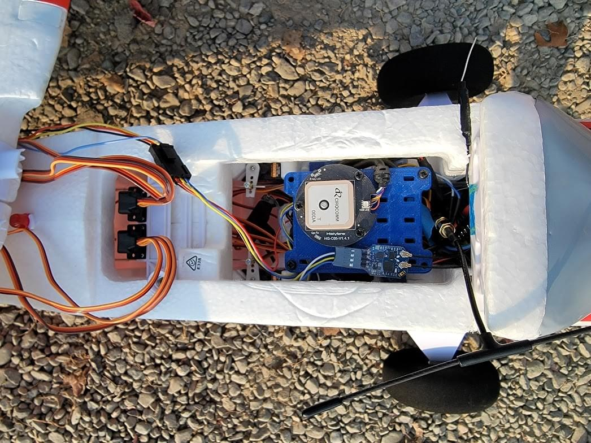
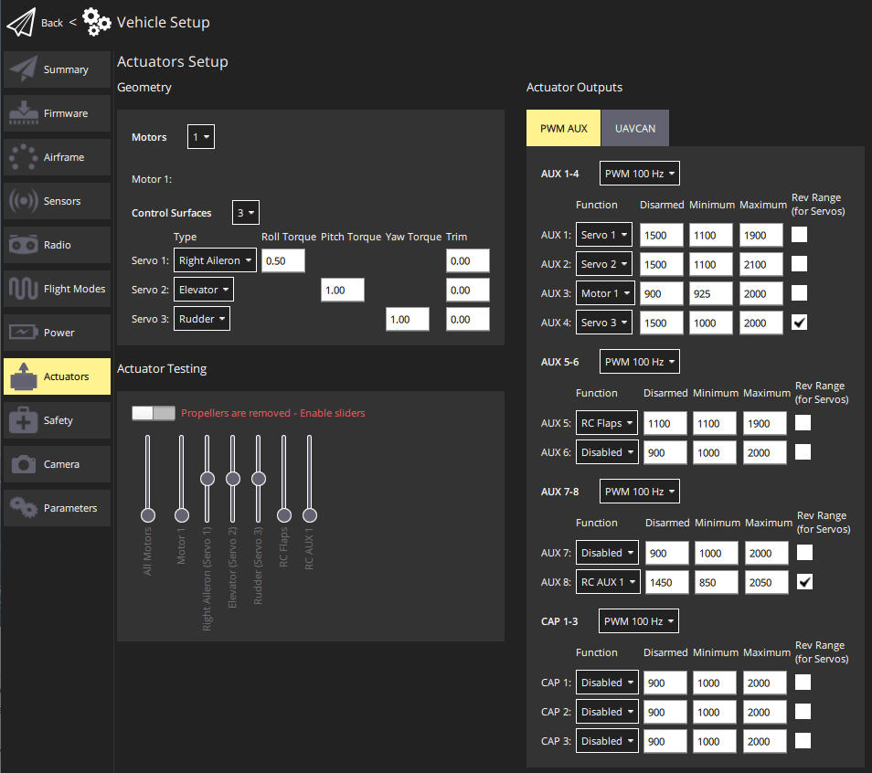
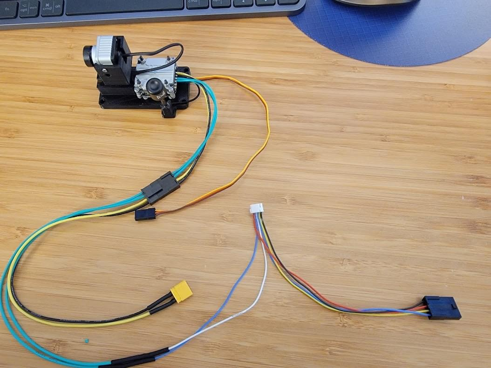
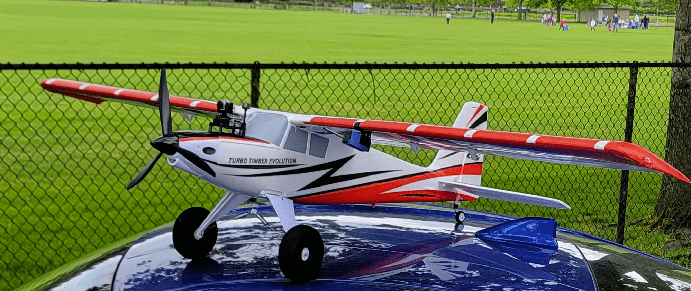

# Turbo Timber Evolution (TTE) 组装

Turbo Timber Evolution 是 Horizon Hobby 销售的模型，最初设计用于传统的视距内遥控模型飞行。
该模型专为在 [STOL](https://en.wikipedia.org/wiki/STOL) 飞行中表现出色而设计，并具备多项显著特性，使其成为适配 FPV PX4 平台的理想选择。

## 概述

本设计目标是创建一个可用于通用PX4测试/开发的平台。  
这一设计目标意味着需要具有代表传统"普通"飞机的自然平衡操控特性。  
由于经典遥控飞机通常设计为无需计算机辅助飞行控制的手动飞行，它们往往特别注重开箱即用的平衡性和可调性。  
这类飞机也投入了更多精力确保其空中操控性能良好。  
虽然即使是简单的泡沫板飞机也可以飞行，但通过更多工程设计可以优化飞行中的细微操控特性。  
这架飞机就是这一理念的优质实例，采用了弗里兹副翼等设计以减少反向偏航。

关键机身结构特点：  
- 宽敞的内部空间  
- 顶部电池舱盖  
- 可选的前缘缝翼  
- 福勒襟翼  
- 带转向方向舵的坚固起落架  
- 预装外部照明  
- 可选浮筒配置  
- 温和的飞行特性  
- 内部联动机构和最小突出物设计的低阻力

关键组装特性：  
* 整体组装简便，机身设置简单  
* 可轻松访问Pixhawk USB和调试接口  
* [第一视角（FPV）](https://en.wikipedia.org/wiki/First-person_view_(radio_control)) 配备云台相机安装位  

* 空中数据由机翼悬挂的皮托管提供  
* 长续航时间（使用锂离子电池时>24分钟）## 零件清单

- [Turbo Timber Evolution PNP (包含电机、舵机、电调等，全部已安装完毕)](https://www.horizonhobby.com/product/turbo-timber-evolution-1.5m-pnp-includes-floats/EFL105275.html#)
- [80A Plush-32 电调](https://hobbyking.com/en_us/turnigy-plush-32-80a-2-6s-brushless-speed-controller-w-bec-rev1-1-0.html)
- [Pixhawk 4 Mini](../flight_controller/pixhawk4_mini.md) (配备 GPS 和 Power 模块)

- [SIK 通信电台](../telemetry/sik_radio.md)

- MS4525DO 差压模块和皮托管
- [Caddx Vista FPV 飞行单元](https://caddxfpv.com/products/caddx-vista-kit)
- [DJI FPV 护目镜](https://www.dji.com/fpv)
- [ExpressLRS Matek 多路接收机](http://www.mateksys.com/?portfolio=elrs-r24)
- [定制设计的 3D 打印零件](https://github.com/PX4/PX4-user_guide/raw/main/assets/airframes/fw/turbo_timber_evolution/3d_printed_parts.zip)
  - Pixhawk 4 Mini 安装座和顶部 GPS 安装座
  - FPV 模块和摄像头安装座
  - 皮托管和机翼固定点支架
- 其他硬件：M3 螺纹件（间隔环、垫圈、螺丝）、XT30 接头、热熔胶、热缩管、Molex Microfit 接插件
- 3.6Ah 4S 锂聚合物电池 OR 4s2p 18650 锂离子电池## 机体组装

机体开箱后基本已组装完成  
舵机和连杆已经安装完毕，剩余主要工作是安装起落架和水平稳定器  
该部分组装请直接参照说明书操作  

::: info  
[部分报告](https://www.rcgroups.com/forums/showthread.php?3904021-NEW-E-flite-Turbo-Timber-Evolution-1-5m-%C2%96-Smartest-Most-Capable-Durable-Timber-Yet/page50)指出，飞机原装电调存在过热问题  

由于本次组装载重较大，电调平均功率需求较高，测试中将原装60A电调更换为80A Turnigy PLUSH-32  
同时将原装电机更换为[更高功率电机](https://hobbyking.com/en_us/turnigy-aerodrive-sk3-3548-840kv-brushless-outrunner-motor.html)  
原装螺旋桨更换为[APC 13x4](https://www.apcprop.com/product/13x4/)以提升效率（相比原装三叶螺旋桨性能更优）  
新电调、电机和螺旋桨组合在测试中表现良好  
:::

## FPV Pod

FPV Pod通过M3尼龙紧固件安装在电池舱盖顶部。  
安装孔的定位方法是：将FPV Pod放置在顶部（使用尺子仔细居中），然后用螺丝刀将FPV Pod的安装孔穿透泡沫。  
随后使用长M3尼龙螺丝和底部垫片，再配合顶部舱盖的垫片和支架进行安装。

## 皮托管外壳

[空速传感器](../sensor/airspeed.md)强烈推荐用于固定翼机体。该设计使用MS4525DO差压模块和皮托管，安装在3D打印的外壳中，外壳设有固定点挂架以便连接到机翼。

在皮托管外壳内，MS4525DO差压传感器通过短管与全静压管连接。扎带用作管夹，防止软管脱离传感器和皮托管接口。I2C和电源线直接焊接到MS4525模块上，然后使用热熔胶进行机械加固。

全静压差压传感器通过3D打印的"挂架"安装在机翼（螺旋桨半径外）上，挂架粘接到机翼前缘。M2螺丝和尼龙锁紧螺母将外壳固定到挂架上。

这四根线缆随后被固定在机翼底部，延伸至Pixhawk 4 Mini。

皮托管外壳的盖子最初使用胶带固定，以便首次飞行后根据需要测试和调整。首次飞行后，盖子使用热胶永久固定。

## 飞行计算机安装

为PX4 Mini设计了定制安装座并进行3D打印（参见[3D打印部件](https://github.com/PX4/PX4-user_guide/raw/main/assets/airframes/fw/turbo_timber_evolution/3d_printed_parts.zip)获取所有部件）。该安装座经过精心设计，利用原厂TTE机体的内部泡沫模具特征以实现安全固定和良好对齐。安装座采用双层结构配置，由M3螺纹隔板螺接组成。下部安装座承载Pixhawk并与机体连接，上部安装座则用于安装GPS和ExpressLRS RX。

首先，将Pixhawk 4 Mini放置在下部安装座中。使用热熔胶将飞控单元与安装座进行刚性连接，并通过两根扎带提供额外固定。安装上部安装座的隔板，确保螺栓紧固。由于下部安装座安装完成后这些螺丝将无法触及，因此需要特别注意确保其紧固程度，防止松动。

## 电气系统

### 电源

Holybro电源模块与电调串联连接。
另外拆解出一根备用的16awg电源线，并连接到XT30接头。
这根备用线用于为Caddx Vista FPV设备供电，也可连接分线器为更多外设供电。
舵机和灯光的供电由电调的"BEC"电源模块提供。

TTE在电池选择上具有高度灵活性。
我同时使用3.6Ah 4S Turnigy电池组和Upgrade Energy 4s2p锂电池组。
虽然3.6Ah锂电池价格较低，但Upgrade Energy锂电池组的飞行时间可达24分钟（对比12分钟）。

### 舵机

舵机按副翼、升降舵、方向舵、油门、襟翼和FPV云台的顺序连接到飞控计算机。
灯光系统的附加电源插头也需要安装，但该插头不携带舵机信号，可连接到任意备用通道。

[Acutator Configuration](../config/actuators.md) 界面如下所示。

通过舵机测试仪确定舵机PWM脉宽来获取舵机终点，从而实现每个舵面在各个方向的最大行程。

### 配置与调试

访问Pixhawk 4 Mini需要移除上部支架。
虽然这并不困难，但考虑现场调试的便捷性，使用了短直角USB Micro扩展线轻松访问Pixhawk 4 Mini的USB接口。
该线缆的USB-A端悬挂在电池舱内。
同样，制作了JST PH转标准间距插针的适配器，并放置在电池舱内易于访问的位置。

### 外设

#### 无线电接收机

制作了专用线缆将ExpressLRS RX ([RC接收机](../getting_started/rc_transmitter_receiver.md)) 连接到Pixhawk 4 Mini。

由于Pixhawk 4 Mini的UART资源有限，接收机连接到没有TX引脚的RC输入端口。
这意味着接收机只能向飞控发送控制数据，但无法接收飞控的遥测数据。
热缩管用于固定杜邦接头，防止其从ExpressLRS RX的插针上脱落。

#### FPV舱体与空速传感器线缆

制作了专用线缆将Caddx Vista FPV发射器连接到飞控的UART（来自`UART/I2C B`端口）以及Holybro电源模块的电池供电。
在Vista附近添加Molex microfit接头，便于无需拆解Pixhawk即可断开连接。
正如名称所示，`UART/I2C B`端口同时提供UART和I2C接口。
该端口通过专用线缆分路：一侧为I2C空速传感器提供电源和数据，另一侧为Caddx Vista提供电源和UART TX/RX。
从UART/I2C B端口，5V、GND和I2C SCL/SDA连接到I2C空速传感器，而仅串口RX和TX连接到Caddx Vista（Vista的接地通过单独的电池供电/地线提供）

[msp_osd](../modules/modules_driver.md#msp-osd) 模块用于将遥测数据流传输到Caddx Vista，可通过DJI眼镜的"自定义OSD"功能查看。

#### SIK遥测无线电

移除了SIK遥测无线电的塑料外壳以减少重量和模块体积。
热缩管用于对裸露电路板进行电气绝缘，并将无线电安装在飞控上下支架之间。

## 构建结果与性能

总体而言，这次构建是成功的。

即使安装了Pixhawk 4 Mini增加了重量，飞机依然平衡良好，并保留了原始STOL特性，拥有充足动力。
PX4能够轻松稳定飞机，通过[固定翼自动调参](../config/autotune_fw.md)完成了速率环的精细调节。
调参结果可参考[下方链接的参数文件](#parameter-file)。

在测试中我发现，不使用襟翼时起飞距离可短至10英尺（3米）。
着陆时我会使用全襟翼来降低原本平滑的机体速度。

### 性能指标

- 失速速度（无襟翼）：14英里/小时（指示速度）
- 巡航速度：35-65英里/小时
- 起飞距离（全襟翼）：< 10英尺
- 续航时间：5.2Ah 4s2p LiIon电池约24分钟，3.6Ah 4S LiPo电池约12分钟

### 视频资料

<lite-youtube videoid="vMFCi3G5s6E" title="PX4 Turbo Timber 精准着陆"/>

---

<lite-youtube videoid="1DUV7QjcXrA" title="PX4 Turbo Timber Evolution 短距飞行演示"/>

### 飞行日志

[傍晚飞行（视频展示）](https://review.px4.io/plot_app?log=d3f2c1f9-f802-48c1-ab5d-3983fc8b8719)

<lite-youtube videoid="6CqigySqyAQ" params="ab_channel=ChrisSeto" title="Turbo Timber Evolution Px4 构建日志飞行示例"/>

### 参数文件

[ PX4机体参数快照](https://github.com/PX4/PX4-user_guide/raw/main/assets/airframes/fw/turbo_timber_evolution/tteparams.params)

该参数文件包含本次构建的自定义PX4参数配置，包括遥控器设置、调参和传感器配置。
可通过QGC按照[参数>工具](https://docs.qgroundcontrol.com/master/en/qgc-user-guide/setup_view/parameters.html#tools)（QGC用户指南）中的说明加载此参数文件。