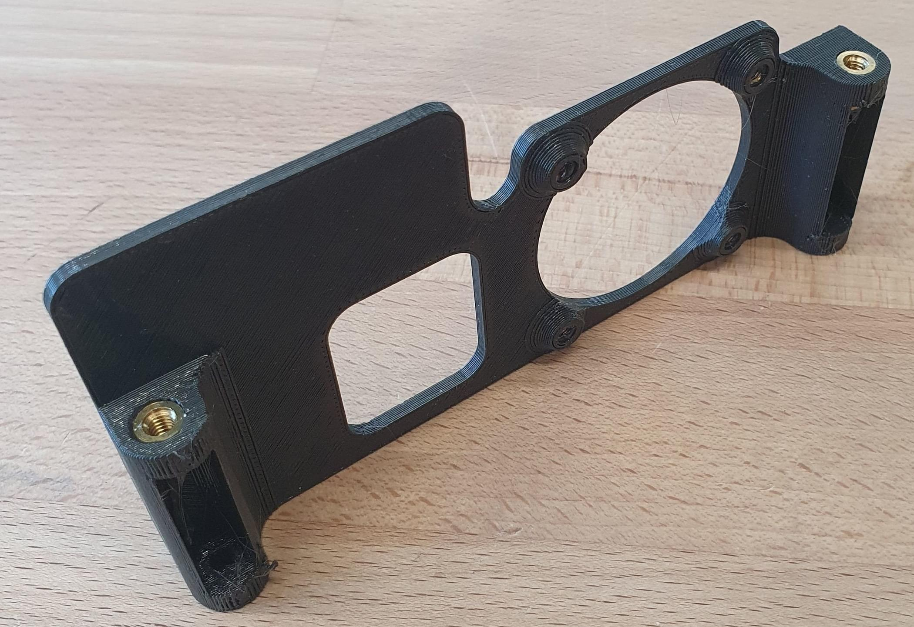
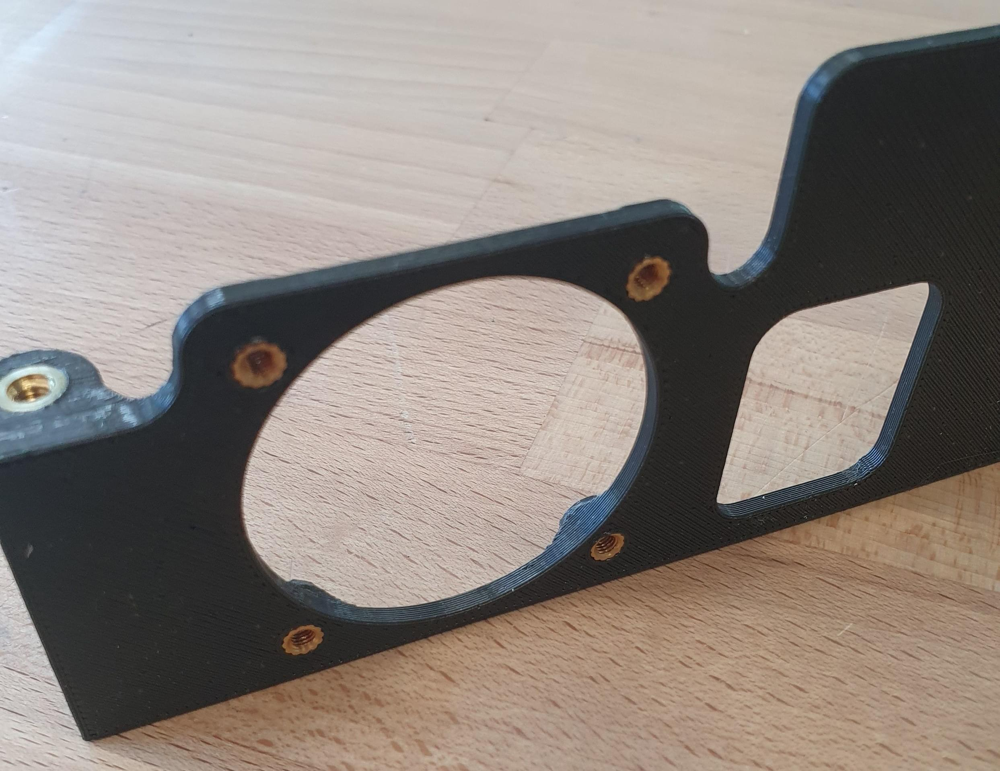
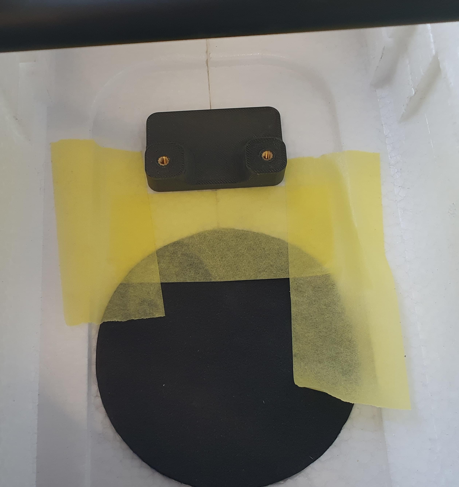
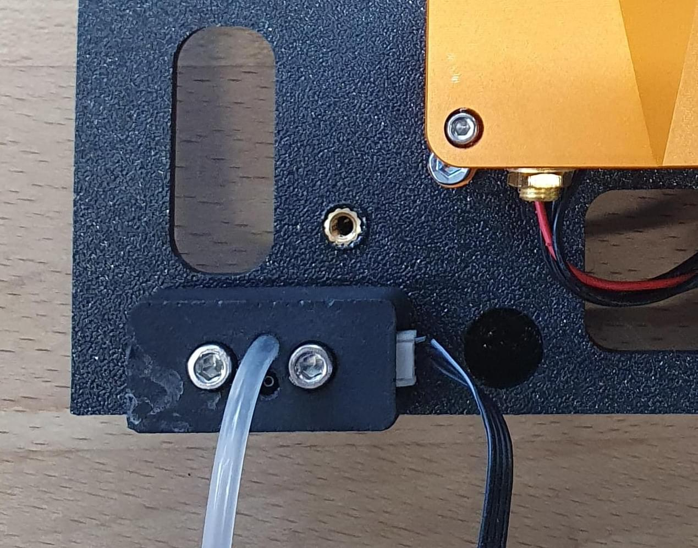
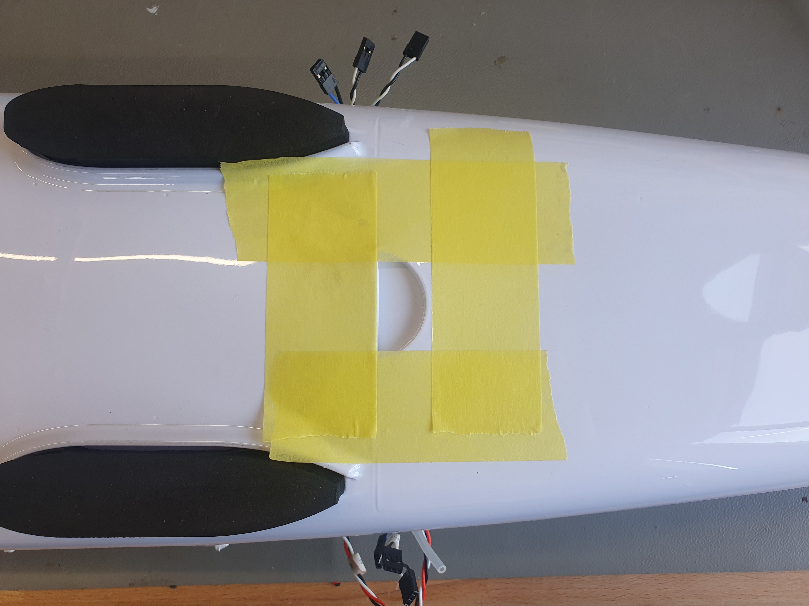

# Foxtech Loong 2160 VTOL

_Foxtech Loong 2160 VTOL_ 是一款易于组装的几乎可飞行的成品（ARF）四旋翼垂直起降无人机，翼展为 2160 毫米。  
本构建指南展示如何添加飞行控制器系统，使用 [Auterion Skynode 评估套件](../companion_computer/auterion_skynode.md) 或 [Pixhawk 6C](../flight_controller/pixhawk6c.md) 并配置 PX4。

## 概述

规格参数：

- 翼展：2160mm  
- 机身长度：1200mm  
- 起飞重量：约7kg（不含载荷）  
- 最大续航时间：最长1小时30分钟  
- 巡航速度：约17m/s  
- 最大载荷重量：约1.5kg  
- 随行箱尺寸：125cm x 34cm x 34cm  

核心特性：

- 轻松组装：快速便捷的设置流程  
- 便携设计：紧凑结构搭配随附运输箱便于携带  
- 开箱即飞：所有执行器预装并接线，最小化调试时间  
- 超长续航：续航时间最长可达1小时30分钟，具体取决于天气状况和起飞重量  
- 多功能载荷能力：宽敞机身可容纳多样化载荷，包括Sony A7R等测绘应用设备## 去哪购买

- [Foxtech FPV (ARF Combo)](https://www.foxtechfpv.com/foxtech-loong-2160-vtol.html) - 推荐
- [Alibaba](https://www.alibaba.com/product_detail/Loong-2160-Long-Endurance-VTOL-Mapping_1600280686653.html)

## 飞控

已测试的选项包括：

- [Auterion Skynode 评估套件](../companion_computer/auterion_skynode.md)
- [Pixhawk 6C](../flight_controller/pixhawk6c.md)

## 额外配件

- Auterion 12S 电源模块  
- [Holybro PM08D 电源模块 (Auterion PM 的替代方案)](https://holybro.com/collections/power-modules-pdbs/products/pm08d-digital-power-module-14s-200a)  
- [GPS F9P (包含在 Skynode 评估套件中)](../gps_compass/rtk_gps_holybro_h-rtk-f9p.md)  
- [GPS M9N (F9P 的低价替代方案)](../gps_compass/rtk_gps_holybro_h-rtk-m8p.md)  
- [空速传感器 (包含在 Skynode 评估套件中)](https://www.dualrc.com/parts/airspeed-sensor-sdp33) — 推荐用于提升安全性和性能  
- [空速传感器 (低价替代方案)](https://holybro.com/products/digital-air-speed-sensor?pr_prod_strat=use_description&pr_rec_id=236dfda00&pr_rec_pid=7150470561981&pr_ref_pid=7150472462525&pr_seq=uniform)  
- [Lidar Lightware lw20-c (包含在 Skynode 评估套件中)](../sensor/sfxx_lidar.md) (可选)  
- [Lidar Seeed Studio PSK-CM8JL65-CC5 (低价替代方案)](https://www.seeedstudio.com/PSK-CM8JL65-CC5-Infrared-Distance-Measuring-Sensor-p-4028.html) (可选)  
- [无线电 (RC) 系统](../getting_started/rc_transmitter_receiver.md) (任选)  
- [地面站及无线电链路](https://holybro.com/collections/rc-radio-transmitter-receiver/products/skydroid-h12?variant=42940989931709)  
- [USB-C 延长线](https://www.digitec.ch/en/s1/product/powerguard-usb-c-usb-c-025-m-usb-cables-22529949?dbq=1&gclid=Cj0KCQjw2cWgBhDYARIsALggUhrh-z-7DSU0wKfLBVa8filkXLQaxUpi7pC0ffQyRzlng8Ph01h2R1gaAp0mEALw_wcB&gclsrc=aw.ds)  
- [I2C 转换器](https://www.3dxr.co.uk/autopilots-c2/the-cube-aka-pixhawk-2-1-c9/cube-cables-accessories-sensors-c15/cubepilot-i2c-can-splitter-jst-gh-4pin-p2840)  
- [3D 打印支架](https://github.com/PX4/PX4-user_guide/raw/main/assets/airframes/vtol/foxtech_loong_2160/loong-3d-prints.zip)  
  - 1个基板  
  - 1个堆叠固定装置  
  - 1个风扇支架  
  - 1个无线电支架  
  - 1个顶板  
  - 1个无线电天线适配器  
  - 1个 USB-C 支架 1  
  - 1个 USB-C 支架 2  
- [铜制螺纹嵌件](https://cnckitchen.store/products/gewindeeinsatz-threaded-insert-set-standard-200-stk-pcs)  
- [XT30 连接器](https://www.amazon.com/Connectors-Female-Pieces-Shrink-Battery/dp/B0875MBLNH/ref=sr_1_1?keywords=xt30+connector&qid=1700643604&sr=8-1)  
- [各种螺丝](https://de.aliexpress.com/item/1005005999729125.html?spm=a2g0o.productlist.main.1.7fe0c7fcvInMsM&algo_pvid=2e5373e9-747f-4a28-9739-cd59d05d64f1&aem_p4p_detail=202311220106396068090130108300006423842&algo_exp_id=2e5373e9-747f-4a28-9739-cd59d05d64f1-0&pdp_npi=4%40dis%21CHF%2114.42%213.72%21%21%2116.01%21%21%402101f04d17006439995917563eeeb0%2112000035246480339%21sea%21CH%210%21AB&curPageLogUid=24AixvgVOlG3&search_p4p_id=202311220106396068090130108300006423842_1)  
- [扎带](https://www.amazon.com/Superun-Cable-Tie-Kit-Assorted/dp/B07TMKJP5S/ref=sr_1_2?crid=968Z3XJK9N3J&keywords=zip%2Bties%2Bset&qid=1700644053&sprefix=zip%2Bties%2Bset%2Caps%2C155&sr=8-2&th=1)  
- [天线延长线 - 与您的无线电系统匹配](https://www.digikey.ch/de/products/detail/amphenol-rf/095-9038-nd/1008084)  
- [12S 电池 (推荐方案)](https://www.batteryspace.com/)

## 工具

本构建中使用了以下工具。

- 六角螺丝刀套装  
- 扳手套装  
- [焊台](https://www.amazon.com/UY-CHAN-Programmable-Pocket-size-Soldering/dp/B07G71CKC4/ref=sr_1_7?crid=2S2XK6363XRDF&keywords=ts+80+soldering+iron&qid=1700644208&sprefix=ts+80%2Caps%2C151&sr=8-7)  
- 胶水：热熔胶、5分钟环氧树脂  
- 胶带  
- 3M双面胶（[3M VHB胶带](https://www.amazon.in/3M-VHB-Tape-4910-Length/dp/B00GTABM3Y)）  
- 3D打印机  
- [Blue Loctite](https://www.amazon.com/Loctite-Heavy-Duty-Threadlocker-Single/dp/B000I1RSNS?th=1)

## 硬件集成

在本文档中描述了Auterion Skynode的集成方式。  
Pixhawk的安装可以采用类似的方法。

### 准备工作

### 航电单元

#### 准备3D打印部件

::: info
使用电烙铁将螺纹衬套压入3D打印部件中。
:::

1. 按照下图所示将10个M3螺纹衬套插入底板中：

   

1. 按照下图所示将2个M3螺纹衬套插入堆叠固定件中：

   

1. 按照下图所示将2个M4螺纹衬套插入风扇支架和无线电支架中。

   

   如果想在风扇支架上安装40mm 5V风扇，则需插入4个M3衬套。

   

1. 将电缆连接器更换为舵机连接器，以便插入舵机轨道供电。

   ::: info
   如果使用功率较大的无线电，可能需要安装风扇。
   :::

   

1. 移除机体原始安装板。
   用胶带将电缆固定在机身外侧。

   

1. 将底板滑入机体。
1. 将堆叠固定件拧到底板上，并用胶带或笔标记其位置。
1. 将部件从机身中取出，用热熔胶将堆叠固定件粘合到位。

### 40A电源模块

40A电源模块为Skynode的航电系统供电（包含在Skynode评估套件中）：

1. 移除外壳中的40A电源模块。
1. 用2个M2x6mm螺丝将电源模块固定在底板底部。
1. 制作一根电缆将XT60连接器延长为XT30并安装在底板上。
   这样6S电池电源可以直接通过XT30连接器，使用机体自带的预配置电缆接入。

   

如果需要，电源模块无线电端口的10V输出也可通过XT30连接器暴露出来，该连接器可安装在6S电池输入XT60旁边。

### 传感器

#### 皮托管

1. 使用2个M3x16mm螺丝将传感器安装在底板右前角。
   注意连接器应朝向机身中心。

   

   仅使用前端管（如图所示），后端管可移除，因为我们的经验表明机舱内压力足以作为静压。

1. 当堆叠组件安装在机舱内时，需要将来自机翼的管和来自空速传感器的管连接在一起。
   用唾液（最简单的方式）将它们推接在一起，然后使用热缩管加固连接。

   :::warning
   使用热源时要小心，因为泡沫在高温下会融化。
   :::

#### 激光雷达

::: info
建议安装激光雷达！
如果没有安装激光雷达，应禁用悬停时使用固定翼推进加速前进（将[VT_FWD_THRUST_EN](../advanced_config/parameter_reference.md#VT_FWD_THRUST_EN)设为`0`而非`1`）。
:::

1. 用胶带或笔标记激光雷达的安装位置。
   在PVC外壳和泡沫中切割出孔洞，使激光雷达能安装到位。

   

1. 用热熔胶固定激光雷达。

   

#### GPS/指南针

1. 使用双面胶将GPS安装在机体后部锁扣下方。

   

   注意GPS连接器应朝向机身中心。

### 飞行控制器安装

1. 将Skynode安装在堆叠固定件上。
1. 连接LTE天线。
1. 将风扇支架和无线电支架拧到底板上。
1. 将底板完全推回并拧紧到堆叠固定件。
1. 将顶板放在堆叠上，并将Skynode的40针电缆通过Pixhawk适配板前的两个孔洞。
1. 确保将顶部连接器连接到标有'GPS1'输入的适配板。

将舵机按以下顺序连接到Pixhawk适配板：

MAIN:

1. 收缩电机
1. 空置或安装风扇
1. 右副翼
1. 左副翼
1. 右升降舵
1. 左升降舵
1. 方向舵

AUX:

1. 前右电机
1. 后左电机
1. 前左电机
1. 后右电机

如果需要将舵机连接到不同输出，需要修改舵机输出映射（参见[Actuator Configuration](../config/actuators.md)）。

### 12S电源模块

12S电源模块将安装在电池顶部。将安装在机体内的XT90连接到电源模块。需要延长Skynode的电源电缆以获取电源模块的电池读数。该电源模块可作为Skynode的5V备用电源。

### 组装步骤

组装步骤如下：

1. 将底板滑入机体。
1. 将LTE天线插入Skynode。
1. 将风扇支架和无线电支架拧到底板上。
1. 将底板完全推回并拧紧到堆叠固定件。
1. 将顶板放在堆叠上，并将Skynode的40针电缆通过Pixhawk适配板前的两个孔洞。
1. 确保将顶部连接器连接到标有'GPS1'输入的适配板。

将舵机按以下顺序连接到Pixhawk适配板：

MAIN:

1. 收缩电机
1. 空置或安装风扇
1. 右副翼
1. 左副翼
1. 右升降舵
1. 左升降舵
1. 方向舵

AUX:

1. 前右电机
1. 后左电机
1. 前左电机
1. 后右电机

如果需要将舵机连接到不同输出，需要修改舵机输出映射（参见[Actuator Configuration](../config/actuators.md)）。

## 软件设置

### 选择机体

1. 打开 QGC，选择 **Q** 图标，然后选择 **机体设置**。
1. 选择 [机体](../config/airframe.md) 选项卡
1. 从 _Standard VTOL_ 组中选择 [Generic Standard VTOL](../airframes/airframe_reference.md#vtol_standard_vtol_generic_standard_vtol)，然后点击 **应用并重启**。

### 加载参数文件

接下来我们加载一个 [参数文件](https://github.com/PX4/PX4-user_guide/raw/main/assets/airframes/vtol/foxtech_loong_2160/loong.params)，该文件包含定义机体几何结构、输出映射和调参值的参数——这样您就不需要手动配置了！
如果您已按照电机接线说明操作，可能除了传感器校准和中立位调整外，无需进行更多配置。

加载文件步骤：

1. 下载 [参数文件](https://github.com/PX4/PX4-user_guide/raw/main/assets/airframes/vtol/foxtech_loong_2160/loong.params)。
1. 选择 [参数](../advanced_config/parameters.md#finding-updating-parameters) 选项卡，然后点击右上角的 **工具**。
1. 选择 **从文件加载**，然后选择刚下载的 `loong.params` 文件。
1. 重启机体。

### 传感器选择

- 如果使用 [Lidar Lightware lw20-c (包含在Skynode评估套件)](../sensor/sfxx_lidar.md)，需要将 [SENS_EN_SF1XX](../advanced_config/parameter_reference.md#SENS_EN_SF1XX) 设置为 6 (SF/LW/20c)。
- 确保选择了正确的空速传感器。
  如果使用推荐的 [SDP33 空速传感器](https://www.dualrc.com/parts/airspeed-sensor-sdp33)，则无需更改，因为 [SENS_EN_SDP3X](../advanced_config/parameter_reference.md#SENS_EN_SDP3X) 已在参数文件中启用（设置为 `1`）。

### 传感器校准

首先确保已设置 [飞控的正确朝向](../config/flight_controller_orientation.md)。
这应为默认值（`ROTATION_NONE`）。

然后校准主要传感器：

- [指南针](../config/compass.md)
- [陀螺仪](../config/gyroscope.md)
- [加速度计](../config/accelerometer.md)
- [空速计](../config/airspeed.md)

### 遥控器设置

[校准您的遥控器](../config/radio.md) 并设置 [飞行模式开关](../config/flight_mode.md)。

我们建议您分配遥控器开关以匹配 [飞行模式配置 > 应设置哪些飞行模式和开关？](../config/flight_mode.md#what-flight-modes-and-switches-should-i-set) 中定义的模式集合。
特别需要分配一个 _VTOL 转换开关_、_紧急停止开关_，以及选择 [稳定模式](../flight_modes_fw/stabilized.md) 和 [位置模式](../flight_modes_fw/position.md) 的开关。

### 执行器设置和电调校准

:::warning
请确保已拆除螺旋桨！
在执行器选项卡中容易意外启动电机。
:::

电机、舵面和其他执行器在 QGroundControl [执行器配置与测试](../config/actuators.md) 中配置。

之前加载的 [参数文件](#load-parameters-file) 表明此界面应已正确配置：您只需调整特定机体的中立位。
如果电机/舵机连接到不同的输出端口，需要在执行器输出部分更改输出到功能的映射。

校准电调时，请断开机翼并启动机体，然后进入 QGC 的 **执行器** 选项卡。
启用电机测试并将要校准电机的滑块调至最大。
将机翼连接到机身并等待蜂鸣序列完成（约5秒）。
然后将滑块调至最小。

#### 舵面控制

使用遥控器检查是否需要反转舵面：

- 切换到 [手动模式](../flight_modes_fw/stabilized.md)
- 横滚杆向右。
  右侧副翼应上偏，左侧副翼应下偏。
- 俯仰杆向后（上升）。
  两个V尾舵面应上偏。
- 偏航杆向右。
  两个舵面应右偏

现在调整中立位值，使所有舵面处于中立位置。

#### 电机方向和朝向

在 [稳定模式](../flight_modes_fw/stabilized.md) 下解除机体武装（螺旋桨仍拆除）。
检查所有四旋翼电机是否以相似的低怠速旋转，并验证方向是否正确。
检查以下反应：

- 横滚杆向右。
  左侧两个电机应加速
- 横滚杆向后。
  前侧两个电机应加速
- 偏航杆向右。
  前右和后左电机应加速

::: info
如果看不到反应，请稍微增加油门，因为 [Airmode](../config_mc/pid_tuning_guide_multicopter.md#airmode-mixer-saturation) 未对偏航轴启用。
:::

## 首次飞行

- 安装螺旋桨（使用蓝色Loctite固定螺丝）。
- 检查重心（CG）。
  通过抬起连接机翼的卡扣处用两个手指举起机体。
  机体应保持水平平衡。
  如果机体向尾部或机头倾斜，则需将电池向相反方向移动。
  如果无法通过此方法平衡机体，需要重新调整部分组件位置或添加配重。
- 检查执行器方向和中性调整
- 在[稳定模式](../flight_modes_fw/stabilized.md)下检查控制面响应。
  将机体切换至前飞模式。
  - 向右滚转。
    右侧副翼应向下偏转。
    左侧副翼应向上偏转。
  - 抬升机头（机头上仰）。
    两个升降舵面均应向下偏转。
  - 向右偏航（机头向右）。
    两个升降舵面均应向左偏转。
- 如果使用了[kill-switch](../config/safety.md#kill-switch)，请确保其工作正常且不会在飞行中意外触发！
- 在[稳定模式](../flight_modes_fw/stabilized.md)下解锁并检查电机是否响应指令（例如：左滚转时右侧电机油门增加）
- 以[稳定模式](../flight_modes_fw/stabilized.md)起飞并进行基本机动
- 如果一切顺利，以[位置模式](../flight_modes_fw/position.md)起飞并在约50米高度进行转换。
  如果出现问题，请尽快切换回多旋翼模式（使用转换开关）。