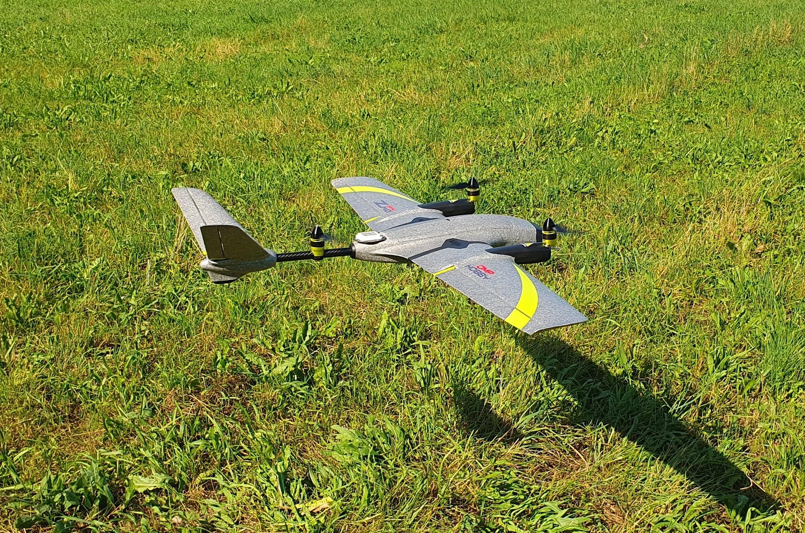
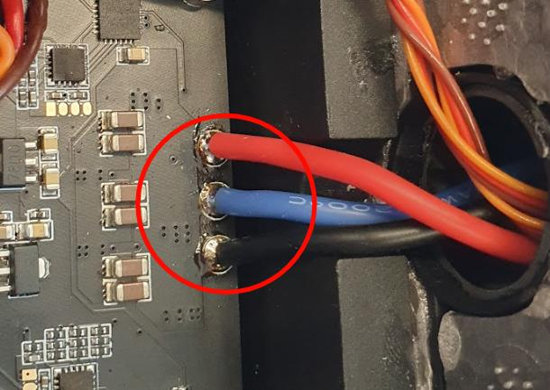
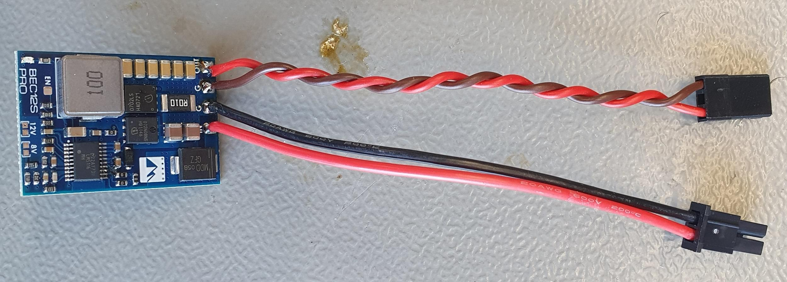
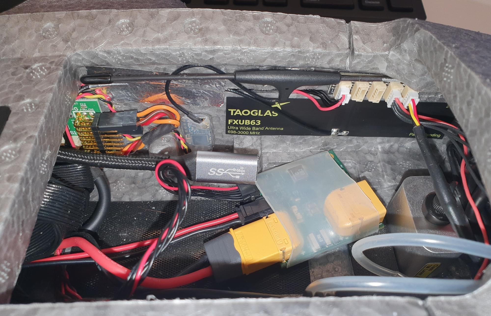

# OMP Hobby ZMO FPV

OMP Hobby ZMO 是一种小型的 [tiltrotor VTOL](../frames_vtol/tiltrotor.md)，其提供了开箱即飞的套件。  
本构建指南展示了如何添加飞行控制器系统（使用 [Auterion Skynode 评估套件](../companion_computer/auterion_skynode.md)、[Pixhawk 6C](../flight_controller/pixhawk6c.md) 或 [Pixhawk 6C mini](../flight_controller/pixhawk6c_mini.md)）并设置 PX4。

  

## 概述

关键机体特性：

- 紧凑且便于携带  
- 预装执行器  
- 快速拆卸机翼连接系统  
- 套件中包含运输箱  
- 约35分钟飞行时间（取决于起飞重量）  
- VTOL可在固定翼无法飞行的区域飞行  
- 套件中包含电池和充电器  
- 整体组装简便  
- 前部有安装FPV和/或运动相机的空间  

根据最终起飞重量，悬停时间可能受限（机体悬停时机身内部空气流通有限，电调可能会过热）。

## 购买渠道

- [OMP-Hobby](https://www.omphobby.com/OMPHOBBY-ZMO-VTOL-FPV-Aircraft-With-DJI-Goggles-And-Remote-Controller-p3069854.html)
- [GetFPV](https://www.getfpv.com/omphobby-zmo-z3-vtol-fpv-1200mm-arf-plane-kit-no-fpv-system.html)
- [FoxtechFPV](https://www.foxtechfpv.com/zmo-pro-fpv-vtol.html)

## 飞行控制器

已测试的配置选项包括：

- [Auterion Skynode 评估套件](../companion_computer/auterion_skynode.md)
- [Pixhawk 6C](../flight_controller/pixhawk6c.md) 配合 [PM02 V3](../power_module/holybro_pm02.md)
- [Pixhawk 6C mini](../flight_controller/pixhawk6c_mini.md) 配合 [PM02 V3](../power_module/holybro_pm02.md)

飞行控制器的大致最大尺寸为：50x110x22mm## 其他配件

- [GPS F9P (包含于 Skynode 评估套件)](../gps_compass/rtk_gps_holybro_h-rtk-f9p.md)
- [GPS M9N (F9P 的经济替代方案)](../gps_compass/rtk_gps_holybro_h-rtk-m8p.md)
- [空速传感器 (包含于 Skynode 评估套件)](https://www.dualrc.com/parts/airspeed-sensor-sdp33) — 推荐用于提高安全性和性能
- [空速传感器 (经济替代方案)](https://holybro.com/products/digital-air-speed-sensor?pr_prod_strat=use_description&pr_rec_id=236dfda00&pr_rec_pid=7150470561981&pr_ref_pid=7150472462525&pr_seq=uniform)
- [Lidar Lightware lw20-c (包含于 Skynode 评估套件)](../sensor/sfxx_lidar.md) (可选)
- [Lidar Seeed Studio PSK-CM8JL65-CC5 (经济替代方案)](https://www.seeedstudio.com/PSK-CM8JL65-CC5-Infrared-Distance-Measuring-Sensor-p-4028.html) (可选)
- [5V BEC](http://www.mateksys.com/?portfolio=bec12s-pro)
- [无线电 (RC) 系统](../getting_started/rc_transmitter_receiver.md) (任选)
- [舵机延长线 30cm 10根装](https://www.getfpv.com/male-to-male-servo-extension-cable-twisted-22awg-jr-style-5-pcs.html)
- [USB-C 延长线](https://www.digitec.ch/en/s1/product/powerguard-usb-c-usb-c-025-m-usb-cables-22529949?dbq=1&gclid=Cj0KCQjw2cWgBhDYARIsALggUhrh-z-7DSU0wKfLBVa8filkXLQaxUpi7pC0ffQyRzLng8Ph01h2R1gaAp0mEALw_wcB&gclsrc=aw.ds)
- [3M VHB 胶带](https://www.amazon.in/3M-VHB-Tape-4910-Length/dp/B00GTABM3Y)
- [3D打印支架](https://github.com/PX4/PX4-user_guide/raw/main/assets/airframes/vtol/omp_hobby_zmo_fpv/omp_hobby_zmo_3d_prints.zip)
  - 2个机翼连接支架
  - 1个空速传感器支架
  - 1个 GPS 支架
  - 1个 Lidar 支架
  - 1个 Skynode 支架
- [USB 摄像头 (包含于 Skynode 开发套件)](https://www.amazon.com/ELP-megapixel-surveillance-machine-monitor/dp/B015FIKTZC)
- 螺丝、垫片、热缩管等## 工具

本构建使用了以下工具。

- 六角驱动器套装
- 扳手套装
- 焊锡工作台
- 胶水：热熔胶，5分钟环氧树脂
- 胶带
- 3M双面胶带 ([3M VHB tape](https://www.amazon.in/3M-VHB-Tape-4910-Length/dp/B00GTABM3Y))
- 砂纸
- 3D打印机## 硬件集成

### 准备工作

移除原始飞控模块、电调和机翼连接线缆。
同时移除螺旋桨。
这将有助于机体的操控，并降低因意外电机启动导致受伤的风险。

ZMO FPV在原始状态下的示意图。

已从机体上移除飞控模块和机翼连接线缆。

### 电调(ESC)

1. 拆焊电调的PWM信号和地线引脚，并焊接伺服延长线到这些引脚。
   电缆应足够长以连接到飞控模块的FMU引脚。
1. 拆焊后电机的3个母香蕉插头（Pixhawk 6集成可能不需要）。
1. 用4个M2.5 x 12螺丝将电调重新固定到位。
1. 缩短后电机线缆并按图示焊接固定。
1. 将信号线和GND线焊接到电调的PWM输入端。

   

1. 移除电调上的母香蕉插头。
   这将为飞控模块安装提供更多空间。

   

1. 将后电机线缆焊接到电调。
   确保连接方式使电机按正确方向旋转。

   

### 机翼连接器

为直接连接机翼连接器，需要3D打印的支架来居中安装连接器。
此步骤非必需，但会使操作更简便，并减少现场安装时的步骤。

1. 用热胶或5分钟环氧树脂将机翼连接器粘到3D打印部件上。
1. 将带连接器的3D打印部件粘到机身。
   确保胶水固化过程中连接器正确对齐。

   最简单的对齐方式是在胶水固化时安装机翼，但需确保机身与机翼之间无胶水，否则机翼可能卡住。

连接器粘接到3D打印部件

连接器粘接到机身。确保连接器正确对齐。

### Pixhawk适配板和BEC

1. 按照图示切割泡沫以腾出空间，用双面胶安装Pixhawk适配板和BEC。
   FMU板应安装在机身左侧（飞行方向）。
   在BEC上焊接一个伺服连接器和电池电压线缆。

   
   

1. 准备BEC以连接IO板和电池。
   BEC也可以直接焊接到电调的电池焊盘上。

   

1. 用双面胶安装BEC。

   

### 线缆

1. 剪断舵机上的连接器并焊接舵机延长线。
   确保线缆长度足够到达Pixhawk适配板。
   如果有压接工具，也可以直接添加连接器而不焊接。

1. 按以下顺序将舵机线缆插入适配IO板：

   - 1 - 左副翼
   - 2 - 右副翼
   - 3 - 襟翼

1. 按以下顺序将舵机线缆插入适配IO板：

   - 1 - 左副翼
   - 2 - 右副翼
   - 3 - 襟翼

### 传感器和执行器

1. 安装3D打印支架固定传感器模块。
   用M3螺丝将支架固定到指定位置。
1. 为多旋翼配置安装电机驱动板。
   确保电调信号线正确连接到飞控输出端口。

### 天线和遥控接收机

::: info
如果安装Skynode，LTE可作为遥测和视频链路。
如果使用Pixhawk需要不同的[遥测链路](../telemetry/index.md)。
一个低成本示例是[SiK遥测无线电](../telemetry/sik_radio.md)。
:::

1. 一个LTE天线可安装在机体底部。
   可通过电调散热孔将天线线缆穿过。

   

1. 第二个天线可安装在电池舱左侧内部。
   遥控接收机也可放置在电池舱左侧。

   

## 软件设置

### 选择机体

1. 打开 QGC，选择 **Q** 图标，然后选择 **机体设置**。
1. 选择 [机体](../config/airframe.md) 选项卡

1. 从 _VTOL 倾转旋翼_ 组中选择 [通用倾转旋翼 VTOL](../airframes/airframe_reference.md#vtol_vtol_tiltrotor_generic_tiltrotor_vtol)，然后点击 **应用并重启**。

### 加载参数文件

接下来我们加载一个 [参数文件](https://github.com/PX4/PX4-user_guide/raw/main/assets/airframes/vtol/omp_hobby_zmo_fpv/omp_hobby_zmo.params)，该文件包含定义机体几何形状、输出映射和调参值的参数 —— 所以你无需手动配置。  
如果你已按照电机接线说明操作，可能不需要进行其他配置，只需进行传感器校准和调整微调。

加载文件的方法：

1. 下载 [参数文件](https://github.com/PX4/PX4-user_guide/raw/main/assets/airframes/vtol/omp_hobby_zmo_fpv/omp_hobby_zmo.params)。
1. 选择 [参数](../advanced_config/parameters.md#finding-updating-parameters) 选项卡，然后点击右上角的 **工具**。
1. 选择 **从文件加载**，然后选择刚刚下载的 `omp_hobby_zmo.params` 文件。
1. 重启机体。

### 传感器选择

空速传感器可在 [参数](../advanced_config/parameters.md#finding-updating-parameters) 选项卡中启用。

- 如果使用 [推荐的空速传感器 (SDP33)](https://www.dualrc.com/parts/airspeed-sensor-sdp33)，需要启用 `SENS_EN_SDP3X`。
- 如果使用 [Lidar Lightware lw20-c (包含在 Skynode 评估套件中)](../sensor/sfxx_lidar.md)，需要将 `SENS_EN_SF1XX` 设置为 6 (SF/LW/20c)。

### 传感器校准

首先确保设置 [飞控的方向](../config/flight_controller_orientation.md)。  
这应为默认值 (`ROTATION_NONE`)。

然后校准主要传感器：

- [指南针](../config/compass.md)
- [陀螺仪](../config/gyroscope.md)
- [加速度计](../config/accelerometer.md)
- [空速计](../config/airspeed.md)

### 遥控器设置

[校准你的遥控器](../config/radio.md) 并设置 [飞行模式开关](../config/flight_mode.md)。

我们建议你为 [飞行模式配置 > 应设置哪些飞行模式和开关？](../config/flight_mode.md#what-flight-modes-and-switches-should-i-set) 中定义的模式分配遥控器开关。  
特别是应分配 _VTOL 转换开关_、_杀车开关_ 以及选择 [Stabilized 模式](../flight_modes_fw/stabilized.md) 和 [Position 模式](../flight_modes_fw/position.md) 的开关。

### 执行器设置

:::warning
确保螺旋桨已拆除！
在执行器选项卡中意外启动电机的可能性很高。
:::

电机、舵面和其他执行器在 QGroundControl 的 [执行器配置与测试](../config/actuators.md) 中配置。

先前加载的 [参数文件](#load-parameters-file) 意味着此界面可能已正确设置：你只需根据机体调整微调值。  
如果电机/舵机连接到的输出与建议不同，需要在执行器输出部分更改输出到功能的映射。

#### 倾斜舵机

1. 将机体切换到手动模式（可通过飞行模式开关切换，或在 MAVLink shell 中输入 `commander mode manual`）。
1. 检查电机是否指向上方。  
   如果电机指向前方，则关联的倾斜舵机需要反转（勾选每个舵机旁边的复选框）。

   

1. 调整最小值（或反转时为最大值），使得旋翼推力可指向后方（多旋翼模式下需要正确偏航分配）。
1. 调整参数 `VT_TILT_MC` 使得在输入为零时旋翼正好指向上方。
1. 然后在 MAVLink shell 中输入 `commander transition` 以调整水平位置。

#### 控制舵面

使用遥控器检查执行器是否需要反转：

- 横滚杆向右。右副翼应上抬，左副翼应下压。
- 俯仰杆向后（爬升）。两片V型尾翼应上抬。
- 偏航杆向右。两片舵面均应向右移动

现在调整微调值，使所有舵面处于中立位置。

#### 电机方向与朝向

确保螺旋桨已拆除！！

- `电机1`：前左电机应顺时针旋转
- `电机2`：前右电机应逆时针旋转
- `电机3`：后部电机应逆时针旋转

如果电机旋转方向错误，需要交换三个电机线中的两根。  
方向无法通过软件更改，因为机体未使用 [DShot 电调](../peripherals/dshot.md)。

## 首次飞行

- 在[稳定模式](../flight_modes_fw/stabilized.md)中检查倾转反应。保持油门杆在最低位置并将机体放置在地面。要启用倾转舵机需要先启用机体。
  - 命令向右偏航（机头右转）-> 左侧电机应向前倾转，右侧电机应向后倾转
  - 命令向左偏航（机头左转）-> 左侧电机应向后倾转，右侧电机应向前倾转
- 安装螺旋桨
- 检查重心（CG）
  将机体切换到前飞模式。
  通过两个手指抬起机翼下方的标记来检查重心。
  机体应水平平衡。
  如果机体向尾部或机头方向倾斜，则需要将电池向相反方向移动。
  如果无法通过此方法平衡机体，需要重新调整组件位置或添加配重以平衡机体
- 检查执行器方向和中立位调整
- 在[稳定模式](../flight_modes_fw/stabilized.md)中检查控制面反应。将机体切换到前飞模式。
  - 将机体向右滚转
    右侧副翼应下偏，左侧副翼应上偏
  - 抬升机体（机头抬起）
    两个升降舵面都应下偏
  - 向右偏航（机头右转）
    两个升降舵面都应左偏
- 如果使用[kill-switch](../config/safety.md#kill-switch)，请确保其正常工作且不会在飞行中意外触发！
- 在[稳定模式](../flight_modes_fw/stabilized.md)中启用机体，并检查电机是否响应指令（例如，向左滚转会增加右侧电机油门）
- 以[稳定模式](../flight_modes_fw/stabilized.md)起飞并进行基础机动
- 如果一切顺利，以[位置模式](../flight_modes_fw/position.md)起飞并在约50米高度进行转换
  如果出现异常，请立即切换回多旋翼模式（使用转换开关）