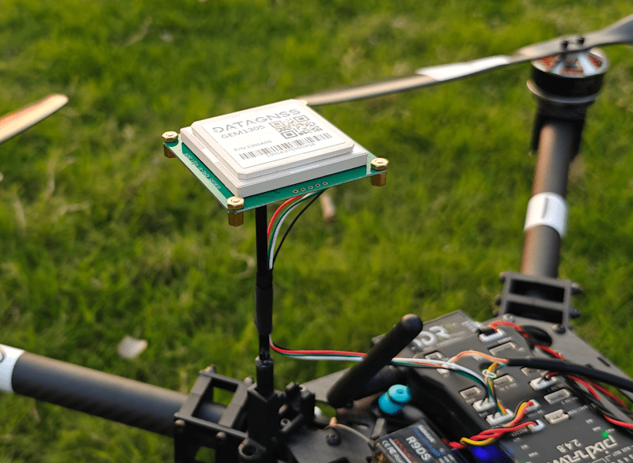
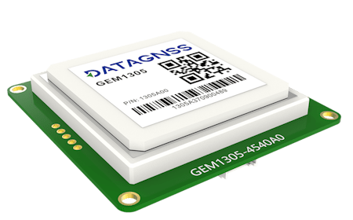
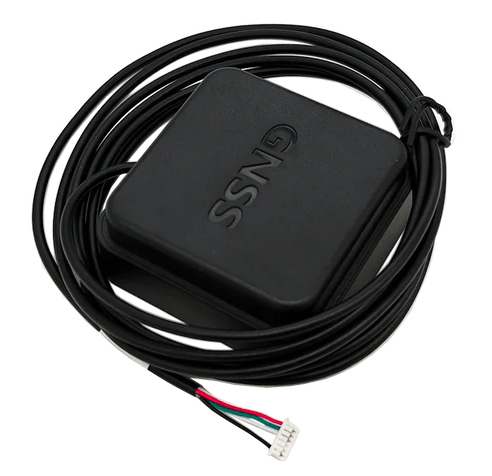
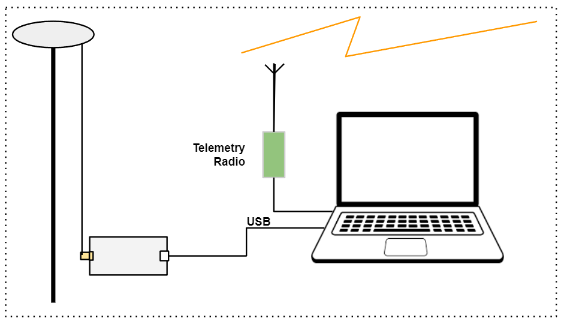

# DATAGNSS GEM1305 RTK接收器（带天线）

GEM1305是由[DATAGNSS](https://www.datagnss.com/)设计制造的[RTK GNSS](../gps_compass/rtk_gps.md)接收器（带天线）。

GEM1305基于新一代CYNOSURE IV双核GNSS SoC，支持RTK功能，最大数据更新速率达10Hz，并配有连接至大多数Pixhawk设备GPS端口的线缆。

::: info
GEM1305支持基准站和流动站模式，目前不支持移动基准站模式。
:::

## 购买渠道

- [GEM1305 RTK接收器（带天线）](https://www.datagnss.com/collections/gnss-for-drone/products/gem1305) (www.datagnss.com)

  

- [DGM10 RTK接收器](https://www.datagnss.com/collections/gnss-for-drone/products/dgm10-rtk-receiver)（同款接收器的外壳版本）

  

## 核心特性

- 全星座、多频段GNSS卫星接收器
- 支持RTK，最高输出速率达10Hz
- 内置IST8310磁力计
- 标准UART串行接口
- 重量仅50g（GEM1305）或26g（NANO RTK接收器）
- 高性能天线

## 频段支持

- GPS/QZSS: L1 C/A, L5C
- GLONASS: L1OF
- 北斗: B1I, B2a
- 伽利略: E1, E5a
- 北斗: L5

## GNSS性能

- 128个硬件通道
- 3D定位精度：**1.5m** CEP
- RTK定位精度：**2cm** +1PPM(H), 3cm+1PPM(V)

## 接口规格

- UART: 默认230400bps
- 天线SMA接口
- 默认输出5Hz，最高10Hz
- 主电源：4.7~5.2V

## 通信协议

- NMEA-0183输出
- RTCMv3输入/输出

## 环境参数

- 工作温度：-20~85°C

## 尺寸与重量

- 55x55x12mm
- 50g (GEM1305) 26g (NANO with Helix)

## 接口定义

该模块通过UART接口与飞控连接。

1.25mm间距6针接口（从左至右：PIN1至PIN6），支持GNSS的UART和磁力计的I2C。

## 硬件配置

RTK需要地面站的基准站模块和机体的流动站模块，基准站数据需通过数传电台传输到机体的RTK接收器。

基准站和流动站模块的配置连接如下：

### 基准站配置（地面站）

基准站连接及数传电台连接如下图所示。

建议使用[NANO RTK接收器](https://www.datagnss.com/collections/gnss-for-drone/products/multi-band-rtk-receiver-package)作为基准站，因其配置更简便。

参见[如何配置基准站](https://wiki.datagnss.com/index.php/GEM1305-autopilot#Base_station_setup)（不含第6步及后续，这些步骤需使用QGroundControl而非Mission Planner）。

### 流动站配置（PX4）

流动站连接至GPS端口和数传电台的配置如下图所示。

下图显示了Pixhawk 6c飞控的GPS2端口接线。请注意配套线缆已提供。

通过_QGroundControl_在PX4上配置GPS和RTK为即插即用（详见[RTK GPS](../gps_compass/rtk_gps.md)获取更多信息）。

## 包装清单

- GEM1305 RTK接收器
- DG-6P-C01，GH-1.25mm-6P线缆

## 资源链接

- [NANO RTK接收器2D图纸](https://wiki.datagnss.com/images/3/31/EVK-DG-1206_V.2.0.pdf)
- [GEM1305维基](https://docs.datagnss.com/gnss/rtk_receiver/GEM1305/) (DATAGNSS维基)
- [HED-10L航向RTK接收器](https://docs.datagnss.com/gnss/rtk_receiver/HED-10L/)
- [NANO HRTK接收器](https://docs.datagnss.com/gnss/rtk_receiver/NANO/nano-helix-rtk/)

## 附加信息

- [NANO RTK接收器](https://www.datagnss.com/collections/evk/products/tau951m-1312-tiny-evk)
- [HELIX RTK天线](https://www.datagnss.com/collections/rtk-antenna/products/smart-helix-antenna)
- [RTK天线AGR6302G](https://www.datagnss.com/collections/rtk-antenna/products/antenna-agr6302g)
- [AT400 RTK天线](https://www.datagnss.com/collections/rtk-antenna/products/at400-multi-band-antenna-for-rtk)