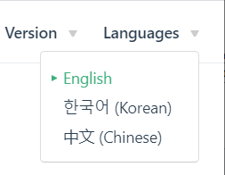

# PX4 自动驾驶仪用户指南

  

PX4 是一款 _Professional Autopilot_。
由来自工业界和学术界的顶级开发者开发，并由活跃的全球社区支持，它为各种类型的机体提供动力，从竞速无人机和货运无人机到地面车辆和水下机器人。

:::tip
本指南包含您组装、配置和安全飞行基于 PX4 的机体所需的所有内容。有兴趣参与贡献？查看 [开发](development/development.md) 部分。

:::

:::warning
本指南适用于 PX4 的开发版本（`main` 分支）。
使用 **版本** 选择器查找当前稳定的版本。

自稳定版本发布后的变更记录已收录在持续更新的 [发布说明](releases/main.md) 中。
:::

## 如何入门？

[基本概念](getting_started/px4_basic_concepts.md) 是所有用户都应阅读的内容！
它提供了关于 PX4 的概述，包括飞行堆栈提供的功能（飞行模式和安全功能）以及支持的硬件（飞控、机体类型、遥测系统、遥控系统）。

根据您的目标，以下提示将帮助您浏览本指南：

### 我需要一个与 PX4 兼容的机体

在 [多旋翼](frames_multicopter/index.md)、[VTOL](frames_vtol/index.md) 和 [固定翼](frames_plane/index.md) 部分，您会找到以下主题（这些链接是针对多旋翼的）：

- [完整机体](complete_vehicles_mc/index.md) 列出了 "即飞型"（RTF）预装机体
- [套件](frames_multicopter/kits.md) 列出了需要自行从预选组件中组装的无人机
- [自制组装](frames_multicopter/diy_builds.md) 展示了一些使用单独采购组件组装的无人机示例

套件和完整机体通常包含除电池和遥控系统外您需要的一切。
套件通常易于组装，能很好地介绍无人机的组装方式，并且相对便宜。
我们提供通用的组装指南，如 [多旋翼组装](assembly/assembly_mc.md)，大多数套件也附带了具体的组装说明。

如果套件和预装无人机都不适合您，您可以从零开始构建机体，但这需要更多专业知识。
[机体组装](airframes/index.md) 列出了支持的机架起点，以帮助您了解可能的选项。

一旦您获得支持 PX4 的机体，就需要进行配置和传感器校准。
每种机体类型都有自己的配置部分，说明主要步骤，如 [多旋翼配置/调参](config_mc/index.md)。

### 我想添加有效载荷/摄像头

[有效载荷](payloads/index.md) 部分描述了如何添加摄像头以及如何配置 PX4 以实现货物投递。

### 我正在修改支持的机体

[硬件选择与设置](hardware/drone_parts.md) 部分提供了关于可能与 PX4 一起使用的硬件的高层级和产品特定信息及其配置。
如果您想修改无人机并添加新组件，这是您应该首先查看的地方。

### 我想飞行

在飞行前，您应该阅读 [操作](config/operations.md) 以了解如何设置机体的安全功能和所有机体类型共有的一般行为。
完成这些后，您就可以开始飞行了。

每种机体类型的飞行基础说明分别在相应部分提供，如 [多旋翼基础飞行](flying/basic_flying_mc.md)。

### 我想在新飞控上运行 PX4 并扩展平台

[开发](development/development.md) 部分解释了如何支持新机体和车辆类型、修改飞行算法、添加新模式、集成新硬件、从飞控外部与 PX4 通信，以及为 PX4 贡献代码。

## 获取帮助

[支持](contribute/support.md) 页面说明了如何从核心开发团队和更广泛的社区获得帮助。

其中包括：

- [可以获取帮助的论坛](contribute/support.md#forums-and-chat)
- [问题诊断](contribute/support.md#diagnosing-problems)
- [如何报告错误](contribute/support.md#issue-bug-reporting)
- [每周开发电话](contribute/support.md#weekly-dev-call)

## 报告错误与问题

如果在使用 PX4 时遇到任何问题，请首先在 [支持论坛](contribute/support.md#forums-and-chat) 进行发布（因为这些问题可能由机体配置引起）。

如果开发团队指示，代码问题可通过 [此处的 Github](https://github.com/PX4/PX4-Autopilot/issues) 提交。
请尽可能提供 [飞行日志](getting_started/flight_reporting.md) 以及问题模板中请求的其他信息。

## 贡献

有关如何为代码和文档贡献的更多信息，请参阅[贡献](contribute/index.md)部分：

- [代码](contribute/index.md)
- [文档](contribute/docs.md)
- [翻译](contribute/translation.md)

## 翻译

本指南有多个[翻译](contribute/translation.md)。  
您可以通过右上角的语言菜单访问这些翻译：

<!--@include: _contributors.md-->

## License

PX4 代码可在宽松的 [BSD 3-clause license](https://opensource.org/licenses/BSD-3-Clause) 条款下免费使用和修改。
本文档采用 [CC BY 4.0](https://creativecommons.org/licenses/by/4.0/) 授权。
更多信息请参见：[Licences](contribute/licenses.md)。

## 日历与事件

_Dronecode日历_ 展示了平台用户和开发者的重要社区活动。  
点击下方链接以在时区中显示日历（并添加到您自己的日历中）：

- [瑞士 – 苏黎世](https://calendar.google.com/calendar/embed?src=linuxfoundation.org_g21tvam24m7pm7jhev01bvlqh8%40group.calendar.google.com&ctz=Europe%2FZurich)
- [太平洋时间 – 提华纳](https://calendar.google.com/calendar/embed?src=linuxfoundation.org_g21tvam24m7pm7jhev01bvlqh8%40group.calendar.google.com&ctz=America%2FTijuana)
- [澳大利亚 – 墨尔本/悉尼/霍巴特](https://calendar.google.com/calendar/embed?src=linuxfoundation.org_g21tvam24m7pm7jhev01bvlqh8%40group.calendar.google.com&ctz=Australia%2FSydney)

:::tip
日历默认时区为中欧时间（CET）。

:::

<iframe src="https://calendar.google.com/calendar/embed?title=Dronecode%20Calendar&amp;mode=WEEK&amp;height=600&amp;wkst=1&amp;bgcolor=%23FFFFFF&amp;src=linuxfoundation.org_g21tvam24m7pm7jhev01bvlqh8%40group.calendar.google.com&amp;color=%23691426&amp;ctz=Europe%2FZurich" style="border-width:0" width="800" height="600" frameborder="0" scrolling="no"></iframe>

### 图标

本库中使用的以下图标分别通过以下许可证授权：

 _占位符_ 图标由 <a href="https://www.flaticon.com/authors/smashicons" title="Smashicons">Smashicons</a> 通过 <a href="https://www.flaticon.com/" title="Flaticon">www.flaticon.com</a> 提供，授权方式为 <a href="https://creativecommons.org/licenses/by/3.0/" title="Creative Commons BY 3.0" target="_blank">CC 3.0 BY</a>。

 _相机自动模式_ 图标由 <a href="https://www.freepik.com" title="Freepik">Freepik</a> 通过 <a href="https://www.flaticon.com/" title="Flaticon">www.flaticon.com</a> 提供，授权方式为 <a href="http://creativecommons.org/licenses/by/3.0/" title="Creative Commons BY 3.0" target="_blank">CC 3.0 BY</a>。

## 治理

PX4 飞行堆栈由 [Dronecode 项目](https://www.dronecode.org/) 进行托管治理。

&nbsp;

文档构建时间: {{ $buildTime }}