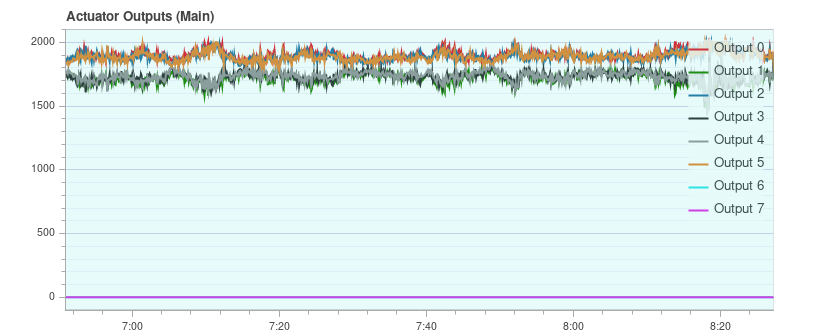
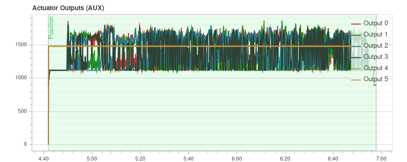
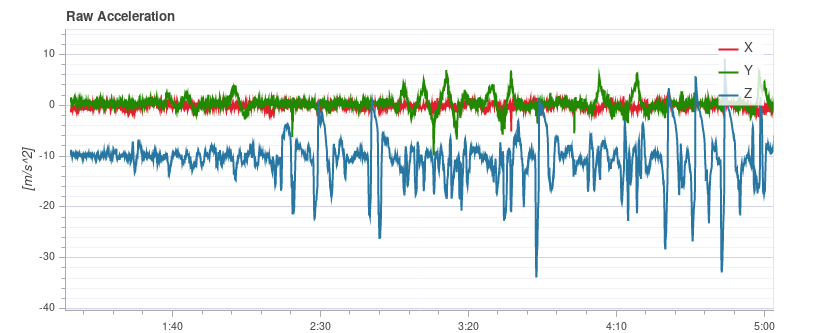

# 使用飞行回顾进行日志分析

[飞行回顾](http://logs.px4.io)的图表可用于分析机体整体状态。

这些图表旨在自解释，但需要一定的经验来判断哪些范围是可接受的，以及图表应呈现怎样的形态。  
本页面解释了如何解读这些图表并识别常见问题。## 通用使用

适用于多数图表的通用功能：

- 图表背景颜色用于在记录期间指示飞行模式（图表内容会根据模式变化）：
  
  - **飞行模式：** 图表主体的背景颜色表示当前飞行模式。
    将鼠标悬停在图表上可显示飞行模式标签。
  - **VTOL飞行模式：** VTOL机体还会在图表底部区域通过背景颜色显示VTOL模式（多旋翼为蓝色，固定翼为黄色，转换阶段为红色）。
- 在特定图表轴上滚动鼠标可缩放该轴（水平或垂直方向）。
- 在图表内部滚动鼠标可同时缩放两个轴。

## PID跟踪性能

根据飞行模式的不同，机体控制器可能会尝试跟踪位置、速度、高度或角速度设定值（跟踪的设定值取决于模式，例如：在稳定模式下没有速度设定值）。

**Estimated**线（红色）应与**Setpoint**（绿色）紧密匹配。  
如果未能匹配，大多数情况下需要调整该控制器的PID增益。

[多旋翼PID调参指南](../config_mc/pid_tuning_guide_multicopter.md)包含示例图表和关于分析跟踪性能的信息。

:::tip
对于角速度控制器，启用高频率记录配置（[SDLOG_PROFILE](../advanced_config/parameter_reference.md#SDLOG_PROFIL)）在放大查看时可以获得更详细的日志信息。
:::## 振动

振动是多旋翼机体最常见的问题之一。
高振动水平可能导致：
- 飞行效率降低和续航时间减少
- 电机过热
- 材料磨损加剧
- 无法精确调校机体，导致飞行性能下降。
- 传感器信号截断
- 位置估算失败，可能导致失控飞离。

因此需要密切关注振动水平，并在必要时优化配置。

存在一个振动水平明显过高的临界点，通常振动水平越低越好。
然而在"一切正常"和"振动过强"之间存在较大区间。
这个区间取决于多个因素，包括机体尺寸（较大机体具有更高的惯性，允许使用更多软件滤波（同时大机体的振动频率更低）。

以下段落和章节提供关于使用哪些图表检查振动水平以及如何分析的详细信息。

:::tip
分析振动时查看多张图表是有帮助的（不同图表可能能更好地突出显示某些问题）。
:::

### 执行器控制FFT

::: info
你需要启用高频率记录配置文件([SDLOG_PROFILE](../advanced_config/parameter_reference.md#SDLOG_PROFILE))才能看到此图表。
:::

此图展示基于执行器控制信号（速率控制器的PID输出）的横滚、俯仰和偏航轴的频率分布。
它有助于识别频率峰值和配置软件滤波器。
应该只有一个位于低端的峰值（约20Hz以下），其余部分应保持低且平滑。

注意y轴比例对不同机体可能不同，但相同机体的记录可以直接比较。

#### 示例：良好振动

[QAV-R 5" Racer](../frames_multicopter/qav_r_5_kiss_esc_racer.md)机架（振动优秀）。

::: info
上述机架优秀的振动特性使我们能够显著提高[软件滤波器](../config_mc/filter_tuning.md)的截止频率（减少控制延迟）。
:::

DJI F450机架（振动良好）。

S500机架:

::: info
虽然上述图表看起来良好，但[相同飞行的原始加速度图](#raw_acc_s500)显示x和y轴的振动水平略高。
这是为何值得检查多个图表的典型例子！
:::

#### 示例：不良振动

此示例显示接近50Hz的频率峰值（在此情况下由"松动"的起落架引起）。

### 加速度功率谱密度

这是二维频率图，显示原始加速度计数据随时间变化的频率响应（显示x、y和z轴的总和）。
颜色越接近黄色，表示该时间和频率下的响应越强。

理想情况下只有最下方到几个Hz的部分显示黄色，其余部分主要为绿色或蓝色。

#### 示例：良好振动

[QAV-R 5" Racer](../frames_multicopter/qav_r_5_kiss_esc_racer.md)机架（振动优秀）。

<!-- https://logs.px4.io/plot_app?log=cd88b091-ec89-457c-85f6-e63e4fa0f51d -->

DJI F450机架（振动良好）。

::: info
上面可以看到螺旋桨的叶片通过频率在约100Hz处。
:::

S500机架:

#### 示例：不良振动

100Hz左右的强黄色线条指示需要进一步调查的潜在问题（从检查其他图表开始）。

下图显示接近50Hz的频率峰值（在此情况下由"松动"的起落架引起）。

::: warning
此频率接近典型电机和螺旋桨的谐振频率，需特别注意。
:::

### 原始加速度图

### 解决振动问题

通常仅凭日志无法识别振动源（或多个振动源的组合）。

此时应检查机体。
[振动隔离](../assembly/vibration_isolation.md)解释了一些可以检查（并执行）以降低振动水平的基本事项。## 执行器输出

*执行器输出*图表展示了发送到各个执行器(电机/舵机)的信号。  
通常这些信号处于配置的最小和最大PWM值范围之间（例如从1000到2000）。

以下是一个四旋翼飞行器的示例，所有信号都正常（信号均在范围内、大致重叠且噪声不大）：  

该图表可帮助识别以下问题：  
- 如果一个或多个信号长时间处于最大值，则说明控制器进入了**饱和**状态。  
  这不一定是问题，例如全油门飞行时这是正常现象。  
  但如果在任务期间发生这种情况，则表明机体的推力不足以支持其重量。  
- 对于多旋翼飞行器，该图表可以很好地显示机体是否**不平衡**。  
  图表显示某些相邻电机（四旋翼飞行器中为两个电机）需要平均以更高推力运行。  
  请注意，这种情况也可能是因为某些电机推力不一致或电调未校准。  
  飞行器不平衡通常不会造成大问题，因为自动驾驶仪会自动补偿这种情况。  
  但会降低最大可实现推力并增加某些电机的负担，因此建议平衡机体。  
- 偏航轴也可能导致不平衡。  
  图表看起来与前一种情况类似，但对角电机的转速会分别更高或更低。  
  原因可能是某些电机发生倾斜。  

  以下是一个六旋翼飞行器的示例：电机1、3和6以更高推力运行：  
    
  <!-- https://logs.px4.io/plot_app?log=9eca6934-b657-4976-a32f-b2e56535f05f -->  
- 如果信号**噪声**很大（振幅较高），可能有两个原因：传感器噪声或振动通过控制器传递（这在其他图表中也会显示，见上一节）或PID增益过高。  
  以下是一个极端示例：  
  

## GPS不确定性

*GPS不确定性*图表展示了来自GPS设备的信息：
- 使用的卫星数量（应为12或更高）
- 水平位置精度（应低于1米）
- 垂直位置精度（应低于2米）
- GPS定位状态：3表示3D GPS定位，4表示GPS+航位推算，5表示RTK浮点解，6表示RTK固定解## GPS噪声与干扰

GPS噪声与干扰图用于检测GPS信号的干扰和阻塞情况。  
GPS信号非常微弱，因此很容易被通过电缆传输或在GPS使用频率上辐射的组件干扰/阻塞。

:::tip
USB 3 [已知会成为](https://www.usb.org/sites/default/files/327216.pdf) 有效的GPS干扰源。
:::

**干扰指标** 应在40或以下。  
80或更高的数值过高，必须检查设备配置。  
信号干扰也会表现为精度降低和卫星数量减少，直至无法获得GPS定位。

这是一个无干扰的示例：

## 推力和磁场

*推力和磁场*图表显示推力和磁传感器测量向量的范数。

在整段飞行过程中，范数应保持恒定且与推力无关。
以下是一个良好示例，其范数非常接近恒定：

*如果存在相关性*，则说明电机（或其他用电设备）的电流正在影响磁场。
这必须避免，因为它会导致偏航估计错误。
下图展示了推力与磁强计范数之间的强相关性：

解决方案包括：
- 使用外部磁强计（避免使用内部磁强计）
- 如果使用外部磁强计，将其远离强电流区域（例如通过使用（更长的）GPS天线杆）

如果范数虽然不相关但不恒定，很可能是校准不当所致。
但也可能是由外部干扰引起（例如靠近金属结构飞行时）。

此示例显示范数非恒定，但与推力无关：

## 估计器看门狗

*估计器看门狗* 图表显示估计器的健康报告。  
它应该保持恒定的零值。

如果没有问题，它应该如下所示：  

如果其中一个标志不为零，估计器检测到需要进一步调查的问题。  
大多数情况下，这是传感器的问题，例如磁力计干扰。  
通常查看相应传感器的图表会有帮助。  
<!-- TODO: separate page for estimator issues? -->

这里有一个磁力计问题的示例：  

## 传感器数据的采样规律性

采样规律性图表有助于发现日志系统和调度方面的问题。

当日志缓冲区过小、日志速率过高或使用低质量SD卡时，**日志丢包**数量会开始增加。

::: info
中等质量的存储卡上偶尔出现丢包是正常的。
:::

**delta t**显示了两个记录的IMU样本之间的时间差。  
它应该接近4毫秒，因为数据发布率是250Hz。  
如果出现该值的倍数级尖峰（且估计器时间滑移未增加），则表示记录器跳过了部分样本。偶尔发生这种情况是因为记录器的优先级较低。  
如果尖峰不是倍数关系，则表明传感器驱动程序的调度不规则，需要进一步调查。

**estimator timeslip**显示当前时间与集成传感器间隔时间的差值。  
如果该值发生变化，表示估计器丢失了传感器数据或驱动程序发布了错误的积分间隔。  
它应该保持为零，但在飞行中进行参数更改时可能会略微增加，这通常不是问题。

这是一个良好示例：  

以下示例包含过多丢包，这种情况使用的SD卡质量过低（见[here](../dev_log/logging.md#sd-cards)获取优质SD卡）：  

## 记录的消息

这是一个包含系统错误和警告消息的表格。  
例如，当任务的堆栈大小不足时会显示这些消息。

需要逐条检查这些消息，并非所有消息都表示存在问题。  
例如，下图显示了一个紧急停止开关的测试示例：  

## 飞行/机身日志审查示例

在分析机体状态时，查看特定飞行的多个图表通常是有价值的（不同图表可以更好地突出某些问题）。  
在审查可能的振动问题时这一点尤为重要。

下面部分按飞行/机体对几个（之前展示的）图表进行了分组。

### QAV-R 5" Racer

这些图表均来自同一架[QAV-R 5" Racer](../frames_multicopter/qav_r_5_kiss_esc_racer.md)的飞行。  
<!-- https://logs.px4.io/plot_app?log=cd88b091-ec89-457c-85f6-e63e4fa0f51d -->

它们展示了一个振动极低的机体：  
- 执行器控制FFT显示仅在最低端有一个峰值，其余部分低且平坦。  
- 频谱密度图大部分为绿色，低频段仅有少量黄色。  
- 原始加速度图中，z轴轨迹与x/y轴轨迹明显分离。  

  
  
  

### DJI F450

这些图表均来自同一架*DJI F450*的飞行。  
<!-- https://logs.px4.io/plot_app?log=cd88b091-ec89-457c-85f6-e63e4fa0f51d -->

它们展示了一个振动较低（但不如上方的QAV-R低）的机体：  
- 执行器控制FFT显示最低端有一个峰值。其余大部分平坦，但在约100Hz处有轻微凸起（这是桨叶通过频率）。  
- 频谱密度图大部分为绿色。桨叶通过频率再次可见。  
- 原始加速度图中，z轴轨迹与x/y轴轨迹明显分离。  

  
  
  

### S500

这些图表均来自同一架S500的飞行。

它们展示了一个振动处于可接受边缘的机体：  
- 执行器控制FFT显示最低端有一个峰值。其余大部分平坦，但在约100Hz处有轻微凸起。  
- 频谱密度图大部分为绿色，但在100Hz处的黄色区域比DJI F450更多。  
- 原始加速度图中，z轴轨迹与x/y轴轨迹较为接近。这已处于开始对飞行性能产生负面影响的临界点。  

  
  
