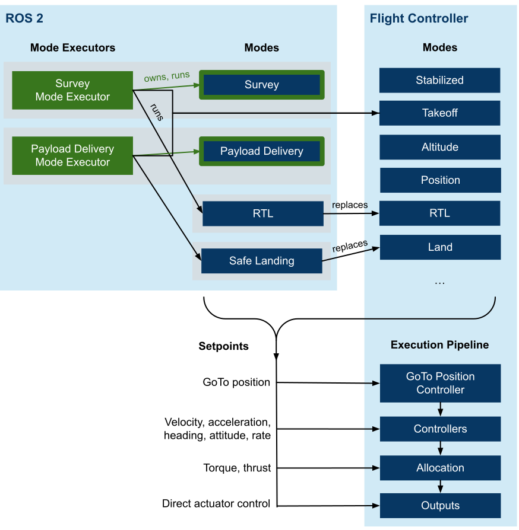

# PX4 ROS 2 控制接口

<Badge type="tip" text="PX4 v1.15" /> <Badge type="warning" text="Experimental" />

:::warning Experimental
在撰写本文时，PX4 ROS 2 控制接口的部分内容仍处于实验性阶段，可能会有所变更：

- 定义ROS 2模式的架构和核心接口已基本稳定，并在CI中进行了测试。
  相比当前状态下的外部模式，该库提供了显著优势。
- 仅有少数设定点类型已稳定（其他仍在开发中）。
  您可能需要使用内部PX4主题，但这些主题可能随着时间推移而失去向后兼容性。
- API尚未完全文档化。

:::

[PX4 ROS 2 接口库](../ros2/px4_ros2_interface_lib.md)是一个C++库，用于简化从ROS 2控制PX4。

开发者使用该库创建并动态注册使用ROS 2编写的模式。
这些模式会动态注册到PX4中，并在地面站或其他外部系统中显示为PX4的一部分。
如果ROS2模式失败，甚至可以替换PX4中的默认模式，并回退到原始版本。

该库还提供了发送不同类型设定点的类，范围从高层导航任务一直到直接执行器控制。
这些类抽象了PX4内部使用的设定点，因此可以为未来的PX4和ROS版本提供一致的ROS 2接口。

与PX4内部模式相比，PX4 ROS 2模式更易于实现和维护，并为开发者提供了更多的资源（如处理能力和现有库）。
除非该模式是安全关键型、需要严格时间控制或极高更新率，或者你的机体没有搭载计算模块，否则应[优先考虑使用PX4 ROS 2模式而非PX4内部模式](../concept/flight_modes.md#internal-vs-external-modes)。

## 概述

该图提供了控制接口模式与模式执行器如何与PX4交互的概念性概述。



<!-- 来源: https://docs.google.com/drawings/d/1WByCfgcytnaow7r41VhYJL8OGrw1RjFO51GoPMQBCNA/edit -->

以下部分定义并解释了图中使用的关键术语。

### 定义

#### 模式

通过接口库定义的模式具有以下特性：

- 模式是一个可向机体发送设定点以控制其运动（如速度或直接执行器指令）的组件。
- 模式选择特定的设定点类型并在激活时发送，可在多种设定点类型间切换。
- 模式不能激活其他模式，必须通过用户（通过遥控器/GCS）、飞控在紧急情况下、_模式执行器_或外部系统激活。
- 具有在GCS中显示的名称。
- 可配置其模式需求（例如需要有效的定位估计）。
- 模式可执行多种任务，例如飞向目标、放下绞盘、释放载荷后返回。
- 模式可替代PX4中定义的模式。

#### 模式执行器

模式执行器是一个用于调度模式的可选组件。例如，自定义载荷投送或测绘模式的执行器可能首先触发起飞，然后切换到自定义模式，完成后触发返航。

具体特性如下：

- 模式执行器是比模式高一级的可选组件。它是一个状态机，可以激活模式并等待其完成。
- 仅在其处于主导状态时才能执行此操作。为此，执行器拥有且仅拥有一_个专属模式_（一个模式最多只能被一个执行器拥有）。该模式作为执行器的激活机制：当用户选择该模式时，所属执行器被激活并可选择任意模式。它将持续主导直至用户切换模式（通过遥控器或GCS）或紧急情况触发模式切换。若紧急情况解除，执行器将重新激活。
- 这允许多个执行器共存。
- 执行器不能激活其他执行器。
- 在库内，模式执行器始终与自定义模式组合实现。

::: info

- 这些定义保证了用户随时可通过遥控器或GCS的模式切换指令从自定义模式或执行器中夺回控制权。
- 模式执行器对用户是透明的。它通过所属模式间接选择和激活，因此模式应相应命名。

:::

#### 配置覆盖

模式和执行器均可定义配置覆盖，允许在模式或执行器激活期间自定义特定行为。当前实现包括：

- _禁用自动解除武装_。允许着陆后重新起飞（例如释放载荷）。
- _延迟非关键性紧急情况_。允许执行器在不被非关键性紧急情况中断的情况下运行。例如，忽略低电量紧急情况以完成绞盘操作。

### 与离线控制的对比

上述概念相比传统[离线控制](../ros/offboard_control.md)具有以下优势：

- 多个节点或应用程序可以共存甚至同时运行。但同一时间仅有一个节点能_控制机体_，且该节点是明确的。
- 模式具有明确的名称，可在GCS中显示/选择。
- 模式与紧急状态机和武装检查集成。
- 可发送的设定点类型是明确的。
- ROS 2模式可替代飞控内部模式（如[返航模式](../flight_modes/return.md)）。

## 安装和首次测试

要开始使用，需要执行以下步骤：

1. 确保已配置好 [ROS 2 环境](../ros2/user_guide.md)，并在 ROS 2 工作空间中包含 [`px4_msgs`](https://github.com/PX4/px4_msgs)。

2. 克隆仓库到工作空间：

   ```sh
   cd $ros_workspace/src
   git clone --recursive https://github.com/Auterion/px4-ros2-interface-lib
   ```

   ::: info
   为确保兼容性，请使用 PX4、_px4_msgs_ 和库的最新 _main_ 分支。
   详见 [此处](https://github.com/Auterion/px4-ros2-interface-lib#compatibility-with-px4)。
   :::

3. 构建工作空间：

   ```sh
   cd ..
   colcon build
   source install/setup.bash
   ```

4. 在另一个终端中启动 PX4 SITL：

   ```sh
   cd $px4-autopilot
   make px4_sitl gazebo-classic
   ```

   （此处使用 Gazebo-Classic，但可替换为任意模型或模拟器）

5. 在新终端中运行 micro XRCE 代理（可保持运行）：

   ```sh
   MicroXRCEAgent udp4 -p 8888
   ```

6. 启动 QGroundControl。

   ::: info
   使用 QGroundControl Daily（支持动态更新模式列表）。
   :::

7. 返回 ROS 2 终端，运行示例模式之一：

   ```sh
   ros2 run example_mode_manual_cpp example_mode_manual
   ```

   应该会输出类似以下内容，显示 'My Manual Mode' 模式已注册：

   ```sh
   [DEBUG] [example_mode_manual]: Checking message compatibility...
   [DEBUG] [example_mode_manual]: Subscriber found, continuing
   [DEBUG] [example_mode_manual]: Publisher found, continuing
   [DEBUG] [example_mode_manual]: Registering 'My Manual Mode' (arming check: 1, mode: 1, mode executor: 0)
   [DEBUG] [example_mode_manual]: Subscriber found, continuing
   [DEBUG] [example_mode_manual]: Publisher found, continuing
   [DEBUG] [example_mode_manual]: Got RegisterExtComponentReply
   [DEBUG] [example_mode_manual]: Arming check request (id=1, only printed once)
   ```

8. 在 PX4 终端中，可以检查 PX4 是否已注册新模式：

   ```sh
   commander status
   ```

   输出应包含：

   ```plain
   INFO  [commander] Disarmed
   INFO  [commander] navigation mode: Position
   INFO  [commander] user intended navigation mode: Position
   INFO  [commander] in failsafe: no
   INFO  [commander] External Mode 1: nav_state: 23, name: My Manual Mode
   ```

9. 此时应在 QGroundControl 中看到该模式：

   

10. 选择该模式，确保有手动控制源（物理或虚拟摇杆），并为机体上锁。
    模式将被激活，并输出以下内容：

    ```sh
    [DEBUG] [example_mode_manual]: Mode 'My Manual Mode' activated
    ```

11. 现在，您可以开始创建自己的模式。To implement an external flight mode using the **PX4 ROS 2 Interface Library**, follow these steps and best practices:

---

### **1. Mode Setup and Initialization**
- **Create a Mode Class**:  
  Inherit from `ModeBase` and define your custom logic. For example, a basic hover mode:
  ```cpp
  class HoverMode : public ModeBase {
  public:
    HoverMode() : ModeBase(Settings{"HoverMode", false, ModeBase::kModeIDCustom}) {
      _trajectory_setpoint = std::make_shared<TrajectorySetpoint>(this);
      _manual_control_input = std::make_shared<ManualControlInput>(*this);
    }
  private:
    std::shared_ptr<TrajectorySetpoint> _trajectory_setpoint;
    std::shared_ptr<ManualControlInput> _manual_control_input;
  };
  ```
  - Use `TrajectorySetpoint` for velocity/acceleration control in multicopter mode.
  - Use `FwLateralLongitudinalSetpoint` for fixed-wing control.

---

### **2. Telemetry Integration**
- **Access Vehicle State**:  
  Use `OdometryLocalPosition` to get the current position/velocity:
  ```cpp
  auto position = _vehicle_local_position->positionNed();  // Returns (x, y, z) in NED
  bool valid = _vehicle_local_position->positionXYValid();
  ```
  - Subscribe to telemetry topics in your mode constructor if needed.

---

### **3. Setpoint Logic**
- **Multicopter Example (Hover)**:  
  Set zero velocity and acceleration to hover:
  ```cpp
  void HoverMode::update() {
    Eigen::Vector3f velocity_sp(0.0f, 0.0f, 0.0f);
    Eigen::Vector3f acceleration_sp(0.0f, 0.0f, 0.0f);
    _trajectory_setpoint->update(velocity_sp, acceleration_sp);
  }
  ```
  - Use `update(velocity, acceleration)` for trajectory-based control.

- **Fixed-Wing Example**:  
  Set a target course (e.g., North):
  ```cpp
  float course_sp = 0.0f;  // 0 radians = North
  _fw_lateral_longitudinal_setpoint->updateWithAltitude(NAN, course_sp);
  ```

---

### **4. Failsafes and Requirements**
- **Declare Requirements**:  
  Automatically set based on used objects. For example, using `ManualControlInput` sets the manual control requirement.
  - If the mode requires arming or a home position, ensure flags are set:
    ```cpp
    modeRequirements().arming = true;
    modeRequirements().home_position = true;
    ```

- **Failsafe Handling**:  
  If requirements are unmet (e.g., no RC signal), PX4 will trigger a failsafe. Override `onFailsafeDeferred()` to handle deferrals:
  ```cpp
  void HoverMode::onFailsafeDeferred() override {
    // Log or handle deferred failsafe
  }
  ```

---

### **5. VTOL Transitions (Optional)**
- **Transition Logic**:  
  Use the `VTOL` API to handle transitions:
  ```cpp
  class VtolHoverMode : public ModeBase {
  public:
    VtolHoverMode() : ModeBase(Settings{"VtolHoverMode", false, ModeBase::kModeIDCustom}) {
      _vtol = std::make_shared<VTOL>(this);
      _trajectory_setpoint = std::make_shared<TrajectorySetpoint>(this);
      _fw_lateral_longitudinal_setpoint = std::make_shared<FwLateralLongitudinalSetpoint>(this);
    }

    void update() override {
      if (_vtol->getCurrentState() == VTOL::State::FixedWing) {
        float course_sp = 0.0f;
        _fw_lateral_longitudinal_setpoint->updateWithAltitude(NAN, course_sp);
      } else {
        // Multicopter logic
      }
    }

  private:
    std::shared_ptr<VTOL> _vtol;
    std::shared_ptr<TrajectorySetpoint> _trajectory_setpoint;
    std::shared_ptr<FwLateralLongitudinalSetpoint> _fw_lateral_longitudinal_setpoint;
  };
  ```

- **Command Transitions**:  
  Use `_vtol->toMulticopter()` or `_vtol->toFixedwing()` to request a transition. During the transition, send both setpoint types to ensure smooth behavior.

---

### **6. Controlling Independent Actuators**
- **Peripheral Actuators**:  
  Use `PeripheralActuatorControls` to control non-flight actuators (e.g., payload servos):
  ```cpp
  _peripheral_actuators = std::make_shared<PeripheralActuatorControls>(this);
  _peripheral_actuators->set(0, 0.5f);  // Actuator index 0 to 50% PWM
  ```

---

### **7. Assigning to RC Switch/Joystick**
- **Get Mode Index**:  
  Run `commander status` in QGroundControl to get the mode index (e.g., "External Mode 1").

- **Assign in QGC**:  
  Go to **Flight Mode Settings** and assign the external mode to an RC switch or joystick action.

---

### **8. Replacing Internal Modes**
- **Replace RTL Mode**:  
  Set `kModeIDRtl` in the constructor:
  ```cpp
  Settings{"CustomRTL", false, ModeBase::kModeIDRtl}
  ```
  - When RTL is selected, your mode will execute instead of the default RTL.

---

### **9. Testing and Debugging**
- **Simulate Requirements**:  
  Ensure the mode declares all required flags (arming, home position, etc.).
- **Check Setpoints**:  
  Use `mavros` or QGroundControl to monitor sent setpoints.
- **Handle Edge Cases**:  
  Test transitions, failsafes, and invalid telemetry data.

---

### **Example: Full Hover Mode**
```cpp
class HoverMode : public ModeBase {
public:
  HoverMode() : ModeBase(Settings{"HoverMode", false, ModeBase::kModeIDCustom}) {
    _trajectory_setpoint = std::make_shared<TrajectorySetpoint>(this);
    _manual_control_input = std::make_shared<ManualControlInput>(*this);
  }

  void update() override {
    Eigen::Vector3f velocity_sp(0.0f, 0.0f, 0.0f);
    Eigen::Vector3f acceleration_sp(0.0f, 0.0f, 0.0f);
    _trajectory_setpoint->update(velocity_sp, acceleration_sp);
  }

private:
  std::shared_ptr<TrajectorySetpoint> _trajectory_setpoint;
  std::shared_ptr<ManualControlInput> _manual_control_input;
};
```

---

By following these steps, you can create a robust external flight mode for PX4 using the ROS 2 interface library. Always validate requirements, test in simulation first, and ensure graceful handling of edge cases.