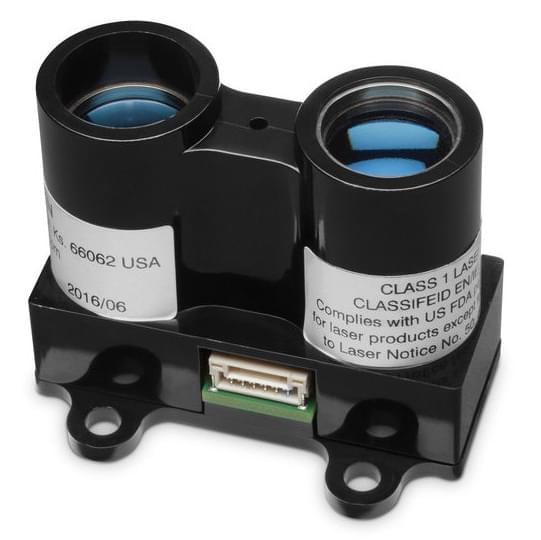

# Lidar-Lite

LIDAR-Lite 是一种紧凑型高性能光学距离测量传感器解决方案，适用于无人机、机器人或无人车辆应用。它可以通过 I2C 或 PWM 接口连接。

## 购买渠道

- [LIDAR-Lite v3](https://buy.garmin.com/en-AU/AU/p/557294) (5cm - 40m)

## 引脚分配

Lidar-Lite (v2, v3) 的引脚分配如下所示。

| 引脚 | 名称                | 描述                                                                                                                           |
| --- | ------------------- | ------------------------------------------------------------------------------------------------------------------------------------- |
| 1   | POWER_IN            | 电源输入。4.75-5.5V直流标称，最大6V直流。                                                                                    |
| 2   | POWER_EN            | 高电平有效，启用3.3V微控制器调节器。低电平使板进入睡眠模式，耗电<40 μA。(内部100K上拉) |
| 3   | Mode Select Control | 提供触发（高低边沿）PWM输出（高）                                                                                       |
| 4   | SCL                 | I2C时钟                                                                                                                             |
| 5   | SDA                 | I2C数据                                                                                                                              |
| 6   | GND                 | 信号/电源地线。                                                                                                                  |

## 接线

_Lidar-Lite v3_ 可通过 PWM 或 I2C 接口使用。
若使用旧型号建议优先使用 PWM 接口。
无论通过 PWM 还是 I2C 接口连接，测距仪都必须通过某个电调/BEC单独供电。

::: info
非蓝标的 Lidar-Lite (v1) 设备的 I2C 接口存在稳定性限制，因此所有银标的 Lidar-Lite 传感器均不支持 I2C 接口。
对于这些传感器建议使用 PWM 接口（如下所述）。
蓝标设备（v2）在低于5V供电时可能会出现固定偏移。
制造商（Q4/2015）正在调查此问题，可能通过遵循特定操作条件解决。
推荐的可靠配置是使用 v1 设备通过 PWM 接口。
:::

Lidar-Lite 3 的标准接线说明（来自[操作手册](http://static.garmin.com/pumac/LIDAR_Lite_v3_Operation_Manual_and_Technical_Specifications.pdf)）如下所示。
Lidar-Lite v2 和 v3 的接线方式相同，区别在于连接器的引脚顺序相反（即仿佛连接器被翻转了）。

### PWM 接口接线

LidarLite 与 _Pixhawk 1_ 辅助端口（PWM 接口）的接线方式如下所示。

| 引脚 | Lidar-Lite (v2, v3) | Pixhawk 辅助舵机 | 说明                                                                                             |
| --- | ------------------- | ----------------- | --------------------------------------------------------------------------------------------------- |
| 1   | VCC                 | 辅助 6（中间）    | 电源输入。4.75-5.5V直流标称，最大6V直流。                                                  |
| 2   | RESET               | 辅助 6（底部）    | 传感器的复位线                                                                            |
| 3   | PWM                 | 辅助 5（底部）    | Lidar Lite的PWM输出。**需要470欧姆下拉电阻（接地），不要使用1K欧姆电阻。** |
| 4   | SCL                 | -                 | 未连接                                                                                       |
| 5   | SDA                 | -                 | 未连接                                                                                       |
| 6   | GND                 | 辅助 6（顶部）       | 地线                                                                                              |

::: info
对于没有辅助端口的飞控，使用等效的主控引脚（例如，测距仪的PWM输出映射到主控5）。
引脚编号是硬编码的。
:::

LidarLite v2 的接线方式如下所示。
Lidar-Lite v3 的接线方式类似，区别在于连接器的引脚编号是相反的。

### I2C 接口接线

I2C 接线方式与其他距离传感器相同。
只需将 SLA、SLC、GND 和 VCC 连接到飞控和传感器上对应的相同引脚即可。

## 软件配置

通过 [SENS_EN_LL40LS](../advanced_config/parameter_reference.md#SENS_EN_LL40LS) 启用测距仪/端口 - 设置为 `1` 用于 PWM，或 `2` 用于 I2C。

::: info
此测距仪的驱动程序通常包含在固件中。
如果缺失，还需要将驱动程序（`drivers/ll40ls`）添加到板配置中。
:::

## 更多信息

- [LIDAR_Lite_v3_Operation_Manual_and_Technical_Specifications.pdf](http://static.garmin.com/pumac/LIDAR_Lite_v3_Operation_Manual_and_Technical_Specifications.pdf) (Garmin)