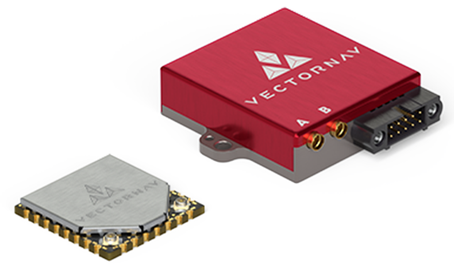

# VectorNav

VectorNav Technologies 设计和开发高性能、低SWaP的[IMU/AHRS](https://www.vectornav.com/resources/inertial-navigation-primer/theory-of-operation/theory-ahrs)、[GNSS/INS](https://www.vectornav.com/resources/inertial-navigation-primer/theory-of-operation/theory-gpsins)和[双GNSS/INS](https://www.vectornav.com/resources/inertial-navigation-primer/theory-of-operation/theory-gnsscompass)解决方案，为大规模自主运行提供安全可靠的性能。

VectorNav产品为PX4用户提供了多种优势，可集成用于：

- 更高精度的航向、俯仰和滚转估计
- 更健壮可靠的GNSS定位
- 在GNSS受限环境下的定位和姿态性能提升
- 在具有挑战性的动态条件下的性能（例如弹射发射、垂直起降操作、高g值或高角速度操作）

VectorNav的PX4驱动程序经过优化，提供简单的即插即用架构，消除工程障碍，加快平台的设计、开发和发布进程，以跟上快速的创新步伐。

PX4可以将这些设备用作[外部INS](../sensor/inertial_navigation_systems.md)，绕过/替代EKF2估计器，或作为原始传感器数据源提供给估计器。

该驱动程序支持[所有VectorNav传感器](https://www.vectornav.com/store/products)。
特别推荐以下系统：

- **VN-200 GNSS/INS**：推荐用于无需悬停且不需要静态航向的固定翼系统。
- **VN-300 双GNSS/INS**：推荐用于需要悬停和低动态操作的多旋翼系统，这些场景需要使用静态航向。

## 购买途径

VectorNav IMU/AHRS、GNSS/INS以及Dual GNSS/INS解决方案可直接通过[VectorNav Technologies](https://www.vectornav.com/store/products)（美国）购买，或通过其全球销售代表订购。如需了解更多解决方案信息或国际订单，请联系 sales@vectornav.com。

[Purchase VN-200 Development Kit](https://www.vectornav.com/store/products/gnss-ins/p/vn-200-rugged-development-kit) (GNSS/INS)  
[Purchase VN-300 Development Kit](https://www.vectornav.com/store/products/dual-gnss-ins/p/vn-300-rugged-development-kit) (Dual GNSS/INS)

## 硬件设置

### 接线

将飞控中未使用的串口（例如备用的`GPS`或`TELEM`端口）连接至VectorNav的UART2端口（PX4要求）。

### 安装

VectorNav传感器可在机体任意位置以任意方向安装，无需考虑重心位置。  
所有VectorNav传感器默认坐标系为x轴向前、y轴向右、z轴向下，对应默认安装方式为连接器朝后、基座朝下。  
可通过VectorNav参考系旋转寄存器将安装方式更改为任意固定旋转。

若使用支持GNSS的产品，GNSS天线必须相对于惯性传感器刚性安装，并具备无遮挡的天空视野。若使用双GNSS产品（VN-3X0），次级天线必须相对于主天线和惯性传感器刚性安装，并具备无遮挡的天空视野。

更多安装要求和建议，请参见相关[快速入门指南](https://www.vectornav.com/resources/quick-start-guides)。

## 固件配置

### PX4配置

要使用VectorNav驱动程序：

1. 在[kconfig板配置](../hardware/porting_guide_config.md#px4-board-configuration-kconfig)中通过设置kconfig变量将模块包含在固件中：`CONFIG_DRIVERS_INS_VECTORNAV` 或 `CONFIG_COMMON_INS`。
1. [设置参数](../advanced_config/parameters.md) [SENS_VN_CFG](../advanced_config/parameter_reference.md#SENS_VN_CFG) 为连接到VectorNav的硬件端口（更多信息请参见[串口配置](../peripherals/serial_configuration.md)）。
1. 通过将 [SYS_HAS_MAG](../advanced_config/parameter_reference.md#SYS_HAS_MAG) 设置为 `0` 来禁用磁力计起飞前检查。
1. 通过重启PX4允许VectorNav驱动程序初始化。
1. 配置驱动程序作为外部INS或提供原始数据：

   - 如果使用VectorNav作为外部INS，请将 [VN_MODE](../advanced_config/parameter_reference.md#VN_MODE) 设置为 `INS`。
     这将禁用EKF2。
   - 如果使用VectorNav作为外部惯性传感器：

     1. 将 [VN_MODE](../advanced_config/parameter_reference.md#VN_MODE) 设置为 `Sensors Only`
     1. 如果启用了内部传感器，请通过 [CAL_GYROn_PRIO](../advanced_config/parameter_reference.md#CAL_GYRO0_PRIO)、[CAL_ACCn_PRIO](../advanced_config/parameter_reference.md#CAL_ACC0_PRIO)、[CAL_BAROn_PRIO](../advanced_config/parameter_reference.md#CAL_BARO0_PRIO)、[CAL_MAGn_PRIO](../advanced_config/parameter_reference.md#CAL_MAG0_PRIO) 优先使用VectorNav传感器，其中 _n_ 是IMU组件的实例号（0、1等）。

     ::: tip
     在大多数情况下，外部IMU（VN）是编号最高的。
     可以通过 [`uorb top -1`](../middleware/uorb.md#uorb-top-command) 获取可用IMU组件的列表，可以通过 [`listener`](../modules/modules_command.md#listener) 命令查看数据或通过速率来区分它们。

     或者，可以检查 [CAL_GYROn_ID](../advanced_config/parameter_reference.md#CAL_GYRO0_ID) 以查看设备ID。
     优先级范围为0-255，其中0表示完全禁用，255表示最高优先级。
     :::

1. 重启PX4。

启用后，模块将在启动时被检测到。
IMU数据应以800Hz频率发布（如果使用VN-300则为400Hz）。

## VectorNav配置

本节涉及的所有命令和寄存器定义可参考相应的[VectorNav ICD](https://www.vectornav.com/resources/interface-control-documents)。

初始化时，PX4将按以下方式配置VectorNav单元：

- 启用必要的二进制输出  
- 在活动串口上禁用ASCII输出  
- 配置VPE航向模式为绝对模式  
- 自动扫描波特率并配置活动端口为921600 bps  

所有其他必要配置参数必须通过手动方式单独加载到VectorNav单元。这些最常见的包括：

- `GNSS Antenna A Offset`：如果使用支持GNSS的产品且GNSS天线安装距离VectorNav单元超过10 cm时需要此参数  
- `GNSS Antenna Baseline`：如果使用双GNSS产品时需要此参数  
- `Reference Frame Rotation`：如果未按接口朝后、基座朝下的方式安装时需要此参数  
- `IMU Filtering Config`：建议调整默认的200Hz IMU滤波设置  

设置完这些参数后，必须通过Write Non Volatile命令将配置写入非易失性存储器以保持断电后生效。

## 发布数据

驱动初始化时，应使用 `PX4_INFO` 打印以下信息到控制台：

- 单元型号号  
- 单元硬件版本  
- 单元序列号  
- 单元固件版本  

可通过 [`dmesg`](../modules/modules_system.md#dmesg) 命令访问这些信息。

VectorNav 驱动始终将单元数据发布到以下 UOrb 主题：

- [sensor_accel](../msg_docs/SensorAccel.md)  
- [sensor_gyro](../msg_docs/SensorGyro.md)  
- [sensor_mag](../msg_docs/SensorMag.md)  
- [sensor_baro](../msg_docs/SensorBaro.md)  
- [sensor_gps](../msg_docs/SensorGps.md)  

若作为外部 INS 启用，则发布：

- [vehicle_local_position](../msg_docs/VehicleLocalPosition.md)  
- [vehicle_global_positon](../msg_docs/VehicleGlobalPosition.md)  
- [vehicle_attitude](../msg_docs/VehicleAttitude.md)  

若仅作为外部传感器启用，则发布：

- `external_ins_local_position`  
- `external_ins_global_position`  
- `external_ins_attitude`  

::: tip  
发布主题可以使用 `listener` 命令查看。  
:::

## 硬件规格

- [产品简介](https://www.vectornav.com/resources/product-briefs)
- [数据手册](https://www.vectornav.com/resources/datasheets)